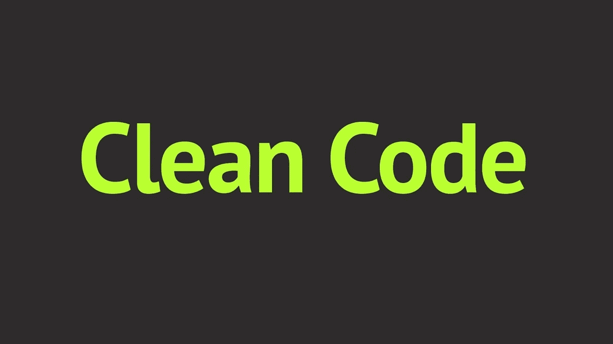

# 🤷‍♂️Tips 写干净的 C#代码

> 原文：<https://medium.com/nerd-for-tech/%EF%B8%8Ftips-to-write-clean-c-code-9d5b8d1929ed?source=collection_archive---------1----------------------->

# 介绍

在当今时代，编写代码并不困难。然而，编写干净且可伸缩的代码并不容易。在本文中，我们将讨论一些为我们的项目编写干净的 C#代码的技巧。乍一看，任何从未见过您的代码的开发人员都必须尽可能地理解它。每节课都要讲一个故事；它帮助我们更好地理解代码。