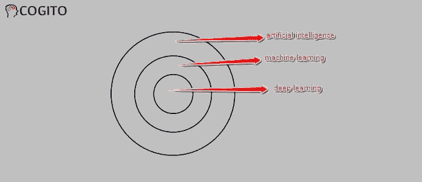
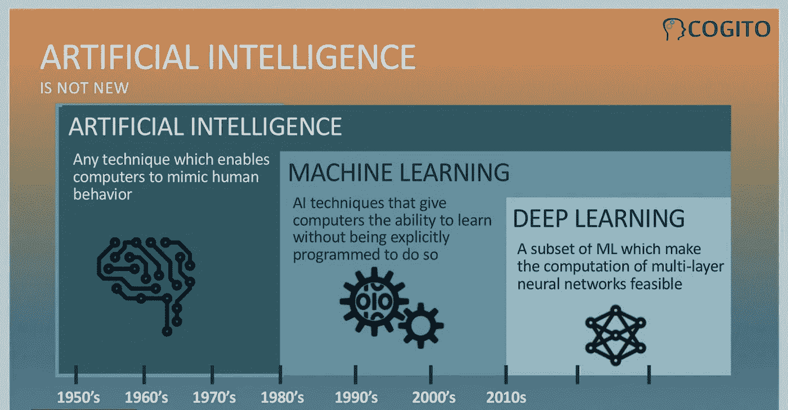
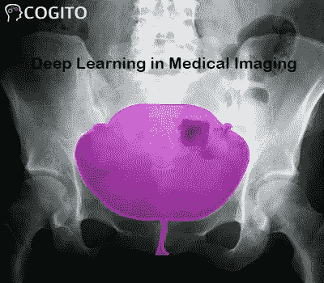

# 所有人工智能都是 ML，但并非所有人工智能都是 ML

> 原文：<https://medium.com/nerd-for-tech/-95d38af2f9ea?source=collection_archive---------6----------------------->

人工智能(AI)、机器学习(ML)和深度学习(DL)是最广泛使用的可互换词汇，在全球许多人中间造成了混乱。虽然，这三个术语**通常可以互换使用，但是它们都彼此不同，尤其是在它们的**应用**、能力和结果方面。
理解 AI、ML 和深度学习之间的差异对于利用这些术语的精确应用并在处理 AI、ML 或 DL 相关项目时做出正确的决定非常重要。在我们开始之前，我想给你们看几张**图片**(见下文)，这些图片将给出一个概述，AI、ML 和 DL 彼此之间有什么不同，或者这三个术语彼此之间有什么联系。**

****

***理解它们之间关系的最简单方法是将它们想象成同心圆，其中 AI 是一个更广泛的领域，然后是 ML，它是 AI 的分支或子集，最后是深度学习，它是 ML 子集的一部分，符合两者，或者你可以说，DL 正在推动今天的 AI 爆炸，因为输入和输出更加复杂。***

****

**我认为这些极具说明性的图片消除了一些关于这些术语的疑惑和误解。但是您需要通过一些有用的例子和用例来浏览更多的定义，这将帮助您更好地理解这些概念。**

****什么是人工智能？****

**顾名思义，AI 是一个更广泛的概念，用于创建一个能够像人类智能一样行动的智能系统。术语“人工”和“智能”是指“人类制造的思维能力”。**

**基本上，AI 是用于将人类智能纳入机器的计算机科学领域，以便这样的机器或系统可以像人类一样思考(不完全是)并做出明智的决定。**

**这种人工智能机器可以很好地执行特定的任务，有时甚至比人类更好——尽管它们的范围有限。为了开发这样的机器**人工智能训练数据集**通过机器学习算法进行处理。**

**更准确地说，人工智能系统不需要预先编程，而是使用这样的算法，它们可以凭借自己的智能工作。并且诸如强化学习算法和深度学习神经网络之类的机器学习算法被用来创建这样的系统。**

****什么是机器学习？****

**顾名思义，机器学习使计算机系统能够从过去通过**训练数据获得的经验中学习。到目前为止，你已经知道机器学习是人工智能的子集，事实上，它是用于开发人工智能模型的技术。****

**机器学习用于创建各种类型的自我学习的人工智能模型。它获得的数据越多，学习能力就越强，给出的结果也越准确。**

**让我们举一个例子，机器学习和算法在进行预测时是如何工作的。ML 实际上是训练算法学习并根据学习做出决策的过程。**

**在训练基于 ML 的模型时，我们需要某些 [**数据外包服务**](https://www.cogitotech.com/) 集合来输入算法，以允许它学习更多关于处理的信息。**

**今天，机器学习正在广泛应用于各个领域，包括医疗保健 **中的 [**人工智能，农业，零售，汽车，**金融等等。](https://www.cogitotech.com/services/healthcare-training-data/)****

****什么是深度学习？****

**它是机器学习的子集，允许计算机解决更复杂的问题，以获得比任何类型的机器学习更准确的结果。**

**深度学习使用神经网络以更高的准确度来学习、理解、解释和解决关键问题。**

**基于 DL 算法的神经网络大致受到主要在人脑中发现的信息处理模式的启发。**

**虽然学习、理解和预测就像我们使用大脑来识别和理解某些模式以对各种类型的信息进行分类一样，但深度学习算法主要用于训练机器轻松执行如此重要的任务。**

***每当我们试图感知新信息时，大脑都会试图在理解它之前将其与大脑已知的项目进行比较。在深度学习中——神经网络算法用来感知新信息并相应地给出结果。***

**实际上，大脑通常会试图解码它接收到的信息，并通过 [**数据分类**](https://www.cogitotech.com/services/data-classification/) 将这些信息归档，并将它们分配到不同的类别中。**

**让我们举一个例子——正如我们所知，DL 使用神经网络，这是一种旨在模拟人脑决策方式的算法。**

**机器学习和深度学习之间的显著**区别在于，后者可以帮助你理解细微的差异。因为 DL 可以自动确定用于分类的特征，而 ML 需要手动使这些特征可理解。****

**最后，与 ML 相比，DL 需要高端机器和大量的深度学习训练数据才能给出更准确的结果。**

****总结****

**机器学习已经被用于各个领域、部门和系统，但深度学习对于医疗保健部门来说更不可或缺，在医疗保健部门，**结果的准确性可以拯救人类的生命**。然而，无数的机会在于机器学习和深度学习，使机器更加智能，并有助于开发可行的人工智能模型。**

**在“医疗保健和医疗领域”，AI 可以使用医学成像中的**深度学习来**诊断**疾病，这些深度学习被输入到深度学习算法中，以学习肿瘤或其他威胁生命的疾病。现在，深度学习正在产生出色的结果，甚至比**放射科医生表现得更好。******

********

*******最后，在所有类型的 AI 中，用“Cogito”***进行基于计算机视觉技术工作的 ML 或 DL 模型，需要海量的训练数据进行物体检测。这些数据集帮助他们学习模式，并在**用于现实生活**时利用类似信息预测结果****