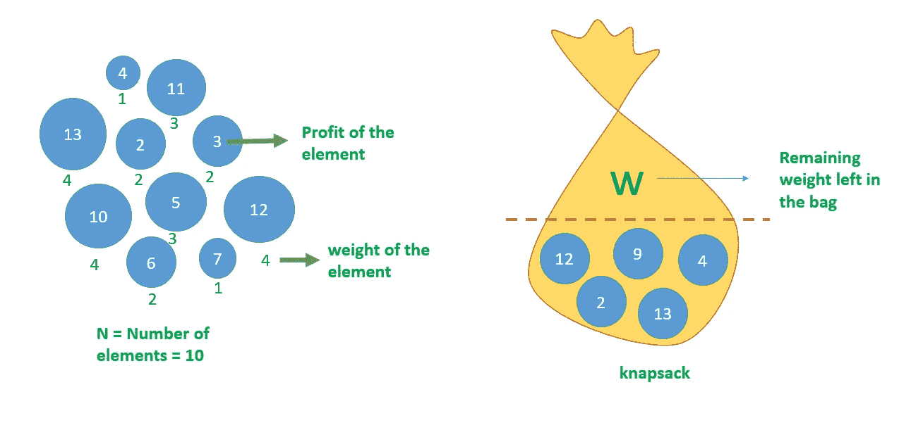
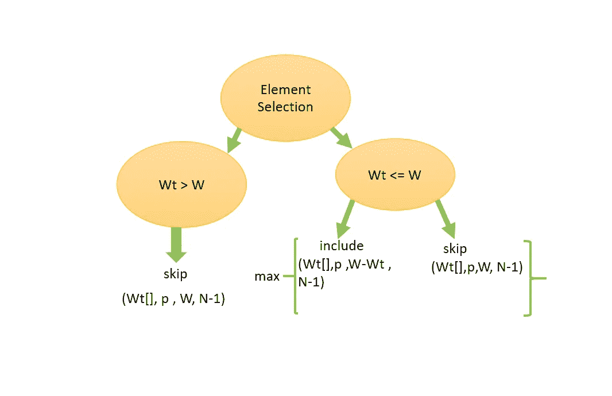

# 0-1 背包问题

> 原文：<https://medium.com/nerd-for-tech/0-1-knapsack-problem-85d95f8d724e?source=collection_archive---------3----------------------->

你好，编码伙伴们。今天我们将研究背包问题。

基本上，背包意味着一个袋子。我们的目标很简单。给我们 N 个项目，它们各自的权重为 Wt[]，利润或价值为 p[]。并且该袋子(背包)具有一定的容量 w。我们需要以非常有效的方式将物品填充到袋子中，使得利润最大化，从而不超过容量。

0–1，此处表示该物品可以挑选 0 次或 1 次。也就是说，您可以选择整个项目，也可以根本不选择它。

总而言之，

1.  我们需要找到最大利润。
2.  物品可以挑选 0 或 1 次。
3.  我们不能超过行李限额。

因为我们有两个选择(选择或不选择)，所以总的组合是 2*2*2*2*2……(N 次)= 2pow(N)。

时间复杂度= O(2 次方(N))

提供给我们的信息包括:

W =袋子中剩余的空间

Wt[] =每个元素的重量

N =元素总数

p[] =每个要素的利润

背包的输入

背包问题可以用两种方法解决。一种是使用递归，另一种是使用 dp 表。给你。我们将使用递归来求解。

# 基本条件:

因为我们在这里使用递归，所以我们继续下去，直到:

1.  什么元素都没有了。(N = 0)
2.  包里没有剩余的空间了。(W = 0)

> `***if***`
> 
> `***return***`**

# *决策树图表:*

**

*决策树图*

*在这里，我们将看到如何选择一个元素 0 或 1 次，以获得背包解决方案。*

*首先，让我们考虑流程图的左侧。如果我们选择的元素的重量大于袋子中剩余的空间，那么很明显，我们必须跳过这个元素。*

> *`if` `(Wt[N - 1] > W)`*
> 
> *`return` `knapsack(W, Wt, p, N- 1);`*

*在上面的代码中，除了 N 之外，所有的参数都保持不变，因为我们已经访问了那个元素，并且跳过了它。所以我们把元素的数量减少了 1。*

*现在，考虑决策树图的右侧，当元素的权重小于或等于袋子中的剩余空间时，我们有两个选择:*

***包含:**当我们包含元素时，元素的重量会添加到包中。因此袋子里剩下的空间变成了，W-Wt，这里 Wt 是我们加入的元素的重量。由于元素 N 被访问，利润增加，元素 N 的数量减少 1。*

***Skip:** 在这里，因为我们要跳过，所以除了 N 之外，其他所有参数都保持不变，因为 N 在被访问后减 1。*

*从上面的两个选择中，我们将返回相加时产生最大利润的那个。我们将通过使用 max 函数来实现这一点。*

> *`return` `max`*
> 
> *`(p[N - 1]`*
> 
> *`+ knapsack(W - Wt[N - 1],`*
> 
> *`Wt, p, N- 1),`*
> 
> *`knapsack(W, W t, p, N- 1));`*

*我们将继续执行上述步骤，直到我们达到基本条件，即包中没有剩余空间或没有剩余元素。因此，这就是如何使用递归来解决 0–1 背包问题。*

*希望你们都觉得这个博客足智多谋，如果你们能鼓掌，我会非常感激，因为这将鼓励我想出更多的这些。*

*谢谢…..*