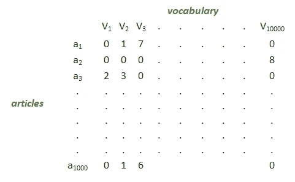
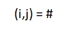
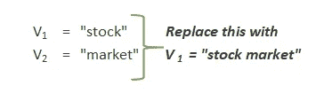
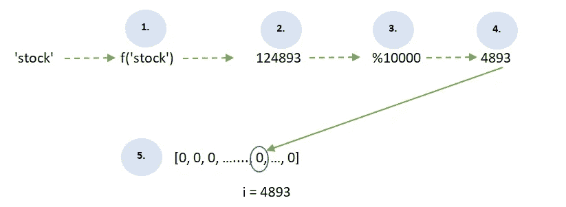
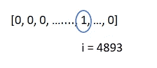
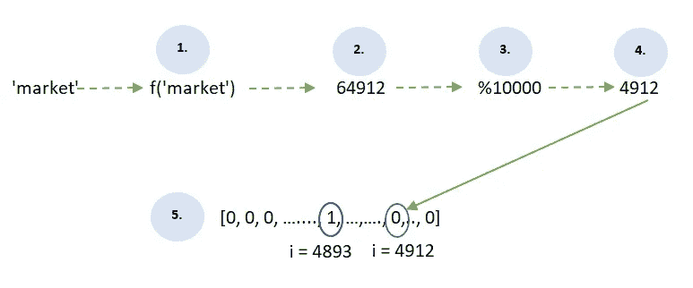
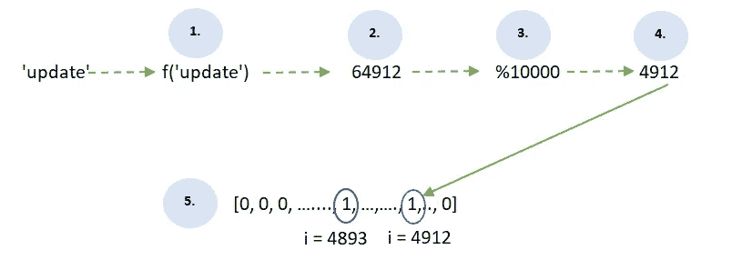
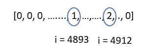

# #01Don'tSkipTheseConcepts |功能哈希

> 原文：<https://medium.com/nerd-for-tech/01dontskiptheseconcepts-feature-hashing-679bd2d1d354?source=collection_archive---------14----------------------->

> “有志者事竟成”——乔治·赫伯特

#DontSkipTheseConcepts 系列中讨论的概念，假设你知道机器学习的基础，并且对算法如何工作有相当的理解。这些概念会加强你的理解或者扩大你的知识基础。不管怎样——试一试。因为我打算保持这些简单，简短但有用。

当我试图向别人解释**哈希**时，我喜欢举文章和词汇的例子。

*我会简单明了，直奔主题。*

假设我们在 1000 篇文章中发现了 10000 个单词。比方说，像这样的东西—

**如果我们假设每个矩阵用 32 位来表示，这将意味着整个矩阵将产生 40 GB 的矩阵！**

*注意，这里的大部分元素都是零，因为并非所有文章都有词汇表中的所有单词。*

## 更有效地表示这些并减小大小的一种方法是使用 s **解析矩阵。**

举例来说，一个稀疏矩阵所要做的就是，把这些元素组合起来

并且，将该组合的条目映射到哈希表。

所以如果我们取，上面矩阵中 i =3，j = 2，那么要映射的值就是 3。

*对于条目为 0 的组合，例如，i = 1000 且 j = 1，它如何减少大小，将跳过此组合的映射。*

因此，我们最终得到的是一个更小的矩阵。

## 另一种方法，我们可以通过利用 **n-grams 来减小尺寸。**

如果你仔细看看上面的矩阵，你会发现我们放在矩阵中的词汇是像 say，“股票”或“市场”这样的单词。这是 **1 克。**

可能有用的是用像“股票市场”这样的词的组合来代替它。

这是**二克**。同样可以扩展到 3 克等。

因此，通过把它提升到更高的克数，你理想地把它的尺寸减小到一个更小的矩阵。

## 还有一种我喜欢的方式——是的，它的“特征散列”！让我们抛开上面的，现在开始研究哈希。

简单地说，特征散列所做的就是，假设我们有单词“stock”。

1.  我们将单词“stock”通过我们所说的“哈希函数”
2.  这个散列函数给出一个值作为输出
3.  我们根据我们想要使用的空间大小来修改它
4.  这个模值输出给出了索引 I
5.  我们将这个索引 I 映射到一个数组，并简单地递增该元素

迷茫？看下面的图片—

例如，我们希望将大小优化为 10，000 个元素

这将变成——

index = 4893 在生成的数组中递增 1

有意义吗？

现在我们再举一个例子。

下一个字得到一个新的索引，该索引再次映射到数组

相应的索引元素增加 1

有趣的是，如果我们得到一个词，散列到相同的值，比如说—

“update”散列到与“market”相同的值，因此，获得要映射到阵列的相同索引

索引= 4912 处的元素增加 1，变成 2

因此，当碰撞发生时，我们只是不断更新！

# 关于使用特征散列的事实-

1.  我们可以处理任意长度的文件。这是因为只要单词不断出现，我们就可以在给定某个单词的特定索引处增加值。
2.  **我们不需要为每一个出现的新单词**频繁地重新训练我们的整个模型，因为每次我们得到一个新单词——我们只是将它散列到一个特定的索引，并在我们的输出数组中增加相应的值。
3.  对于像**垃圾邮件检测**这样的情况，在正常的文本稀疏矩阵中，对手可以很容易地掌握词汇，使他们的电子邮件看起来“合法”，并干涉我们的隐私。但是使用特征散列，**对手没有任何词汇可以获取，因为我们在这里使用的是散列输出！**

因此，使用特征哈希的**优势在于，你可以**将变长的文本文档表示为等长的数字特征向量**，并实现**降维**。**

*相反，如果您试图按原样使用文本列进行训练，它将被视为分类特征列，具有许多许多不同的值。*

**将输出作为数字也使得对数据使用许多不同的机器学习方法成为可能**，包括分类、聚类或信息检索。因为查找操作可以使用整数哈希而不是字符串比较，所以获取特征权重也要快得多。

想要更正式的阅读？我找到了一些关于哈希以及如何实现它的文章-

1.  [http://www . umsl . edu/~ siegelj/information _ theory/projects/hashingfunctionsincryptography . html](http://www.umsl.edu/~siegelj/information_theory/projects/HashingFunctionsInCryptography.html)(了解哈希)
2.  [http://contrib . sci kit-learn . org/category _ encoders/hashing . html](http://contrib.scikit-learn.org/category_encoders/hashing.html)(sci kit-learn 的类别编码库)

如果你想在 *LinkedIn* 上与我联系，请随时在这里 给我发短信或请求 [**。**](http://www.linkedin.com/in/anaa-vs)

如果*推特*是你的事，这里 联系我[。](https://twitter.com/_anaavs_)

当然，你也可以在这里留下你的评论！我也很乐意回答任何问题。

直到下一次，继续唱，唱，唱。最重要的是，*不断学习*:)