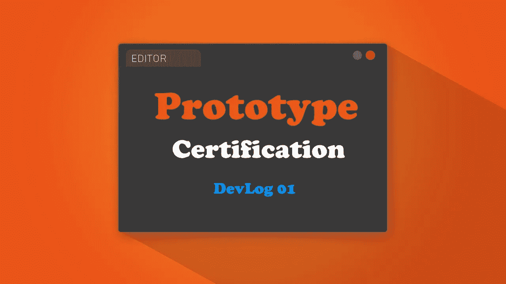
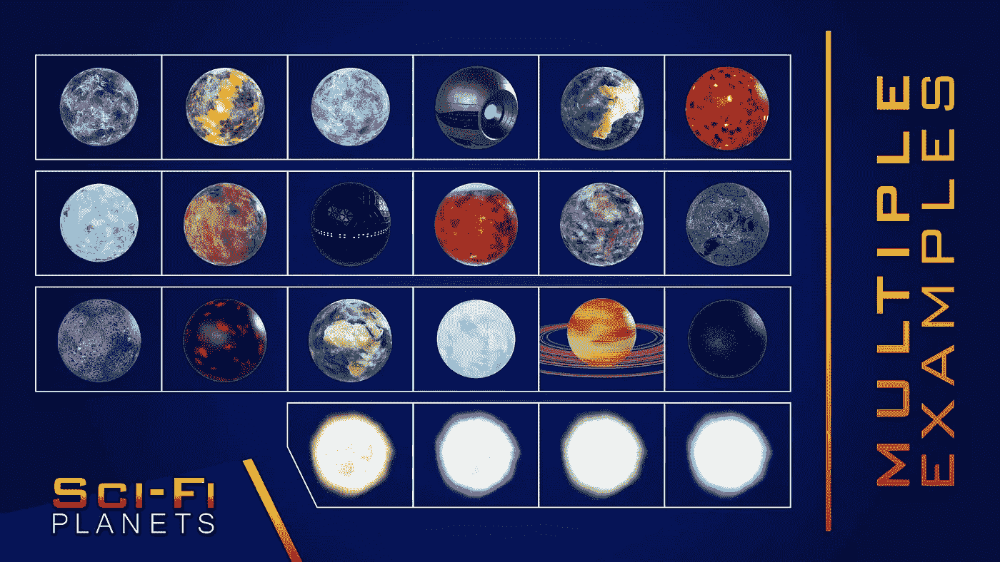
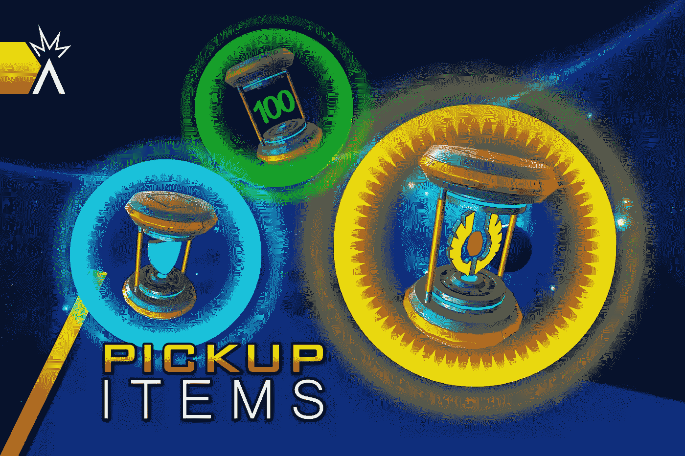
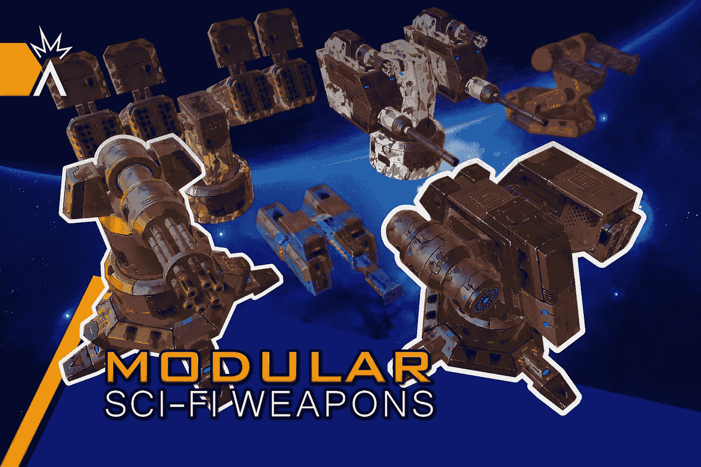
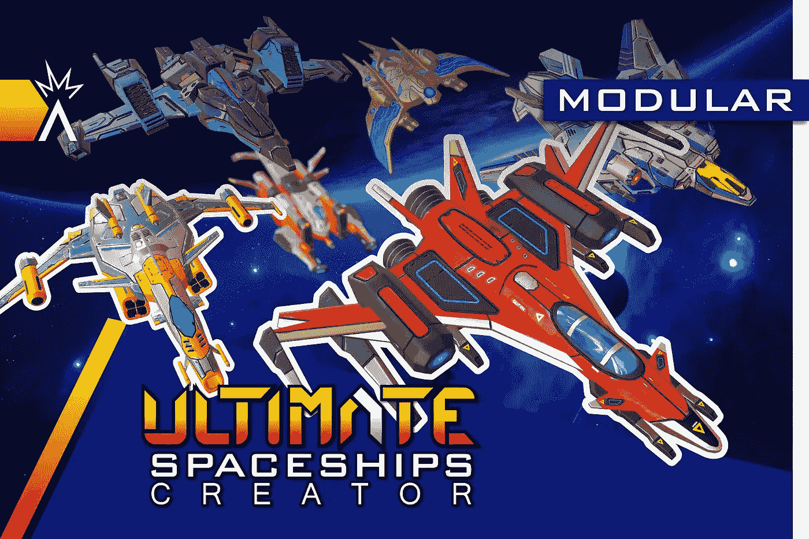
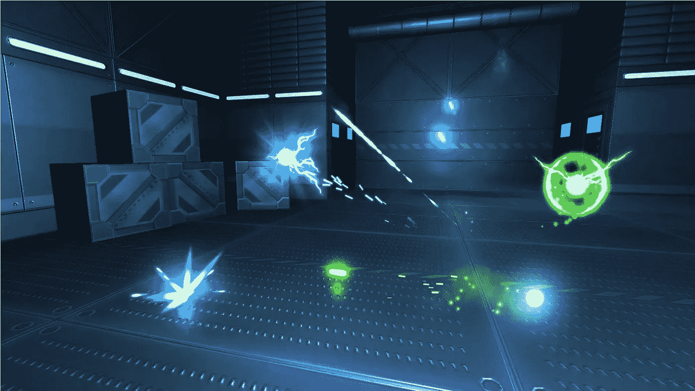
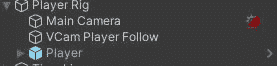
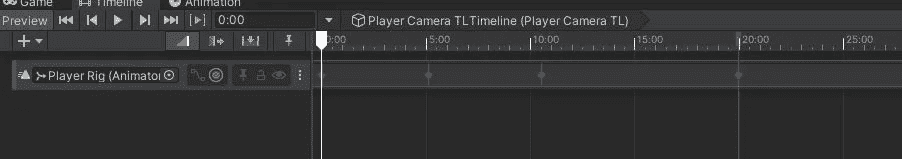
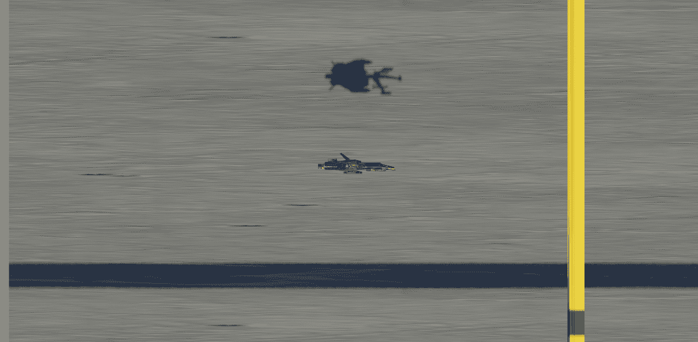
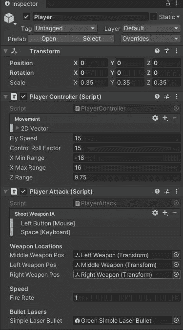

# 02 小时:GameDevHQ 认证原型开发日志

> 原文：<https://medium.com/nerd-for-tech/02-hours-in-gamedevhq-certification-prototype-devlog-cb69f02749ae?source=collection_archive---------7----------------------->

在经历了 GameDevHQ 项目的惊人且富有成效的旅程后，我几乎要到达它的终点了。还有一件事要做:在短短 6 天内创建一个原型 2.5D 空间射击游戏街机风格的游戏。为了让我能够在这方面付出很大的努力，我决定跟踪我的时间，在 40 小时内完成原型，这是一个游戏开发人员每周的平均工作时间。

> 主要目标

该项目有一些最低要求，如:

*   2.5D 射击游戏
*   成群结队的敌人
*   中层老板
*   末级 Boss
*   比最低要求做得更多

## 灵感

在这个项目中，激励我的游戏是 Gradius V。这是一个伟大的 PS2 太空射击游戏，游戏中的摄像头引导玩家投掷杀死敌舰的关卡，直到它们到达最终的 boss。

> 资产

我不是艺术家，所以我必须从 Unity 或 GameDevHQ filebase 或任何其他好的网站获取资源。我还没有决定环境资产，但我已经为玩家和敌人抓到了一些非常好的资产，比如船只、行星和武器。

## *伊巴尔工作室科幻资产*

*   科幻星球

*   模块化皮卡

*   科幻武器

*   终极宇宙飞船创造者

## 阿纳科尔·VFX 资产公司

*   射弹的科幻武器库

> 相机和播放器控制

对于相机控制，我决定使用 Timeline 来移动相机(使用 Cinemachine ),而不是创建一个脚本来控制相机并根据航路点移动它。

时间轴可以让我更好地控制相机的速度、方向和移动的距离。

至于玩家，他们也将被时间线驱动，同时给玩家一些控制(上下、前后移动)，同时仍然保持在可玩区域和相机范围内。

玩家装备

为了让播放器和相机同步移动，我创建了一个播放器支架，可以同时支撑播放器和相机。将这个播放器移动到时间线会给我创造这个原型所需要的自由。

时间表

## 玩家输入

使用 unity 的新玩家输入系统，我创建了移动和攻击的输入动作。移动会被限制在相机的范围内，玩家的船会上下移动。稍后我会添加可视推进器，用于向前和向后移动。

球员移动和射门

这只是玩家攻击的第一次迭代。玩家将获得武器升级，可能会有一些迷你无人机跟随他，发射更强大更快速的武器。

下期博客再见。