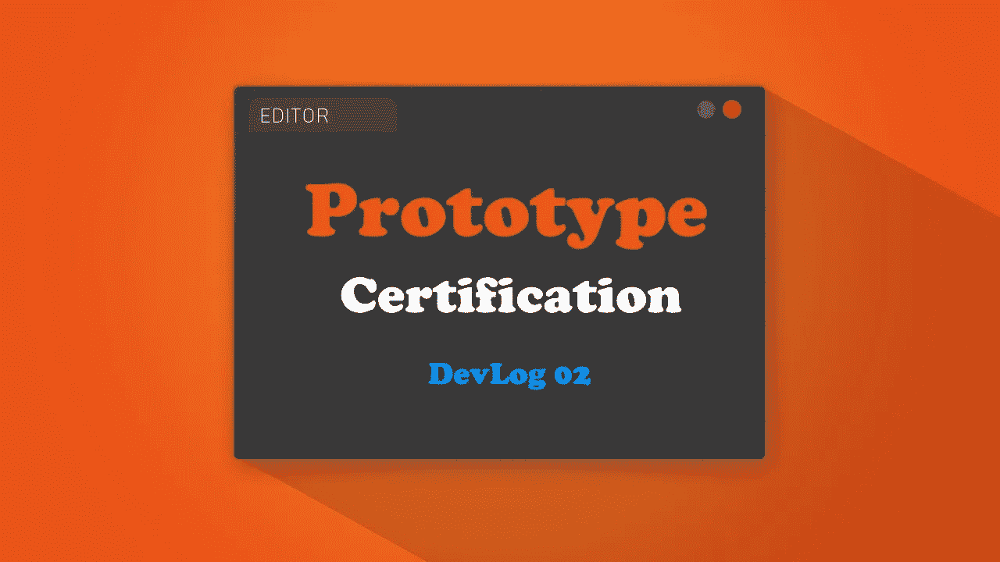
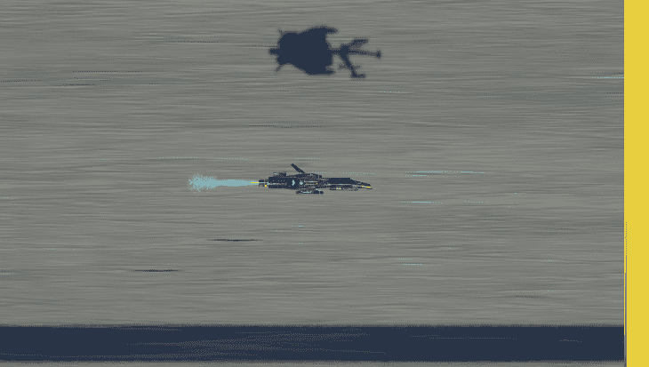
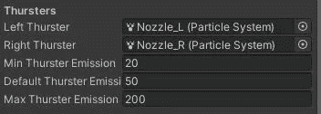
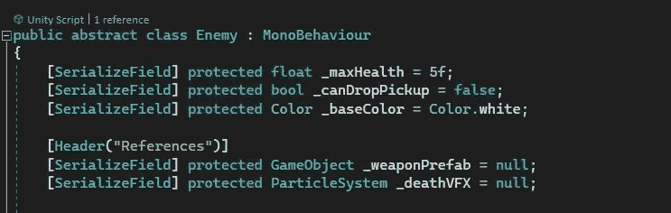
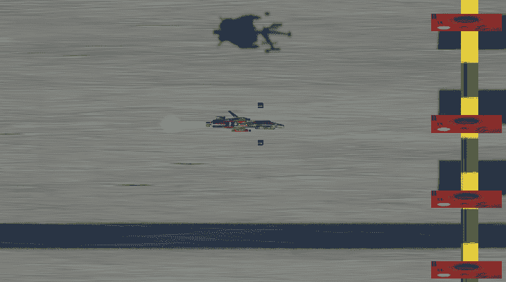

# 04 小时登录:GDHQ 认证发展博客

> 原文：<https://medium.com/nerd-for-tech/04-hours-in-gdhq-certification-devlog-ce5b3bf8cea8?source=collection_archive---------3----------------------->

从上一个 devlog ( [02 小时 In: GameDevHQ 认证原型 DevLog](https://novusxdev.medium.com/02-hours-in-gamedevhq-certification-prototype-devlog-cb69f02749ae) )开始，我给玩家的 jet 加了几个很酷的东西，还有 1 号敌人原型。让我们浏览一下它们…

> 玩家升级等级

玩家将通过关卡获得更多的武器和投射类型。玩家船将有 3 个武器，一个在中间，一个在上面，一个在下面。中间的武器会一直在哪个是主要武器上。随着你获得更多的级别和升级，其他武器将开始发挥作用。同样，升级可以让你获得一些射弹升级，比如更快的射速和更多的射弹类型。

武器升级

## 可视推进器

正如你在上面看到的，我给玩家的飞船增加了可见的推进器。所以现在，当它们加速时，推进器变大，当它们减速时，推进器变小。

推进器使用的是粒子系统组件，所以我通过它们的发射来控制它们的能量。

推进器

> 射弹粉碎机

这是一面不可见的墙，跟随摄像机，设置在屏幕之外。它唯一的工作是捕捉投射物(基于 Unity 的粒子系统)。当投射物与碎纸机碰撞时，它们会被销毁，以清除游戏中的杂物。

> 基本敌人原型

敌人抽象类

我必须测试我的武器，所以我创造了一个基本的敌人原型。敌人将从一个抽象类继承，因为他们每个人都有一些共同的方法，如健康，伤害和死亡。这将允许我更好地专门化我的敌人，而不必为敌人重写最常用的方法。至于健康，我决定用浮点型而不是整数型，这样激光可以足够快地杀死敌人，而不会压倒他们。

基本敌人原型