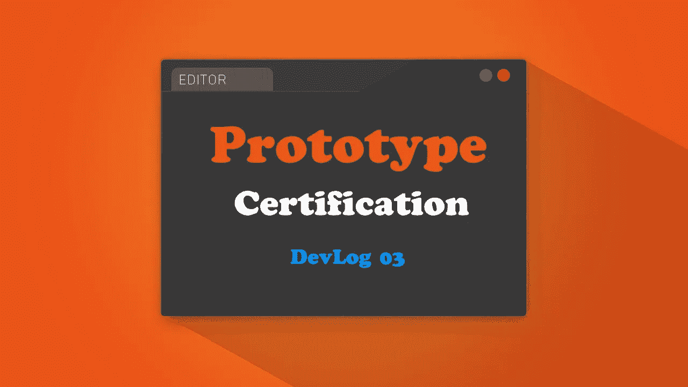
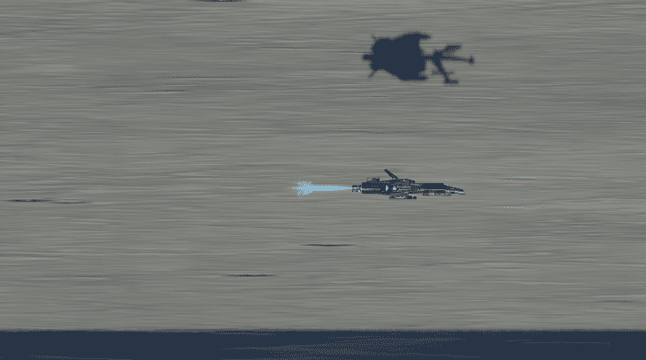
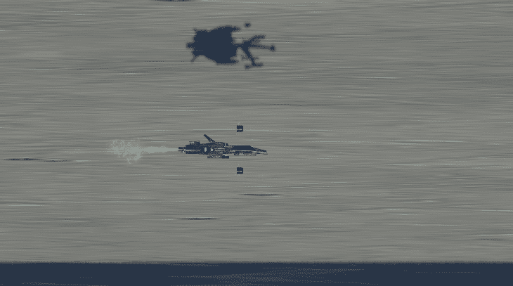
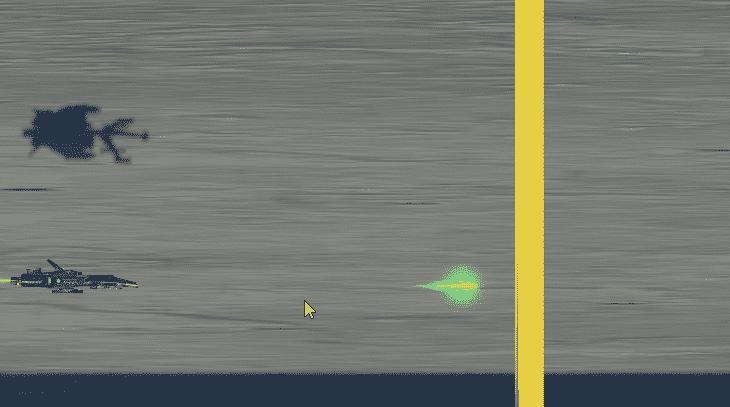
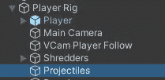

# 06 小时进入:GDHQ 认证发展博客

> 原文：<https://medium.com/nerd-for-tech/06-hours-in-gdhq-certification-devlog-b5cc7b09aa8e?source=collection_archive---------10----------------------->

之前的 devlog ( [04 小时 In: GDHQ 认证 Devlog](https://novusxdev.medium.com/04-hours-in-gdhq-certification-devlog-ce5b3bf8cea8) )我增加了玩家等级，玩家将通过这些等级升级自己的武器，还增加了一个敌人原型。现在我对关卡和玩家的投射物做了一些改进。

> 新型射弹

这种新的射弹比普通的激光子弹稍快，这是一种带电的激光，速度更快，杀伤力更大。

新型激光器

> 玩家健康

我增加了玩家健康的第一次迭代。基本上，玩家将能够拍摄 6 个镜头。我首先想到的是让玩家在受到伤害时失去所有的升级，但这有点太苛刻了(如果我引入难度，也许我可以这样做)，然后我让他每受到 1 点伤害就失去 3 个等级，这有点宽容，但也是惩罚。

玩家受到伤害时会失去等级

> 级别经理

我的第一次关卡迭代被直接添加到玩家的攻击脚本中，只是为了感受一下关卡应该如何工作。现在我重构了所有东西，创建了一个玩家等级管理器脚本，负责管理玩家每一级的升级，当他受到伤害时降低等级。

> 激光 Bug 修复

如前所述，许多播放器和相机装备是通过时间线来控制的，让我能够敏锐地控制场景中的运动。这就产生了一个问题:玩家投射物不能与玩家装备同步移动。

不同步激光器

正如你所看到的，当相机加速时，激光会变慢，如果激光的速度很慢，当相机移动得太快时，它们会看起来不动。起初，我想根据相机的速度来更新激光速度，但这仍然会导致一些子弹不同步，修复方法只是简单地将激光安装到固定相机和播放器的装备上。现在，所有的激光器无论快慢，都将与摄像机保持同步。

