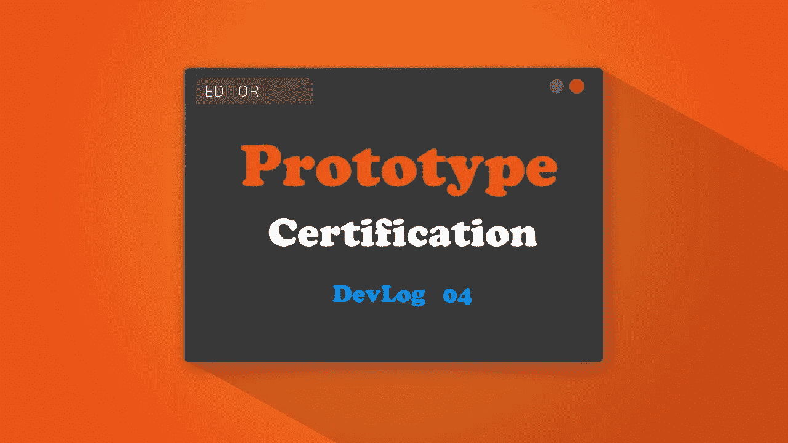
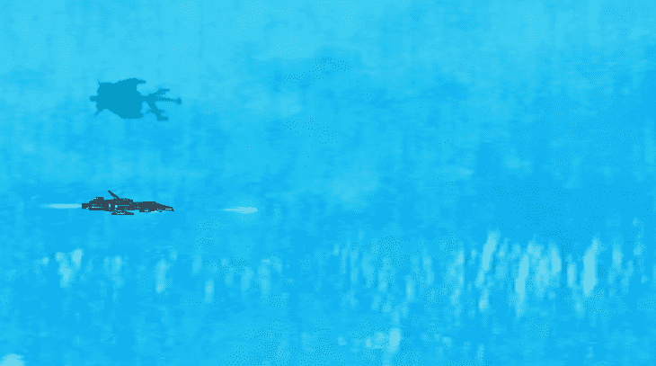
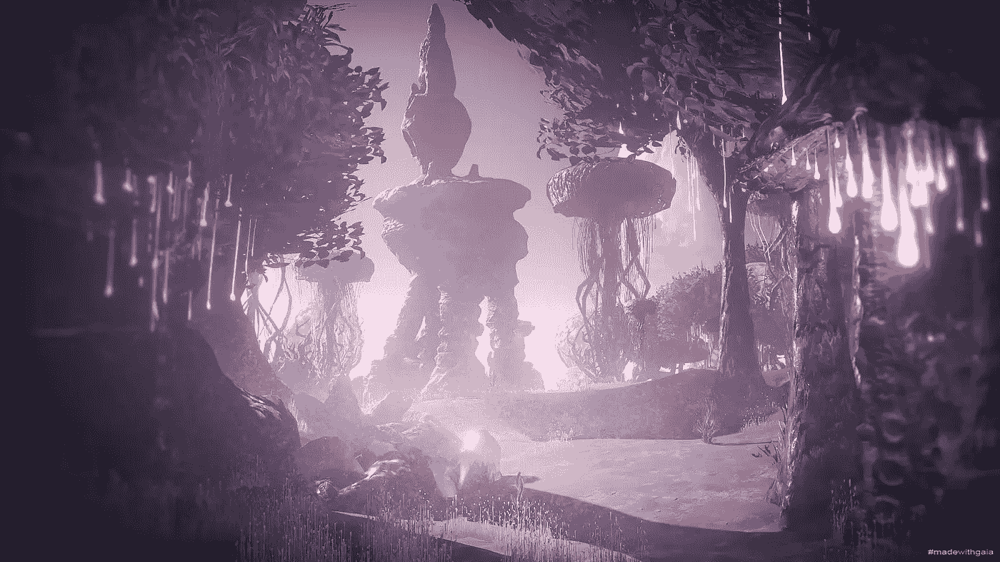

# 07 小时登录:GDHQ 认证发展博客

> 原文：<https://medium.com/nerd-for-tech/07-hours-in-gdhq-certification-devlog-b64bbeb5e07c?source=collection_archive---------6----------------------->

距离我的上一篇文章已经过去两周了；电脑出了问题，我需要休息。所以让我们回到正题。

如前所述，我正在为游戏开发总部项目的认证项目开发一款 2.5D 街机空间射击游戏。在我的上一篇文章中( [06 小时 in: GDHQ Certification Devlog](/nerd-for-tech/06-hours-in-gdhq-certification-devlog-b5cc7b09aa8e) )，我添加了一些必要的功能，比如健康系统和关卡管理器(供玩家升级武器)。

今天将会很短很快，这是已经添加的内容。

> 旋转玩家武器

玩家有 3 个炮塔可以射击。一个炮塔是固定的，它被放置在玩家船的前面。另外两个炮塔随着层数的增加而被激活，所以船的上面有一个炮塔，下面有一个炮塔。

以前这些炮塔也是固定的，玩家只能像经典的太空射手一样向前射击。但是为了让游戏更有活力，我允许这两个炮塔旋转。旋转跟随玩家的鼠标，当然我限制了他们的旋转，上面的炮塔不能向下射击，下面的炮塔不能向上射击。这就是它的作用。

转台旋转

> 世界

建设世界在这里将是非常重要的。玩家将要对抗外星人的入侵，在这个原型级别中，玩家的帝国已经向外星人的星球发起了自己的反击。

所以我决定用 unity 资产商店的外星地形包。[外星地形包| 3D 风景| Unity 资产商店](https://assetstore.unity.com/packages/3d/environments/landscapes/alien-terrain-pack-38488)。它将允许我创建一个栩栩如生的外星世界，将一个伟大的背景故事添加到我的原型水平。这是他们商店页面的截图。看起来很神奇，对吧？！

外星地形包