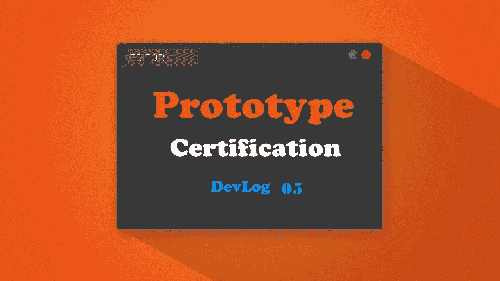
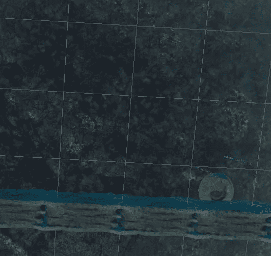
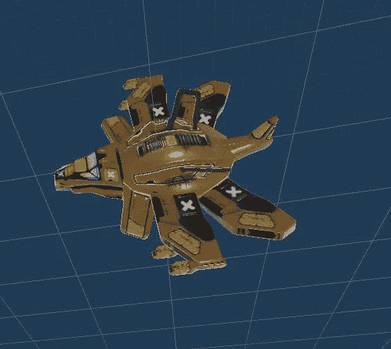
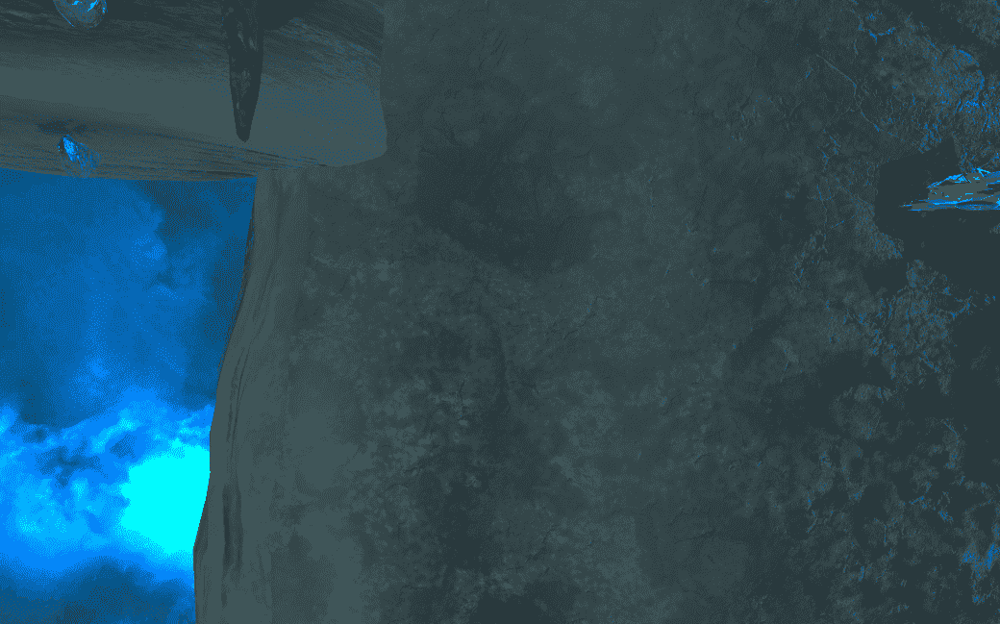

# 09 小时登录:GDHQ 认证发展博客

> 原文：<https://medium.com/nerd-for-tech/09-hours-in-gdhq-certification-devlog-3f7dcfbfdcf0?source=collection_archive---------6----------------------->

之前我能够修复一个非常烦人的阻碍进度的图形 Bug([Bug Fix:Unity 渲染管道](https://bootcamp.uxdesign.cc/bug-fix-invisible-particle-system-in-unitys-render-pipeline-c8790a581a2d)中的隐形粒子系统)。现在让我们检查一下目前的进度。

> 世界基础设施

使用外星地形包，我开始建立这个原型级环境的基础设施。这里的目的是你的帝国派你去这颗外星小行星上执行一项估算任务，并检查那里是否有基地。这是这颗小行星的一瞥。

这只是这张地图的梗概。外来植物将随着更多的照明和环境效果被添加。

> 新敌人

**幻影獾**比咕噜稍微重一点。他们以队形移动，他们的目标是撞向你并摧毁你。仍然不能 100%确定他们是否应该发射投射式导弹。

幽灵獾

