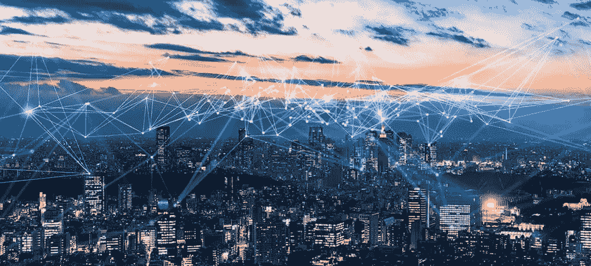
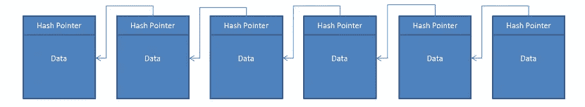

# 1.互联网的演变…什么是 Web 3.0？

> 原文：<https://medium.com/nerd-for-tech/1-evolution-of-internet-what-is-web-3-0-29b17d9d4cc7?source=collection_archive---------2----------------------->

**Web 1.0(Read)** :当第一个数据传输/通信协议在 80 年代推出时，互联网诞生了。现在，人们可以借助 HTTP、TCP 等协议阅读其他人在互联网上发布的信息。互联网的第一个时代被称为 Web 1.0，在这个时代，人们只能阅读其他人编写和发布的数据/信息。他们搜索了一篇文章，阅读了它，然后关闭了它，这就是它的大部分进展。*例子:*雅虎、MSN 等。

**Web 2.0(读、写):**从 2000 年开始，一个新的互联网时代开始了，因为人们厌倦了仅仅跟随他人的指示。他们希望通过互联网贡献、互动和表达自己的想法。这是由社交媒体行业和脸书、Orkut 等公司促成的。人们渴望分享他们的观点，并与互联网上可用的数据进行互动，因此每个人都加入了进来。世界上大部分地区仍在使用 Web 2.0，与越来越多的数据进行交互，大公司开始收集这些数据。例如:脸书，YouTube 等。

**Web 3.0 :** 随着 Web 2.0 的兴起和流行，人们提出了一个担忧，关于**数据的集中化及其使用，**即个人隐私。随着人们开始与在线信息互动，他们的互动和个人数据存储在特定公司的数据库中，他们可以以任何可能的方式使用这些数据，这在当今的在线广告和营销世界中显而易见。随着这种担忧达到顶峰，Web 3.0 被引入，其整个思维模式是**读、写和拥有。**有了 Web3，参与者将对自己的内容、数据和资产拥有完全的所有权。它代表了一个民主化的互联网，以分散的方式存储数据，即没有一个人/组织可以成为所有东西的所有者。*示例:* DeSo、Pancakeswap、D.Tube 等。

> 这是一个由用户为了用户的利益而管理的互联网。

随着我们在这方面的深入，Web3 将通过区块链让用户完全拥有他们的资产、数据，几乎任何东西。

**区块链**是所有这些 Web 3.0 基础设施背后的技术。基本上区块链是公共账本(一组记录)。它将数据/信息存储在一组**块**中。这些块连接在一起形成一个**链。**每块积木就像一页书。

src —谷歌

区块链不是加密货币。

区块链不是编程语言，不是框架

区块链不是人工智能或机器学习技术。

## 那么，我们该如何利用它呢？或者说区块链的好处是什么？

区块链作为数据/交易的**不可变**(不可改变的、固定的)记录，不需要依赖任何中央权威机构或组织进行验证。(即使要更新任何数据，也不会删除以前存储的数据，而是会替换该数据，创建新的数据块并添加到链中。)

## 那么，它将如何得到验证呢？

正如我之前告诉你的，这是一个公共账本，也就是说，所有的数据都将是透明的和公开的，并且权力在于这些公共访问器(节点)来验证交易/数据。这就是数百万互联网用户帮助管理和维护这些记录的方式。从而使它真正权力下放和民主化。

总而言之， **Web 3.0** 将提供一个开放、无信任、无权限、安全的网络。因为它是开源的，每个人都可以使用和探索，用户可以在没有任何第三方干预的情况下直接交互(不需要信任，因为一切都是透明的)，用户/供应商不需要任何权威机构的许可就可以使用它，任何人/组织都不能拥有或控制它。