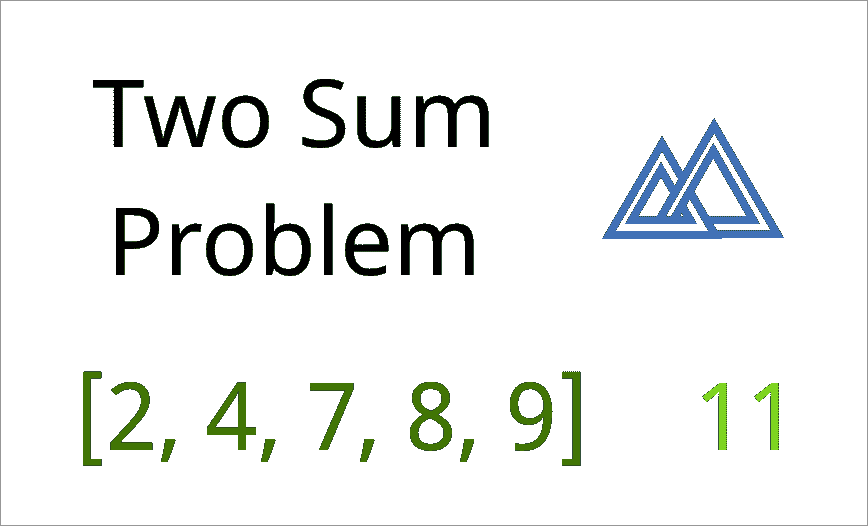
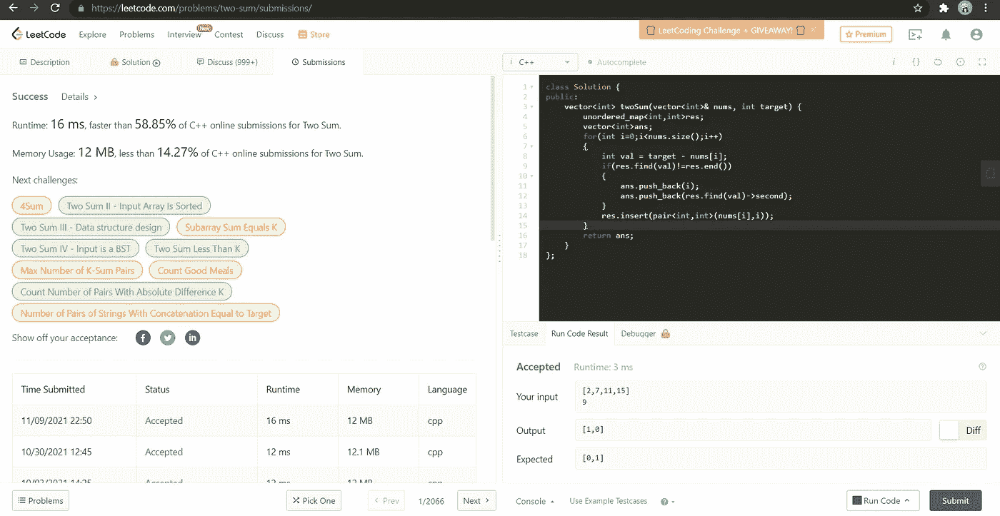

# 1.两个总和

> 原文：<https://medium.com/nerd-for-tech/1-two-sum-fd566d9a79cb?source=collection_archive---------0----------------------->

(Leetcode 易题)



给定一个整数数组`nums`和一个整数`target`，返回这两个数的索引*，使得它们相加为* `*target*`。

你可以假设每个输入都有 ***恰好*一个解**，你不能两次使用*相同的*元素。

可以任意顺序返回答案。

**例 1:**

```
**Input:** nums = [2,7,11,15], target = 9
**Output:** [0,1]
**Output:** Because nums[0] + nums[1] == 9, we return [0, 1].
```

**例 2:**

```
**Input:** nums = [3,2,4], target = 6
**Output:** [1,2]
```

**例 3:**

```
**Input:** nums = [3,3], target = 6
**Output:** [0,1]
```

**方法:**

现在我将分享两种解决这个问题的方法:

# 1.强力法

```
In this approach I will iterate the array using two loops to find if the sum is equal to the target.for(int i=0;i<nums.size()-1;i++)
{
    for(int j = i+1;j<nums.size();j++)
        {
          if(nums[i]+nums[j]==target)
          ...
        }
}**Time Complexity** - O(n*n)
**Space Complexity** - O(1) 
```

# 2.使用散列表

```
In this approach I will use hashmap and a vector to return the index of the elements if the target is found by addition of two elements.**Time Complexity** - O(n) because I will tarverse the array only once and Hasmap has a time compelexity of O(1) for insertion. 
**Space Complexity** - O(1) Code is as follows :**class Solution {
public:
    vector<int> twoSum(vector<int>& nums, int target) {
        vector<int>ans;                  
        unordered_map<int,int>m;

        for(int i=0;i<nums.size();i++)    
        {
            int val = target-nums[i];
            if(m.find(val)!=m.end())** // in case the second element is found **{
                ans.push_back(m.find(val)->second);
                ans.push_back(i);
                break;
            }
            m.insert(pair<int,int>(nums[i],i));** // in case the above criteria is not satisfied I will keep inserting the element in the hashmap **
        }
        return ans;
    }
};**
```



希望这有所帮助！继续编码！

既然你喜欢看我的博客，为什么不请我喝杯咖啡，支持我的工作呢！！[https://www.buymeacoffee.com/sukanyabharati](https://www.buymeacoffee.com/sukanyabharati)☕