# 10 个免费的开发人员必须使用的工具，你可能从来没有…

> 原文：<https://medium.com/nerd-for-tech/10-free-must-use-tools-for-developers-you-probably-have-never-of-ac6a78e87766?source=collection_archive---------0----------------------->

## 使用这 10 种工具将您的工作效率提高 10 倍

作为开发人员，我们经常有很多需求，无论是适当的文档、简单的片段、设计方面还是内容创建！就像我们代码中的函数一样，现成的易于使用的工具总是一个巨大的奖励！在这篇文章中，让我们来看看 10 个能让你大吃一惊并提高你工作效率的工具。

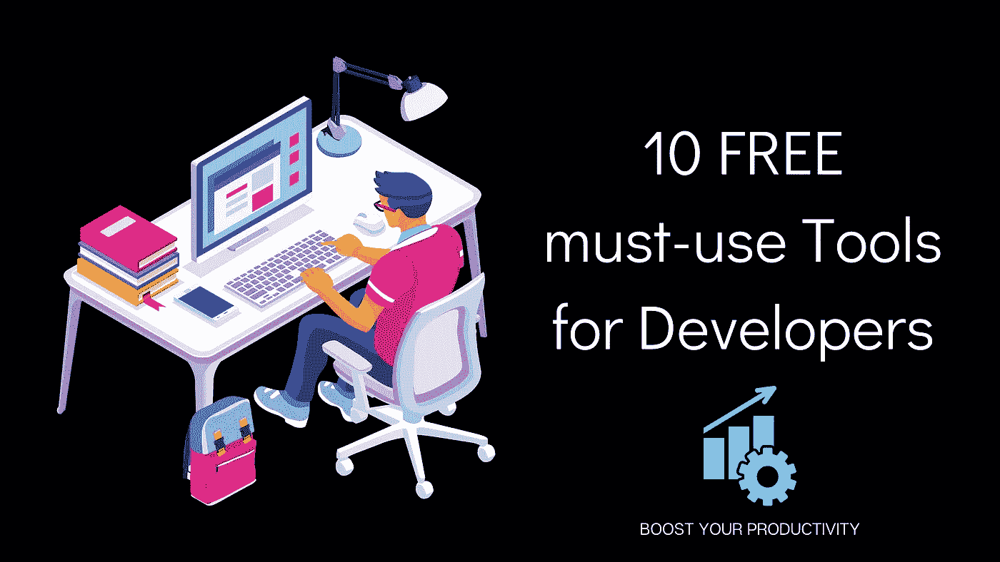

# 1.诗人。所以

🌐 [**网站**](https://poet.so) |🎁 [**品猎**](https://www.producthunt.com/posts/poet-so)

Poet.so 将你的推文或 LinkedIn 帖子转换成漂亮的可编辑设计，然后你可以在社交媒体上分享。

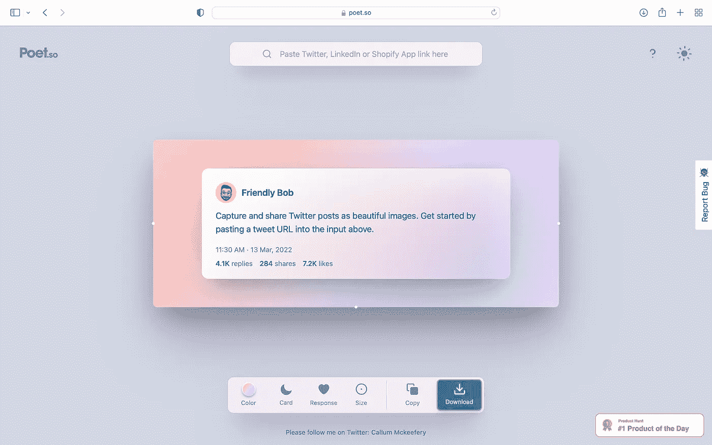

# **2。开发文档**

🌐 [**网站**](http://devdocs.io/) |🐙 [**GitHub**](https://github.com/freeCodeCamp/devdocs)

DevDocs 在一个快速的、有组织的、可搜索的界面中结合了多个 API 文档。

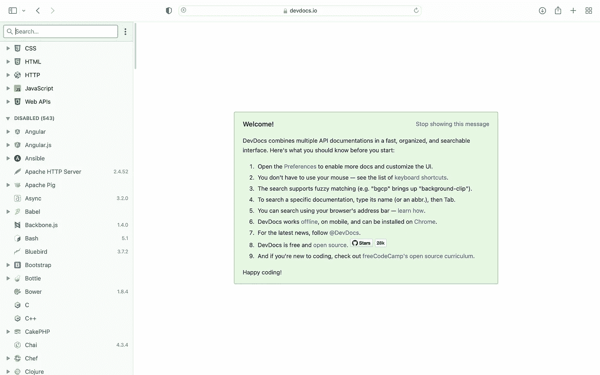

# **3。碳**

🌐 [**网站**](https://carbon.now.sh) |🐙 [**GitHub**](https://github.com/carbon-app/carbon)

Carbon 帮助您创建和共享源代码的美丽图像。您可以开始输入或拖放文件到文本区开始！

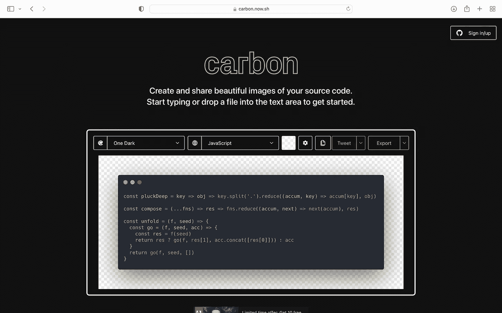

# 4.**日报**

🌐 [**网站**](https://daily.dev/) |🐙 [**GitHub**](https://github.com/dailydotdev/daily)

DailyDev 是您获取所有开发者新闻的一站式平台。它从各种来源收集文章，并为你创建一个可定制的订阅源。

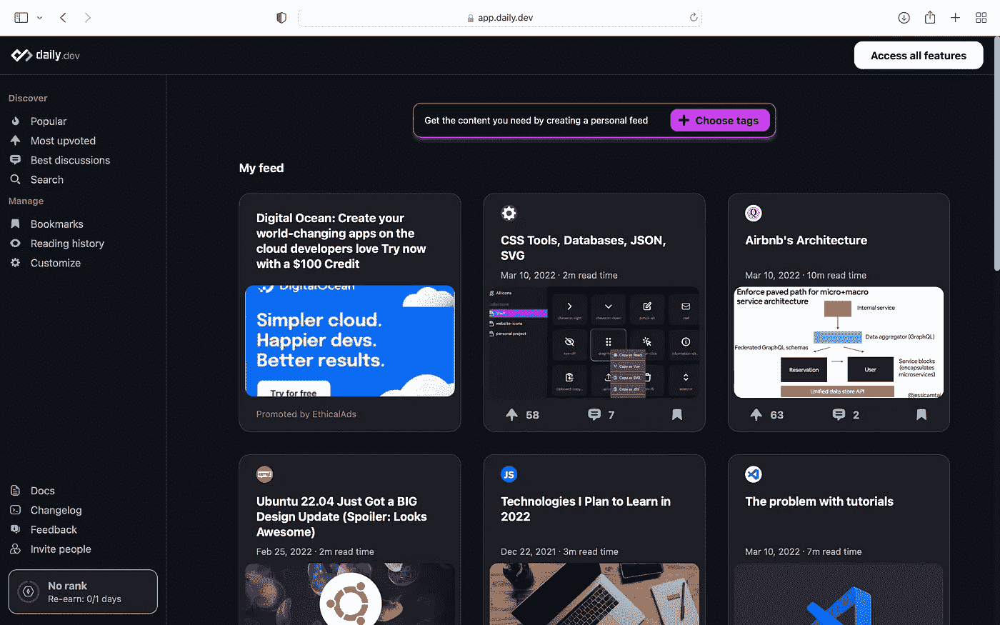

# 5. **ProfilePicMaker**

🌐 [**网站**](https://pfpmaker.com/) |🎁 [**产品搜索**](https://www.producthunt.com/posts/pfpmaker?utm_source=badge-top-post-badge&utm_medium=badge&utm_souce=badge-pfpmaker)

ProfilePicMaker 为您的开发人员作品集中的每张照片创建专业而美丽的个人资料。作为开发者，你会接触到社交媒体。

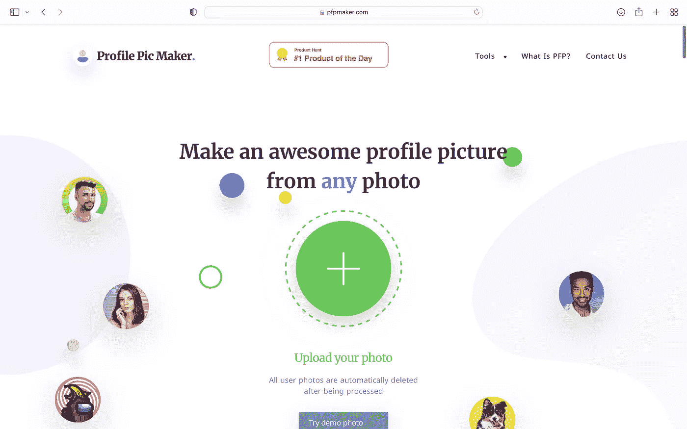

# 6.简历. io

🌐 [**网站**](https://resume.io)

Resume.io 帮助你使用经过实地测试的专业简历模板，这些模板完全遵循雇主寻找的**简历规则**。它很容易使用，几分钟就能完成！

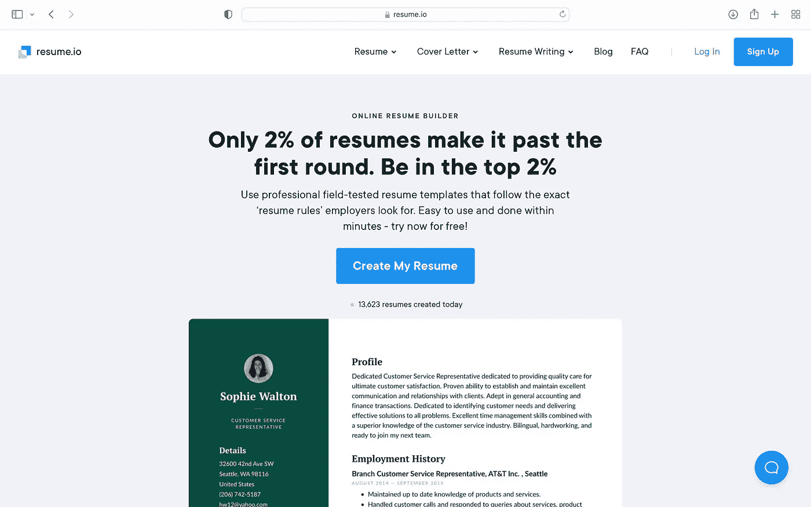

# 7.CSS 技巧

🌐 [**网站**](https://css-tricks.com)

CSS 技巧可以帮助你掌握前端 web 开发，因为它讨论了所有的 CSS。这里的一些文章有如此惊人的技巧，会让你大吃一惊！

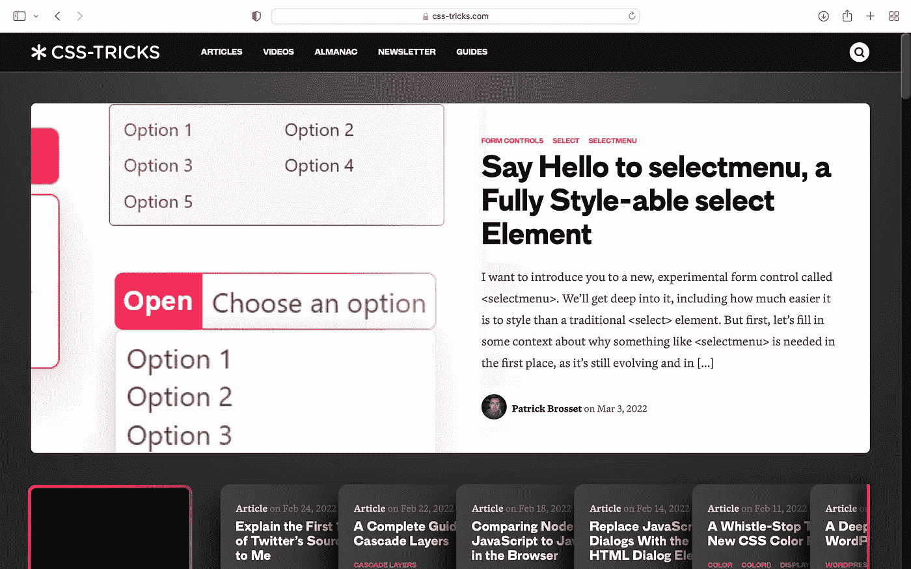

# 8.Readme.so

🌐 [**网站**](https://readme.so) |🐙 [**GitHub**](https://github.com/octokatherine/readme.so)

Readme.so 的简单编辑器允许您快速添加和自定义项目 Readme 所需的所有部分。

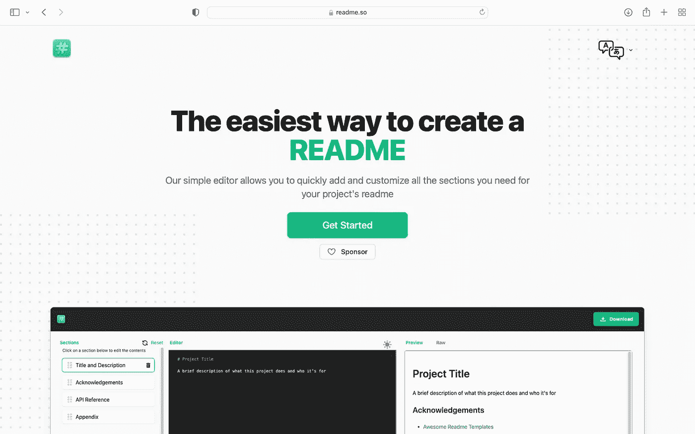

# 9.扁平图标

🌐 [**网站**](https://www.flaticon.com)

拥有超过 680 万个矢量图标、贴纸和插图，这是满足您所有设计需求的一站式目的地。如果你不想归因于设计师，你可以额外购买一个溢价。

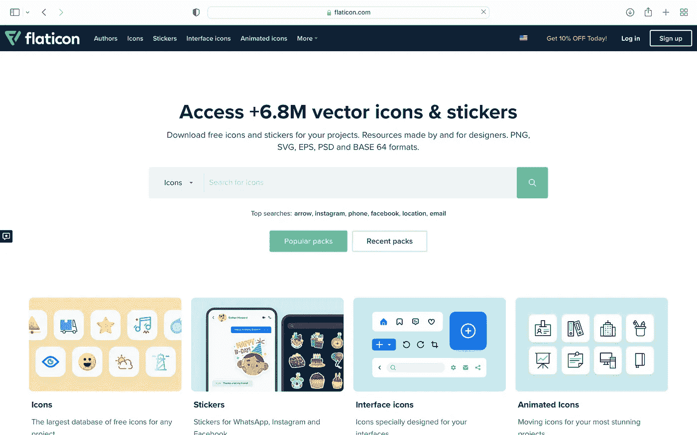

# 10.坎瓦

🌐 [**网站**](https://www.canva.com/)

我把我个人最喜欢的留到了最后。Canva 是一个非常强大的工具。您可以创建任何内容，从演示文稿到帖子、视频、贺卡等等。在这里你能做的没有限制。而且好消息是 Pro 版自带 [**GitHub 学生开发者**](https://education.github.com/pack) 包！

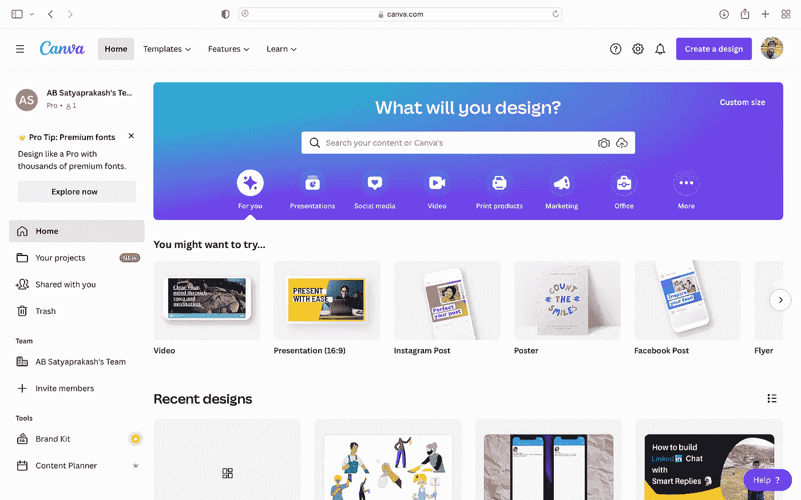

# 结论

继续尝试这些工具吧！这篇文章的封面图片也是使用 **Canva** 制作的😌

如果您有任何问题或建议，请随时联系我。你可以在这些社交媒体平台上关注我——[LinkedIn](https://www.linkedin.com/in/ab-satyaprakash/)， [YouTube](https://www.youtube.com/channel/UCJ6D0HS8c9Il-eX5lGbAyGg) ， [Twitter](https://twitter.com/AbSatyaprakash) ， [Instagram](https://www.instagram.com/absatyaprakash/) 了解更多更新内容！

**一如既往！黑客快乐！😇**

[加入我的电子邮件列表，获得更多精彩的教程和编程博客](https://absatyaprakash01.medium.com/subscribe) ❤️