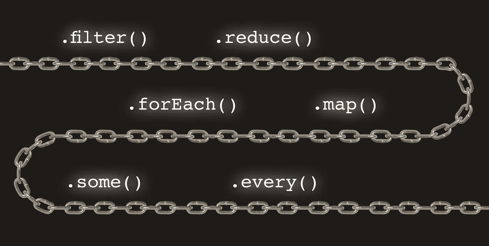

# 你应该知道的 10 种 JavaScript 数组方法，包括提示、技巧和示例

> 原文：<https://medium.com/nerd-for-tech/10-javascript-array-methods-you-should-know-with-tips-tricks-2c55d5fab251?source=collection_archive---------12----------------------->



数组是 JavaScript 中广泛使用的数据结构。您可以在数组上执行的操作(迭代、插入项、删除项等)数量很大。数组对象提供了大量有用的方法，比如`array.forEach()`、`array.map()`等等。

我经常不知所措，当使用哪种方法时，在哪种情况下哪种方法有用，所有的数组方法都带有特定的参数或签名，我将逐一解释所有的数组方法，以便我们在数组上执行各种操作以及日常操作

# 1.重复

我们使用迭代来打印 1 到 100 个数字，或者说执行重复的动作，直到满足特定的条件

## **1.1 对于..周期**

`for(const item of items)`循环迭代数组项。

让我们遍历一个`colors`列表:

```
const colors = ['blue', 'green', 'white'];

for (const color of colors) {
  console.log(color);
}
//output
// 'blue'
// 'green'
// 'white'
```

让我们再举一个例子，使用中断并继续关键字

```
const numbers = [1,2,3,4,5];for (const number of numbers) {
if (number == 2) {
continue;
}
if (number == 4) {
break;
}
console.log(number);
}
//output//1
//3
```

小贴士:

*   你可以在任何时候使用`break`语句停止迭代。
*   您可以通过使用`continue`语句来停止一次迭代。

## 1.2 对于..循环的

`for(let i; i < array.length; i++)` 使用递增的索引变量循环遍历数组项。

`for`通常需要在每个周期递增的`index`变量:

```
const colors = ['blue', 'green', 'white'];

for (let index = 0; index < colors.length-1; index++) {
  const color = colors[index];
  console.log(color);
}
// 'blue'
// 'green'
// 'white'
```

`index`变量从`0`到`colors.length - 1`递增。该变量用于通过索引访问项目:`colors[index]`。

## 1.3 array.forEach()方法

为每个数组元素调用一次函数。在每次迭代中，使用参数调用`callback(item [, index [, array]])`:迭代项、索引和数组本身。

让我们迭代`colors`数组:

```
const colors = ['blue', 'green', 'white'];

colors.forEach(function callback(value, index) {
  console.log(value, index);
});
// 'blue', 0
// 'green', 1
// 'white', 2
```

`array.forEach(callback)`对数组中的每一项调用`callback` 3 次:`'blue'`、`'green'`和`'white'`。

让我们为每种方法再举一个例子

```
var a = [1, 2, 3, 4, 5];var totalSum = 0;a.forEach(x => {totalSum += x;console.log(totalSum);});//output
//1
//3
//6
//10
//15
```

小贴士:

*   您不能中断`array.forEach()`迭代。

# 2.地图

## 2.1 array.map()方法

`array.map(callback)`方法通过对每个数组项使用`callback`调用结果来创建一个新数组。

在每一次迭代中，`callback(item[, index[, array]])`都是通过参数调用的:当前项、索引和数组本身。它应该返回新的项目。

让我们递增数组的编号:

```
const numbers = [0, 2, 4];const newNumbers = numbers.map(function increment(number) {
  return number + 1;
});newNumbers; // => [1, 3, 5]
```

`numbers.map(increment)`用λ表达

```
const arr = [1, 2, 3, 4, 5, 6];

  // add one to every element
  const oneAdded = arr.map(num => num + 1);
  console.log(oneAdded); // output [2, 3, 4, 5, 6, 7]

  console.log(arr); // output: [1, 2, 3, 4, 5, 6]
```

使用映射功能动态添加对象

```
const appleColor = ['white', 'black', 'red'];
const apple = appleColor.map(x => {
return {
appleColor: x,
applePrice: 50
}});
console.log(appleColor);
// output
// 0: "white"
// 1: "black"
// 2: "red"console.log(apple);
// output// 0: {appleColor: "white", applePrice: 50}
// 1{appleColor: "black", applePrice: 50}
// 2: {appleColor: "red", applePrice: 50}
// length: 3
```

小贴士:

*   `array.map()`创建一个新的映射数组，不改变原来的数组。

## 2.1 array.from()方法

`Array.from(arrayLike[, callback])`方法通过使用`callback`在每个数组项上调用结果来创建一个新数组。

在每一次迭代中，`callback(item[, index[, array]])`都是通过参数调用的:当前项、索引和数组本身。它应该返回新的项目。

让我们递增数组的编号:

```
const numbers = [0, 2, 4];const newNumbers = Array.from(numbers,
  function increment(number) {
    return number + 1;
  }
);newNumbers; // => [1, 3, 5]
```

`Array.from(numbers, increment)`从`numbers`创建一个新的数组，增加每个数组项。

这将所有类似数组或可迭代的东西变成真正的数组，尤其是在使用 DOM 时。

```
const name = 'frugence';
  const nameArray = Array.from(name);

  console.log(name); // output: frugence
  console.log(nameArray); // output: ['f', 'r', 'u', 'g', 'e', 'n', 'c', 'e']
```

小贴士:

*   `Array.from()`创建新的映射数组，而不改变原始数组
*   `Array.from()`更适合从[阵列状物体](https://dmitripavlutin.com/javascript-array-from-applications/#2-transform-array-like-into-an-array)映射。

# 3.减少

## 3.1 array.reduce()方法

`array.reduce(callback[, initialValue])`通过调用`callback`函数作为缩减器，将数组缩减为一个值。

在每一次迭代中，`callback(accumulator, item[, index[, array]])`被带参数调用:累加器、当前项、索引和数组本身。它应该返回累加器。

经典的例子是对一组数字求和:

```
const numbers = [2, 0, 4];function summarize(accumulator, number) {
  return accumulator + number;
}const sum = numbers.reduce(summarize, 0);sum; // => 6const arr = [1, 2, 3, 4, 5, 6];

  const sum = arr.reduce((total, value) => total + value, 0);
  console.log(sum); // 21
```

在第一步`accumulator`用`0`初始化。然后在每个数组项上调用`summarize`函数，累加数字的和。

小贴士:

*   如果跳过`initialValue`参数，第一个数组项将成为初始值。

# 4.串联

## 4.1 array.concat()方法

`array.concat(array1[, array2, ...])`将一个或多个数组连接到原始数组。

让我们连接两个名称数组:

```
const heroes = ['Batman', 'Robin'];
const villains = ['Joker', 'Bane'];const everyone = heroes.concat(villains);everyone; // => ['Batman', 'Robin', 'Joker', 'Bane']
```

`heroes.concat(villains)`通过连接`heroes`和`villains`数组创建一个新数组。

小贴士:

*   `array.concat()`创建一个新数组，不改变原来的数组
*   `array.concat(array1[, array2, ...])`接受多个数组进行连接。

## 4.2 扩展运算符

您可以使用带有数组文字的 spread 运算符来连接数组:`[...array1, ...array2]`。

让我们连接两个名称数组:

```
const heroes = ['Batman', 'Catwoman'];
const villains = ['Joker', 'Bane'];const names = [...heroes, ...villains];names; // => ['Batman', 'Catwoman', 'Joker', 'Bane']
```

`[...heroes, ...villains]`展开`heroes`和`villains`项，然后创建一个包含所有展开项的新数组。

*   `[...arr1, ...arr2, ...arrN]`:您可以使用 spread 运算符连接任意数量的数组。

# 5.薄片

## 5.1 array.slice()方法

`array.slice([fromIndex[, toIndex]])`返回从`fromIndex`开始到`toIndex`结束的数组切片(不包括`toIndex`本身)。`fromIndex`可选参数默认为`0`，`toIndex`可选参数默认为`array.length`。

让我们来看一些数组切片:

```
const names = ['Batman', 'Catwoman', 'Joker', 'Bane'];const heroes = names.slice(0, 2);
const villains = names.slice(2);heroes; // => ['Batman', 'Catwoman']
villains; // => ['Joker', 'Bane']
```

`names.slice(0, 2)`从`names`数组返回 2 个项目的切片。

`names.slice(2)`返回 2 个项目的切片。`end`参数默认为`names.length`。

小贴士:

*   创建一个新数组，而不改变原来的数组。

# 6.克隆

## 6.1 扩展运算符

克隆数组的一个简单方法是使用 spread 操作符:`const clone = [...array]`；

让我们克隆一个`colors`数组:

```
const colors = ['white', 'black', 'gray'];const clone = [...colors];clone; // => ['white', 'black', 'gray']
colors === clone; // => false
```

`[...colors]`创建一个`colors`数组的克隆。

小贴士:

*   `[...array]`创建浅拷贝。

## 6.2 array.concat()方法

`[].concat(array)`是关于如何克隆`array`的另一种方法。

```
const colors = ['white', 'black', 'gray'];const clone = [].concat(colors);clone; // => ['white', 'black', 'gray']
colors === clone; // => false
```

`[].concat(colors)`创建一个`colors`数组的克隆。

小贴士:

*   创建一个浅拷贝。

## 6.3 array.slice()方法

`array.slice()`是关于如何克隆`array`的另一种方法。

```
const colors = ['white', 'black', 'gray'];const clone = colors.slice();clone; // => ['white', 'black', 'gray']
colors === clone; // => false
```

`colors.slice()`创建`colors`数组的克隆。

小贴士:

*   `colors.slice()`创建浅层副本。

# 7.搜索

## 7.1 array.includes()方法

`array.includes(itemToSearch[, fromIndex])`返回一个布尔值，判断`array`是否包含`itemToSearch`。可选参数`fromIndex`，默认为`0`，指示开始搜索的索引。

让我们确定`2`和`99`是否存在于数字数组中:

```
const numbers = [1, 2, 3, 4, 5];numbers.includes(2);  // => true
numbers.includes(99); // => false
```

`numbers.includes(2)`返回`true`，因为`2`存在于`numbers`数组中。

然而`numbers.includes(99)`是`false`，因为`numbers`不包含`99`。

## 7.2 array.find()方法

`array.find(predicate)`方法返回满足`predicate`函数的第一个数组项。

在每次迭代中`predicate(item[, index[, array]])`函数被参数调用:迭代项、索引和数组本身。

例如，让我们找到第一个偶数:

```
const numbers = [1, 2, 3, 4, 5];function isEven(number) {
  return number % 2 === 0;
}const evenNumber = numbers.find(isEven);evenNumber; // => 2
```

`numbers.find(isEven)`返回`numbers`内的第一个偶数，即`2`。

小贴士:

*   如果没有项目满足谓词，则`array.find()`返回`undefined`。

## 7.3 array.indexOf()方法

`array.indexOf(itemToSearch[, fromIndex])`返回`array`中第一次出现`itemToSearch`的索引。可选参数`fromIndex`，默认为`0`，是开始搜索的索引。

让我们找到`'Joker'`的索引:

```
const names = ['Batman', 'Catwoman', 'Joker', 'Bane'];const index = names.indexOf('Joker');index; // => 2
```

`names`内`'Joker'`的索引为`2`。

小贴士:

*   `array.indexOf(itemToSearch)`如果没有找到物品，返回`-1`
*   `array.findIndex(predicate)`是使用谓词函数查找索引的替代方法。

# 8.询问

## 8.1 array.every()方法

如果每个项目都通过了`predicate`检查，则`array.every(predicate)`方法返回`true`。

在每一次迭代中，谓词函数被参数调用:迭代项、索引和数组本身。

让我们确定数组`evens`和`mix`是否只包含偶数:

```
const evens = [0, 2, 4, 6];
const numbers = [0, 1, 4, 6];function isEven(number) {
  return number % 2 === 0;
}evens.every(isEven); // => true
numbers.every(isEven); // => false
```

`evens.every(isEven)`是`true`，因为`evens`中的*都是偶数。*

但是，`numbers.every(isEven)`的计算结果是`false`，因为`numbers`包含一个奇数`1`。

## 8.2 array.some()方法

如果至少有一项通过了`predicate`检查，则`array.some(predicate)`方法返回`true`。
在每次迭代中`predicate(item[, index[, array]])`函数被参数调用:迭代项、索引和数组本身。

让我们确定数组是否包含至少一个偶数:

```
const numbers = [1, 5, 7, 10];
const odds = [1, 3, 3, 3];function isEven(number) {
  return number % 2 === 0;
}numbers.some(isEven); // => true
odds.some(isEven);   // => false
```

`numbers.some(isEven)`是`true`，因为`numbers`中至少存在一个偶数`10`。

但是`odds.some(isEven)`是`false`，因为`odds`只包含奇数。

# 9.过滤器

## 9.1 array.filter()

`array.filter(predicate)`方法返回一个包含通过`predicate`检查的项目的新数组。

在每次迭代中，使用参数调用函数:迭代项、索引和数组本身。

让我们过滤一个只有偶数的数组:

```
const numbers = [1, 5, 7, 10];function isEven(number) {
  return number % 2 === 0;
}const evens = numbers.filter(isEven);evens; // => [10]
```

`numbers.filter(isEven)`通过过滤`numbers`创建一个新的数组`evens`，使其只包含偶数。

小贴士:

*   创建一个新数组，而不改变原来的数组。

# 10.插入

## 10.1 array.push()方法

方法将一个或多个项目附加到数组的末尾，返回新的长度。

让我们将`'Joker'`追加到`names`数组的末尾:

```
const names = ['Batman'];names.push('Joker');names; // ['Batman', 'Joker']
```

`names.push('Joker')`在`names`数组的末尾插入一个新项目`'Joker'`。

小贴士:

*   `array.push()`原地变异阵列
*   `array.push(item1, item2, ..., itemN)`可以推送多个项目。

## 10.2 array.unshift()方法

方法将一个或多个项目追加到数组的开头，返回数组的新长度。

让我们在`names`数组的开头追加`'Catwoman'`:

```
const names = ['Batman'];names.unshift('Catwoman');names; // ['Catwoman', 'Batman']
```

`names.unshift('Catwoman')`在`names`数组的开头插入一个新项`'Catwoman'`。

小贴士:

*   `array.unshift()`就地变异阵列。
*   `array.unshift(item1, item2, ..., itemN)`可以插入多个项目。

## 10.3 扩展运算符

通过将 spread 运算符与数组文字相结合，可以以不可变的方式在数组中插入项。

在数组的*末端追加一个项目:*

```
const names = ['Joker', 'Bane'];const names2 = [
  ...names,
  'Batman',
];names2; // => ['Joker', 'Bane', 'Batman'];
```

在数组的*开头追加一个项目:*

```
const names = ['Joker', 'Bane'];const names2 = [
  'Batman',
  ...names
];names2; // => ['Batman', 'Joker', 'Bane'];
```

在任一索引处插入一个项目*:*

```
const names = ['Joker', 'Bane'];
const indexToInsert = 1;const names2 = [
  ...names.slice(0, indexToInsert),
  'Batman',
  ...names.slice(indexToInsert)
];names2; // => ['Joker', 'Batman', 'Bane'];
```

# 11.去除

## 11.1 array.pop()方法

方法从数组中移除最后一项，然后返回该项。

例如，让我们删除`colors`数组的最后一个元素:

```
const colors = ['blue', 'green', 'black'];const lastColor = colors.pop();lastColor; // => 'black'
colors; // => ['blue', 'green']
```

`colors.pop()`删除`colors`的最后一个元素并返回。

小贴士:

*   `array.pop()`就地变异数组。

## 11.2 array.shift()方法

`array.shift()`方法从数组中移除第一项，然后返回该项。

例如，让我们删除`colors`数组的第一个元素:

```
const colors = ['blue', 'green', 'black'];const firstColor = colors.shift();firstColor; // => 'blue'
colors; // => ['green', 'black']
```

`colors.shift()`删除`colors`的第一个元素`'blue'`并返回。

小贴士:

*   `array.shift()`就地变异数组
*   `array.shift()`具有 O(n)复杂度。

## 11.3 array.splice()方法

`array.splice(fromIndex[, removeCount[, item1[, item2[, ...]]]])`从数组中删除项目并插入新项目。

例如，让我们从索引`1`中删除 2 项:

```
const names = ['Batman', 'Catwoman', 'Joker', 'Bane'];names.splice(1, 2);names; // => ['Batman', 'Bane']
```

`names.splice(1, 2)`删除元素`'Catwoman'`和`'Joker'`。

`names.splice()`可以插入新的物品代替已删除的物品。让我们替换索引`1`中的 2 个项目，并插入一个新项目`'Alfred'`:

```
const names = ['Batman', 'Catwoman', 'Joker', 'Bane'];names.splice(1, 2, 'Alfred');names; // => ['Batman', 'Alfred' ,'Bane']
```

小贴士:

*   `array.splice()`原地变异阵列。

## 11.4 扩展运算符

通过将 spread 运算符与数组文字相结合，可以以不可变的方式从数组中移除项。

让我们删除一些项目:

```
const names = ['Batman', 'Catwoman', 'Joker', 'Bane'];
const fromIndex = 1;
const removeCount = 2;const newNames = [
  ...names.slice(0, fromIndex),
  ...names.slice(fromIndex + removeCount)
];newNames; // => ['Batman', 'Bane']
```

`newNames`包含`names`的项目，但没有被删除的 2 个。

# 12.空的

## 12.1 数组长度属性

`array.length`是保存数组长度的属性。不止如此，`array.length`是可写的。

如果你写一个小于当前长度的`array.length = newLength`，多余的元素将从数组中移除。

让我们使用`array.length = 0`来移除数组中的所有项目:

```
const colors = ['blue', 'green', 'black'];colors.length = 0;colors; // []
```

`colors.length = 0`从`colors`数组中移除所有项目。

## 12.2 array.splice()方法

`array.splice(fromIndex[, removeCount[, item1[, item2[, ...]]]])`从数组中删除项目并插入新项目。

如果省略了`removeCount`参数，那么`array.splice()`将删除从`fromIndex`开始的数组的所有元素。

让我们用它来删除数组中的所有元素:

```
const colors = ['blue', 'green', 'black'];colors.splice(0);colors; // []
```

`colors.splice(0)`删除`colors`数组的所有元素。

# 13.充满

## 13.1 数组.填充()方法

`array.fill(value[, fromIndex[, toIndex]])`从`fromIndex`开始到`toIndex`用`value`填充数组(不包括`toIndex`本身)。`fromIndex`可选参数默认为`0`，`toIndex`可选参数默认为`array.length`。

例如，让我们用零值填充一个数组:

```
const numbers = [1, 2, 3, 4];numbers.fill(0);numbers; // => [0, 0, 0, 0]
```

用零填充数组。

不仅如此，您还可以使用`Array(length).fill(initial)`初始化特定长度和初始值的数组:

```
const length = 3;
const zeros = Array(length).fill(0);zeros; // [0, 0, 0]
```

创建一个由 3 个零组成的数组。

小贴士:

*   `array.fill()`就地变异阵列。

## 13.2 Array.from()函数

`Array.from()`可以用对象来初始化一个一定长度的数组:

```
const length = 4;
const emptyObjects = Array.from(Array(length), function() {
  return {};
});emptyObjects; // [{}, {}, {}, {}]
```

`emptyObjects`是用空对象的不同实例初始化的数组。

# 14.变平

## 14.1 array.flat()方法

`array.flat([depth])`方法通过递归平坦化数组中的项目来创建一个新的数组，直到某个`depth`。`depth`可选参数默认为`1`。

让我们展平数组的数组:

```
const arrays = [0, [1, 3, 5], [2, 4, 6]];const flatArray = arrays.flat();flatArray; // [0, 1, 3, 5, 2, 4, 6]
```

`arrays`包含数字和数字数组的混合。`arrays.flat()`平坦化数组，使其只包含数字。

小贴士:

*   创建一个新数组，而不改变原来的数组。

# 15.分类

## 15.1 array.sort()方法

方法对数组中的项目进行排序。当省略 compare 函数时，该方法将这些项转换为字符串，然后按照 UTF-16 代码单位值对它们进行升序排序。

可选参数`compare(item1, item2)`是一个定制项目顺序的回调函数。如果`compare(item1, item2)`返回:

*   在排序后的数组中，`-1`之后是`item1`
*   在排序后的数组中，`1`之后是`item2`
*   `0`那么项目的位置不会改变

让我们对一组字母进行排序:

```
const letters = ['B', 'C', 'A'];letters.sort();letters; // => ['A', 'B', 'C']
```

`letters.sort()`按升序排列字母。

让我们使用比较函数，使偶数后跟奇数:

```
const numbers = [4, 3, 1, 2];function compare(n1, n2) {
  if (n1 % 2 === 0 && n2 % 2 !== 0) {
    return -1;
  }
  if (n1 % 2 !== 0 && n2 % 2 === 0) {
    return 1;
  }
  return 0;
}numbers.sort(compare);numbers; // => [4, 2, 3, 1]
```

`numbers.sort(compare)`使用自定义比较功能，首先对偶数进行排序。

小贴士:

*   `array.sort()`就地变异数组。