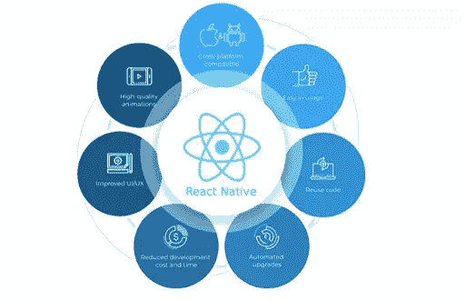

# React 原生应用开发中要避免的 10 个错误

> 原文：<https://medium.com/nerd-for-tech/10-mistakes-to-avoid-in-react-native-app-development-185325c22d7f?source=collection_archive---------0----------------------->

2021 年，React Native 是全球开发者使用第二多的跨平台移动框架，市场份额为 38%。React 本机应用程序开发服务提供了更快的原型开发速度和开发便利性，成为每个开发人员的首选。

一些世界顶级公司，如脸书、优步、Skype、Instagram、Pinterest 等，要么拥有 React 原生应用程序，要么在其技术栈中使用它。它为 iOS 和 Android 提供了快速的应用程序开发。随着公司从传统框架转向 React，对 React 本地开发人员的需求正在增加。

资料来源:LitsLinks

虽然 React Native 有很大的好处，但开发人员也面临着挑战。公司通常认为 React Native 将解决他们所有的跨平台开发需求。然而，他们忘记了考虑可能发生的人为和机器错误。

这篇文章将强调 [React 本地开发者](https://www.botreetechnologies.com/hire-react-native-developers)在创建跨平台解决方案时可能犯的 10 大错误。我们将了解他们如何避免这样的错误，并做出更好的反应原生应用。

**10 大反应原生开发错误避免**

理解 React Native 和 JavaScript 出现的错误很重要，这样可以避免降低用户体验。以下是开发人员在使用 React 原生项目时必须避免的 10 大错误

1.  **不当的 Redux 商店规划** 如果规划不当，即使是最好的 React 原生应用也会失控。开发者通常关注应用的布局和体验，而很少关注数据处理部分。
    Redux 是正确管理和规划数据的首选工具。它非常适合处理大量数据的大型企业应用程序。它将创建一个存储层次结构，并提供所有文件的适当安排。
2.  **不正确的图像优化** React 本地应用开发公司可能犯的另一个错误是没有优化图像。团队认为这是一个耗时的过程，这导致了对图像优化过程的忽视。它最终会增加应用程序的加载时间。
    图像优化可轻松将图像上传至云端。它提供了不占用太多空间的正确对齐的图像。优化可以简单地通过调整图像大小来完成。
3.  错误的估计
    在不同的领域，错误的估计会导致非常糟糕的结果。应用布局、模块、表单、端点——一切都有某些因素，很容易被错误地估计。
    开发人员在制定计划之前需要正确估计需求。他们需要为两个独立的平台评估代码，即使它是可重用的。团队应该创建两种不同的布局，并在进行评估之前考虑数据库结构。
4.  **忽略外部模块代码** 这是构建 React 原生应用时的一个大问题。许多开发人员从不阅读外部模块代码。虽然它会浪费很多时间，但是开发人员添加一个特性所花费的时间也比预计的要多。
    外部模块简化了应用程序开发过程。它们带有文档，实现时可以节省大量时间。开发团队可以很容易地识别与模块相关的问题，并毫不费力地解决它们。
5.  **无状态组件利用** React 原生应用通常具有无状态组件，因为开发人员不知道它可能会对移动应用造成什么影响。尽管在 React 16 之前，添加无状态组件是一种有效的做法，但现在已经不再这样了。
    为了避免重新渲染组件，开发人员现在更喜欢使用纯组件。因此，为了消除基于父组件的更改，使用纯组件是有意义的，因为它只重新呈现特定的组件。
6.  **忽略编写单元测试** React 原生项目中最大的错误之一就是不编写任何类型的单元测试。这是一个冒险的举动，因为一旦产品进入市场，解决出现的问题可能是一个挑战。它经常会使预算和时间估计偏离轨道。
    单元测试有助于在其他人之前识别不同部分中的问题和错误。在向最终用户发布之前，测试功能是很重要的。
7.  **糟糕的编码实践** 糟糕的编码实践经常通过定期调用修改来阻碍 React 本地应用程序开发服务。如果您不知道最佳编码实践，可能会增加代码长度，最终导致应用程序延迟。为编码实践创建一个计划，并确保你遵循它们。它增强了代码的可读性，并使团队能够在代码库上无缝地工作。由于跨平台能力，React Native 可能具有复杂的代码库，因此遵循最佳编码实践非常重要。
8.  **离开“console.log”语句** 如果把渲染方法和逻辑留在内部，会导致严重的问题。对于控制台日志，调试变得很麻烦——尤其是当呈现方法和逻辑异步时。它还会在 JavaScript 线程中产生问题。
    开发人员能做的最好的事情就是将 console.log 语句放在手边。当他们需要调试应用程序时，他们可以浏览文档并轻松地实现更改。
9.  **俯瞰项目结构** 一个跨平台的应用可以有一个复杂的项目结构，这并不奇怪。即使是一个有很好计划的软件开发服务公司也可能被项目复杂的 React Native 结构所困扰。这也是一个被忽视的因素，导致未来的重大问题。构建项目有多种方式。如果文件和文件夹易于访问，将会简化协作。从长远来看，一个好的、组织良好的项目框架将会带来巨大的好处。
10.  **状态内部呈现突变** React Native app 中数据和视图是互联的。该视图使用数据存储中的新数据，并在屏幕上展示新的状态。当内部状态直接突变时，状态变化的循环就被破坏了。这可能会导致应用程序崩溃或性能不佳。
    开发团队必须避免直接从数据存储中改变状态。他们应该关注在 React 本地开发过程中被检查的组件的生命周期。

**包装**

React 本地应用程序开发可能是跨平台移动开发的最佳选择之一。它使开发人员构建移动应用的速度比其他几个框架快 25%到 40%。避免上述错误可以很容易地提高开发过程的速度和应用程序的性能

*原载于 2022 年 3 月 13 日 https://www.trickyenough.com**。*