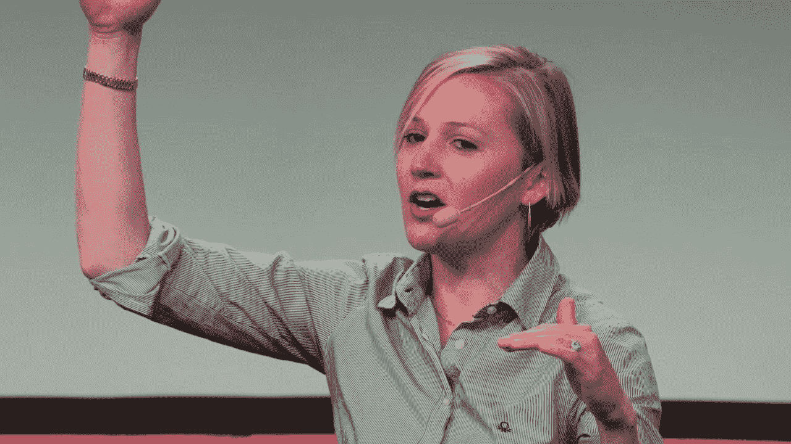
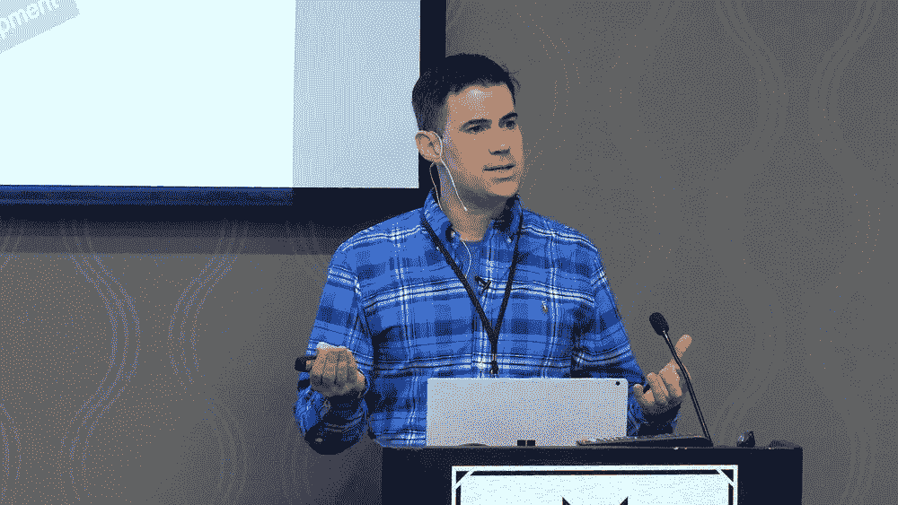
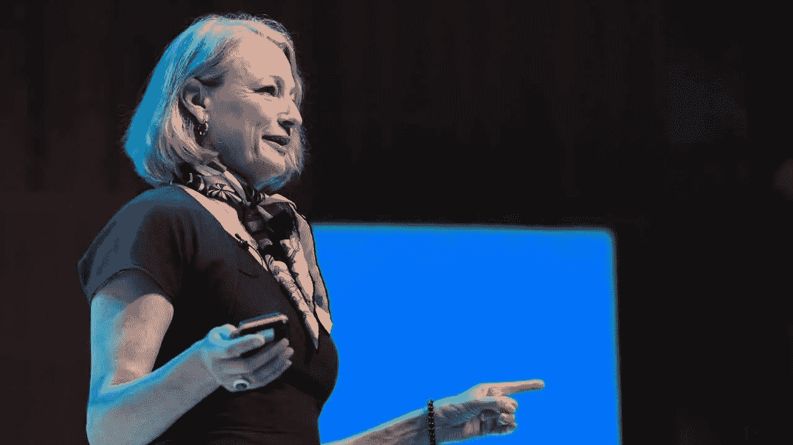

# Instagram 上 10 个必须关注的 UX 影响者

> 原文：<https://medium.com/nerd-for-tech/10-must-followed-ux-influencers-on-instagram-a31776f21452?source=collection_archive---------10----------------------->

当今的数字世界正处于稳步变化之中。类似地，当您习惯了另一种计划模式时，另一种模式就会出现，迫使您重新考虑如何处理每个用户项目。作为一名 [UX 专家](https://mockitt.wondershare.com/ui-ux-design/ux-experts.html?utm_source=other_media_sites&utm_medium=social&utm_campaign=md&utm_term=medium_post&utm_content=post_md_md_en_20087918_2021-03-11)，这取决于你能否确保自己掌握业务中最新的变化。尽管如此，它倾向于试图毫无疑问地知道哪些模式你应该适当地观察，哪些你可以忽略。

在[莫基特](http://mockitt.wondershare.com?utm_source=other_media_sites&utm_medium=social&utm_campaign=md&utm_term=medium_post&utm_content=post_md_md_en_20087918_2021-03-11)看来，改进和提高你的计划风险的另一个选择是关注 UX 有影响力的人。UX 的影响者不仅仅是管理客户做出购买选择。这些人被认为是他们领域的先驱。他们投入全部精力去寻找真正有用的想法和主意。这样，他们可以在网上保持有效的地位。

# 2021 年 UX 十大影响力人物

## 1.安德鲁·库切里纳维

Andrew Kucheriavy 是一家名为 inte technic 的公司的杰出联合创始人兼首席执行官。Andrew 是世界上第一批获得“用户体验大师”奖的人之一。这意味着，如果你想了解用户体验设计的来龙去脉，他是一个值得关注的优秀人物。

作为 UX、商业战略和集客营销领域的领军人物之一，Andrew 为专业人士和学习者提供了有用的信息。安德鲁在 Twitter 上特别活跃，他不断分享对设计和营销的见解。你也可以在英特尔博客上找到 Andrew 的意见。

## 2.杰夫·维恩

另一个必须遵循的设计师谁想要学习更多地了解他们的观众和他们在市场中的地位，杰夫维恩是 UX 和产品设计的领导者。在为 UX 咨询公司创建 [Adaptive Path](https://www.adaptivepath.com/) 公司之前，维恩从《连线》的创始团队起步。杰夫·维恩也因负责[谷歌分析](https://analytics.google.com/)的各个方面而闻名。

这些年来，Jeff 扩展了他在设计领域的知识，并指导了许多公司，从 WordPress 到 Medium。他还有一个很棒的播客，当你在路上的时候，你可以听听他的指导。如果你听不到杰夫在 UX 和产品活动上的演讲，你可以听听他的播客或者在 Instagram 上关注他。

## 3.[杰瑞德阀芯](https://www.instagram.com/jmspool/?hl=en)

在“UX”这个词出现之前，杰瑞德·斯波尔就已经着手解决最常见的用户体验问题了。自 1978 年以来，Jared 在设计领域表现出色，已经成为用户体验环境中最大、最知名的名字之一。他是用户界面工程咨询公司的创始人。该公司致力于帮助公司提高网站和产品的可用性。

贾里德在他的推特上提供了大量有用的信息。此外，你还可以在 [Twitter](https://twitter.com/jmspool) 上找到大量他在[网](https://aycl.uie.com/)上发表的博客和文章的有用链接。紧随其后的是轮毂、[皮库斯](https://www.picussecurity.com/)以及许多其他领先品牌。一定要看看他收集的关于 UIE 的行业领先演讲。

## 4.凯蒂·迪尔

凯蒂·迪尔是 [Airbnb](https://www.airbnb.com/) 的前体验总监，所以你知道她对一些独特的体验了如指掌。凭借与利用新技术和 UX 设计的公司合作的专业知识，Katie Dill 处于用户体验领域的前沿。凯蒂·迪尔一年到头参加各种 [UX 会议](https://mockitt.wondershare.com/ui-ux-design/design-conferences.html?utm_source=other_media_sites&utm_medium=social&utm_campaign=md&utm_term=medium_post&utm_content=post_md_md_en_20087918_2021-03-11)，并在 [YouTube](https://www.youtube.com/watch?v=FeaUgol_ot4) 上发布一系列精彩视频。你可以在网上找到凯蒂的博客和文章；然而，你可以通过在 Katie 的 Instagram 上关注她来获得更多的信息。

## 5.[葵荣](https://www.instagram.com/khoi/?hl=en)

Khoi Vinh 是当今市场上最友好、最独特的 UX 博主和有影响力的人之一。他知道如何有趣而吸引人地与人交谈——甚至是关于 UX 设计中更复杂的话题。Vinh 是 Adobe 的首席设计师，他有自己的播客叫做线框。然而，他仍然有时间让他的追随者在推特上保持活跃。

这些年来，Khoi 一直是 Etsy 和 T2 纽约时报的设计总监。Vinh 还写了一本名为“[排序混乱](https://www.amazon.com/Ordering-Disorder-Principles-Design-Voices/dp/0321703537)”的书，研究网页设计中的网格原则。据《快速公司》报道，他是美国最有影响力的设计师之一。此外，Khoi 有一个很棒的博客[,在那里你可以看到他对 UX 设计的最新见解。](https://www.subtraction.com/)

## 6.[科里·莱布森](https://www.instagram.com/cory.lebson/?hl=en)

Cory Lebson 是网页设计和用户体验领域的资深人士。Cory 在景观领域拥有 20 多年的经验，他有自己专门的 UX 咨询公司，名为 [Lebsontech](https://lebsontech.com/) 。Lesson 和他的公司专注于提供 UX 培训、指导和用户体验策略支持。Cory 还定期就 UX 职业发展、用户体验、信息架构等话题发表演讲。

科里是一个很有影响力的人，你可以在 Twitter 上关注他，在那里你会发现他分享了各种 UX 的技巧和窍门。你也可以看看科里的 UX 职业手册，或者找到他在 Lebsontech 博客上发表的内容。

## 7.[利兹·戴森](https://www.instagram.com/mrskellydyson/?hl=en)

UX 电影业的另一位了不起的女性[利兹·戴森](https://www.linkedin.com/in/lizziedyson/?originalSubdomain=uk)，正在改变我们所知的体验景观。尽管她在网页设计领域是一个相对较新的人物，但她对网页开发领域惊人的洞察力已经得到了全世界的认可。Lizzie 还帮助创建了一个新的团体，专门针对那些想参与网页设计的女性。

UX 每月聚会的女士们欢迎女性社区进入数字领域，帮助她们学习和拓展技能。利兹定期在网上发布内容，作为 UX 女士的一部分。此外，她还出现在为全球女性举办的年度设计和技术会议 [Talk UX feed](https://www.youtube.com/watch?v=iUYD57iSmUc) 上。

## 8.[克里斯·梅西纳](https://www.instagram.com/chris/)

[克里斯·梅西纳](https://chrismessina.me/)是一名产品设计师和技术大师，他知道如何避免让你的用户失望。梅西纳在 UX 设计领域拥有十多年的经验，曾为各种大牌品牌工作过，包括谷歌和优步。他最广为人知的身份是标签的发明者[！](https://www.cnbc.com/2018/04/30/chris-messina-hashtag-inventor.html)

Chris 是一个技术高超的人，他了解吸引客户并让人们再次访问网站的独特元素。你可以看到克里斯在世界各地的主要会议上发言。在 YouTube 上查看他的一些演讲，或者在这里追踪他即将到来的演讲的时间表。克里斯也有各种关于媒体的精彩文章可供阅读。

## 9.詹·罗马诺·博格斯特伦

珍·罗马诺·博格斯特伦是一名实验心理学家、用户体验研究教练和 UX 专家。Jen 是网页设计界最令人印象深刻的女性之一。她帮助顾客在 Instagram 和脸书上创造独特的体验。此外，她还具备网络眼球追踪的专业知识。你甚至可以看看 Jen 关于眼球追踪和可用性测试的书。

当她不写书或研究用户体验时，Jen 就在博客和推特上谈论可用性和研究网页设计领域的新策略。在[推特](https://twitter.com/romanocog)上关注 Jen 绝对是值得的，特别是如果你想第一个知道她即将到来的研讨会和学习会议。

## 10.[伊莉莎白·邱吉尔](https://www.instagram.com/xeeliz/?hl=en)

最后， [Elizabeth Churchill](https://www.linkedin.com/in/elizabethfchurchill) 是一位 UX 领导人，在心理学、研究科学、心理学、人工智能、认知科学、人类与计算机的交互等领域有着杰出的背景。从认知经济学到日常网页设计，她无所不知。邱吉尔还担任谷歌材料设计的 UX 总监。

创新和信息的发电站，伊丽莎白·丘吉尔。丘吉尔名下拥有 50 多项专利。她也是计算机械协会的副主席。当她不在 Twitter 上分享信息时。伊丽莎白也有一个固定的专栏，你可以在 ACM Interactions 杂志上收听。

# 结论

UX 影响者不仅仅是电脑化推广的工具；它们也是发展 UX 创作者的巨大方向源泉。不管你是在寻找动机、方向还是数据，正确的影响者可以将一些精彩的经历传递到网站架构的宇宙中。在客户体验领域，有许多思想先驱可以改变你处理客户项目的方式。你甚至可以找到另一个最受欢迎的网络广播来收听，或者一个惊人的录音安排来帮助你驾驭新的能力。

感谢您花时间阅读这篇文章。[了解更多关于 Mockitt 的信息](https://mockitt.wondershare.com/?utm_source=other_media_sites&utm_medium=social&utm_campaign=md&utm_term=medium_post&utm_content=post_md_md_en_20087918_2021-03-11)

我们为 UX 初学者创建了一个[终极指南](https://mockitt.wondershare.com/ux-beginner.html?utm_source=other_media_sites&utm_medium=social&utm_campaign=md&utm_term=medium_post&utm_content=post_md_md_en_20087918_2021-03-11)，它收集了来自多个 UXers 的知识、经验和建议。

订阅我们的 [YouTube](https://www.youtube.com/channel/UCESxamaRS8nOGpWYvP1VSqA) [脸书](https://www.facebook.com/mockitt) [Instagram](https://www.instagram.com/wondershare.mockitt/)

*最初发表于*[*https://mockitt.wondershare.com*](https://mockitt.wondershare.com/ui-ux-design/instagram-ux.html?utm_source=other_media_sites&utm_medium=social&utm_campaign=md&utm_term=medium_post&utm_content=post_md_md_en_20087918_2021-03-11)*。*