# 你应该知道的南非 10 大流行送餐应用

> 原文：<https://medium.com/nerd-for-tech/10-popular-food-delivery-apps-in-south-africa-c7e5573a1546?source=collection_archive---------4----------------------->

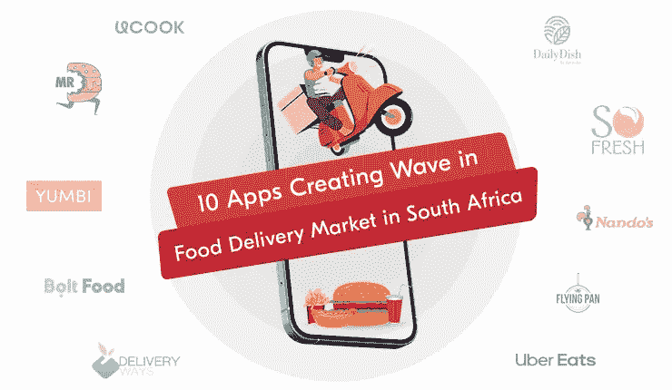

疫情促成了食品配送市场的大幅增长。这是就受欢迎程度和收入而言的。在南非等地，市场观察到了更高的利润。

根据 Statista 的数据，按 8.33%的 CAGR 计算，到 2026 年，收入将达到 12 亿美元。同期用户数量将达到 2250 万左右。

通过这些吸引人的数字，很明显这些解决方案对南非次大陆有利可图。然而，这不是我们不在这里讨论的事情。

在本文中，我们为您提供了在南非食品配送市场掀起波澜的十大流行应用的列表，并提到了它们的显著特征。

因此，没有进一步的告别，让我们开始吧。

# 南非十大流行的食品订购和交付应用

## 1.UCook

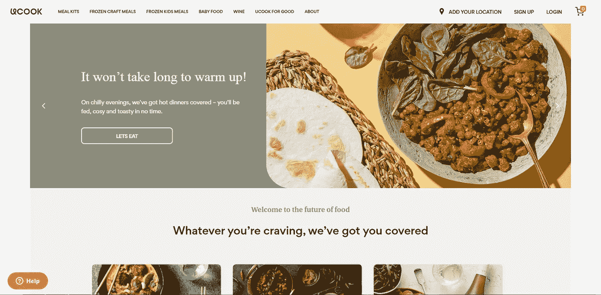

UCook

> 推出年份— 2014 年
> 服务区域—西开普省、豪登省和夸祖鲁-纳塔尔省

这是南非一款受欢迎的按需送餐应用，以其革命性的送餐服务而闻名。给送餐带来优势:应用程序教育顾客食物的来源；那是食品加工的地方。其次，用户知道他们可以遵循的技术，以支持小规模企业和农民，使方便的饮食成为现实。

该应用程序具有一些最好的功能，以确保对环境的影响很容易。

**这些包括-**

*   套餐会员计划
*   套餐食谱和配料
*   餐包供应商
*   手艺餐递送

这些使得这种食品配送解决方案成为一种独特的解决方案，使晚餐和膳食准备成为一个既方便又有趣的过程。

除了这些特点之外，它还易于操作。这也是它人气飙升的原因。

看一下下面的视频，观察这个应用程序是如何工作的。

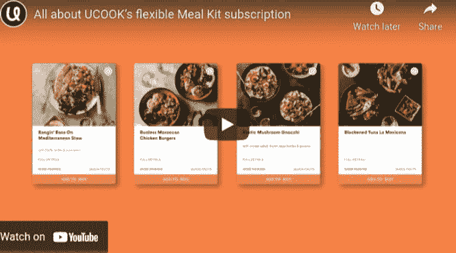

视频来源—youtu.be/_BKgrdKauKs

因此，如果你在南非，正在寻找一个让食品配送服务变得简单的解决方案，那么你应该使用 UCook。

## 2.食物先生

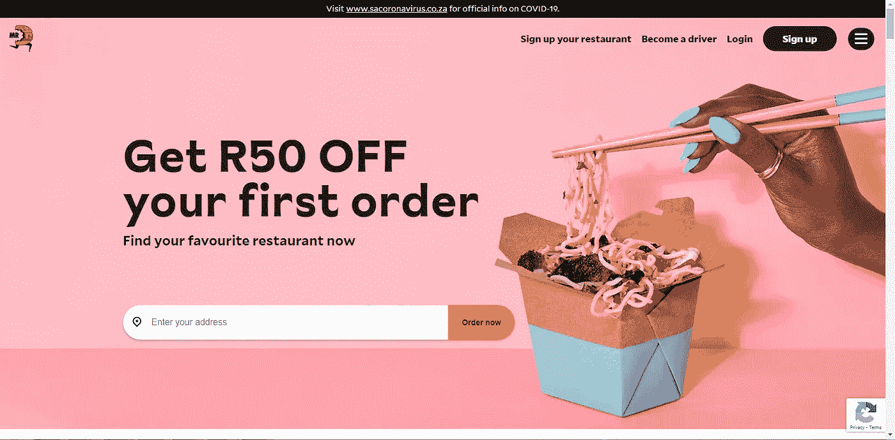

食物先生

> 启动年份— 2017 年
> 服务区域—约翰内斯堡、开普敦、德班、布隆方丹、格克伯哈、比勒陀利亚

食品先生成立于 1992 年。不过在 2017 年，它作为一款[按需送餐应用](https://www.peppyocean.com/food-ordering-delivery-app-development/)推出。该应用服务于 2500 多个地区的 100 多万客户，拥有 4500 名司机和 8000 家餐厅，在该地区很受欢迎。

**这是由于这些独特特征的存在-**

*   日常交易
*   订单跟踪
*   多种支付方式
*   餐馆列表
*   餐厅可用性状态

由于所有这些特点和简单的操作，它在南非的美食爱好者中获得了狂热的地位。因此，如果你在南非，一定要借助这款应用来充饥。

## 3.尤恩比

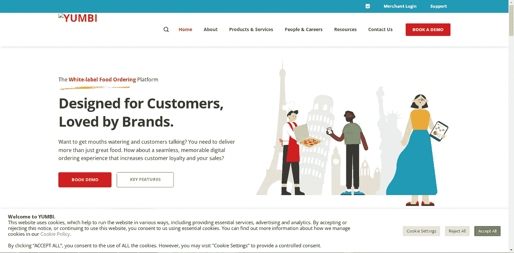

尤恩比

> 推出年份— 2011 年
> 服务领域—南非各地

Yumbi 改善了食品订购的方式，为顾客点餐提供了直观的体验。这是因为他们在应用程序中采用了客户参与模式。换句话说，通过像网上和电话订餐这样的服务，顾客可以用他们觉得舒服的方式订餐，并直接把饭送到他们家门口。

**它越来越受欢迎的一些其他特征是-**

*   智能餐厅搜索器
*   安全支付
*   实时跟踪
*   灵活的菜单
*   报告和分析

由于所有这些因素，按需送餐应用程序在南非的客户和餐馆中很受欢迎。

因此，这是另一个你应该注意的解决方案，当你需要的时候，住在南非来满足你的饥饿感。

## 4.螺栓食品

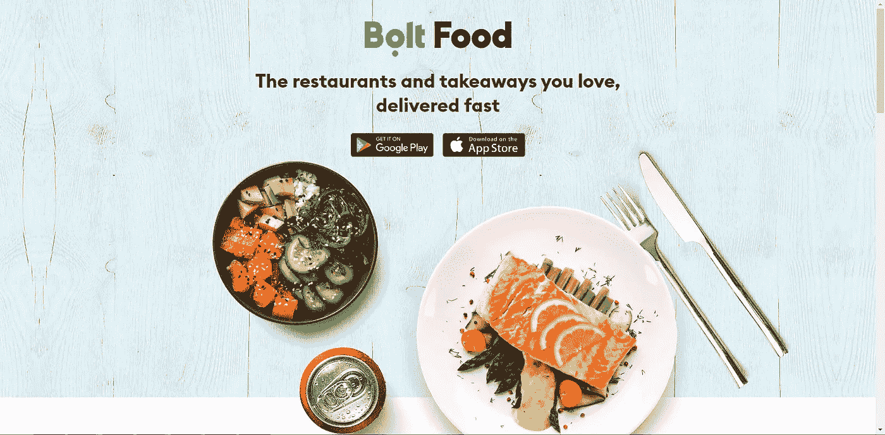

螺栓食品

> 发布年份— 2016 年
> 服务区域—布朗方坦的布兰斯顿

Bolt Food 以向生活在南非的顾客提供闪电般速度的食品配送服务而闻名。通过该解决方案，顾客可以发现食物，订购并跟踪它们。

**这是由于这些独特的元素在其中的存在——**

*   最喜欢的餐馆
*   添加订单注释并修改它们
*   添加调味品
*   从多家餐馆订餐
*   添加或删除您正在订购的商品

所有这些因素都是这个解决方案越来越受欢迎的原因。因此，如果你在南非，这个应用程序是你的饥饿感得到满足的必备工具，只需在应用程序上点击几下。

## 5.交付方式食欲

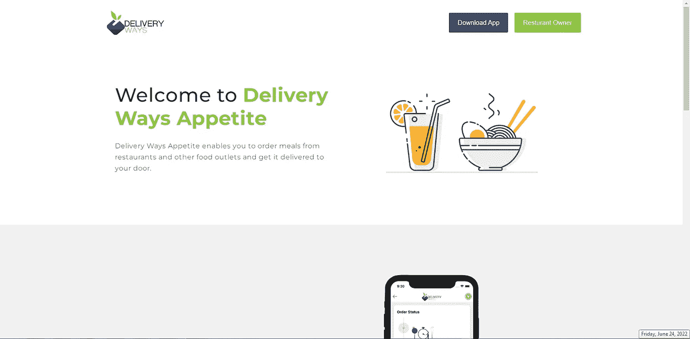

交付方式食欲

> 发布年份— 2020 年
> 服务领域—约翰内斯堡

始终保持高于标准的质量，通过按需送餐应用程序，交付方式食欲使送餐服务成为一种独特的体验。

其次是拥有解决方案中可用的各种食物类别。这使得他们在那里下单时可以自由地享受难忘的用餐体验。

*   构建购物车
*   订单跟踪
*   轻松找到餐馆
*   食物种类
*   在旅途中点餐

所有这些都使得这款应用成为生活在南非的顾客点餐时的最爱。

## 6.日常菜肴

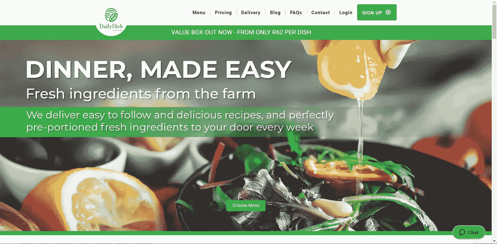

日常菜肴

> 推出年份— 2013 年
> 服务领域—南非全境

Daily Dish 允许客户在旅途中访问食材和食谱，只需轻点几下就可以快速用餐。

该解决方案在中具有独特的功能。它还确保了在准备的饭菜中使用新鲜的配料。接下来是确保不重复配方的执行。最后，它确定；当客户从该解决方案下食品配送订单时，成本得到最大限度的节省。

**它的其他一些独特功能是-**

*   图片库
*   新食谱
*   每个季节定制的膳食
*   餐盒
*   多种定价选项

上述功能使其在南非居民点餐时或那些寻求他们想要准备的饭菜的食谱知识时非常受欢迎。

因此，这是一个你应该在你的设备上安装的应用程序，它可以让你方便地获取食物和食谱。

## 7.SoFresh

SoFresh

> 启动年份— 2010 年
> 服务区域— Opebi、Ogudu、Oando Ikoyi、VGC

SoFresh 是另一个受欢迎的按需送餐应用程序，它以通过几下点击向客户提供新鲜和营养丰富的饭菜而闻名。除了食品配送，该解决方案还适用于沙拉、果汁、冰沙和其他此类配送。

**尽管有这些独特的功能，该应用程序也有这些特点——**

*   菜单
*   给养
*   跟踪订单状态
*   通过下订单获得奖励

所有这些因素都是该解决方案在南非居民中如此受欢迎的原因。因此，如果你想要一个让送餐服务成为独特体验的应用程序，SoFresh 应用程序是你今天应该使用的。

## 8.南非南多斯:交付和收集

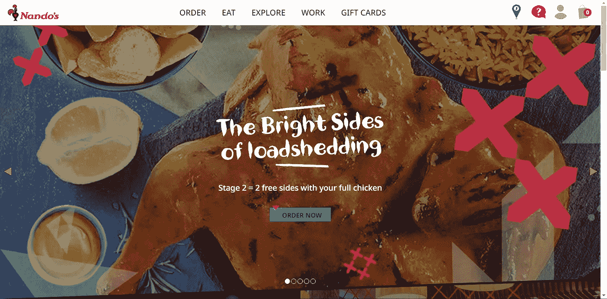

南非南多斯:交付和收集

> 推出年份— 2012 年
> 服务领域—南非全境

Nandos 是南非一款受欢迎的食品订购和交付应用程序，它确保生活在那里的客户可以无缝订购食品，并立即将食品送到家门口。

凭借独特的功能，该应用程序目前已列出 7000 多家餐厅。这使得顾客可以放心地从他们认为符合他们要求的餐馆点餐。

**让它如此受欢迎的一些独特功能是-**

*   在附近找到南多斯
*   制品
*   方法
*   礼品卡
*   菜单
*   订购最喜爱的

所以，如果你在南非，正在寻找一次难忘的用餐体验，今天就下载这个应用程序吧。

## 9.飞盘

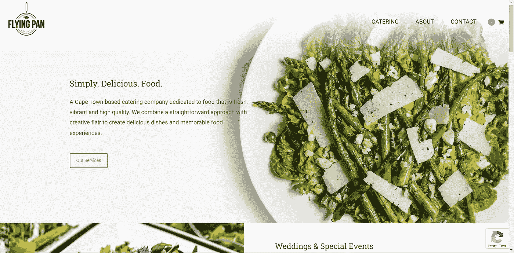

飞盘

> 推出年份— 2013 年
> 服务领域—南非全境

有了飞盘，顾客可以享用高质量的新鲜食物。通过在点餐过程中采用简单的流程，顾客在使用该解决方案点餐时可以获得独特的送餐体验。

**它的其他一些独特的特性也增加了它的受欢迎程度，这些特性是-**

*   预订私人厨师
*   餐饮的多种选择
*   定制的膳食选择
*   菜单
*   点最喜欢的饭菜

这些功能使这款应用程序在客户中格外受欢迎。所以，如果你住在南非，确保你有办法保证独特的食物递送体验，既健康又丰富，而且是肩并肩的。

## 10.优步吃饭

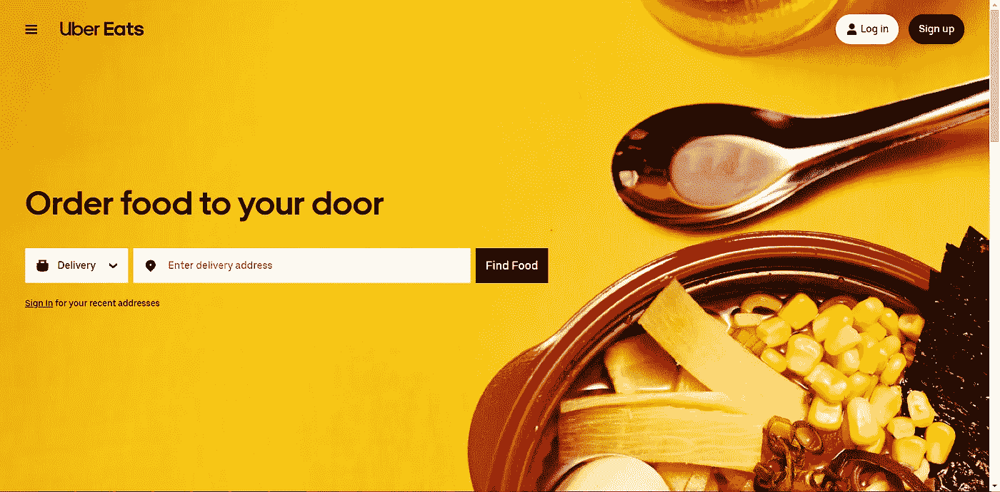

优步吃饭

> 推出年份— 2016 年
> 服务区域—布隆方丹、开普敦、德班、约翰内斯堡、比勒陀利亚、波洛、伊丽莎白港

Uber Eats 是一款受欢迎的送餐应用，于 2016 年在南非开始运营，一直没有回头。它允许客户只需在应用程序上点击几下就可以获得快餐。除此之外，它的这些特点也是其人气飙升的原因。

*   实时订单跟踪
*   寻找最喜欢的食物和餐馆
*   订单计划
*   无接触递送
*   查找附近的皮卡

 [## 使用 UberEats 克隆应用程序，让您的食品配送事业如虎添翼

### ankit Patel 2022 年 6 月 2 日 7 分钟阅读接近 10 亿人每天在网上订餐。感谢…

www.peppyocean.com](https://www.peppyocean.com/blog/empower-food-delivery-venture-with-ubereats-clone-app/) 

除了存在于 Uber Eats 的食品订购和交付应用程序中的功能之外，上述功能也是获得如此大规模流行的原因。

# 包扎

到 2022 年底，南非在线食品配送市场的用户渗透率将达到 26.3%。这些诱人的数字足以说明这些解决方案的盈利性质。然而，从头开始构建应用程序可能会很乏味，请联系我们。遵循食品交付应用程序开发过程中的最佳技术，并填充最佳功能，我们的按需食品交付应用程序将为您的食品交付企业带来最大价值。它将同时给你动力，从第一天就获得最大的投资回报率！