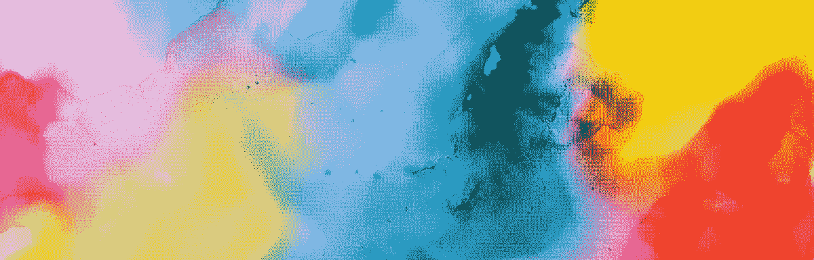
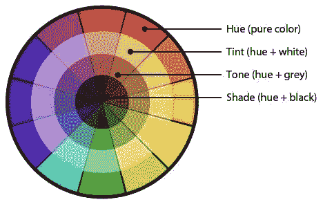
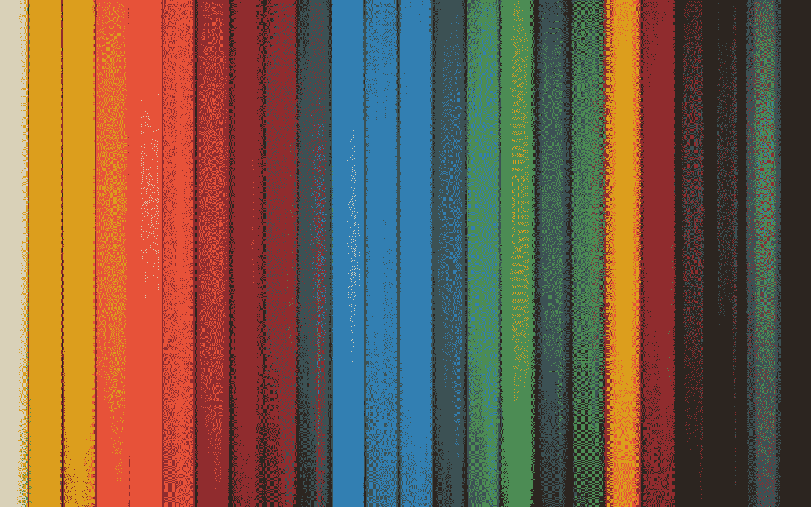
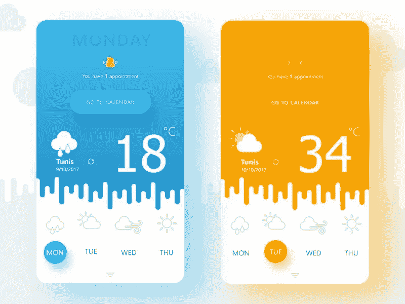
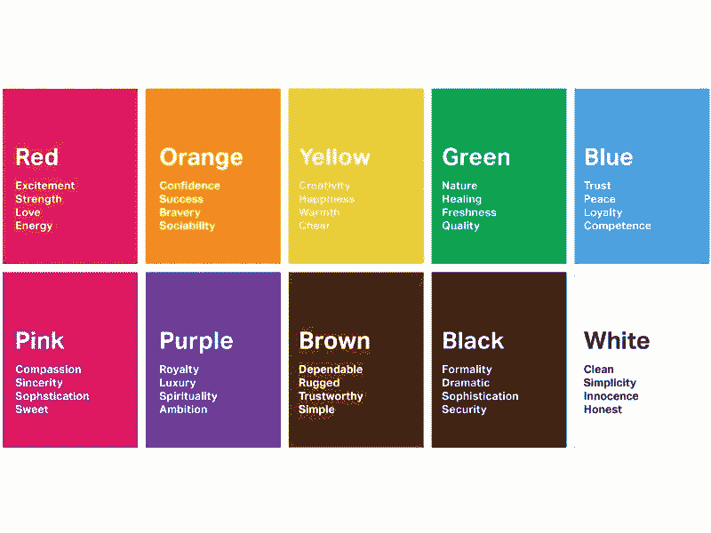
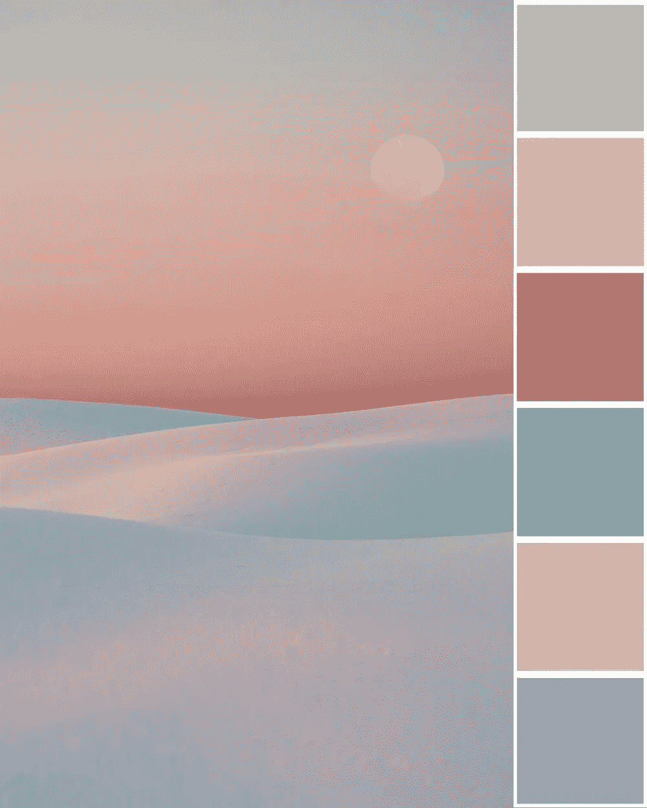
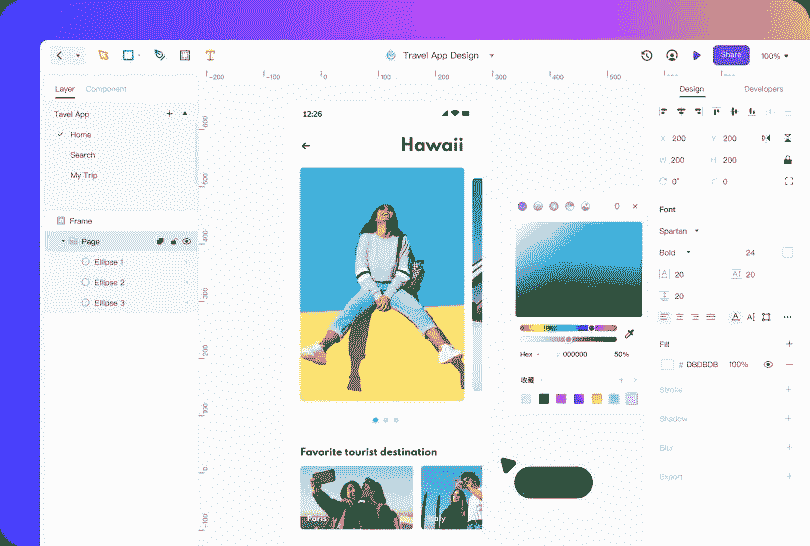

# UI 设计中使用颜色的 10 个原则

> 原文：<https://medium.com/nerd-for-tech/10-principles-for-color-usage-in-ui-design-245c2b595425?source=collection_archive---------1----------------------->

如果我们仔细观察，每个人日常接触的事物都有自己的词汇和独特的语言。同样的道理现在比以往任何时候都适用于颜色，因为我们已经开始用它们来传递信息，唤起情感，分享我们的感受等等。

同样，在 [UI 设计](https://mockitt.wondershare.com/ui-ux-design/?utm_source=other_media_sites&utm_medium=social&utm_campaign=md&utm_term=medium_post&utm_content=post_md_md_en_20087918_2021-03-11)中使用颜色不仅仅是一种审美练习。相反，[的设计师们](https://mockitt.wondershare.com/ui-ux-design/ui-designer-skills.html?utm_source=other_media_sites&utm_medium=social&utm_campaign=md&utm_term=medium_post&utm_content=post_md_md_en_20087918_2021-03-11)一直用它来定义产品，并通过理想的[调色板](https://mockitt.wondershare.com/ui-ux-design/ui-color-palette.html?utm_source=other_media_sites&utm_medium=social&utm_campaign=md&utm_term=medium_post&utm_content=post_md_md_en_20087918_2021-03-11)来提升整体用户体验。

为你的应用程序、网站、登陆页面或任何其他数字产品选择 UI 颜色需要一些思考。你不应该在没有首先考虑你通过品牌传递的信息、你的受众、他们的兴趣和你的目的等的情况下匆忙选择用户界面的颜色。

因此，使用颜色对于你的用户界面设计来说就像遵循 iOS 或 Android 平台的用户界面设计细节一样重要。在处理颜色时，你还需要根据你的设计和布局来确定正确的结构。

就像你必须遵循一些特定的[原则](https://mockitt.wondershare.com/ui-ux-design/ui-color.html?utm_source=other_media_sites&utm_medium=social&utm_campaign=md&utm_term=medium_post&utm_content=post_md_md_en_20087918_2021-03-11)来创建 UI 设计一样，就像简单的[界面](https://mockitt.wondershare.com/ui-ux-design/interface-design.html?utm_source=other_media_sites&utm_medium=social&utm_campaign=md&utm_term=medium_post&utm_content=post_md_md_en_20087918_2021-03-11)一样，在 UI 颜色上的工作也必须依靠一些原则。在这里，[莫基特](http://mockitt.wondershare.com?utm_source=other_media_sites&utm_medium=social&utm_campaign=md&utm_term=medium_post&utm_content=post_md_md_en_20087918_2021-03-11)将向你展示 UI 设计中色彩运用的 10 大原则。

# UI 设计中使用颜色的 10 个原则

## 1.熟悉颜色术语

***来源:***[***Pinterest***](https://www.pinterest.com/pin/107875353547572421/)

第一个原则要求你理解用颜色创建 UI 设计时使用的术语。这里使用的术语有色调、色调、阴影、色调、对比度、值、饱和度等。

所以，在 UI 颜色中，你必须知道什么是色调(一种饱和色或者一种母色)和一种淡色(任何添加了白色的颜色都被称为淡色)。同样，学习其他术语的含义，并利用它们为你的设计创造最佳的颜色组合。

## 2.对色彩组织进行界面盘点

您可以在设计中使用的 UI 颜色数量是无限的。这肯定会给你带来问题，让事情变得难以理解。你不可能把所有的颜色都组织起来，如果你想按时完成工作的话。

***来源:***[***Pinterest***](https://www.pinterest.es/pin/490610953151408864/)

因此，更好的方法是创建一个界面清单，其中你必须对组成解决方案结构的所有组件进行分类，这将告诉你在你的设计中必须使用多少种颜色。

## 3.使用颜色显示组件的层次结构

我们知道折叠线以上的组件很重要，是为了创造最高价值而创建的，而不是折叠线以下的组件。然而，在 UI 颜色的帮助下，你可以在任何地方指定网站或应用程序组件的重要性。

一种方法是在一个界面或同一页面上使用一种颜色来给每一个组件赋予权重。例如，在标题中，您可能希望从一开始就将用户的注意力吸引到 CTA 上。

对 CTA 使用母色，对页眉的其他部分使用淡色会很有帮助。

## 4.创造视觉平衡

你有没有近距离看过一幅画，就像从远处近距离看一样，如果你从同样的距离看一个人，你可以听到他们的呼吸声？绘画是用许多东西创作的，通过将颜色融合在一起，创造出一种视觉上的 T21 体验。

***来源:*** [***中等***](/)

类似地，在使用和选择 UI 颜色时，您需要使用每种颜色的正确值。这里，值代表颜色从浅到深的等级。因此，有不同的颜色变化，你需要创造设计，建议的变化数量是三个。

目的是通过使用不同的色调和在 UI 设计的每个方面使用正确的色调来创造一种平衡。

## 5.利用色彩心理学的原理

颜色会引发观众的反应。因此，通过使用正确的用户界面颜色，你将会激发浏览者的反应。因此，使用色彩心理学意味着你可以改变观众的反应，并驱使他们的行为朝着你想要的目标发展。

***来源:*** [***伦敦形象学院***](https://londonimageinstitute.com/)

不仅如此，理解色彩心理学也将帮助你识别不同文化、地区和年龄组对色彩的感知是如何变化的。

理解关于颜色的一切，以及它是如何在你的观众中激起情绪反应的，这真的很有力量。

## 6.使用有限的颜色来吸引更多的注意力

正如我们已经知道的，颜色会引起观看者的反应，这适用于每一种颜色。因此，使用太多很容易引起混乱的反应，把观众赶走。

当您使用有限的颜色时，有颜色的美化区域比没有颜色的区域得到更好的响应。因此，在你想引起回应的地方，用颜色来唤起回应。

## 7.在你的用户界面中使用象征性的颜色

你可以用颜色来表示界面元素的意义。例如，像红色这样的 UI 颜色用于共享界面中的更改状态，并描述不允许的操作。

***来源:***[***jquery***](https://www.jquery-az.com/)

类似地，绿色可以用来表示期望的动作已经完成。在这种情况下，UI 设计人员还需要保持深色和浅色模式的颜色一致性。比如在明暗界面模式下用不同的颜色来表示成功和失败的状态就不好。

## 8.上下文一致性对于避免任何混淆非常重要

你为应用程序或网站选择的 UI 配色方案应该是一致的。换句话说，如果你对一个元素使用一种颜色，比如标题背景色，它就不应该用于另一个元素，比如 CTA。

颜色应该随着每个上下文而变化。例如，如果您使用蓝色来表示“添加到购物车”按钮，那么它不应该用于同一页面或任何其他页面的其他上下文中。

## 9.创建你的调色板，并融合在一起

调色板包含您在设计中使用的所有 UI 颜色。因此，不创建调色板会导致混乱的 UI 颜色模式，并且会产生设计问题并对您的转换产生负面影响。

***来源:*** [***膨胀与石头***](https://www.swellandstone.com/)

要创建正确的调色板，首先要选择原色，然后是文本的颜色，最后是背景。原色是你的品牌颜色，比如红色代表可口可乐，黄色代表 Snapchat，蓝色代表脸书，绿色代表 Whatsapp，等等。

覆盖原色后，您可以使用流行的颜色工具来获得每种原色的变化。最后，把想要的颜色放在一起，形成统一的设计。

## 10.使用 60–30–10 规则来保持一致性

60–30–10 规则是每种 UI 设计的必要补充，也是 UI 配色方案中最重要的内容之一。这个规则意味着你需要使用 60%的主色，30%的副色，10%的强调色。

60–30–10 非常有用，因为它有助于创造一种平衡，并为眼睛在应用程序或网站的不同区域之间移动提供独特的舒适感。

在介绍了 UI 设计中 UI 颜色的十个原则之后，你还必须了解构建正确的 UI 设计的完美工具，这将有助于你实现这些原则。

# UI 设计的最佳工具——Mockitt

创造最好的 UI 设计不是一件容易的事情，但通过使用正确的工具，它肯定可以系统化，这就是 Mockitt 设计。使用这个工具，您可以创建像素完美的图标、图形和其他 UI 设计元素，并根据 UI 配色方案的核心原则用丰富的 UI 颜色进行修饰。

Mockitt 设计工具可以免费使用，并提供在线版本，拥有简单而强大的界面，包含所有必需的特性和功能。为数字解决方案创建 UI 元素所需的一切都可以在 Mockitt 中找到。

*   您可以使用各种矢量工具，包括钢笔，贝塞尔曲线和布尔。
*   向您的设计添加各种各样的小部件和组件。
*   根据默认尺寸和屏幕大小，为不同的移动设备选择预先添加的模板。
*   导入 Sketch 中现有的设计，并开始在 Mockitt 上免费编辑它们。
*   立即分享您的作品，并获得预览选项，以便在将设计发送给客户之前最后看一眼。

Mockitt Design 还为您提供了每个设计师都需要的终极工具，那就是与其他团队成员实时协作，减少现场更改时的来回奔波。

# 结论

不可否认，选择正确的 UI 颜色对于构建整个设计的理想美学和情感价值是必不可少的。当你根据真实的原则使用颜色时，选择实现这些原则的完美工具并使用它们以获得最佳效果也是至关重要的。

Mockitt 设计工具是一个免费且方便的创建 UI 设计的解决方案。这款在线工具可让您访问特定于设备的画板和大量工具，包括矢量设计、预添加的形状和各种基于颜色的功能，让设计变得栩栩如生。

感谢您花时间阅读这篇文章。[了解更多关于 Mockitt 的信息](https://bit.ly/3ewCXuz)

我们为 UX 初学者创建了一个[终极指南](https://bit.ly/2OLPPlW)，它收集了来自多个 UXers 的知识、经验和建议。

订阅我们的 [YouTube](https://www.youtube.com/channel/UCESxamaRS8nOGpWYvP1VSqA) [脸书](https://www.facebook.com/mockitt) [Instagram](https://www.instagram.com/wondershare.mockitt/)

*原载于*[*https://mockitt.wondershare.com*](https://mockitt.wondershare.com/ui-ux-design/ui-color.html?utm_source=other_media_sites&utm_medium=social&utm_campaign=md&utm_term=medium_post&utm_content=post_md_md_en_20087918_2021-03-11)*。*