# 10 步 EDA——初学者数据科学项目入门。

> 原文：<https://medium.com/nerd-for-tech/10-step-eda-getting-started-with-your-data-science-project-for-beginners-ae9e2a3a43ba?source=collection_archive---------3----------------------->

探索性数据分析(EDA)是任何数据科学项目的第一步。它让我们对数据有一个总体的了解，并且只用几行代码就能产生有意义的见解。

EDA 对于生成特性重要性以及对数据集有一个实际而直观的理解是至关重要的。

开始您的数据科学项目可能会令人望而生畏，尤其是作为初学者。这里有 10 个步骤或清单，你可以参考开始你的 EDA 过程。

弗兰基·查马基在 [Unsplash](https://unsplash.com?utm_source=medium&utm_medium=referral) 上的照片

我使用的数据集可以在这里找到:

 [## CareerCon 2019 -帮助导航机器人

### 在我们的赞助商面前竞争获得你的简历

www.kaggle.com](https://www.kaggle.com/c/career-con-2019/overview) 

这是一个分类问题。这里的任务是使用从惯性测量单元(IMU 传感器)收集的包含与加速度和角速度相关的属性的数据来识别机器人正在九种类型的表面中的哪一种表面上行进。

您可以在此处参考我关于该数据集的完整入门笔记本:

 [## kssubhodh/导航-机器人-Kaggle

### 这是一个分类问题。这里的任务是识别机器人正在九种表面中的哪一种上行走…

github.com](https://github.com/kssubhodh/Navigate-Robots-Kaggle) 

将数据集导入 pandas 数据框后，以下是执行 EDA 的步骤

# 1.数据的形状

您可以使用`dataframe.shape`属性返回一个表示数据帧维度的元组。这为我们提供了有关数据帧中行数和列数的信息。

**举例**:

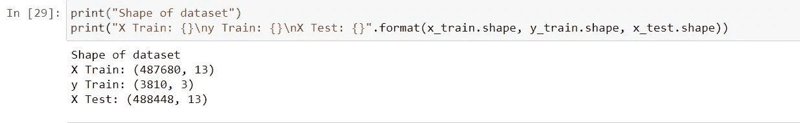

# 2.显示几行数据帧

Pandas DataFrame 具有允许我们显示前几个(*头*)、后几个(*尾*)或数据的随机样本(*样本*)的功能。这让我们对数据有了更好的了解。

示例:

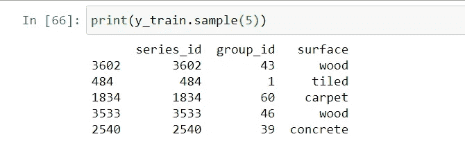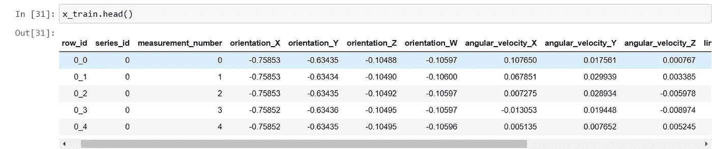

## 见解:

*   列名
*   重要缺失值(NaN)
*   分类特征中的类别类型

# 3.所有列的数据类型

熊猫*。dtypes* 属性帮助我们将所有列的数据类型显示为一个系列

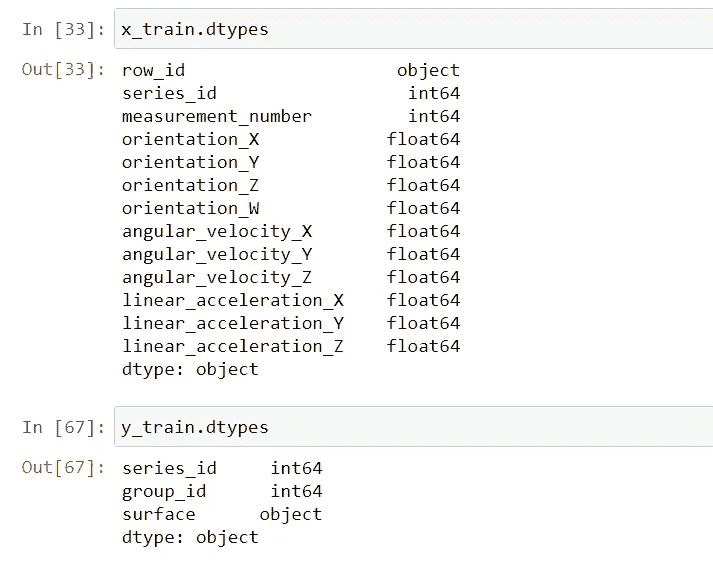

观察结果:

*   *x_train* 除 row_id 属性外，只有数字( *int* 和 *float* )数据类型
*   *y_train* 具有数字( *int* )和分类( *object* )特征的组合

# 4.功能的统计摘要

在我们对特性有了高层次的直观感受之后，我们将查看数据的汇总统计。

*dataframe.describe()* 生成一个描述性统计。这包括汇总数据集分布的集中趋势、离散度和形状，不包括 NaN 值。

显示计数、平均值、最小/最大值和不同的分位数

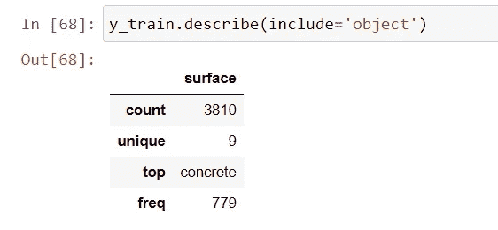

*   这里我们看到最常见的类别是混凝土，频率为 779
*   我们有 9 个唯一的表面值
*   我们总共有 3810 行

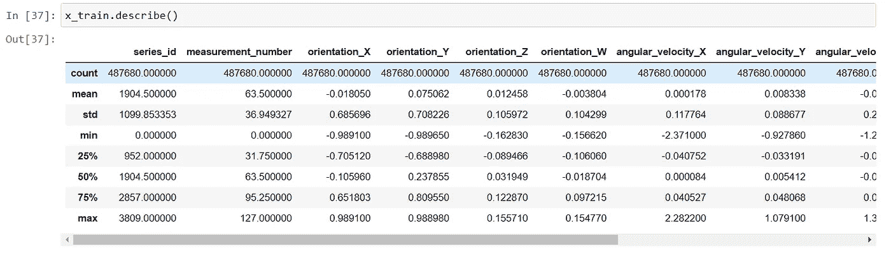

*   这里我们可以使用平均值、最大值、最小值和 50%le(第 50 百分位或中值)下的信息

# 5.检查每个要素的缺失值

我们可以用熊猫。isnull()和。sum()函数一起显示每个属性缺失值的计数

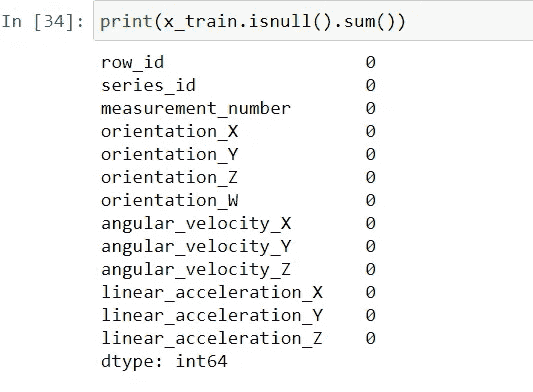

这里我们看到 *x_train* 中没有任何特征包含缺失值。

# 6.目标变量的分布

在下一步中，我们可以绘制一个[***seaborn count plot***](https://seaborn.pydata.org/generated/seaborn.countplot.html)显示目标变量的每个类别的频率。

代码:

`f, ax = plt.subplots(1,1, figsize=(15,5))
graph = sns.countplot(y_train[‘surface’])
graph.set_title(“Number of labels for each class”)
plt.show()`

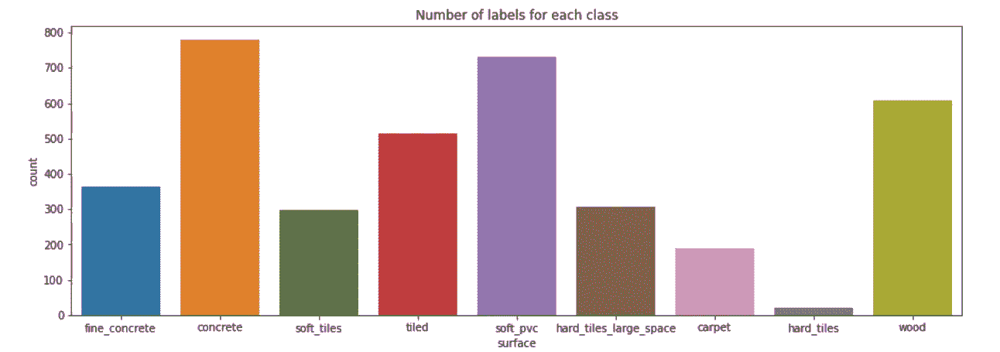

这里我们看到值*混凝土*、*软聚氯乙烯*和*木材*具有最高的 3 个频率。

# 7.所有特征的分布

接下来，我们可以绘制一个直方图，显示所有特征的分布。这让我们对数据有了更多的了解。使用 Matplotlib.pyplot 库。

代码:

`plt.figure(figsize=(26, 16))
for i, col in enumerate(x_train.columns[3:]):
plt.subplot(3, 4, i+1)
plt.hist(x_train[col], color=’red’, bins=100)
plt.hist(x_test[col], color=’green’, bins=100)
plt.title(col)`

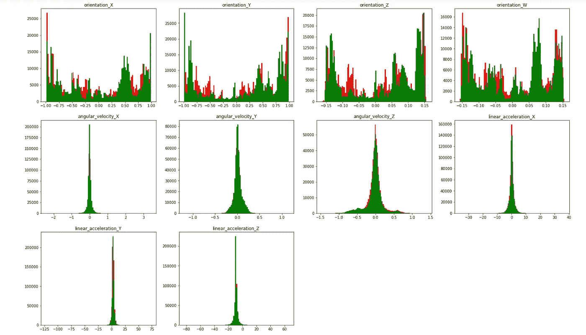

这里我们看到测试(绿色)和训练(红色)数据集的分布。我们可以观察到:

*   训练和测试中的特征分布非常相似
*   速度和加速度呈正态分布

# 8.箱线图

创建一个**箱形图**，也称为须状图，用于显示第一个**四分位数**、中间值和第三个**四分位数**等值

箱线图也可以用来发现数据中的异常值。这里用的是 Seaborn 库。

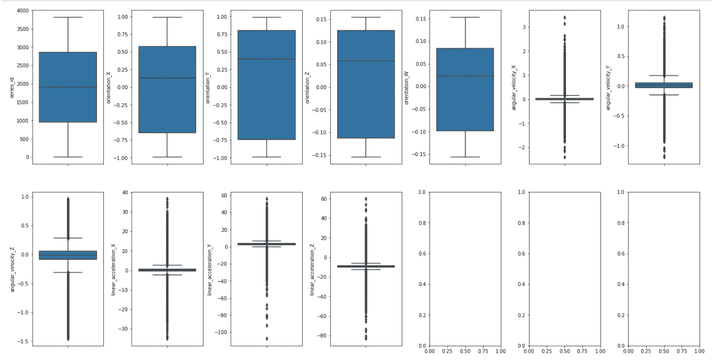

*   这里，线加速度和角速度的值似乎包含异常值(晶须的存在)。这是因为加速度和速度在给定的时间点可以取任何值。
*   箱线图为我们提供了关于 25%le、50%le 和 75%le 数据的信息。
*   在上图中，我们看到 orientation_x 的中值(分隔方框的水平线)约为 0.12

# 9.关联热图

相关性是一个介于-1 和 1 之间的值，表示两个要素之间的关系。*正相关*意味着一个特征增加，另一个特征也增加，而*负相关* *意味着一个特征增加，另一个特征减少。接近 0 的相关性表示*弱*关系，而接近-1 或 1 表示*强*关系。*

相关性可以从`dataframe.corr()`函数中获得

并且可以从`sns.heatmap()`函数获得相应的热图，以可视化数据集中的相关性。

示例:

`f,ax = plt.subplots(figsize=(8, 8))
sns.heatmap(x_train.iloc[:,3:].corr(), annot=True, linewidths=.5)`

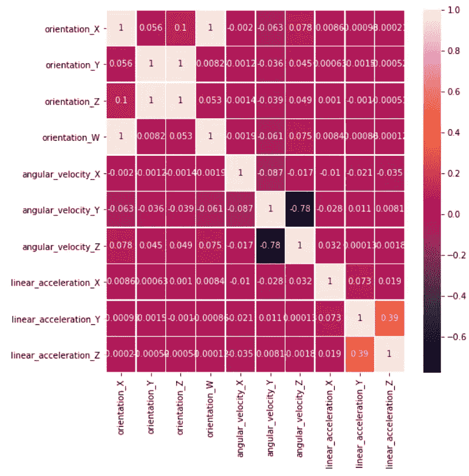

*   这里我们看到特征 *angular_velocity_y* 和 *angular_velocity_z* 是高度负相关的(黑色瓦片)。而 *linear_acceleration_Z* 和 *linear_acceleration_Y* 具有弱的正相关性(橙色块)

# 10.清晰的结论

EDA 过程中最重要的部分是它的可解释性。描述每个情节或发现的简短摘要和简明扼要的观察对于完成你的 EDA 过程是必不可少的。

*那都是乡亲们！这些是你在 EDA 过程中需要探索的 10 个基本步骤。我写这篇博客是因为我发现很难开始我的数据科学项目，并且没有找到有用的参考来执行 EDA 以获得对数据的高级理解。如果你觉得这在你的项目中有用，请告诉我。*

你可以在 linkedin 上联系我:

 [## 印度卡纳塔克邦本加卢鲁工程学院

### 在世界上最大的职业社区 LinkedIn 上查看 Subhodh KS 的个人资料。Subhodh 有一个工作列在他们的…

www.linkedin.com](https://www.linkedin.com/in/subhodh-ks-8b993b177/)