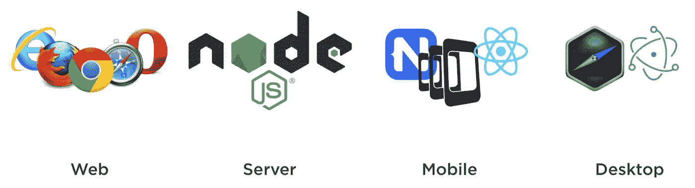
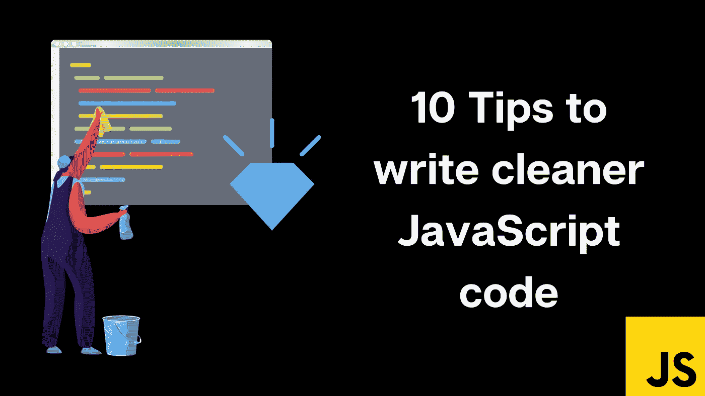
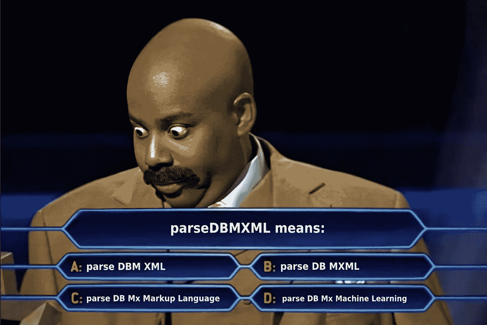
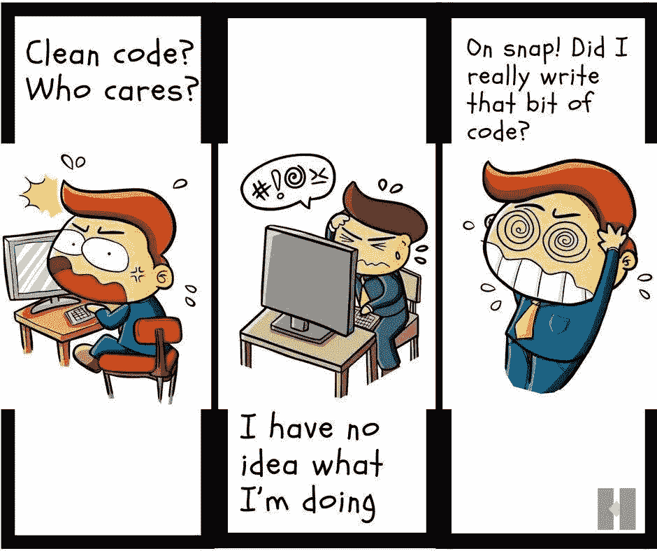

# 编写更简洁 JavaScript 代码的 10 个技巧

> 原文：<https://medium.com/nerd-for-tech/10-tips-to-write-cleaner-javascript-code-a5209b989f9f?source=collection_archive---------0----------------------->

## 让我们彻底清除这些变量和函数

Javascript 是 Github 上使用最多的编程语言之一，被超过 97%的网站使用。近年来，随着几个[框架](https://www.simform.com/blog/javascript-frameworks/)的引入，覆盖了从后端和前端 web 到跨平台移动应用甚至游戏的一切，Javascript 的受欢迎程度达到了很高的水平。

图片取自文章: [JavaScript 无处不在，真的吗？](/commencis/javascript-is-everywhere-really-906d1cf06092)

**编写干净易读的代码是构建业务逻辑之后最重要的事情之一**。从我与几个组织、创业公司和项目合作的经验来看，我可以保证处理糟糕的代码是一场噩梦。它减缓了开发过程，延迟了发布，并使开发人员感到沮丧。在开发者社区中有这样一种说法-

> 编写代码的时候，要把最终维护你的代码的人想象成一个知道你住在哪里的暴力精神病患者

**因为你的生命可能在这里受到威胁** 🥲，让我快速地指导你一些基本的技巧来保持你的 JavaScript 代码整洁。

# 1.变量名——保持它们有意义和易读

变量名应该能够清楚地解释它们的用途。此外，避免混淆的首字母缩写词和难发音的单词。作为奖励，尝试坚持使用适当的案例，如(下)[骆驼案例](https://en.wikipedia.org/wiki/Camel_case)。

我不知道该如何强调这一点。让我们看看下面的例子:

# 2.变量名—保持可搜索性

尽管有些文章会告诉你在可以使用单态形式时不要创建变量，但是你不应该把它扩展到使用常量，这会使代码更难阅读和搜索。同样，正确的想法是将它们存储在`const`变量中，并使用`CONSTANT_CASE`来命名变量。例如，请看下面的代码片段:

# 3.避免变量的心理映射

最好在`array.forEach()`中显式命名变量，而不是使用以后可能没有意义的缩写。

# 4.避免不必要的上下文

如果类名或对象名已经告诉了你它代表什么，就不要再在变量名中添加这些信息了。在下面的例子中，既然我们已经知道，我们正在谈论`Car`或`paintCar`你不需要在你的变量中再次提到上下文**汽车**。

# 5.在函数中使用默认参数

避免在函数中使用短路或条件，以保持简洁。更重要的是，记住只有`undefined`参数会被你的函数赋值。默认值不会替换任何其他错误值。

# 6.明智地使用函数参数

根据经验，尽量将函数参数的数量限制在 2 个或最多 3 个。如果它接受了这么多参数，有可能你的函数做得太多了。然而，如果你仍然需要它，使用一个 JavaScript **对象**作为参数。为了使函数期望的属性更明显，可以使用 ES6 析构语法。

# 7.函数应该做一件事

不要忘记函数是用来做什么的——给你的代码增加模块性。更小的函数，每个函数只做一件事，将确保你的代码易于编写、测试和理解。不要为一个功能设定多个目标。

# 8.函数名——让它们有意义

请确保您编写的函数名称清楚地说明了这些函数的作用。模糊的函数名意味着读者必须查看函数定义和逻辑才能理解他们的工作。

# 9.避免重复代码——让代码更短、更简洁

最伤人的是多个代码段中一堆相同或相似的行。我们都遇到过这样的场景。这通常是因为一些逻辑在两个或更多地方的实现略有不同。但是，想想有人发现逻辑有 bug 会做的噩梦，现在又要到处修改这个。

# 10.不要使用标志作为函数参数

为什么需要标志作为函数参数？只有一个明显的原因，你的功能是做多件事。从第 7 点来看，你知道这是一种不好的做法。所以，继续把你的功能一分为二。

# 结论

以上大部分技巧适用于许多编程语言，而不仅仅是 JavaScript。如果您正在寻找用 JavaScript 编写干净代码的更多信息，请访问这个资源库。这篇文章的灵感来自那里的内容。

 [## GitHub-ryanmcdermott/Clean-Code-javascript:适用于 JavaScript 的干净代码概念

### 《软件工程原理》,来自 Robert C. Martin 的书，改编为 JavaScript。这不是一个风格指南。这是…

github.com](https://github.com/ryanmcdermott/clean-code-javascript) 

如果你是一个初学者，你感到不知所措，只要记住这叫做**良好的编码习惯，**，养成习惯总是需要时间的。然而，重要的是，你要确保你知道要养成什么样的习惯，并且你练习它们，这样随着时间的推移，它们就会变得自然！

最后，我想提一下**不要仅仅因为害怕有人日后维护你的代码而写干净的代码，而是为你自己写，这样你就不会像这样疯狂地结束**

你们也用 Flutter 做 app 吗？我在这里写了一篇文章[保护你的下一个 Flutter 应用](/nerd-for-tech/5-steps-to-secure-your-next-flutter-app-549def2428b3)的 5 个步骤。去读一读吧。

你可以在 [LinkedIn](https://www.linkedin.com/in/ab-satyaprakash/) 上关注我，也可以查看我的 Youtube 频道。

 [## AB Satyaprakash

### 嘿伙计们！这是 AB Satyaprakash，IIT·古瓦哈蒂大学的最后一年学生，即将成为甲骨文公司的软件工程师…

www.youtube.com](https://www.youtube.com/channel/UCJ6D0HS8c9Il-eX5lGbAyGg) 

# 一如既往，祝你黑客生涯愉快！！！😄