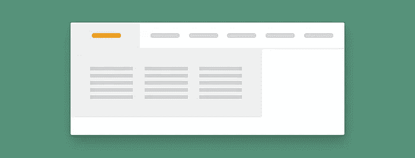

# 改善导航的 10 个 UX 设计技巧

> 原文：<https://medium.com/nerd-for-tech/10-ux-design-tips-for-better-navigation-7f279d0da3c7?source=collection_archive---------14----------------------->

M [奥奇特](https://mockitt.wondershare.com/?utm_source=other_media_sites&utm_medium=social&utm_campaign=md&utm_term=medium_post&utm_content=post_md_md_en_20087918_2021-03-11)认为网站的结构会影响网站的整体表现。你可能认为[导航条](https://mockitt.wondershare.com/ui-ux-design/navigation-menu.html?utm_source=other_media_sites&utm_medium=social&utm_campaign=md&utm_term=medium_post&utm_content=post_md_md_en_20087918_2021-03-11)是一个不必要的因素，但是相信它，它是必不可少的。有一种可能是，你的网站面临着高跳出率，但不知道背后的原因。嗯，那可能是因为你的网址导航不当。

# 什么是导航？

网站导航是一个简单但被低估的因素。导航菜单或栏是网站水平或顶部的信息或链接的集合。这个因素听起来很简单，但却至关重要。

你设计的导航栏结构会影响网站的跳出率、销售额和转化率。你遇到过吗？你访问一个网站，在上面漫游大约 10 秒钟，然后有东西点击你的眼睛。你想了解更多关于[的内容](https://mockitt.wondershare.com/website-builder/website-content.html?utm_source=other_media_sites&utm_medium=social&utm_campaign=md&utm_term=medium_post&utm_content=post_md_md_en_20087918_2021-03-11)或者找一些其他相关的内容，但是导航条在哪里？一个显而易见的事实，你的模式会破坏。这就是为什么导航栏如此重要。

你必须允许用户浏览整个网站，而不是迷失方向。另一个大多数网页设计师推荐的代替导航条的因素是“[搜索栏](https://mockitt.wondershare.com/page-design/search-page-design.html?utm_source=other_media_sites&utm_medium=social&utm_campaign=md&utm_term=medium_post&utm_content=post_md_md_en_20087918_2021-03-11)”。但是你认为用户对搜索所有的内容感兴趣吗？

通过研究，已经证实 [40%](https://www.smartinsights.com/search-engine-marketing/search-engine-statistics/) 的用户在网站上使用搜索引擎，而 [60%](https://mashable.com/2011/12/08/design-navigation-bar/) 的用户使用导航栏。这就是为什么导航栏有优先权的原因。

# 为什么导航很重要？

你有没有想过，为什么用户离开你的网站这么快(高跳出率)？那可能是因为网站导航的结构不合理。以下是导航至关重要的五大理由:

1.  **增加访问时长:**这是描述导航栏重要性的第一个确凿理由。导航条通过允许用户和观众探索更多的商业信息来降低网站的跳出率。
2.  **一针见血:**用户希望直接获得他们想要的内容。这时候导航条就开始发挥作用了。导航栏防止用户在网站上迷路。它允许用户快速方便地访问他们想要的信息。
3.  **创造更多销售:**通过信息和购买方法的适当整合，导航栏鼓励用户购买产品。
4.  **连环位置效应:**连环位置效应是一种心理现象。这是当顾客优先考虑第一个和最低的产品，而不是中间的产品。让我们举一个日常生活中的例子。你列出你需要的食品清单，面包、牛奶、蔬菜、鸡蛋和水果。到了超市，你意识到哦！我把单子忘在家里了。你应该记住哪些项目？面包，水果？导航栏插入网站上所有产品的链接。这使得顾客很容易发现它们。
5.  **整体设计:**导航的位置影响网站的整体设计。通常，导航栏位于网站的顶部或水平左侧。把导航栏放在网站中间会影响[网站设计](https://mockitt.wondershare.com/web-design/website-design-online.html?utm_source=other_media_sites&utm_medium=social&utm_campaign=md&utm_term=medium_post&utm_content=post_md_md_en_20087918_2021-03-11)。组织和标准化导航条的位置，使你的网站看起来更有吸引力。

# 网站导航的 10 个最佳实践技巧

## 1.使用面包屑

面包屑是一种二级导航方案，它告诉用户在网站上的位置。它鼓励用户搜索更多关于网站的信息，探索更多关于它的层次结构。面包屑这个词来自童话故事《汉瑟和葛丽特》。

就像童话故事一样，网站上的面包屑允许用户定位他们的位置。关于面包屑你需要知道的一点是，千万不要在单级网站上使用。建议仅对分层排列的页面使用面包屑。

## 2.使超链接明显

网页设计师的这个错误毁了他们的生意。在你没有突出显示超链接之前，用户怎么可能认出它呢？使[超文本和超链接](https://mockitt.wondershare.com/ui-ux-design/hyperlinks.html?utm_source=other_media_sites&utm_medium=social&utm_campaign=md&utm_term=medium_post&utm_content=post_md_md_en_20087918_2021-03-11)可访问，不可使用。

使用独特的[颜色](https://mockitt.wondershare.com/color-design/color-palettes-for-apps.html?utm_source=other_media_sites&utm_medium=social&utm_campaign=md&utm_term=medium_post&utm_content=post_md_md_en_20087918_2021-03-11)(特别是蓝色)。给文本加下划线并加粗，以便于识别。此外，使用符号和指示器来指示文本和链接。所有这些做法将使超链接更容易被观众看到。

## 3.让它有条理和一致

不要把导航栏当成一个可以随心所欲插入超链接的地方。使它有条理和一致。把自己当成一个用户。你访问了一个网站，你喜欢一个产品，并想了解更多，但太多的超链接混乱你会怎么办？

请记住，UX 导航设计的每一个细节都会影响[的用户体验](https://mockitt.wondershare.com/ui-ux-design/what-is-ux-design.html?utm_source=other_media_sites&utm_medium=social&utm_campaign=md&utm_term=medium_post&utm_content=post_md_md_en_20087918_2021-03-11)。让导航更吸引人，更容易访问。

## 4.创建类别

不要把所有的数据都放在一个地方。组织你的导航[菜单](https://mockitt.wondershare.com/ui-ux-design/menu-ui-design.html?utm_source=other_media_sites&utm_medium=social&utm_campaign=md&utm_term=medium_post&utm_content=post_md_md_en_20087918_2021-03-11)并在其中分类。您可以根据您的业务类型对菜单进行分类。例如，如果你的网站是关于健康和健身的，你可以制作健身和健康相关内容的子部分。

您可以将健康部分归类为更详细的版本。健身部分也是如此。这就是通过为用户提供便利来提升用户体验的方式。

## 5.使用粘性菜单

向下滚动一个长长的网页，想查看一下业务，但是导航栏是？AHH！再次向上滚动以找到该栏。

如果你把这个因素运用到你的长篇网站上，那么相信它，你的网站会有比天还高的跳出率。粘性导航菜单专门用于长格式内容。你一定见证过当你向下滚动一页时，无论你是否到达页脚，顶部的导航条仍然在那里。

粘性导航菜单帮助用户直接进入要点，而不需要滚动。

## 6.排除易混淆的导航标题

访问者希望获得关于企业的准确信息。如果你给他们提供误导性的标题和文字，他们会给你很高的跳出率作为回报。保持导航条内容的吸引力。

你有没有想过为什么 90%的网站在“关于我们”和“关于我”部分有相同的“关于”这个词？这是因为它清楚而直截了当。你在导航栏中使用的所有文本都应该是主题。

## 7.下拉菜单应该是垂直的

你在网站的顶部设置了导航栏，这很棒，但是需要等待！这是什么？你水平设置下拉菜单了吗？哦！你做了搅拌机，伙计！

你必须水平设置导航栏，垂直设置下拉菜单。这背后的原因是水平滚动比垂直滚动麻烦。在导航栏的子菜单中进行平衡。别忘了用户对子滚动感兴趣。他们将到达那里寻找信息。

## 8.确保它能在移动设备上运行

我们注意到设计师设计出了类外导航菜单，但他们缺乏在[移动](https://mockitt.wondershare.com/web-design/mobile-web-design.html?utm_source=other_media_sites&utm_medium=social&utm_campaign=md&utm_term=medium_post&utm_content=post_md_md_en_20087918_2021-03-11)设备上的良好表现。如今，大多数用户使用移动设备作为他们的[媒介](https://mockitt.medium.com/)。因此，有必要确保移动导航栏也像在桌面上一样工作。

要让导航条在移动设备上有反应，需要横向设计。如上所述，自定义下拉菜单。使用选择概念。这个概念将所有信息隐藏在像手机一样的小屏幕上，并在用户需要时弹出。

## 9.保持导航标题简短但信息丰富

不要用冗长的句子来描述这个功能。使用最多 2-3 个单词的排序句子。你认为用户会阅读菜单的长句子吗？不仅仅是导航菜单，还有任何种类的菜单。如果句子太长，读者会感到厌烦。

使用简单简短的导航标签，如“关于我们”、“联系我们”和“我们的服务”。这些句子很短，但很中肯。这就是它们被广泛使用的原因。

## 10.确保搜索栏正常工作

我们承认 60%的用户使用导航条查找信息，但是如果你有一个使用搜索引擎的用户，你会怎么做？这就是为什么有必要将所有的功能添加到网站中，以便满足各种用户的需求。

# 结论

一旦你恰当地运用了这些技巧，你会发现你的网站访客率有明显的变化。如果你的网站层级多于 3-4 级，那么重新设计它以增加用户体验。

感谢您花时间阅读这篇文章。[了解更多关于摩奇特的信息](https://mockitt.wondershare.com/?utm_source=other_media_sites&utm_medium=social&utm_campaign=md&utm_term=medium_post&utm_content=post_md_md_en_20087918_2021-03-11)

我们为 UX 初学者创建了一个[终极指南](https://mockitt.wondershare.com/ux-beginner.html?utm_source=other_media_sites&utm_medium=social&utm_campaign=md&utm_term=medium_post&utm_content=post_md_md_en_20087918_2021-03-11)，它收集了来自多个 UXers 的知识、经验和建议。

订阅我们的[YouTube](https://www.youtube.com/channel/UCESxamaRS8nOGpWYvP1VSqA)脸书 insta gram

*原载于*[*https://mockitt.wondershare.com*](https://mockitt.wondershare.com/ui-ux-design/navigation-menu.html?utm_source=other_media_sites&utm_medium=social&utm_campaign=md&utm_term=medium_post&utm_content=post_md_md_en_20087918_2021-03-11)*。*