# UX 设计师应该关注的 10 个 YouTube 频道

> 原文：<https://medium.com/nerd-for-tech/10-youtube-channels-that-ux-designers-should-be-watching-75d359c85529?source=collection_archive---------21----------------------->

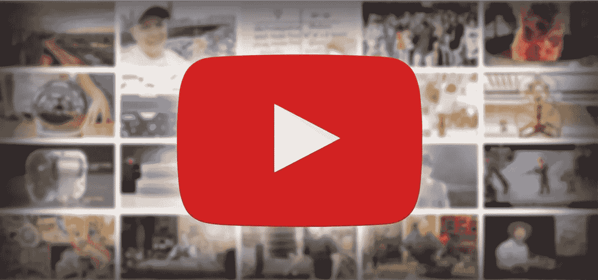

设计的世界已经从遵循设计焦点的原则发展到使用焦点。今天，不是为人民制造的产品和设计不会被使用。因此，创造更好的用户体验势在必行。学习成为一名更好的 UX 设计师可以采取多种形式，YouTube 引领着帮助新设计师学习和探索的道路。

随着 YouTube 成为学习、娱乐和其他一切的首选站点，找到[学习 UX 设计的顶级渠道 YouTube](https://bit.ly/3cf92Ew) 迫在眉睫，尤其是当有成千上万个频道致力于这一动机时。所以，在这里 [Wondershare Mockitt](https://bit.ly/3ewCXuz) 为你列出了 YouTube 上十大 UX 设计频道。

# 十大 UX 设计 YouTube 频道

***1。*** [***未来***](https://www.youtube.com/c/thefuturishere/featured)

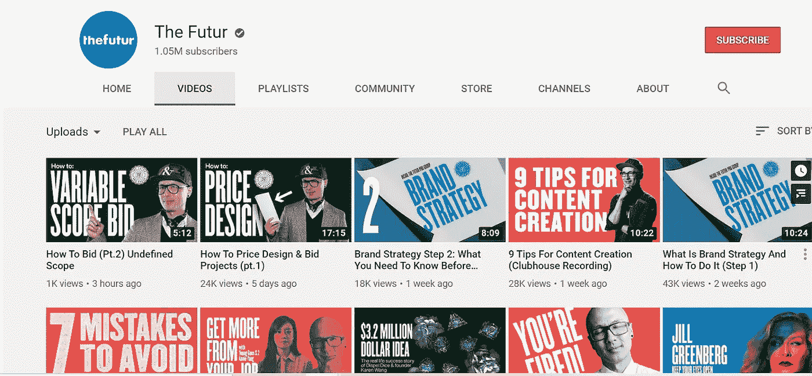

Futur 拥有超过 150 万订户和超过 5300 万的视频总浏览量，其使命是教导超过 10 亿人如何以他们喜欢做的事情谋生。这个 UX YouTube 频道为崭露头角的 UX 设计师提供了各种咨询教程、评论和指导。

有很多视频会让你在看完它们的内容后，创意如泉涌。该频道受欢迎的主要原因是它通过视频提供了该频道提供的真实和实用的知识。

他们为 UX 设计师提供信息，以增加他们的业务，建立更牢固的关系，获得更多的客户，获得他们的第一份工作，并建立获得新工作的软技能。这是未来为 UX 设计师创造的一个完整的课堂环境，让他们成为更好的设计师、思想家和商人。

**②*。*** [***通量***](https://www.youtube.com/c/FluxWithRanSegall/featured)

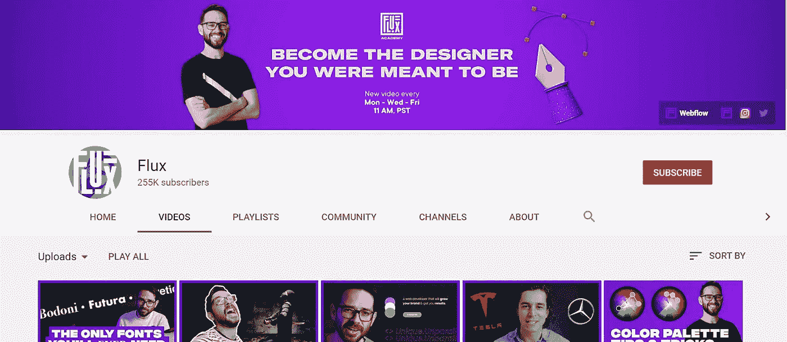

当谈到一个人的团队帮助全球观众了解 UX 设计的来龙去脉时，Ran Segall 的 Flux 是你可以看看的 UX YouTube 频道。Ran Segall 是一名设计师和企业家，他在自己的 YouTube 频道 Flux 上制作和分享视频。

他的视频总浏览量超过 1200 万。我们观察到他的视频博客有一个独特之处，那就是它们非常容易让人上瘾。当你开始看他的视频时，你不能在结束前离开。他分享了他对数字设计技术和咒语的看法。

除此之外，你还可以找到关于他的职业生涯、自由职业、建立可持续的客户关系、回顾与 UX 设计相关的产品等视频。作为 UX 最好的 YouTube 频道之一，如果你正在寻找娱乐和知识的结合，Flux 是你的首选频道。

***3。*** [***高分辨率***](https://www.youtube.com/c/HighResolution/featured)

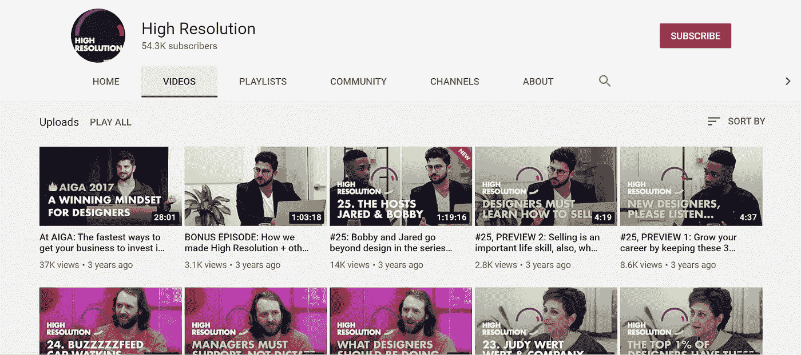

这是一个不同类型的 UX 设计的 YouTube 频道。高分辨率是由两个家伙操作的，贾里德·埃隆杜和鲍比·戈沙尔。两位设计师的工作围绕着采访设计界的名人。

这些人拥有超过 54，000 名订阅者，在他们长达一小时的采访中，他们获得了近 100 万次的观看，这些采访涉及设计世界及其由行业中坚分子解释的细微差别。

基本上，他们在经营一种视频系列的业务，在那里他们与设计界的主要参与者接触，他们要么是白手起家的成功商人，要么是为全球的大公司工作。

除此之外，你还可以在他们的 YouTube UX 设计频道上找到与设计世界相关的会议视频。

***4。*** [***麦克洛克***](https://www.youtube.com/c/MikeLocke/featured)

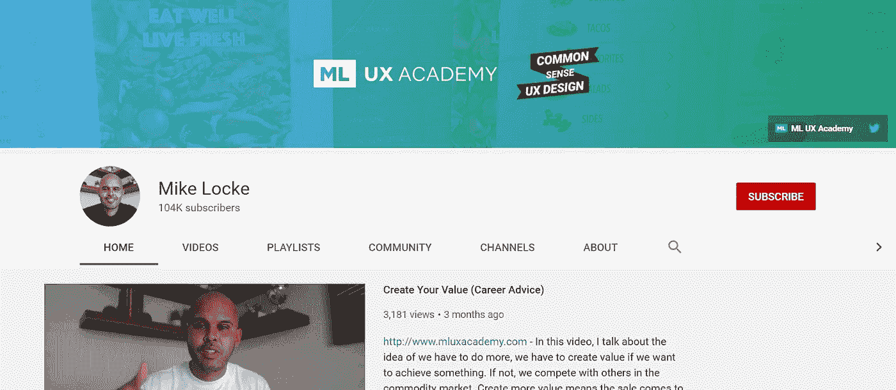

早在 2019 年，迈克·洛克就开始在 UX YouTube 频道上分享他关于 UX 设计的专业知识。他在 YouTube 上的简历是“高度创新、充满激情、成功的高级 UI/UX 设计师”他还提到了许多其他方面，但我们现在就集中在这一点上。

迈克和他的 YouTube 频道 ML UX 学院取得了巨大的成功，因为他制作和分享的内容引起了有抱负的设计师的共鸣。他通过分享具体的设计想法和建议来分享实际建议的能力使他的频道成为你了解 UX 设计行业兴衰的理想起点。

他分享视频来帮助设计师在他们的专业领域变得更好，以及在运行一个成功的在线业务。所以，如果你想在 YouTube 上免费获得商业知识和实用的 UX 设计建议，Mike 就是你要找的人。

***5。*** [***AJ &智能***](https://www.youtube.com/c/AJSmart/featured)

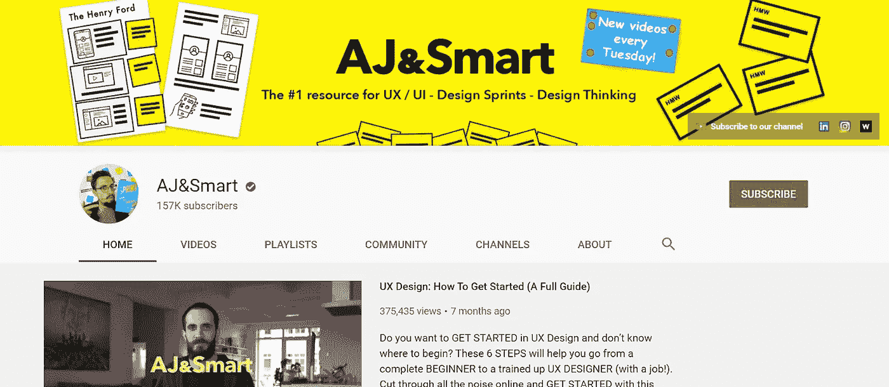

短短四年内就有 157，000 名用户，AJ&Smart 在过去四年一直以惊人的速度增长，未来还会有更多增长。这个频道代表了德国柏林的一个设计和创新工作室。整个设计师团队来到摄像机前，分享他们对设计不同方面的看法。

这个 UX 设计 YouTube 频道的独特之处在于，它有助于建立设计思维，有助于学习其过程，这样任何观看他们视频的人都会成为更好的思考者和创造者。

通过分享关于产品设计、评论、书籍、技巧、工具等设计的核心原则，AJ&Smart 的视频浏览量超过 500 万次，并且每周上传一个新视频，以保持用户群定期获得新知识的娱乐和愉悦。

***6。***[***Dansky***](https://www.youtube.com/c/ForeverDansky/featured)

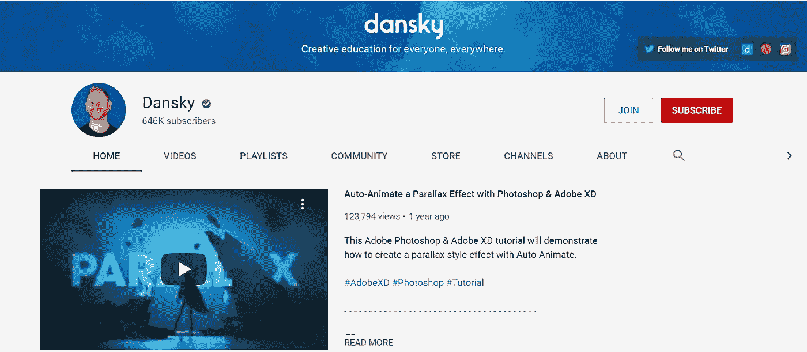

丹斯基的 YouTube 频道有 64.6 万订户，他的视频被观看了超过 5000 万次。作为一名设计师，丹斯利喜欢分享他对 UX 设计的经验和观点。作为他教学和辅导的一部分，丹斯基涵盖了所有关于主要设计软件的知识。

他谈到了它们的效果，如何使用它们，分享了演练，独特的方面，等等。想要了解不同软件和设计工具的用户必须访问他的 UI UX YouTube 频道。

设计师分享了两种类型的视频，要么是 5 分钟的简短教程，要么是内容详细、图形生动的长视频。

***7。*** [***一起勾画***](https://www.youtube.com/c/SketchTogetherTV/featured)

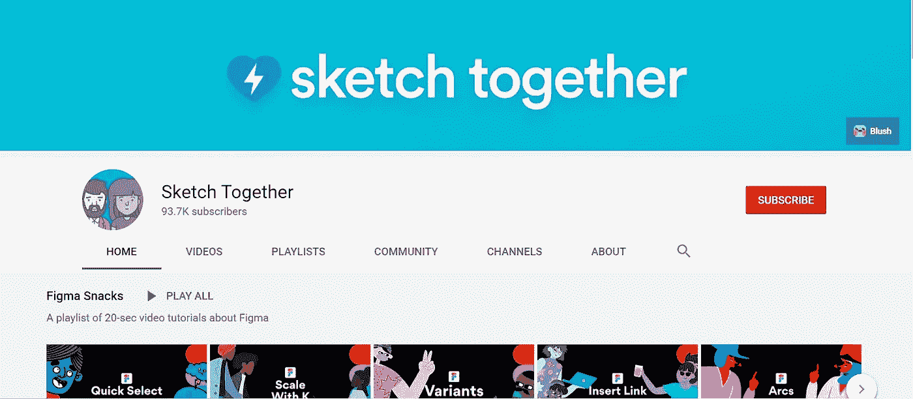

从指标上看，你可以相信 Sketch Together 对于设计师来说并不是一个很好的 UX YouTube 频道。但是，这个频道最适合 MacOS 用户，因为教程和视频指南是为 Mac 用户设计的。

不仅如此，你将在频道上看到的视频类型在长度和内容方面也各不相同。你会发现 15 秒的教程到 2 小时的视频都是关于设计的。

Sketch Together 成立于 2016 年，拥有 93.7 万用户，总浏览量达 400 万次。此外，该平台上的大多数视频都是针对设计软件 Sketch 的。为此，您会发现几乎所有主题的视频，如创建更好的用户体验、操作方法、新内容等等。

***8。***[***CharlieMarieTV***](https://www.youtube.com/c/charlimarieTV/featured)

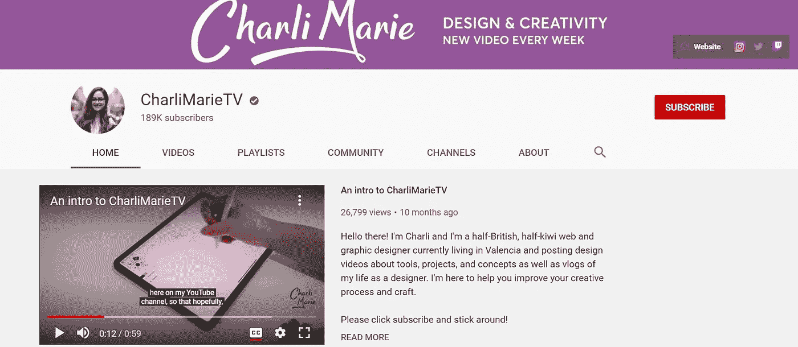

查理·玛丽正在运营她令人惊叹的 YouTube UX 设计频道，她的目的是帮助那些崭露头角的设计师改进他们的工艺和设计流程。作为一名经验丰富的网页和平面设计师，你会发现这里的视频更多的是关于如何成为一名设计师。

有一些关于自由职业者和个体创业者的技巧和指导的视频，可以帮助他们扩大客户群。疫情之后，她开始上传更多关于远程工作的视频。我们在她的频道上观察到的另一件事是，Charlie 向她的 189，000 名订户提供关于如何在不同设计工具和软件之间切换的建议。

在加入该平台并在 YouTube 上分享她的 UX 设计故事后，Charlie 的视频已经获得了 1100 万次点击量。

***9。*** [***杰西不以为意***](https://www.youtube.com/c/JesseShowalter/featured)

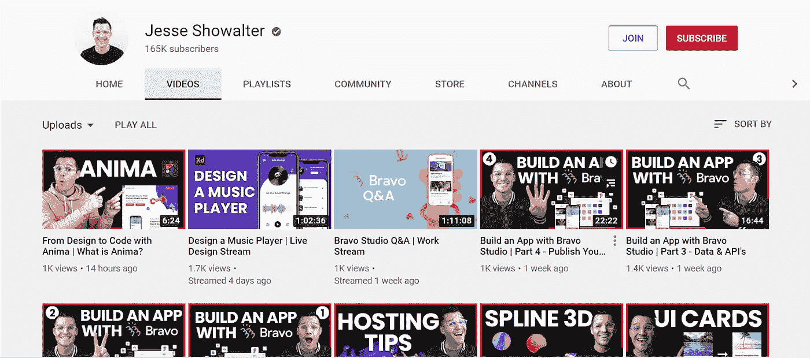

这位数字和网络设计师分享的视频涵盖了侧重于工具、技术和各种设计项目的教程和指南。杰西在 2009 年开始了他的 YouTube 频道，直到今天，他已经管理了一个拥有 165，000 名订户的家庭。

Jesse 每周都会发布一个视频，它与 web 设计人员、UI 设计人员、前端开发人员以及任何其他想要通过设计创造东西并学习编码的人相关。

这些大多是培训视频，带领用户踏上学习之旅，帮助他们学习从基础到复杂的 HTML、CSS、UX 等相关主题。你还会找到类似“用 Bravo 构建应用程序”的视频因此，Jesse 采取了一项新举措，帮助设计师和开发人员完成产品设计生命周期。

***10。***[***tutvid***](https://www.youtube.com/channel/UCeR7U67I2J1icV8E6Rn40vQ)

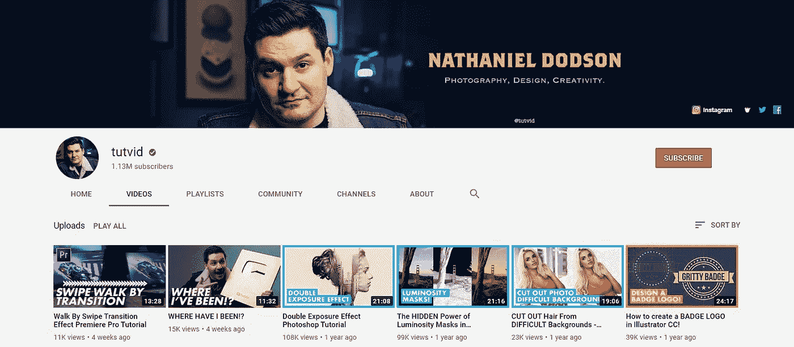

我们把最好的 UX YouTube 频道留到了最后，Tutvid。这个由纳撒尼尔·多德森运营的频道拥有超过 130 万订户(真的)，这些视频的浏览量超过 1 亿次。

纳撒尼尔在过去的 15 年里一直在分享他在设计、摄影和创意方面的专业知识，他的大多数视频都是关于 Adobe 的。Tutvid 提供了大量的教程和指南，分享了包括 UX 和 UI 在内的所有设计内容。

有很多关于 Adobe，Photoshop，After Effects 和 XD 的教程。因为所有这些软件服务于不同的目的，Tutvid 视频详细展示和教授了关于这些工具的一切。

# 结论

的确，YouTube 已经成为任何能上网的人都能使用的最重要的东西之一。作为一个学习和培训的媒介，你需要知道正确的 UX 设计 YouTube 频道来学习最好的。

上面列出的是 UX YouTube 上的 10 个频道，我们发现它们对每个设计师来说都很棒，也是必不可少的。如果你有其他的渠道，请告诉我们，并告诉我们为什么你认为它们是独一无二的。

感谢您花时间阅读这篇文章。[了解更多关于 Mockitt 的信息](https://bit.ly/3ewCXuz)

我们为 UX 初学者创建了一个[终极指南](https://bit.ly/2OLPPlW)，它收集了来自多个 UXers 的知识、经验和建议。

订阅我们的 [YouTube](https://www.youtube.com/channel/UCESxamaRS8nOGpWYvP1VSqA) [脸书](https://www.facebook.com/mockitt) [Instagram](https://www.instagram.com/wondershare.mockitt/)

*原载于*[*https://mockitt.wondershare.com*](https://mockitt.wondershare.com/ui-ux-design/ux-youtube.html)*。*