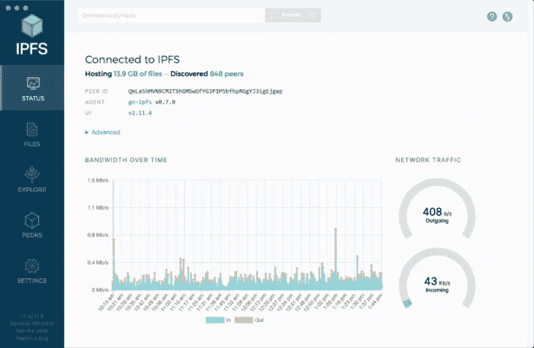
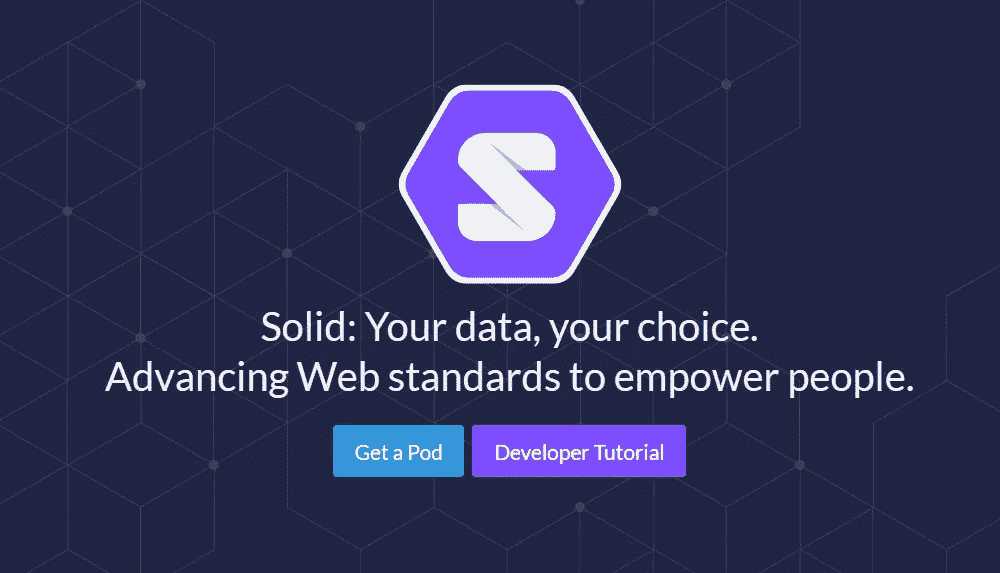
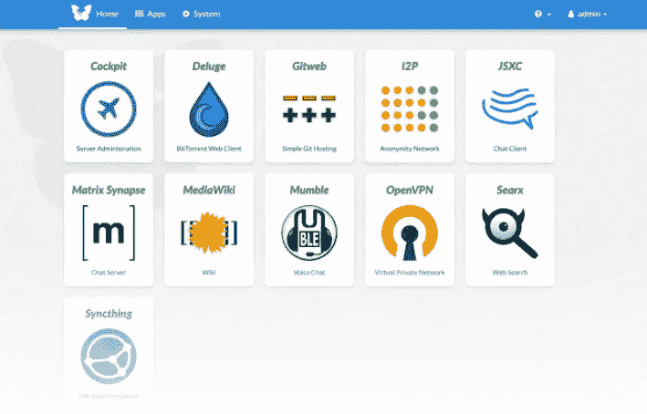
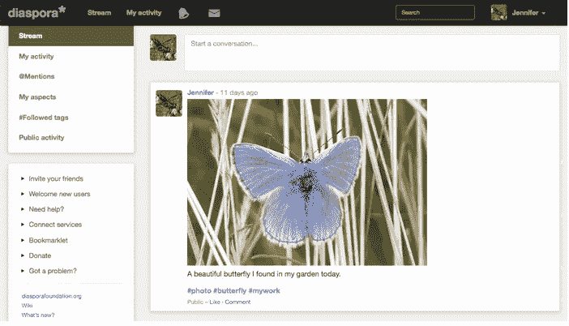
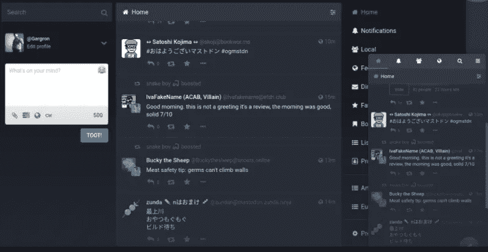
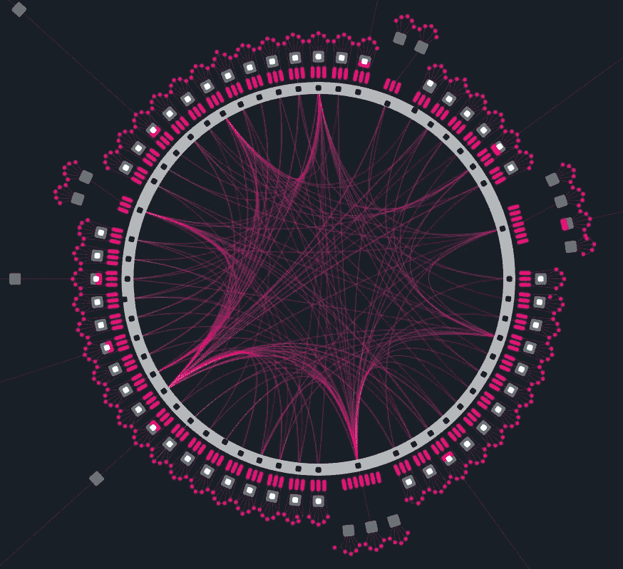
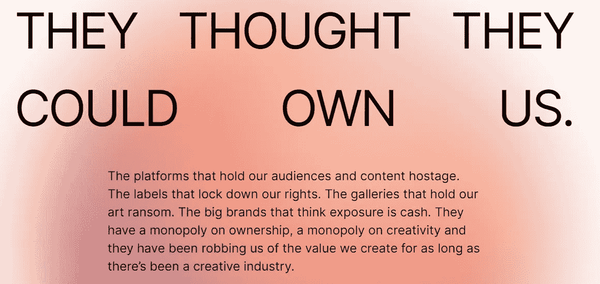
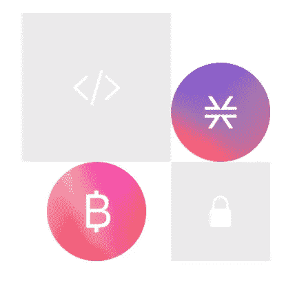

# 你今天就可以开始利用的 11 种权力下放工具

> 原文：<https://medium.com/nerd-for-tech/11-decentralization-tools-you-can-start-utilizing-today-3629abd172af?source=collection_archive---------13----------------------->

## 权力下放的协议、系统和工具清单

网络发展迅速，几十年来，它给我们带来了许多我们甚至无法想象没有它生活会怎样的东西。我们每天都在使用它，我们相互联系，我们使用数字服务，但同时这个系统有点坏。我们的个人数据、隐私和信任岌岌可危。大公司拥有它，使用它，并出售给第三方。数据泄露时有发生，我们面临威胁。

由 [Unsplash](https://unsplash.com?utm_source=medium&utm_medium=referral) 上的 [CHUTTERSNAP](https://unsplash.com/@chuttersnap?utm_source=medium&utm_medium=referral) 拍摄

> *网络是公民辩论的关键空间，也是当前保护言论自由的战场。* [https://dci.mit.edu/decentralizedweb](https://dci.mit.edu/decentralizedweb)

新的运动正在发生，以解决这些问题，他们的目标是权力下放。新的系统和协议正在被创建，使我们能够控制我们的数据，在不需要中央单元的情况下相互连接，把信任还给它应该在的地方。有 [Web 3.0 运动](https://web3.foundation/)包含了一个去中心化的网络，运行加密货币和链接数据(语义网)的区块链技术。

> *Web 3.0 =去中心化 web +区块链+链接数据*

我将与你们分享一份工具、协议和其他系统的清单，这些都是在去中心化的思想下建立的，你们可以开始探索。互联网是一个广阔的空间，所以这只是我最近偶然发现的资源的一个简短列表(排名不分先后)。

## 1.[星际文件系统](https://ipfs.io/)

一种对等超媒体协议，旨在使 web 更快、更安全、更开放。您可以将它安装在桌面上或作为命令行工具。

IPFS 桌面界面

## 2.[固体](https://solidproject.org/)

你的数据，你的选择。推进网络标准以增强人们的能力。
**Solid** 是一个 [**规范**](https://solidproject.org/TR/protocol) ，它让人们将他们的数据安全地存储在名为 **Pods** 的分散数据存储中。豆荚就像安全的个人数据网络服务器。当数据存储在某人的 Pod 中时，他们控制哪些人和应用程序可以访问它。

## 3. [Urbit](https://urbit.org/)

Urbit 是 21 世纪的全新操作系统和网络。它有两个部分:

*   Urbit 操作系统——将操作系统重新想象为“覆盖操作系统”
    这是一个紧凑的系统，个人可以在任何有互联网连接的 Unix 机器上运行自己的永久个人服务器。
*   urbit ID——是一个分散的数字身份系统。您的 Urbit ID 是用户名、网络地址和加密钱包。

每个 Urbit ID 都有自己的头像

**Urbit OS + Urbit ID** 被设计成作为一个单一系统协同工作，完全开源，并且 100%归使用它们的人所有。

## 4. [FreedomBox](https://freedombox.org/)

FreedomBox 是一个面向非专家的私有服务器:它让您只需点击几下鼠标就可以安装和配置服务器应用程序。它运行在你选择的廉价硬件上，使用你的互联网连接和电源，并且在你的控制之下。

## 5.[流散](https://diasporafoundation.org/)

你控制的在线社交世界基于三个理念:去中心化、自由、隐私

## 6.[乳齿象](https://joinmastodon.org/)

社交网络，回到你的手中。
关注朋友，在超过 440 万人中发现新朋友。发布你想要的任何东西:链接、图片、文本、视频。所有这些都在一个社区拥有的无广告平台上。

## 7.[波尔卡多特](https://polkadot.network/)

面向下一代网络的可扩展、可互操作且安全的网络协议

## 8.[仿植物怪兽佐拉](https://zora.co/)

仿植物怪兽佐拉是一种通用媒体注册协议。对于创作者来说，这是一种发布创意媒体、通过他们的工作赚钱、让其他人构建和共享他们所创造的东西的方式。因为这种媒体是基于一种协议的，所有这一切的发生都没有社交媒体平台的束缚。

仿植物怪兽佐拉宣言

## 9.[堆栈](https://www.stacks.co/)

一个更好的互联网，建立在比特币之上。
Stacks 使比特币可编程，支持继承比特币所有功能的去中心化应用和智能合约。

## 10.[矩阵](https://matrix.org/)

Matrix 是一个**开放标准**，用于通过 IP 进行**互操作**、**分散式**、**实时**通信。

## 11.[状态](https://status.im/)

私人的，安全的通信。Status 是一个安全的消息应用程序、加密钱包和 Web3 浏览器，采用最先进的技术构建。

你用过这些吗？或者你有兴趣尝试这些工具来取代，例如，我们习惯的社交网络(Twitter，FB 等。) ?我认为很高兴看到一些解决方案的出现，但它们必须经过仔细设计和深思熟虑。

说到加密货币，有许多基于以太坊和其他区块链的所谓 Dapps(去中心化应用)。

我整理的简短列表是我作为一个新来者对分散技术的探索。我很好奇人们是否会大规模地转换和采用这些系统。

你准备好挣脱束缚，探索这些 Dapps 了吗？