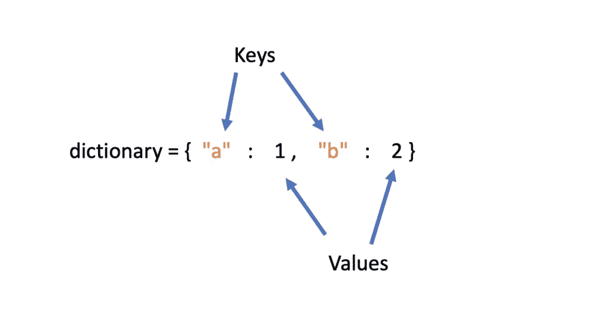
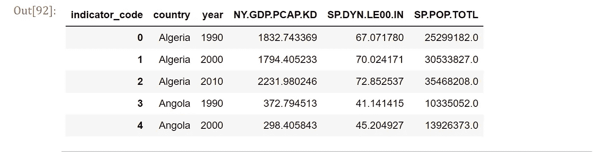
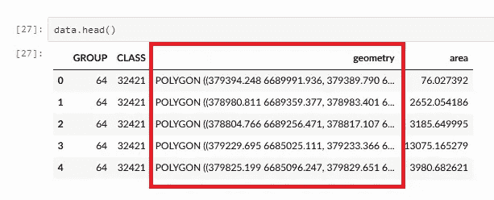

# 作为 python 程序员必须知道的 11 种数据类型和结构

> 原文：<https://medium.com/nerd-for-tech/11-must-know-data-types-and-structures-as-a-python-programmer-45573fbec5bb?source=collection_archive---------0----------------------->

## 最有用/最常见的数据类型和结构的参考列表，你应该知道在数据世界的职业生涯


Istockphoto.com

数据类型和结构在技术上是一件非常非常重要的事情！！💻

你可能已经听你的开发者朋友或你新工作的同事谈论过“[数据结构和算法(DSA)](https://www.youtube.com/watch?v=pkYVOmU3MgA&ab_channel=freeCodeCamp.org) ”就像一个不可能的高峰🗻难以获得的计算机科学知识；我知道我有。

但是这篇文章的目的不是讨论'[数据结构和算法](https://www.youtube.com/watch?v=pkYVOmU3MgA&ab_channel=freeCodeCamp.org)。

在我开始数据科学之旅的短暂时间里，我遇到了大量的数据类型和数据结构，这使我意识到保留它们的目录将有助于我，也许还有你，更好地理解它们。

首先，数据类型是大多数开发人员，不，大多数人每天都要接触的最基本、最常见的数据分类。本质上，数据类型指定了数据的种类和性质。

很容易将数据类型与数据结构混为一谈，因为后者只是要执行的特定操作的不同数据类型的集合；数据结构帮助组织内存中的数据项[。](https://www.geeksforgeeks.org/difference-between-data-type-and-data-structure/)

事不宜迟，我们开始吧！！💪

# 数据类型

## 用线串

不要与[字符串对象](https://www.tutorialspoint.com/javascript/javascript_strings_object.htm)混淆在几种语言中，字符串文字(或原始字符串)是字符(字符)的序列，可见或不可见，重复或唯一。字符串可以包含任意数量的字符，并且总是用单引号或双引号括起来。

```
>> "Hello World"  # A string
>> '12345' # Another string
>> "Start in 10 minutes" # A string
```

基本上，所有用引号括起来的键盘输入或文本输出都是字符串。我们也可以称字符串为字符的集合。

## 数字(整数、浮点和复数)

```
>> 1000 # an Integer
>> 1001.2 # a float
>> 100 + 2J # a complex number
```

和基础数学中一样，整数包括零、正、负整数(包括二进制、八进制和十六进制)；浮点数是正负实数，小数部分前面有小数；而复数有实部和虚部，字母“J”表示虚部。

## 日期时间

美好的时光📅🕐！没有你我们能做什么？
`DATETIME` type 用于包含日期和时间部分的值。有这么多不同格式的日期和时间。

```
>> yyyy*mm*dd HH*MM*SS --datetime
>> mmm*dd*yyyy --date
>> HH*MM --time
```

与关系数据库和一些语言不同，Python 中的日期和时间并不完全是它们自己的数据类型，它们被表示和操作为 DateTime 对象。具体来说,‘DateTime’这个名称是为了处理内置的 python 模块，用于操作日期和时间对象。

日期、时间、日期时间、时间增量、tzinfo、时区是日期时间模块中的六个类；每一种都有处理各种情况的方法。

## 布尔代数学体系的

这是许多编程语言中的另一种内置数据类型，它只占用两个值:True 或 False。布尔数据类型用于表示表达式的真值，就像我们日常使用的互斥术语一样，如是或否、对或错以及阴阳。

```
>> 1 == 0 # comparison expression checking for equality
   False
>> 25 > 18 # another comparison expression
   True
```

# 我遇到的数据结构

## 数组

现在，在这里容忍我一分钟！如果您曾经学习或使用过一些通用编程语言(Python、Javascript、Java 等)，您可能也遇到过数组。明确地说， [*一个数组是一系列相同类型的数据项*](https://www.cs.utah.edu/~germain/PPS/Topics/arrays.html) 。

除了这个定义之外，还有一大堆与创建数组及其在不同语言中的实现相关的技术问题，坦率地说，我对此知之甚少，无法给出意见。我所知道的是数组在 Python 中的含义，这可能适用于其他[通用高级语言](https://www.bbc.co.uk/bitesize/guides/z4cck2p/revision/1)。

在 Python 中，数组是一种以连续方式存储项目集合的数据结构。它们是可变的、有序的，并被括在方括号中。

```
>> py_array_1 **=** arr.array("i", [3, 6, 9, 12]) # python in-built array declaration
>> print(py_array_1)
>> print(type(py_array_1))array('i', [3, 6, 9, 12])
<class 'array.array'>
```

对于一般用途，上面使用的数组模块允许轻松访问 python 中传统的同构数组结构，而 Numpy(一个 python 库)具有更灵活的数组结构，通过它的许多特殊函数来处理和操作数字数据。

```
>> np_array_1 **=** np.array(["numbers", 3, 6, 9, 12])  # Numpy array declaration
>> print (np_array_1)
>> print(type(np_array_1))['numbers' '3' '6' '9' '12']
<class 'numpy.ndarray'>
```

## 列表

是的，不是那种清单！
像一个数组一样，一个列表保存了一组用方括号括起来的条目。列表与数组的不同之处在于项目不必是同质的(相同类型),尽管数组可以有多个轴，但列表只是一个一维数组。

```
>> list **=** [3, 'friends', 9.5, 'blog', [0,1,1], 'binary']
>> print(list)
   [3, 6, 9, 12]
```

列表是**可变的**，**有序的，不需要唯一的**并且可以很容易地**嵌套。**

## 设置

当你看到集合时，也许你高中时代的集合论会出现在你的脑海里。是的，是同一套。我们通常将[集合](https://realpython.com/python-sets/)定义为明确定义的不同(或唯一)成员(或元素)的集合。

此外，它们是无序和可变的，但每个成员本身是不可变的。这意味着像字典和列表这样的可变元素不能是集合中的元素。

在 python 中，集合是用弯曲的括号`{}`或内置的`.set()`方法定义的。

```
>> set([1,2,2,4,5,0,0]) # definining a set
   {1,2,4,5,0}
>> x = 'floooowwww'    
>> set(x)
   {'w', 'o','f', 'l'}
```

## 词典

你还记得你如何通过查字典来寻找单词的意思吗，就像一把打开大门的钥匙？字典数据结构并没有太大的不同。[我们使用不可变的键将数据存储在字典中，该键被配对/映射到特定的值](https://docs.python.org/3/tutorial/datastructures.html#dictionaries)。



programmatically.com

键可以是任何不可变的数据类型或结构，但是值可以是任何值。将字典想象成一个 ***键:值*** 对是有帮助的，因为这正是它作为输出显示的方式。

请注意，与序列(数组、集合和列表)不同，序列的索引是由一系列整数完成的，而字典是使用关键字进行索引的。

## 系列

虽然它不是一个内置的 python 结构，但它和任何结构一样有用和受欢迎，这要感谢 [***熊猫***](https://pandas.pydata.org/docs/reference/api/pandas.Series.html)*库。一个系列或多或少是一个带有标签和索引的表格列。从技术上讲，它是一个一维 ndarray，可以保存任何数据类型，包括时序数据。*

```
*>> d = {'idowu': 1, 'reader': 2, 'data': 3, 'partition': 'four','a':    5, 'b':6, 'c':7}
>> ser = pd.Series(data=d, )
>> ser
idowu           1
reader          2
data            3
partition    four
a               5
b               6
c               7
dtype: object*
```

*使用基于整数或基于标签的索引可以很容易地访问序列元素。根据数据类型，可以对一个系列执行各种基本操作，但是大多数人依赖健壮的 pandas 系列方法来操作系列数据。*

## *[**数据帧**](https://pandas.pydata.org/docs/reference/api/pandas.DataFrame.html)*

*在我看来，这可能是最周到和直观的数据结构。pandas dataframe 是一个包含行和列的表格，就像 Excel 一样。每当我看到一个数据框架，我马上会想到一个 excel 表格。*

**

*再次从技术角度来说，[pandas data frames 的官方文档](https://pandas.pydata.org/docs/reference/api/pandas.DataFrame.html)将其定义为一种*二维的、大小可变的、潜在异构的表格数据，可以将其视为 pandas 系列对象的字典容器。”**

*有关如何构造数据帧、对其执行操作或访问其方法的更多信息，请访问上一段中链接的文档。*

## *地理数据框架🌐*

*有我称之为 ***【外来数据结构】*** 的数据结构。我称它们为*奇异的*,因为它们是用于特定领域和利基的结构，大多数人可能永远不会遇到它们。*

*在这篇文章中，我将只提到 [***geopandas 地理数据框架*** *s*](https://geopandas.org/docs/reference/api/geopandas.GeoDataFrame.html) ，主要是因为它建立在来自 pandas 数据框架的知识上。*

**

*为了增加对数据帧中地理数据的支持，`geopandas.GeoDataFrame`对象是一个`pandas.DataFrame`对象，它有一列使用坐标参考系统 CRS 的几何数据。*

*它通常用于在 python 中添加和处理空间(地理)信息。一些卫星图像🌍数据、地图数据等等都是这样存储的。*

> *荣誉提及包括元组、[图、树、图](https://www.programiz.com/dsa/data-structure-types)等等。想要更全面的了解数据类型和结构，我建议咨询优数据结构与算法(DSA) [正文](https://www.amazon.com/Common-Sense-Guide-Data-Structures-Algorithms/dp/1680502441)。*
> 
> *我在这里列出的数据类型和结构并不详尽，但是我可以向您保证，在您成为一名经验丰富的开发人员的过程中，您离不开它们。*

## *你认为列表中还缺少哪种流行的数据类型或数据结构？请在评论中告诉我！！*

*感谢阅读！！！*