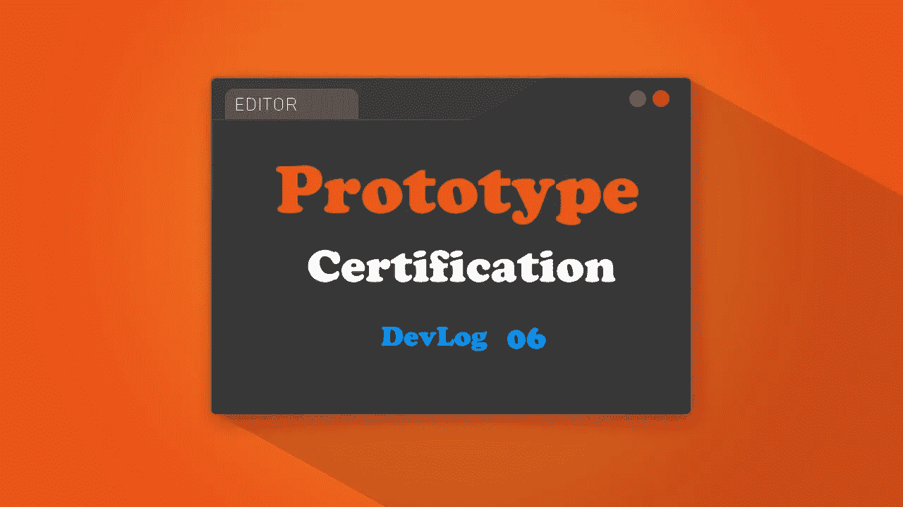
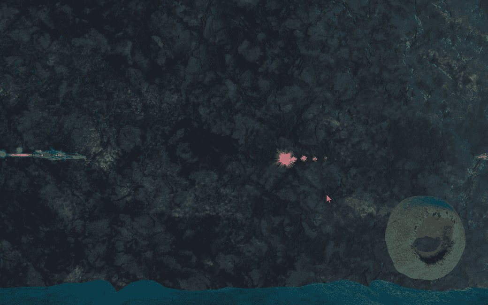
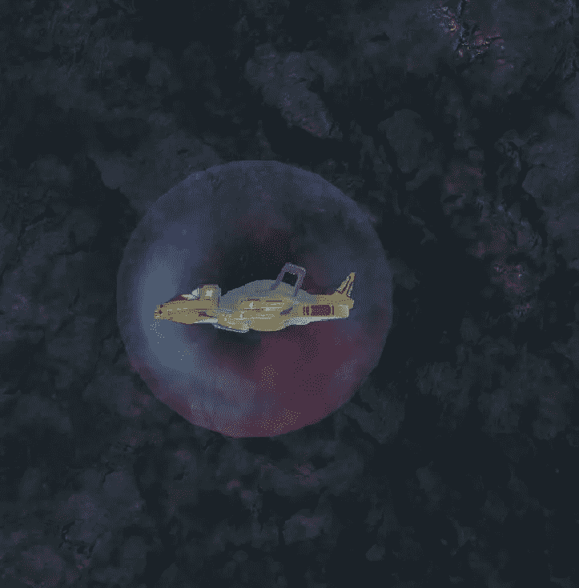
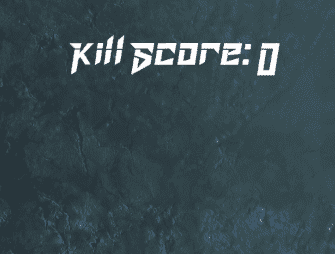

# 12 小时登录:GDHQ 认证发展博客

> 原文：<https://medium.com/nerd-for-tech/12-hours-in-gdhq-certification-devlog-be12f18104c?source=collection_archive---------7----------------------->

自从上一个 Devlog(GDHQ 认证 Devlog 中的 [09 小时)以来，进度已经慢了一点，但是有一个很好的理由。我被要求在 7 天内开发一个我从未涉足的领域的小项目，一旦我完成了这个项目，我肯定会记录所有的事情。](/nerd-for-tech/09-hours-in-gdhq-certification-devlog-3f7dcfbfdcf0)

所以让我们从目前为止的变化开始。

> 改变摄像机位置

是的，改变相机位置在这里非常重要。以前，镜头离玩家有点近，但是我发现这有点限制了玩家的移动，我不能放置我想要的那么多敌人。所以我把镜头往后移了一点，调整了玩家可以移动和敌人可以射击的可玩区域。

旧的相机位置，离玩家很近

新的摄像机位置，远离玩家。更多动作更有趣

> 幻影步兵武器

咕噜人是一个重型单位，可以承受一些伤害，并且有独特的移动模式。所以我没有给士兵一件可以射击的武器，而是给了他们一个包围他们的力场。如果玩家进入这个力场，只要他们在里面就会受到伤害。

> 基本用户界面和评分系统

在每一关之后，玩家会根据我的因素被评分。前两个因素是**击杀**得分和**连击**得分。

当玩家杀死敌人时，点数会加到他的杀死点数上，每个敌人会给不同的杀死点数。

连击得分随着玩家杀死敌人而增加，如果敌人受到伤害，连击得分会重置。我仍然不确定我希望它如何影响最终分数。玩家应该根据他的最高连击数获得分数奖励吗？或者玩家应该根据他完成关卡的连击次数获得分数乘数。

分数用户界面