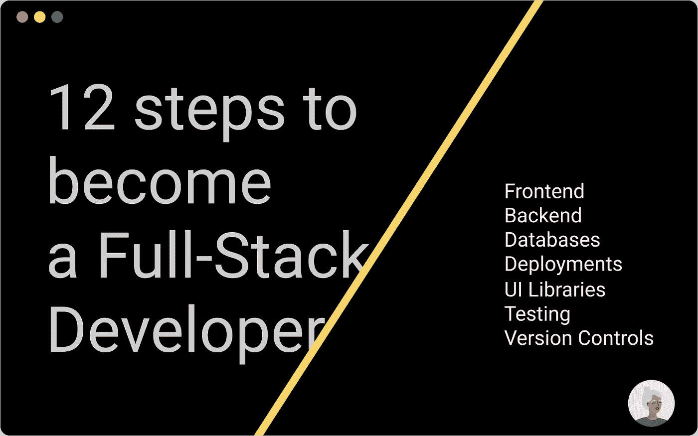

# 成为全栈开发人员需要考虑的 12 件事

> 原文：<https://medium.com/nerd-for-tech/12-things-to-ponder-to-be-a-full-stack-developer-d590a6a7bec5?source=collection_archive---------21----------------------->

仅仅 12 件事和我已经为你介绍过的大部分事情😁

[网站](http://ihatereading.in)

# 让我们现在浪费时间，直接跳到他们身上

*   **前端**——学习 React 或 Svelte 或 Vue，但 React 是我的首选，因为它至少在 5 年内不会有任何进展。
*   **反应框架**——我的永远和最重要的…