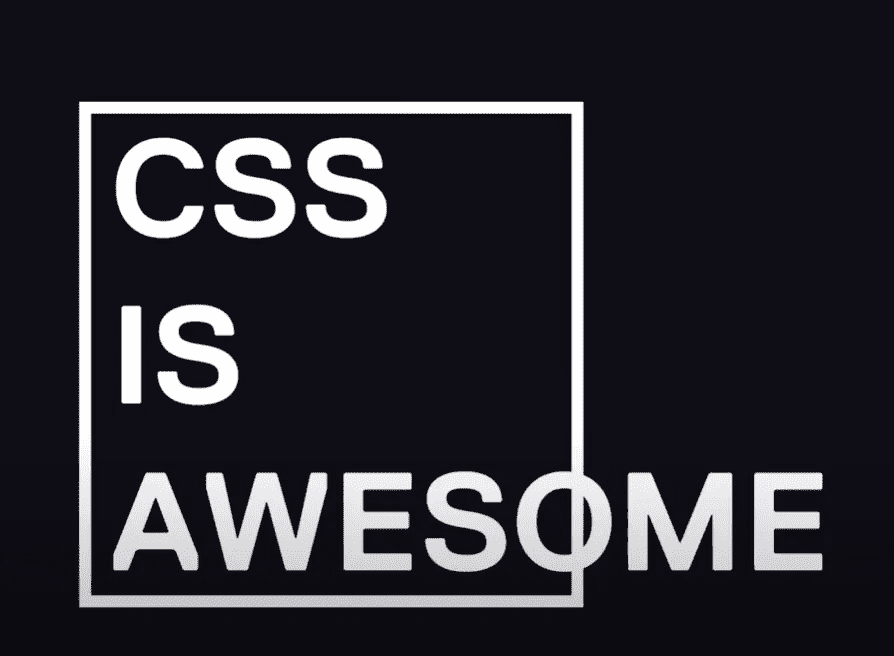
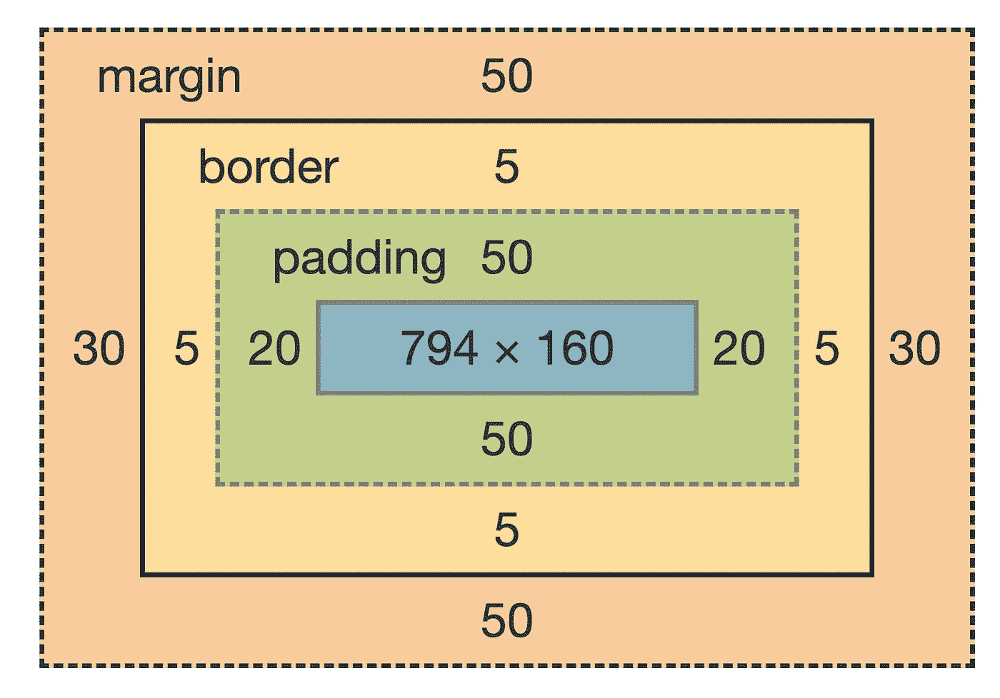
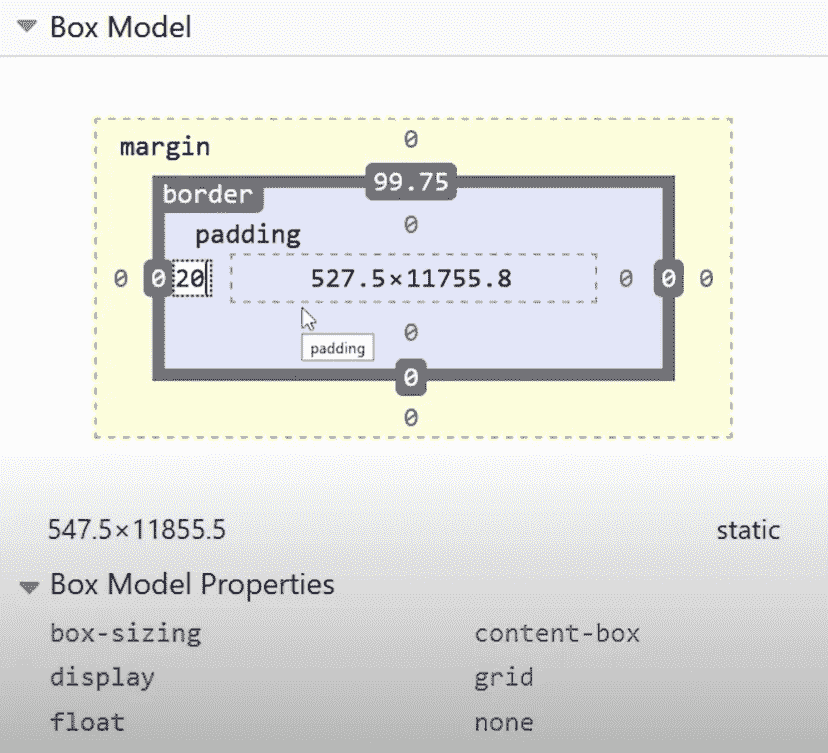
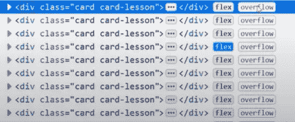
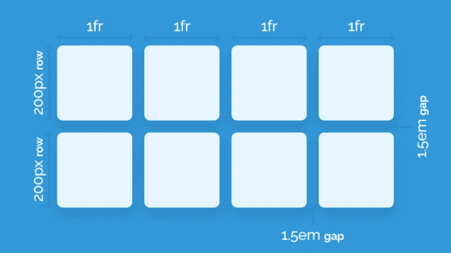
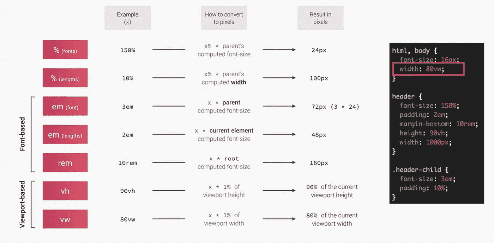

# 13 个 CSS 专业技巧

> 原文：<https://medium.com/nerd-for-tech/13-css-pro-tips-b9a451fd3b69?source=collection_archive---------2----------------------->



你需要知道的第一件事是如何学习 CSS。不学习 CSS 的方法是使用一个框架，如 tailwind 或 bootstrap。这些工具可以帮助你快速获得一个好看的用户界面，但是如果你使用类似 tailwind 的东西，你将无法学习 CSS 基础知识，你将学习 tailwind。当你学习基本的 CSS 时，你将对你的代码创造力和自由度有更多的控制。

## 1.学习盒子模型

学习盒子模型，因为当你理解了，语言中的其他东西就开始变得更有意义了。事实上，这很简单，我现在就教你盒子模型。



把每个 HTML 元素想象成一个盒子，盒子里面的内容有宽度和高度，你可以在盒子周围添加填充来挤压内容，然后你可以在外面添加边框，然后在边框周围添加额外的不可见空间，称为边距。CSS 中所有与布局和位置相关的东西都受到盒子模型的影响。你可以打开 chrome 开发工具，你可以看到页面上的任何元素的盒子模型是如何计算的，这让我想到了第二个技巧

## 2.火狐很神奇

调试 CSS 时不要使用 chrome，而是使用 firefox，他们的开发工具通常更好，特别是在 CSS 方面，如果你检查一个元素，你可以直接编辑它的属性，firefox 会给你一个影响盒子模型的所有属性的分解。



它还在 HTML 中提供了有用的注释，比如当一个元素导致另一个元素溢出时，firefox 还为 flex 和 grid 布局提供了非常好的图形。



## 3.Flexbox 太棒了

CSS 的一个具有挑战性的方面，就像一个古老的问题:如何使一个 div 水平和垂直居中。一种选择是给子元素绝对定位，然后通过使用 top 和 left 属性将它移动到右下角，然后将其向后平移 50°以将其放在中央，这可以工作，但非常不直观。现代 CSS 的一种更好的方法是 flexbox，它允许您在 UI 中的任何位置创建灵活的列或行，当元素有 display flex 时，它还有一个 **X** 和 **Y** 轴，您可以在其上对齐其子元素。

当涉及到布局时，Flexbox 通常是我接触的第一个工具，但它确实有一个主要缺点，如果你有一个包含许多交叉行和列的复杂 UI，你可能会在你的 HTML 中有许多容器或包装元素。幸运的是，现在有一个叫做网格的现代 CSS 特性。

## 4.网格很棒

Flexbox 只处理单独的列和行，但是**网格**允许你考虑全局布局。如果你已经做了很长时间的 web 开发人员，你可能会觉得它很熟悉，因为它与过去的表格布局非常相似。当您设置一个元素来显示一个网格时，您可以将它的子元素定义为一组列和行，这对于开发人员来说更加友好。这里需要注意的重要一点是，与 flexbox 布局相比，您将减少 HTML 和 CSS 的数量。



来源于 designmodo

## 5.夹紧它

现在，90%的情况下，当我们谈论响应式布局时，我们只是在谈论根据设备或视口的可用空间来改变某些东西的宽度，有许多方法可以做到这一点。例如，您可能有一篇文章，其首选宽度为 50，但在小屏幕上，您希望将其固定为 200 像素，或在大屏幕上固定为 800 像素，您可以通过编写媒体查询来实现这一点，该媒体查询将根据视区大小有条件地应用 CSS。

唯一的问题是，随着项目越来越大，媒体的询问会让你想放弃自己。不过好消息是，你可以通过使用像最小-最大和箝位这样的功能来翻转表格。我们可以重构这段代码，将宽度设置为一个箝位值，最小值为 200 像素，最大值为 600 像素，然后 f 首选值为 50，将 13 行代码变成一行，代码减少了 92%。

## 6.长宽比单行

这条建议真的会让你大吃一惊。如果您曾经不得不创建一个保持特定纵横比的响应图像或视频。我最近嵌入了 16x9 宽高比的视频，需要这种技巧，你在顶部填充 pt 56.25，然后给孩子绝对定位，尽管它不是在所有地方都受支持，但我们可以使用宽高比属性来代替填充，我们可以定义视频的宽高比，我们完成了消除 CSS 代码是使它更有趣的一个重要部分，但同样重要的是使您的代码更灵活。

## 7.寻找焦点-内在

当构建一个复杂的下拉菜单时，您可能会假设使用了一些 JavaScript 来管理菜单的打开和关闭状态，但是您可能会惊讶于只使用普通的 CSS 所能达到的程度。现在，您很可能已经熟悉了 focus 伪类，当您进入表单输入或单击按钮时，它会应用于一个元素。问题是，当构建下拉菜单时，您可能会使用 focus 来打开一个 但是，当你点击菜单中的某个东西时，它会失去焦点并关闭，这时你需要 JavaScript 来管理状态，然而，还有另一个伪类叫做 focus within，如果任何子菜单也有焦点，它会保持活动状态，这个简单的特性可以消除大量用于切换状态的 JavaScript。

## 8.状态管理计数器

我知道我们说 CSS 不是一种编程语言，但是你知道它实际上有一个内置的状态管理机制吗？你可以在你的 CSS 代码中跟踪一个运行计数，而不需要编写任何 JavaScript 代码。如果你想给你的 HTML 中的标题编号，最简单的方法是在 HTML 中手工添加这些编号，因为如果你想拼接一个新的标题，你必须手工重新编号。一个更聪明的方法可能是 CSS 计数器你可以在你的代码中使用 counter reset 属性创建一个计数器，给它一个你想要的名字，然后每当应用所需的选择器时递增它，它将从 0 开始，然后向 dom 中的每个 h1 元素加 1，现在你再也不用担心在你的 HTML 中给东西编号了。

## 9.奇特的计算

它能够使用 **calc** 函数运行基本计算。它允许你用一些基本的数学来计算一个值，但是真正酷的事情是—

```
width: calc(100vw - 80px);
font-size: calc(1rem * 1.25);
padding: calc(5% + 22px);
```

您可以组合不同的单位，就像您可能希望从当前视口宽度中减去 50px 一样。在我们的代码中，我们有动画，其中字母从顶部落下，但我们希望交错它们，以便它们一个接一个地出现。实现这一点的一种方法是对每个元素应用不同的动画延迟，但这非常重复，很难重构。更复杂的方法是为每个项目定义一个定义其顺序的内联 CSS 变量，然后我们可以将动画延迟定义为顺序变量* 100 毫秒的计算结果，现在我们可以处理无限数量的元素，而不增加我们的 CSS 足迹。

## 10.变量对变量

重构并不完全是一场噩梦，实现重构的一个好方法是使用 CSS 自定义属性或变量。

```
p{
    color: rgba(255, 0, 0);
}
h1{
    color: rgba(255, 0, 0);
}
h2{
    color: rgba(255, 0, 0);
}
```

注意我们是如何在多个地方使用相同的颜色值的，如果我们决定改变颜色，我们需要修改引用它的每一行代码。一个更好的方法是在根选择器上定义一个全局变量，然后在需要的地方引用它。

```
:root {
    --text-color: rgb(255, 0, 0);
}
p {
    --text-color: yellow;
    color: var(--text-color);
}
h1 {
    color: var(--text-color);
}
h2 {
    color: var(--text-color);
}
```

现在，当你决定改变它，你只需要修改一行代码变量级联像其他一切。在 CSS 中，这意味着您可以通过在树的更深处重新定义它们来覆盖它们，您也可以将它们组合起来以比较更复杂的值，例如:

```
:root {
    -r: 255;
    --g: 0; 
    --b: 0;
    --text-color: rgb(var(--r), var(--g), var(--b));
}
p {
    --text-color: yellow;
    color: var(--text-color);
}
h1 {
    color: var(--text-color);
} 
```

我们可以根据其他三个变量的值来定义我们的 rgb 颜色，这种灵活性将真正改变你的生活，让你可以快速地为你的网站更换不同的主题。

## 11.响应相对单位

尽可能在静态像素值上使用相对单位。例如，当设计一个响应式布局时，你可能会有一些标题或容器，它们的边距和填充像素值是固定的，然后你可能会有一个媒体查询来更改这些值或较小的屏幕，这不仅难以维护，而且在自动缩放字体而不是像像素这样的固定单位的设备上也不太好用，我们可以使用像 **m** 或 **rem 这样的相对单位。m** 将根据其最近的父字体大小自动计算大小，如果父字体大小为 16px，则 2m 将计算为 32px，作为替代，您也可以使用相对于根字体大小的 rem。相对单位不仅仅是 **m** 和 **rem。**



## 12.HSL 色彩魔法

在十六进制或 rgb 上使用 **hsl** 颜色。“RGB”代表红绿蓝，其中每种颜色的混合值可以是从 0 到 255。十六进制包含相同的信息，但格式更紧凑，甚至更难解释。另一方面，hsl 代表色调饱和度和亮度，这种格式使计算好看的调色板更加容易。

## 13.滚动填充快速修复

我经常在有固定导航条的网站上看到的是，当你去一个锚链接时，页面会自动滚动，但标题会被固定的导航条覆盖。原来有一个模糊的属性叫做顶部滚动填充，或者只是所有其他边的滚动填充，当浏览器自动滚动到那个锚点时，它会添加额外的填充，这给了我们一个简单的方法来修复一个非常常见但非常烦人的错误。

```
article {
    scroll-padding: 1rem 0 0 0;
}
```

✏📝在评论中留下你最喜欢的 CSS pro 技巧。