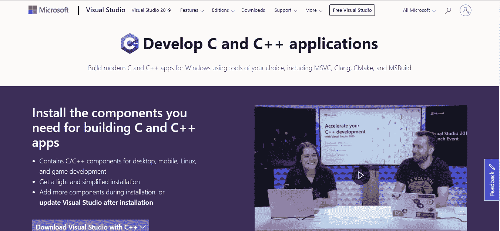
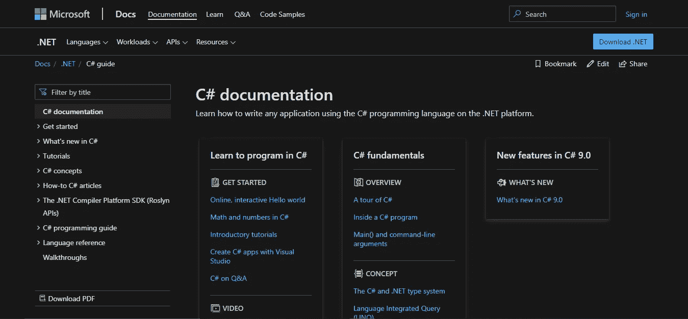
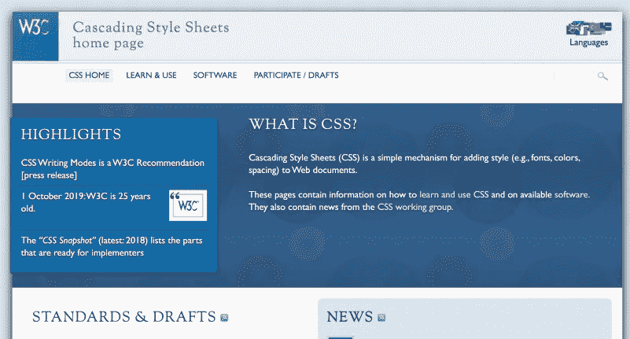
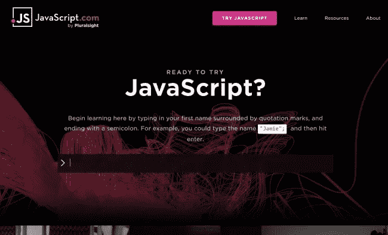
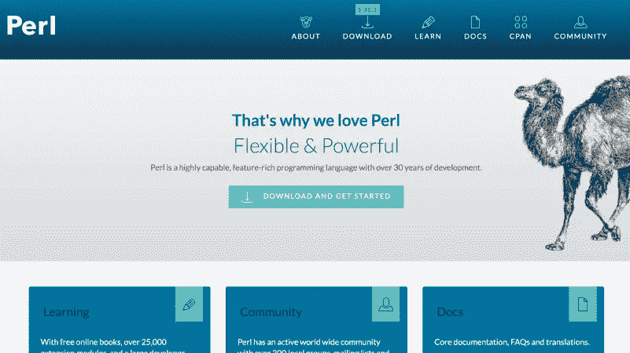
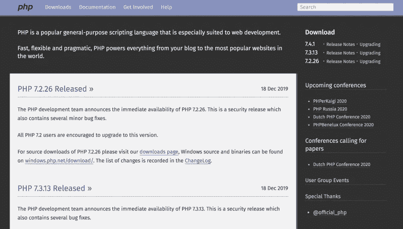
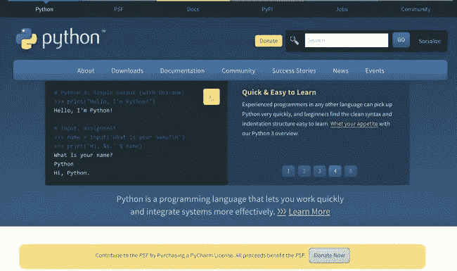
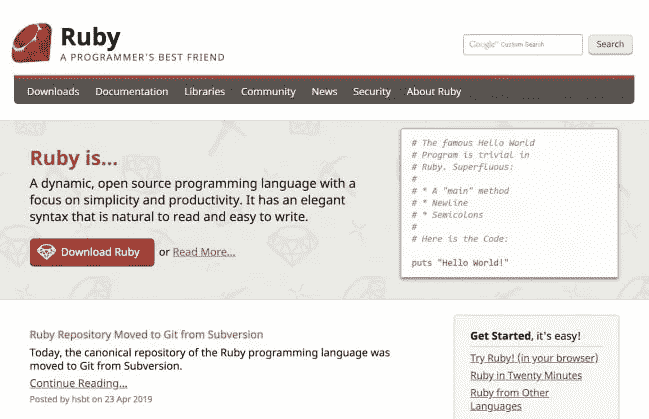
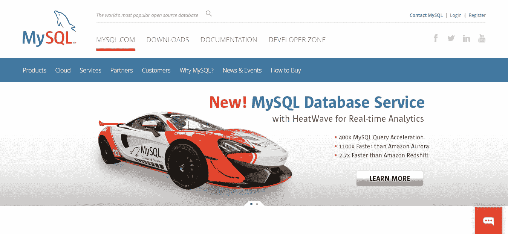
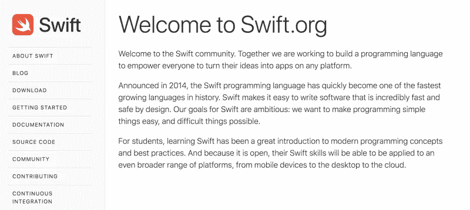

# 解释了 14 种不同的编程语言及其用途。

> 原文：<https://medium.com/nerd-for-tech/14-different-programming-languages-and-their-uses-explained-8d654f0c1788?source=collection_archive---------2----------------------->

# 什么是计算机编程语言？

计算机编程语言允许我们用计算机能理解的语言向计算机发出指令。正如存在许多基于人类的语言一样，程序员可以使用一系列计算机编程语言与计算机进行交流。计算机能够理解的语言部分称为“二进制”将编程语言翻译成二进制被称为“编译”从 C 语言到 Python，每种语言都有其独特的特性，尽管编程语言之间往往存在共性。

这些语言允许计算机快速有效地处理大量复杂的信息。例如，如果给一个人一个从 1 到 10000 的随机数字列表，并要求他将这些数字按升序排列，很可能需要相当长的时间，并且会出现一些错误。

当今业界使用的编程语言有几十种。下面我们总结了 14 种最重要、最相关和最受欢迎的语言。

> 1.C
> 
> 2.C#
> 
> 3.C++
> 
> 4.超文本标记语言
> 
> 5.半铸钢ˌ钢性铸铁(Cast Semi-Steel)
> 
> 6.Java 语言(一种计算机语言，尤用于创建网站)
> 
> 7.Java Script 语言
> 
> 8.目标-C
> 
> 9.服务器端编程语言（Professional Hypertext Preprocessor 的缩写）
> 
> 10.Perl 语言
> 
> 11.计算机编程语言
> 
> 12.红宝石
> 
> 13.结构化查询语言
> 
> 14.迅速发生的

# 1.C

**所有编程语言的曾祖母和通用语，** [**C**](https://en.wikipedia.org/wiki/C_(programming_language)) **于 1972 年首次发布——这是 45 年前的一个巨大的*！***

**

*在过去的几十年里，它已经成为有史以来最广泛使用的编程语言之一。它用于为计算机创建各种程序，例如操作系统。*

*如果你对学习 C 感兴趣，让我告诉你:这不是在公园散步。*

*c 语言的语法有点晦涩，所以需要一些时间来熟悉。但是一旦你克服了这一点，学习语言就变得相当简单了。*

*此外，学习 C 语言的好处是，当你掌握了它，开始学习另一种语言就容易多了。*

*因为 C 已经存在很久了，它对其他一些编程语言也有很大的影响。你可以在 [C#](https://mikkegoes.com/14-programming-languages-explained/#c-sharp) 和 [C++](https://mikkegoes.com/14-programming-languages-explained/#c-plusplus) 、 [Java](https://mikkegoes.com/14-programming-languages-explained/#java) 、 [JavaScript](https://mikkegoes.com/14-programming-languages-explained/#javascript) 、 [PHP](https://mikkegoes.com/14-programming-languages-explained/#php) 和 [Python](https://mikkegoes.com/14-programming-languages-explained/#python) 中找到熟悉的点点滴滴。*

# *该不该学 C？*

*c 并不是最流行或最时髦的编程语言。但它是该领域的可靠参与者，比大多数仍在使用的编程语言有更长的历史。*

*学习 C 语言会让你对过去 40 多年来编程的发展有一个很好的了解。你会发现很多开发人员甚至在互联网出现之前就已经使用 C 了。*

*C 语言的一个主要缺点是对初学者来说有点难学。*

*因此，如果你正在寻找最好的第一编程语言来学习，我建议你选择更高级的语言，比如 Python。高级编程语言更容易“读懂”。这意味着你可以专注于学习编程的基础，而不是花太多时间去理解一门编程语言是如何工作的。*

# *2.C#*

***最初由微软开发，在他们的** [**上运行。NET 框架**](https://en.wikipedia.org/wiki/.NET_Framework) **，** [**C#**](https://en.wikipedia.org/wiki/C_Sharp_(programming_language)) **(读作 *C-sharp* )是基于** [**C**](https://mikkegoes.com/14-programming-languages-explained/#c-language) **和**[**c++**](https://mikkegoes.com/14-programming-languages-explained/#c-plusplus)**。***

**

*C#最初被设计成*易学易用*。显然，这使它成为一门简单的语言。*

*C# a *高级语言*，意思是读起来有点像英语。最重要的是，它抽象出许多确保计算机能够处理你的代码所需的复杂任务——例如，与 [C++](https://mikkegoes.com/14-programming-languages-explained/#c-plusplus) 相反。*

*然而，它仍然不像 [**Python**](https://mikkegoes.com/14-programming-languages-explained/#python) 那么高级——因此对初学者来说不太容易学会。*

# *该不该学 C#？*

***C#是为微软开发软件和程序的主要编程语言。也就是说，如果你对为微软平台构建应用程序感兴趣，C#是你的最佳选择。***

*C#的另一个流行应用是游戏开发。如果你想从事游戏行业，C#是一个极好的选择。例如，它是在 [Unity 游戏引擎](https://unity3d.com/)上构建游戏的推荐语言。*

# *3.C++*

*[C++](https://en.wikipedia.org/wiki/C%2B%2B) 是基于 [C](https://mikkegoes.com/14-programming-languages-explained/#c-language) 的，这是仍在使用的无可争议的编程语言恐龙。*

**

*C++是一种强大、高性能的语言，但它是相当低级的。低级编程语言使用较低程度的抽象，这意味着代码更难“阅读”。*

*学习一门低级语言需要花更多的时间去理解语言本身是如何工作的。这意味着你将有更少的时间来学习计算机编程的基本原理。*

*同样，如果你用 C++从头开始编写一个应用程序，你将需要写很多代码。也就是说，用 C++编写的项目通常更难维护和管理。如果你和整个开发团队一起工作，事情当然会更容易。*

*另一方面，C++是非常可伸缩和高效的。大量资源密集型程序经常使用 C++，就像你见过的一些最漂亮的 3D 游戏。*

*一旦你对 C++更有信心，你就可以在很多不同的项目中使用它。C++非常适合编写计算机软件、移动应用程序、游戏引擎和游戏，或者 web 应用程序。*

# *该不该学 C++？*

*如果你对学习 C++感兴趣，记住这是一门非常复杂的语言，很难学。因此，确保你有一个全面发展的导师来支持你。*

*如果你的目标是承担大项目，你希望对程序的执行有更多的控制，C++很可能是一个好的选择。如果你已经知道 C——那就更是学习 C++的先决条件了。*

*一旦掌握了 C++，学习其他编程语言就容易多了。*

# *4.超文本标记语言*

*[***超文本标记语言***](https://en.wikipedia.org/wiki/HTML) **或 HTML 用于为所有网站创建结构化内容。***

*与其说 HTML 是一种编程语言，不如说它是一种标记语言，它创建了网页的结构和内容。您使用 HTML 将文本、图像或其他媒体插入到网页中。*

*你在网站上看到的所有东西都是从 web 开发人员编写的 HTML 代码中获得其基本特征的。*

*要开始学习 HTML，请确保获取下面的免费 HTML 备忘单:*

*为了获得更好的学习资源，这里有适合初学者学习 HTML 的最佳在线课程。*精挑细选，测试，推荐！**

***阅读也:**[**HTML 入门:入门指南**](https://mikkegoes.com/getting-started-with-html/)*

# *该不该学 HTML？*

*是啊！HTML 超级简单易学，是你用过的每个网站和网络应用的基础。*

*你可以在周末学习 HTML 的基础知识，并开始一步一步地培养你的 web 开发技能。*

*要获得学习 HTML 的最佳资源，请访问我的[推荐的初学者学习 HTML 的在线课程](https://mikkegoes.com/courses/html-css/)。*

*如果你像我一样，喜欢从书本中学习，看看我的关于 HTML 和 CSS 的书评:设计和建立网站，作者是 Jon Duckett。*

*另外，当你开始学习 HTML 时，也要准备好学习 CSS 和 JavaScript。这三种语言构成了网络的基本构件。*

# *5.半铸钢ˌ钢性铸铁(Cast Semi-Steel)*

***CSS 或** [***层叠样式表***](https://en.wikipedia.org/wiki/Cascading_Style_Sheets) **是网页设计师和网页开发者用来创建网站外观和设计的语言。***

**

*HTML 创建网站的结构和内容，如段落、标题和图像，而 CSS 则获取这些元素并使它们看起来漂亮。*

*如果你对建立网站感兴趣，你必须学习 CSS。幸运的是，CSS 学习起来既简单又快捷。它也是对初学者最有激励作用的语言之一，因为你可以立即看到代码的输出。*

*然而，即使你可以在短短几天内学会 CSS 的基础知识，也可能需要*年*才能自信地掌握更高级的技巧。*

*现在，有人可能会指出 CSS 只是一种样式表语言，而不是一种“合适的”编程语言。但是由于 CSS 是 web 开发的基石之一，它在这个列表中占有一席之地。*

***这里有几篇你可能也想读的有用文章:***

*[**书评:HTML 和 CSS —设计和构建网站**](https://mikkegoes.com/book-review-html-and-css-design-and-build-websites/)*

*[**推荐给初学者的 HTML 和 CSS 课程**](https://mikkegoes.com/courses/html-css/)*

*[**常见问题解答:如何成为一名 Web 开发者？**](https://mikkegoes.com/become-a-web-developer/)*

# *该不该学 CSS？*

***如果你以后想建网站，一定要学习 CSS。与 HTML 和 JavaScript 一起，CSS 构成了你作为一个网页开发者或网页设计师必须掌握的前端技能的第三个基本支柱。***

*此外，如果你想在学习编码的同时就赚钱，获得第一份迷你工作的最快最简单的方法就是学习 HTML、CSS 和 JavaScript。*

*你可以在像 [UpWork](https://www.upwork.com/) 这样的自由职业网站上做些小工作，在几周内开始赚钱。与此同时，你可以逐步为自己建立一个不错的网站开发者组合，一步一步地获得更大的工作。一旦你感到足够自信，你就可以开始申请你的第一份入门级前端开发人员工作了。*

# *6.Java 语言（一种计算机语言，尤用于创建网站）*

*[**Java**](https://www.java.com/) **是世界上最流行、使用最广泛的编程语言之一。***

**

*您可以将 Java 用于各种不同的项目，从 Android 智能手机应用程序到完整的桌面应用程序。*

*在更新本文时，Java 事实上在 TIOBE 索引中排名第三，该索引根据人们在最常见的搜索引擎上搜索编程语言的频率对编程语言进行排名。*

*[Java](https://en.wikipedia.org/wiki/Java_(programming_language)) 的基础其实源于 [C++](https://mikkegoes.com/14-programming-languages-explained/#c-plusplus) ，但是 Java 更容易学一点，更容易用一点，尤其是对于初学者。*

*例如，Java 开发人员的一个基本想法是创建一种编程语言，允许他们的代码在两种完全不同的设备上运行。Java 的口号就是这么来的:*[*写一次，随处跑*](https://en.wikipedia.org/wiki/Write_once,_run_anywhere)*。***

***也就是说，Java 在所有平台、操作系统和设备上都很流行。这种多功能性和灵活性也使 Java 成为最受欢迎和报酬最高的编程语言之一。***

# ***该不该学 JAVA？***

***如果你还不太确定你想通过编码完成什么，Java 可能是一个很好的选择，因为它的多功能性。***

***总而言之，当你开始申请你的第一份开发工作时，Java 是一笔巨大的财富。***

***但是，您也可以找到其他编程语言，它们对初学者更友好，从头开始创建整个应用程序所需的代码更少。例如，你可以试试 [Python](https://mikkegoes.com/14-programming-languages-explained/#python) 或者 [Ruby](https://mikkegoes.com/14-programming-languages-explained/#ruby) 。***

***Java 也是 Android 移动开发最有用的编程语言。如果你想成为一名全职的 Android 开发者，请在 Udemy 上查看这些顶级的 Android 移动开发课程。***

# ***7.java 描述语言***

***不要和 Java 混淆， [JavaScript](https://www.javascript.com/) 是*网络编程语言*。它给网站注入了活力，使它们更具互动性，使用起来更有趣，也更人性化。***

****

**如今，你日常使用的几乎每个网页都使用 JavaScript。不用说，它是最流行的 web 开发语言之一，也是最强大的编程语言之一——因此在就业市场上是一项非常好的技能。**

****读也:** [**什么是 JavaScript，如何快速学习？**](https://mikkegoes.com/what-is-javascript/)**

**不同的框架和库——比如 [AngularJS](https://angularjs.org/) 和 [jQuery](https://jquery.com/) 或[React](https://facebook.github.io/react/)——使得使用 JavaScript 进行前端开发更加高效和有趣。**

**JavaScript 本身是一种客户端语言，这意味着代码在用户的浏览器上执行。**

**但有了 [Node.js](https://nodejs.org/) 等新技术，也可以作为服务器端语言使用。这通过额外的多功能性使 JavaScript 更加强大，最终使其成为一种全栈语言。**

****阅读也:** [**推荐给初学者的 JavaScript 和 jQuery 课程**](https://mikkegoes.com/courses/javascript-jquery/)**

# **该不该学 JAVASCRIPT？**

**如果你想成为一名前端 web 开发人员，你必须在某个时候学习 JavaScript。没有它，你根本无法建立一个完整的网站。**

**将 JavaScript 与 HTML 和 CSS 结合起来，你就拥有了获得第一份前端开发工作的完整技能组合！**

**此外，JavaScript 是目前 web 开发“最热门”和最好的编程语言之一。**

**因此，一旦你掌握了 JavaScript，找工作不会有任何困难。随着新的前端框架定期凭空出现，它的受欢迎程度似乎越来越高。**

****如果你不确定从哪里开始学习，可以在 Udemy** **上查看一下** [**这些顶尖的 JavaScript 课程。一旦你对语法感到舒适，你就可以开始为你的作品集网站构建你的第一个 Javascript 项目。**](https://mikkegoes.com/udemy-top-javascript-courses)**

# **8.目标-C**

**[**Objecive-C**](https://en.wikipedia.org/wiki/Objective-C)**是苹果公司为 Mac OS X 和 iOS 开发程序的主要语言。****

**Objective-C 最初开发于 80 年代，随着 iOS 的日益流行，它的发展势头越来越猛。**

**Objective-C 是一种基于 C 语言的强大而灵活的编程语言。然而，对于初学者来说，这不是最容易学的编程语言。**

**尽管 Objective-C 是苹果设备最有用的编程语言，但苹果设备应用程序开发的总体趋势是朝着 Swift 的方向发展。**

**我们将会看到 Objective-C 在未来会发生什么，但是现在它仍然是 iOS 开发需要学习的有价值和必要的编程语言。**

# **我应该学习 OBJECTIVE-C 吗？**

**如果你想为 App Store 创建应用，Objective-C 是你需要学习的必要技能。**

**当你开始学习 Objective-C 时，也要做好学习 Swift 的准备。这两种编程语言的结合将让你在很长一段时间内掌握坚实的 iOS 开发技能！**

# **9.实际抽取与汇报语言(Practical Extraction and Reporting Language)**

**Perl 是一种高级脚本语言，最早出现于 1987 年，后来发展成为两种独立语言的小家族，Perl 5 和 Perl 6。**

****

**Perl 最初的用途是文本处理和操作，但后来它被发现有了从 web 开发到系统管理的更广泛的应用。**

**经过多年的发展，Perl 已经成为一个强大的工具，几乎可以在这个星球上的任何操作系统上使用。因此，它有时也被称为计算机语言的“瑞士军刀”。**

**例如，Perl 从 C 等其他编程语言中吸取了它的最佳特性。它在一定程度上也可以与 [PHP](https://mikkegoes.com/14-programming-languages-explained/#php) 或 [Python](https://mikkegoes.com/14-programming-languages-explained/#python) 相媲美。**

**然而，与 Python 相反，Perl 通常为一个问题提供多种解决方案。在这方面，它类似于 [Ruby](https://mikkegoes.com/14-programming-languages-explained/#ruby) ，没有单一的最佳方式来解决特定的问题。**

**如果您是一名初学编程的人，请记住，Perl 和其他编程语言一样，有一些令人望而生畏的特性。**

**例如，它因在语法中大量使用令人困惑的符号而闻名。因此，初看起来，代码对初学者来说可能有点难以理解。**

# **该不该学 PERL？**

**Perl 是一种强大而通用的编程语言。一旦你掌握了窍门，学起来就没那么难了。**

**然而，如果你想在未来得到一份开发人员的工作，确保你的潜在雇主确实使用 Perl。**

**因为它不是最流行的编程语言，你可能会在寻找一家你想作为 Perl 开发人员工作的公司时遇到问题。**

# **10.服务器端编程语言（Professional Hypertext Preprocessor 的缩写）**

**[PHP](https://secure.php.net/) 是一种运行在服务器端的脚本语言，用来创建用 [HTML](https://mikkegoes.com/14-programming-languages-explained/#html) 编写的网页。**

****

**对于新开发人员来说，这是一种相对容易使用的语言，这使得它成为最受欢迎的编程语言之一。事实上，目前排名前 1000 万的网站中有 80%使用 PHP。**

**有趣的是， [PHP](https://en.wikipedia.org/wiki/PHP) 从未真正打算成为一种编程语言。它最初是作为一个工具集来帮助它的创建者拉斯马斯·勒德尔夫维护他的个人主页。**

**除此之外，PHP 已经成为网络上最流行的脚本语言之一。**

**作为一种服务器端语言，就像 Python 和 Perl 和 T21 一样，PHP 可以做诸如创建登录页面、图片库、论坛等等。**

**使用 PHP 的网站包括一些我们都熟悉的可爱的东西，比如 WordPress、脸书和 Tumblr。**

****阅读也:** [**新手 PHP 课程推荐**](https://mikkegoes.com/courses/php/)**

# **我该不该学 PHP？**

**由于 PHP 很容易上手，所以对于一个初学程序员来说，这是一个很好的选择。**

**此外，PHP 是 WordPress 开发中最有用的编程语言。**

**如果你打算[成为一名自由网络开发者](https://mikkegoes.com/how-to-become-a-freelance-web-developer/)，PHP 是一个安全的选择:WordPress 和其他内容管理系统经常使用 PHP。**

****如果你正在寻找最好的初级 PHP 课程开始学习，请查看 Udemy** **上的** [**这些顶级 PHP 课程。**](https://mikkegoes.com/udemy-top-php-courses)**

# **11.大蟒**

**Python **是你会发现的对初学者最友好的编程语言之一。如果你刚开始写代码，这是学习编程基础的绝佳机会。****

****

**Python 很容易学，因为它读起来几乎像英语。所以，你不必花太多时间去理解语言本身是如何工作的，因为它是如此的直观和简洁。**

**这意味着你可以投入更多的时间来学习编程是怎么一回事，并学习编码的基本知识。**

**此外，Python 还是一种通用的编程语言，可以用于各种不同的编码项目，比如**

***数据挖掘和可视化***

***机器学习***

***网络应用***

**游戏开发等。**

****阅读也:**[**Python 是伟大的第一编程语言的 5 个理由**](https://mikkegoes.com/5-reasons-why-python-is-a-great-first-programming-language/)**

# **该不该学 PYTHON？**

**如果您想快速看到结果，并从一开始就构建有意义的项目，Python 是一个很好的选择。你可以毫不费力地找到在线学习 Python 的有用资源。**

**同样，你也不必担心在任何时候感到孤独。Python 周围强大而支持的社区会照顾好他们的亲属。**

**因此，无论何时遇到困难，你都可以从像 StackOverFlow 这样的问答网站获得帮助。**

**我知道学习编程可能会感到有点力不从心，并且很难知道你将来想做什么。Python 允许你创建如此多的不同项目，从数据挖掘到游戏开发，你可以开始学习它，并随着你的进步看到你最喜欢什么。**

**要开始学习 Python，可以看看我在[发的关于用 *Python 速成班*](https://mikkegoes.com/learning-python-with-python-crash-course/) 学习 Python 的帖子。这是我的第一本编程书，它教会了我开始将 web 开发作为全职工作所需要知道的一切。**

# **12.红宝石**

**Ruby 是一种非常高级的多用途编程语言，于 1995 年首次发布。**

****

**它是最有趣和最有创造性的编程语言之一，因为你通常会找到几种方法来解决一个特定的问题。**

**学习 Ruby 肯定会让你有一个陡峭的学习曲线，并很快看到结果。例如，您可以使用 Ruby on Rails 框架以惊人的速度从头构建一个 web 应用程序。**

**因此， [Ruby](https://www.ruby-lang.org/en/) 是创业公司和小企业中最快启动 web 应用最有用的编程语言。**

# **我该学 RUBY 吗？**

**如果你对快速进步和从头开始创建一个完整的应用程序感兴趣(即使只是你自己)，Ruby 是最有用的编程语言，可以很快看到结果。**

**将它与 Rails 框架结合起来，你可以比你预期的更快地构建一个 web 应用。**

**最重要的是，Ruby 在小型科技公司中很受欢迎。所以，如果这是你将来想从事的领域，Ruby 可能是你首选的编程语言。**

**为了确定就业市场的需求，只需在网上做一些研究，找出你未来的潜在雇主使用的编程语言。**

**如果你正在寻找一个初学者友好的课程来学习 Ruby 和 Rails，我推荐 [Udemy](https://mikkegoes.com/udemy) 上的[完整的 Ruby on Rails 开发者课程](https://mikkegoes.com/udemy-complete-ruby-on-rails-developer-course)。这是我上的第一堂 Ruby 课程，我很喜欢。强烈推荐—五万多学生不会错！**

# **13.结构化查询语言**

**[**SQL**](https://en.wikipedia.org/wiki/SQL) **或*结构化查询语言*是最常用于管理存储在** [**关系数据库管理系统**](https://en.wikipedia.org/wiki/Relational_database_management_system) **(RDBMS)中的数据的语言。****

****

**MySQL.org**

**你无法想象如今公司的数据库里储存了多少数据。知道如何使用 SQL 来管理和分析大量的数据在就业市场上是一项很有价值的技能。**

**企业需要能够筛选数据库并帮助他们从中得出结论的人。例如，亚马逊的数据分析师在圣诞节前创建需求预测，为可能在假期前订购的客户准备和预包装数百万件商品。**

**类似地，航空公司通过筛选过去的预订来预测未来的航班需求。这就是他们如何知道每趟航班能卖出多少更高价格的机票。是的，这就是为什么你要在假期花一大笔钱买机票。**

**也就是说，举例来说，理解如何以合理的方式使用数据来洞察客户行为，是目前就业市场非常需要的技能！即使你的目标不是成为一名数据分析师，基本的 SQL 技能在了解数据挖掘提供的可能性方面也是一个优势。**

# **该不该学 SQL？**

**如果你喜欢分析数据并从中得出有价值的结论，SQL 是最有用的编程语言。例如，如果你喜欢统计学和数学，数据分析可能是你擅长的事情。**

**一旦你掌握了 SQL 和数据库管理，你就可以在世界上几乎任何行业工作。更重要的是，你很快就能找到工作。**

# **14.迅速的**

****早在 2014 年，苹果开发了自己的编程语言，现在被称为******。**在此之前，iOS 开发的事实语言是 [Objective-C](https://mikkegoes.com/14-programming-languages-explained/#objective-c) 。****

********

****Swift.org****

****因此， [Swift](https://en.wikipedia.org/wiki/Swift_(programming_language)) 的目标是 iOS 和 OS X 开发者，为他们提供创造应用市场下一个大事件的完美工具。****

****考虑到移动应用市场的巨大需求，Swift 迅速变得非常受欢迎也就不足为奇了。它的伸缩性很好，而且速度很快。此外，Swift 受 Ruby 和 Python 的影响很大，所以它对初学者非常友好，也很容易使用。****

****然而，由于与其他语言相比，Swift 还是一个新生事物，所以 Swift 的支持社区可能会比其他更成熟的语言要小一些。但是和其他语言一样，这只是时间问题。****

# ****我应该学雨燕吗？****

****如果你想为 Mac OS 或 iOS 开发本地应用，Swift 是你的首选武器。由于苹果的未来目前看起来很有希望，如果你的长期目标与 iOS 开发有关，Swift 可能是一个不错的投资。****

****在这种情况下，将 Swift 与 Objective-C 配对可能是最好的方法，因为理解 Objective-C 代码肯定需要一个认真的 iOS 开发人员。****

******如果你正在寻找 iOS 移动开发的最佳在线课程，请查看 Udemy** **上的** [**这些顶级 iOS 开发课程。**](https://mikkegoes.com/udemy-top-ios-development-courses)****

# ****最后的想法:不同的编程语言及其用途—****

****这就对了。这些流行的编程语言和它们的用法应该可以帮助你选择一种开始学习。我希望这篇文章对了解每种编程语言的优点有所帮助。****

****只要记住，更重要的是你首先知道*为什么*你想学编程。****

****当你知道你将来想用编码创造什么时，你学习任何编程语言都会快得多。****

****为了帮助你开始，我整理了一个有用的帖子，里面有 [6 个简单的步骤来开始编码](https://mikkegoes.com/how-to-start-learning-coding/)。我们在那里见！****

****底线是，从哪种编程语言开始并不重要。无论你对 web 开发还是数据分析感兴趣，[重要的是你只需开始](https://mikkegoes.com/4-steps-to-get-you-started-with-coding/)，就这么简单！****

****你怎么想呢?你对哪些感兴趣？在下面的评论里给我留言吧！****

****谢谢大家！！！****