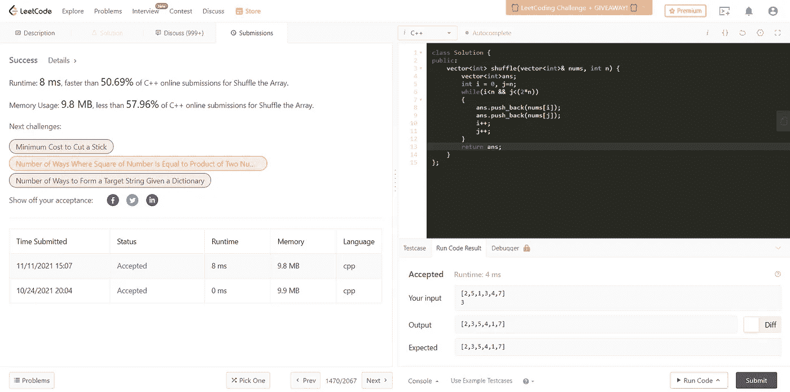

# 1470.洗牌

> 原文：<https://medium.com/nerd-for-tech/1470-shuffle-the-array-c80c60732962?source=collection_archive---------4----------------------->

(LeetCode 简单问题)

假设数组`nums`由`2n`个元素组成，形式为`[x1,x2,...,xn,y1,y2,...,yn]`。

*以* `[x1,y1,x2,y2,...,xn,yn]`的形式返回数组。

**例 1:**

```
**Input:** nums = [2,5,1,3,4,7], n = 3
**Output:** [2,3,5,4,1,7] 
**Explanation:** Since x1=2, x2=5, x3=1, y1=3, y2=4, y3=7 then the answer is [2,3,5,4,1,7].
```

**例 2:**

```
**Input:** nums = [1,2,3,4,4,3,2,1], n = 4
**Output:** [1,4,2,3,3,2,4,1]
```

**例 3:**

```
**Input:** nums = [1,1,2,2], n = 2
**Output:** [1,2,1,2]
```

**约束:**

*   `1 <= n <= 500`
*   `nums.length == 2n`
*   `1 <= nums[i] <= 10^3`

既然这个问题包含了这个问题的意思的自我解释，我相信你现在已经理解这个问题了。

现在让我们来谈谈这种方法:

# 方法:

我首先想到的是让我们采用两点法。这只是一个一次使用两个指针的基本方法。

我将使用两个指针 I 和 j；I 从起点开始，即 x1 值，j 从 y1 值开始。继续存储指向 x1 和 y1 的元素，以此类推，每次都递增指针。

代码如下所示:

```
**class Solution {
public:
    vector<int> shuffle(vector<int>& nums, int n) {
        vector<int>ans;
        int i = 0, j=n;
        while(i<n && j<(2*n))
        {
            ans.push_back(nums[i]);
            ans.push_back(nums[j]);
            i++;
            j++;
        }
        return ans; 
    }
};**
```



那么现在的**时间复杂度**会是多少呢？嗯，它是 **O(n)** 因为我仍然在遍历整个数组。**的空间复杂度也将是 O(n)** ，因为我使用了一个向量来存储给定格式的数组元素。

我希望这能让你清楚如何解决这个问题。尝试尽可能多的例子来更好地理解它。

**到那时继续编码&继续学习！！🙌💻**

既然你喜欢看我的博客，为什么不请我喝杯咖啡，支持我的工作呢！！[https://www.buymeacoffee.com/sukanyabharati](https://www.buymeacoffee.com/sukanyabharati)☕