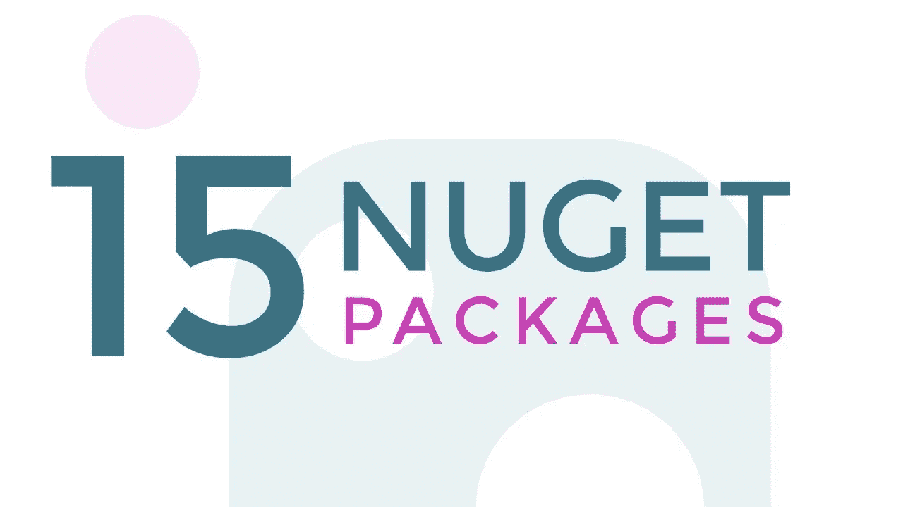

# 15 个包裹。Net 开发人员应该熟悉的？

> 原文：<https://medium.com/nerd-for-tech/15-nuget-packages-that-every-net-developer-should-be-familiar-with-24d66c0db538?source=collection_archive---------1----------------------->

**简介:**

大家好，希望大家都过得很好:)

在本文中，我们将介绍 every.Net 开发者在他们的项目中常用的 15 个 Nuget 包

1.Xunit

2.努尼特

3.最小订货量

4.不可替代

5.时髦的

6.Serilog

7.衣冠楚楚的

8.实体框架核心

9.流畅验证

10.自动映射器

11.Json.NET-纽顿软件公司

12.波莉

13.Scrutor

14.Nlog

15.基准点网

**1。Xunit**

XUnit 是一个开发人员测试框架，旨在支持测试驱动的开发，在所有领域都具有极大的灵活性。Net 框架和。也是网络核心

**2。努尼特**

NUnit 是一个测试框架，你可以在其中定义你的测试用例和断言。它可以运行所有的测试并向您显示报告，还支持 TDD(测试驱动开发)。

**3。最小起订量**

Moq 框架使得创建模仿类和接口行为的模拟对象变得容易，并且只需要您需要的功能。

**4。n 替代**

NSubstitute 是为 Arrange-Act-Assert (AAA)测试而设计的，所以您只需要安排它应该如何工作，然后在完成后断言它收到了您期望的调用。因为您有比是否需要一个 mock 或 stub 更重要的代码要写。

**5。招摇**

Swagger 是面向团队和个人的强大而易用的 API 开发工具，支持从设计和文档到测试和部署的整个 API 生命周期的开发。

**6。系列日志**

Serilog 是的诊断日志库。Net 应用程序。它很容易设置，有一个干净的 API，并运行在所有最新的。NET 平台。在检测复杂的、分布式的和异步的应用程序和系统时，Serilog 对结构化日志记录的支持大放异彩。

**7。衣冠楚楚**

Dapper 是一个 ORM(对象关系映射),在速度方面也被称为微型 ORM 之王，实际上和使用原始 ADO.Net 数据阅读器一样快

**8。实体框架核心**

实体框架核心是流行的实体框架数据访问技术的轻量级、可扩展、开源和跨平台版本。Ef Core 可以充当对象关系映射器。Net 开发人员使用。Net 对象。

**9。流畅验证**

Fluent 验证是一个用于构建强类型验证规则的. Net 库。它使用流畅的接口和 lambda 表达式来构建验证规则。它有助于清理您的域代码，使其更具内聚性，并为您提供了一个查找验证逻辑的单一位置。

10。自动制图机

Automapper 是一个简单的小库，用来解决一个看似复杂的问题——去掉将一个对象映射到另一个对象的代码。这种类型的代码写起来相当枯燥乏味，所以为什么不发明一种工具来为我们做这件事呢？

**11.Json.NET——纽顿软**

Json。NET 是一个流行的高性能 JSON 框架。网

优势和特点

*   灵活的 JSON 序列化程序。NET 对象和 JSON
*   手动读写 JSON 的 LINQ 到 JSON
*   高性能:快于。NET 的内置 JSON 序列化程序
*   编写缩进的、易读的 JSON
*   将 JSON 与 XML 相互转换

**12。波利**

Polly 是一个非常棒的开源项目。Net 基础。Polly 有许多选项，并擅长其电路断路器模式和异常处理。

**13。Scrutor**

ASP。Net Core 只包含一个简单的 DI(依赖注入)容器，它的功能很少，这就让第三方来扩展这些功能。Scrutor 是一个开源库，它为 ASP.Net 核心 DI 容器增加了汇编扫描功能。

14。NLog

Nlog 是一个灵活和免费的日志平台。NET 平台。Nlog 使得写几个目标变得容易。(数据库、文件、控制台)并动态更改日志记录配置。它支持结构化和传统的日志记录，并且易于使用。

**15。BenchmarkDotNet**

BenchmarkDotNet 帮助您将方法转化为基准，跟踪它们的性能，并共享可重复的测量实验。这不比写单元测试难。它保护您免受流行的基准错误的影响，并在您的基准设计或获得的度量有问题时警告您。

软件包管理器控制台中的安装命令—2020 版

1.安装包 xunit —版本 2.4.1

2.安装包 NUnit —版本 3.12.0

3.安装包最小起订量—版本 4.15.2

4 安装软件包 NSubstitute —版本 4.2.2

5.安装-包装 Swashbuckle。AspNetCore —版本 5.6.3

6.安装软件包系列日志—版本 2.10.1-dev-01265

7.安装包 Dapper —版本 2.0.78

8.安装包微软。EntityFrameworkCore —版本 5.0.1

9.安装包流体验证。AspNetCore —版本 9.3.0

10.安装包自动映射器。扩展. Microsoft.DependencyInjection 版本 8.1.0

11.安装软件包 Newtonsoft。Json —版本 12.0.3

12.安装包 Polly —版本 7.2.1

13.安装包检查器。AspNetCore —版本 1.0.0

14.安装包 NLog —版本 4.7.6

15.安装包 BenchmarkDotNet。核心—版本 0.10.14

希望这篇文章对你有所帮助..！

继续学习！！！！！！！