# Top +30 最佳 GNOME 扩展

> 原文：<https://medium.com/nerd-for-tech/18-best-gnome-extensions-8e7c4f947ef5?source=collection_archive---------0----------------------->

最近，我的一个朋友让我准备一台装有 Linux 的小型定制台式电脑，用来做作业，而不是玩游戏。这将是他第一次使用 Linux 操作系统(他一生都是 Windows power 用户)，我必须明智地选择帮助他平稳过渡到一个 ***更好的世界*** 。

我选择的发行版本是 [**pop-OS**](https://pop.system76.com/) ，因为这是一个来自 **System76** 的优秀作品，它检查了一个好的操作系统必须具备的所有特性，甚至是他儿子有时想玩的游戏…

每次我安装基于 gnome 的发行版时(*现在 pop-OS 使用 gnome，即使是 Cosmic* )，我都使用这个官方扩展网站上几乎相同的扩展:[https://extensions.gnome.org/](https://extensions.gnome.org/)

因此，没有进一步的原因，这些是我精心挑选的扩展，有一些简短的描述，没有任何特定的兴趣或价值的顺序*(如果我发现一些更有用的扩展，我会尝试更新这个列表)。*

# 目前，该列表包含 30 多个扩展(2023 年更新):

**1 -用户主题**
从用户目录中加载 shell 主题
网址:[https://extensions.gnome.org/extension/19/user-themes/](https://extensions.gnome.org/extension/19/user-themes/)

**2 -浮船坞**
为什么不？dock 非常有用，尤其是在用户不太习惯键盘快捷键的情况下。注意:如果你正在使用宇宙，不要使用这个扩展，因为它可能会导致奇怪的行为，它与宇宙码头是多余的。
网址:[https://extensions.gnome.org/extension/3730/floating-dock/](https://extensions.gnome.org/extension/3730/floating-dock/)

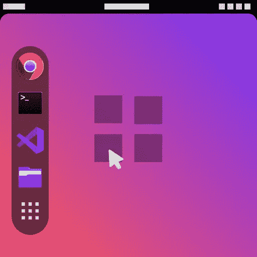

**3 -倒退**
自动背景图旋转，像 MAC OS…旋转动力！
网址:[https://extensions.gnome.org/extension/3730/floating-dock/](https://extensions.gnome.org/extension/543/backslide/)

**4 -蓝牙快速连接**
允许从 gnome 控制面板连接到配对的设备
URL:[https://extensions . gnome . org/extension/1401/Bluetooth-Quick-Connect/](https://extensions.gnome.org/extension/1401/bluetooth-quick-connect/)

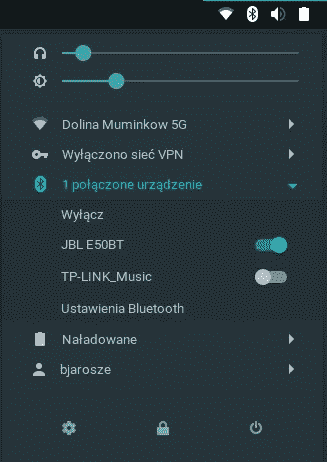

**5 -咖啡因**
我爱咖啡……有时我需要禁用屏保并自动暂停常通模式
网址:[https://extensions . gnome . org/extension/1401/bluetooth-quick-connect/](https://extensions.gnome.org/extension/517/caffeine/)

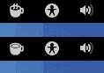

**6 -定制热角**
对于热角爱好者来说，我花了一段时间才得到它……但现在我已经迷上了。一个角将我放回桌面，另一个角将显示器置于睡眠状态，另一个角是应用程序列表，最后，最后一个角运行自定义脚本或应用程序。
爱死了！！！你可以为每个角落定制你想要的……我最喜欢的一个动作是“点击激活”带有栅栏尺寸和压力阈值参数的角落。
网址:[https://extensions . gnome . org/extension/1362/custom-hot-corners/](https://extensions.gnome.org/extension/1362/custom-hot-corners/)

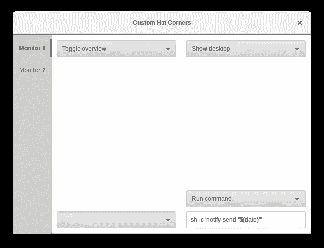

**7 - GSConnect**
我一直很欣赏苹果生态系统，尤其是 macOS 和 iPhone 的关系。现在，我们可以在您的 android 设备和 PC 之间获得类似甚至更好的体验。
有了这个扩展，我再也不需要把手机放在电脑旁边了，我可以阅读和回复通知，轻松地在设备之间传输文件，电池信息，剪贴板同步，鼠标&键盘支持，等等……新功能也在定期实施
网址:[https://extensions.gnome.org/extension/1319/gsconnect/](https://extensions.gnome.org/extension/1319/gsconnect/)

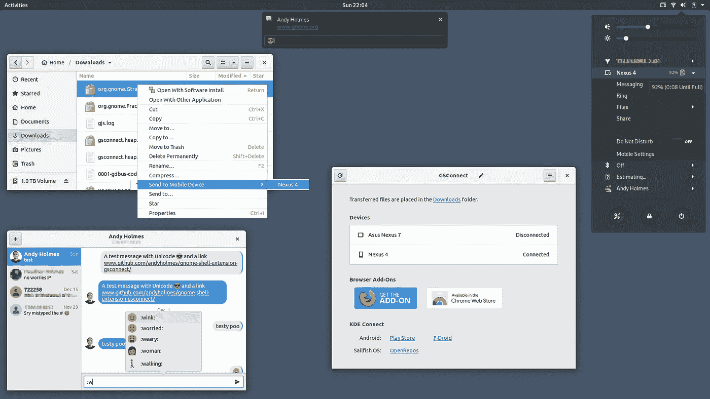

**8 - Just Perfection**
对 Gnome Shell 的更多调整，我在这里强调控制几个面板选项可见性的特性
URL:[https://extensions . Gnome . org/extension/3843/Just-Perfection/](https://extensions.gnome.org/extension/3843/just-perfection/)

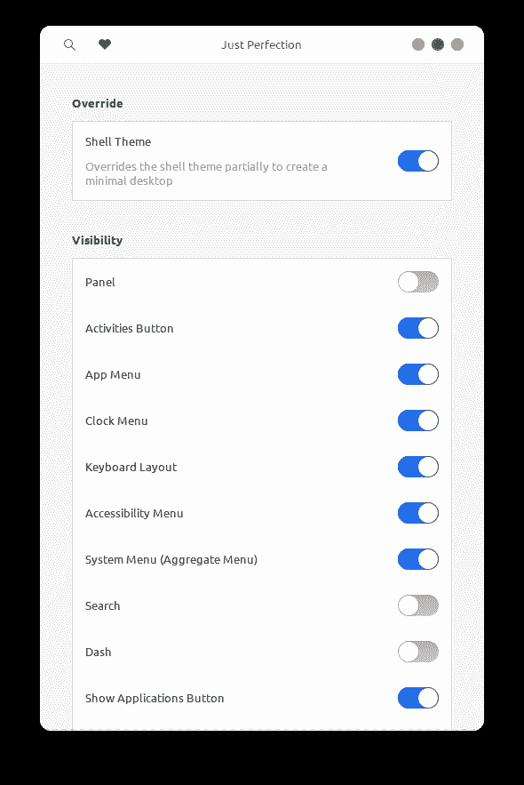

9 -多显示器附件
好的工作空间很棒……但是额外的显示器更好。如果您将多台显示器连接到您的电脑，请控制多个选项
URL:[https://extensions . gnome . org/extension/921/multi-monitors-add-on/](https://extensions.gnome.org/extension/921/multi-monitors-add-on/)

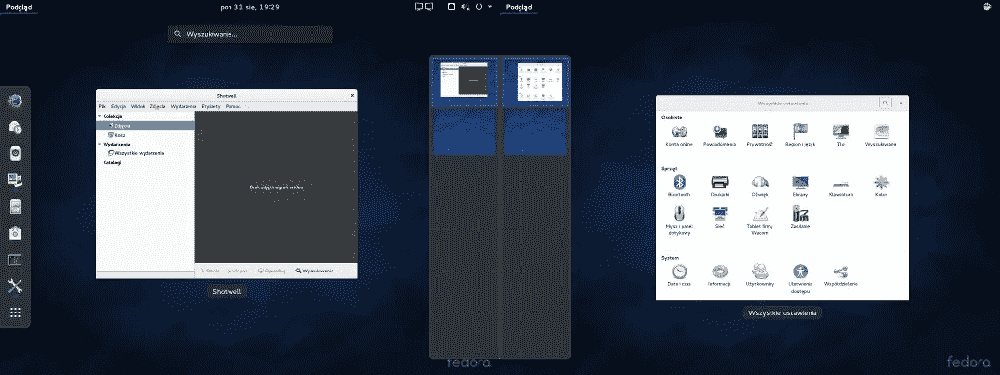

**10 - OpenWeather**
天气扩展，有很棒的天气信息和很酷的设计
网址:[https://extensions.gnome.org/extension/750/openweather/](https://extensions.gnome.org/extension/750/openweather/)

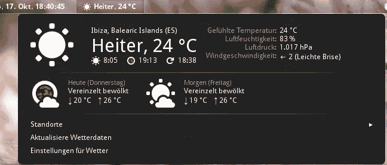

移除下拉箭头
这是个人选择，我不喜欢看到那些向下的箭头。
网址:[https://extensions . gnome . org/extension/800/remove-drop down-arrows/](https://extensions.gnome.org/extension/800/remove-dropdown-arrows/)

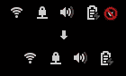

12 -服务 Systemd
令人敬畏的扩展，容易从弹出菜单切换系统服务的开/关。对我来说这是一个改变人生的东西，你可以添加任何服务，比如 Apache，Docker，MySQL 等等…我在这里偷懒？！…
URL:[https://extensions . gnome . org/extension/1034/services-systemd/](https://extensions.gnome.org/extension/1034/services-systemd/)

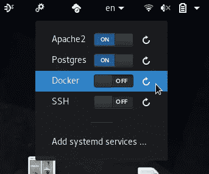

**13 -声音输入&输出设备选择器**
A 为了更好的控制你的音频设备必须具备。
网址:[https://extensions . gnome . org/extension/906/sound-output-device-chooser/](https://extensions.gnome.org/extension/906/sound-output-device-chooser/)

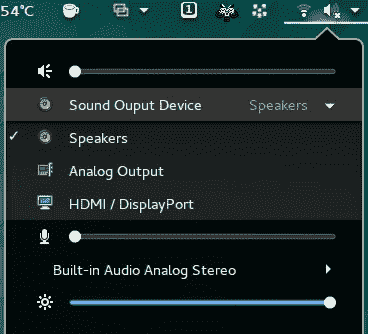

**14 -状态区水平间距**
一个像素就是一个像素，控制你的面板间距
URL:[https://extensions . gnome . org/extension/355/Status-Area-Horizontal-Spacing/](https://extensions.gnome.org/extension/355/status-area-horizontal-spacing/)

**15 系统显示器**
适合您系统的最佳显示器之一，易于使用和定制。
网址:[https://extensions.gnome.org/extension/120/system-monitor/](https://extensions.gnome.org/extension/120/system-monitor/)

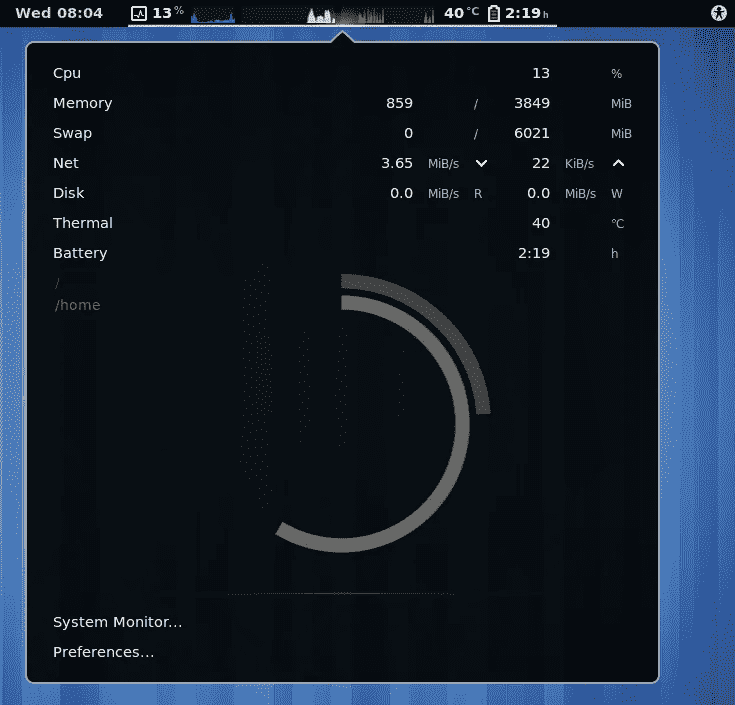

**16 -透明通知**
如果您喜欢调整通知的不透明度以获得更好看的消息
URL:[https://extensions . gnome . org/extension/1080/Transparent-Notification/](https://extensions.gnome.org/extension/1080/transparent-notification/)

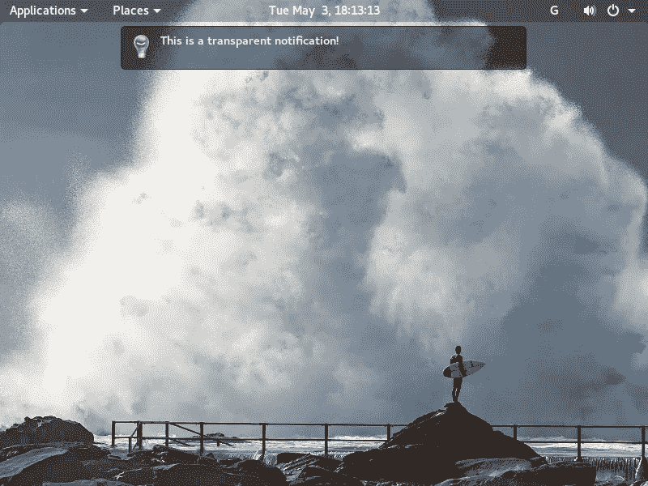

**17-window overlay Icons**
当你在 windows 概览中看到应用程序图标时，看起来很棒，很养眼
URL:[https://extensions . gnome . org/extension/1080/transparent-notification/](https://extensions.gnome.org/extension/302/windowoverlay-icons/)

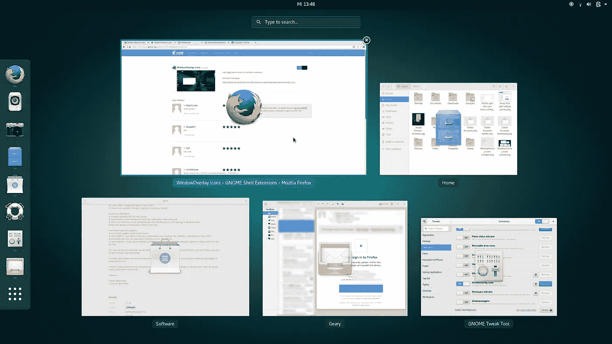

**18-KStatusNotifierItem/app indicator 支持**
为 Shell 添加 KStatusNotifierItem 支持
URL:[https://extensions . gnome . org/extension/615/app indicator-Support/](https://extensions.gnome.org/extension/615/appindicator-support/)

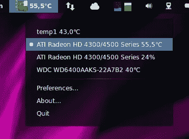

**19 -生命体征**
将系统信息添加到您的面板中，可以通过多种方式进行定制，试试看。
网址:【https://extensions.gnome.org/extension/1460/vitals/ 

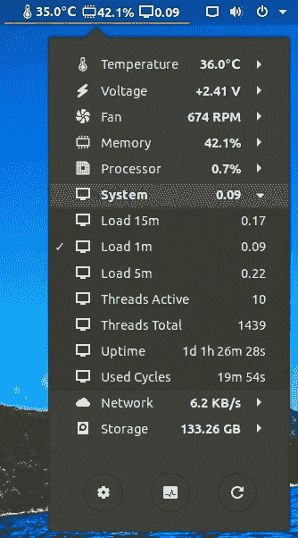

20 - Arcmenu
增加了一个应用程序菜单，非常可定制，有很多布局可供选择。一个非常方便的扩展，你甚至可以在这里看到 Windows 的布局。
网址:[https://extensions.gnome.org/extension/1460/vitals/](https://extensions.gnome.org/extension/1460/vitals/)

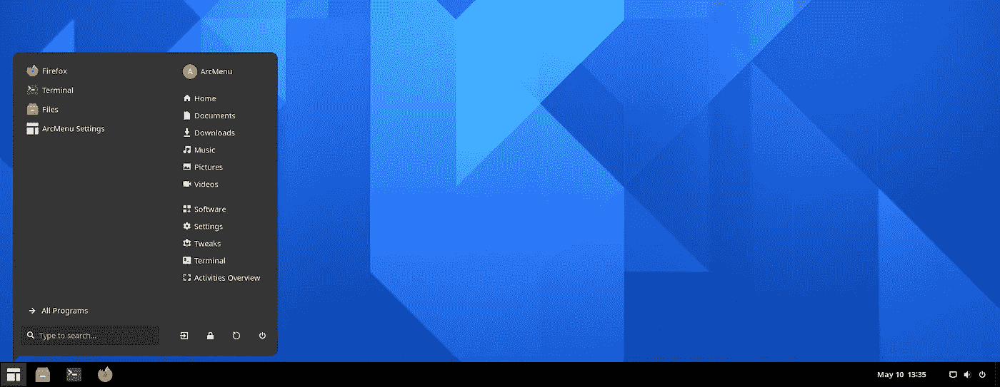

**21-模糊我的外壳**
给 GNOME 外壳的不同部分添加模糊外观，包括顶部面板、破折号和总览图。
网址:[https://extensions.gnome.org/extension/3193/blur-my-shell/](https://extensions.gnome.org/extension/3193/blur-my-shell/)

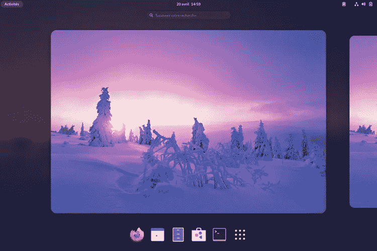

**22 -急躁**
控制 gnome-shell 动画的速度【https://extensions.gnome.org/extension/277/impatience/ URL:

**23 —剪贴板指示器**
将剪贴板指示器添加到顶部面板，并缓存剪贴板历史。
网址:[https://extensions . gnome . org/extension/779/clipboard-indicator/](https://extensions.gnome.org/extension/779/clipboard-indicator/)

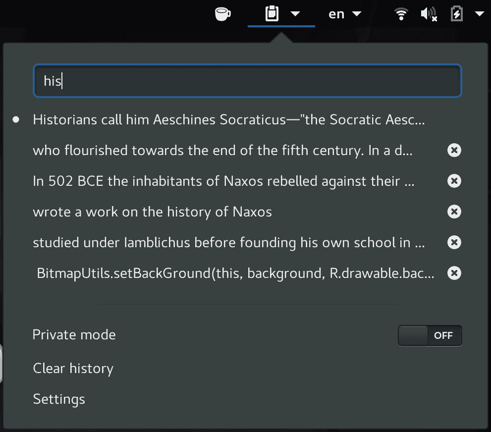

**24 — ddterm**
快速访问我们的终端，按 F12 并开始…简单
URL:[https://extensions . gnome . org/extension/1446/transparent-window-moving/](https://extensions.gnome.org/extension/3780/ddterm/)

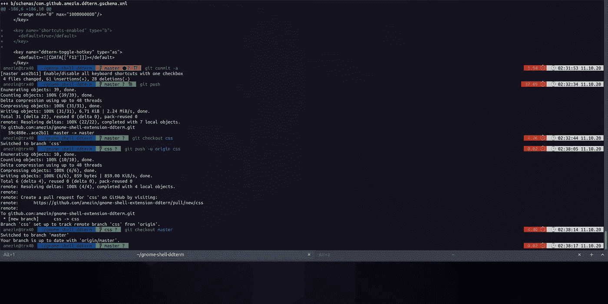

**25 — Gnome 4.x UI 的改进**
所以，现在在 Gnome 4.x 中需要一些设置来使它更有用，这个扩展给了你更多的控制。安装后不要忘记重启 *gnome-shell* 。
网址:[https://extensions . gnome . org/extension/4158/gnome-40-ui-improvements/](https://extensions.gnome.org/extension/4158/gnome-40-ui-improvements/)

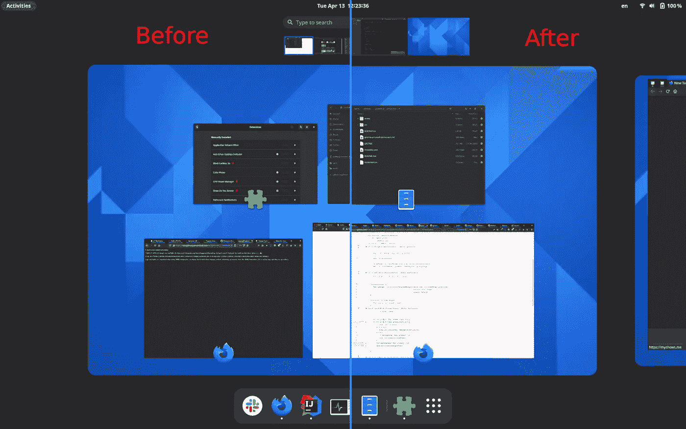

**26—位置状态指示器**
在位置、磁盘等之间快速跳转，添加一个菜单，用于在系统中快速导航位置。
网址:[https://extensions . gnome . org/extension/8/places-status-indicator/](https://extensions.gnome.org/extension/8/places-status-indicator/)

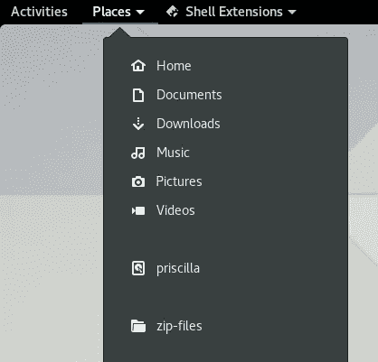

**27 —可移动驱动器菜单**
用于访问和卸载可移动设备的状态菜单。简单却有用。
网址:[https://extensions . gnome . org/extension/7/removable-drive-menu/](https://extensions.gnome.org/extension/7/removable-drive-menu/)

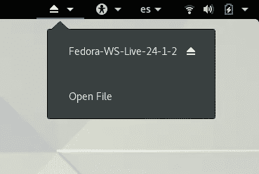

28 -透明窗口移动
看到透明窗口当移动一个窗口时，给你的桌面一个漂亮的光噱头…让 windows 用户哭泣😆
网址:[https://extensions . gnome . org/extension/1446/transparent-window-moving/](https://extensions.gnome.org/extension/1446/transparent-window-moving/)

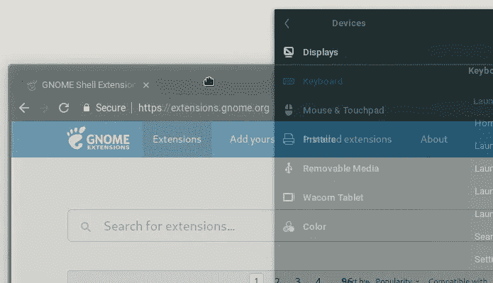

透明窗口移动

**29 —烧掉我的窗户**
好吧，这有点极端……但我喜欢(开/关)窗户的电视效果。轻量级的影响，为您的操作系统窗口，是非常可定制的。
提示:提高动画速度，以降低窗口渲染器为用户交互做好准备时的延迟。我的天啊。！！！电视效果超赞:)
网址:[https://extensions . gnome . org/extension/4679/burn-my-windows/](https://extensions.gnome.org/extension/4679/burn-my-windows/)

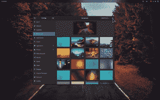

**30 — EasyScreen Cast**
所以你需要录制一个桌面视频，这个扩展简化了集成在 gnome shell 中的视频录制功能的使用，允许快速改变桌面录制的各种设置。
网址:[https://extensions.gnome.org/extension/690/easyscreencast/](https://extensions.gnome.org/extension/690/easyscreencast/)

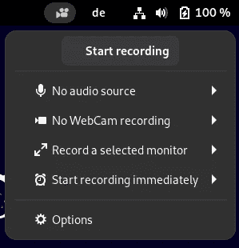

**31 —自定义热角—扩展**
自定义热角的 UI 更好，可以试试这个。
网址:[https://extensions.gnome.org/extension/690/easyscreencast/](https://extensions.gnome.org/extension/4167/custom-hot-corners-extended/)

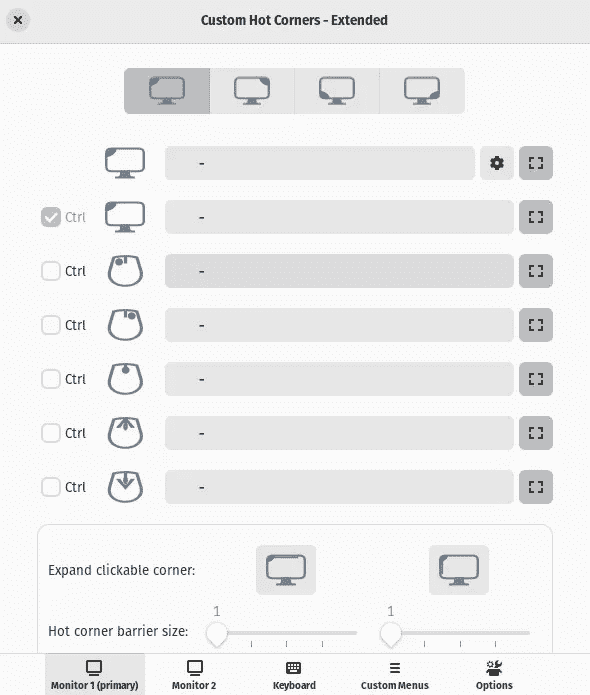

> 注意:启用所有这些扩展后，RAM 的使用将会增加。如果您运行的是较低规格的机器*，您必须了解这一点…对于最新或中等规格的机器，这种额外的 RAM 使用并不十分重要。

> **如果你使用的是较低规格的机器，我不推荐 pop-OS 或过载的扩展，有更适合你需要的轻量级解决方案。*

就这样，我希望这些扩展对你有用。