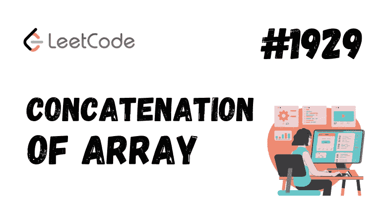

# 1929.数组串联

> 原文：<https://medium.com/nerd-for-tech/1929-concatenation-of-array-e27cc243f07?source=collection_archive---------1----------------------->

(LeetCode 易题)



给定一个长度为`n`的整数数组`nums`，你想创建一个长度为`2n`的数组`ans`，其中`ans[i] == nums[i]`和`ans[i + n] == nums[i]`代表`0 <= i < n`(**0-索引**)。

具体来说，`ans`是两个`nums`数组的**串联**。

返回*数组*中的`ans`。

**例 1:**

```
**Input:** nums = [1,2,1]
**Output:** [1,2,1,1,2,1]
**Explanation:** The array ans is formed as follows:
- ans = [nums[0],nums[1],nums[2],nums[0],nums[1],nums[2]]
- ans = [1,2,1,1,2,1]
```

**例 2:**

```
**Input:** nums = [1,3,2,1]
**Output:** [1,3,2,1,1,3,2,1]
**Explanation:** The array ans is formed as follows:
- ans = [nums[0],nums[1],nums[2],nums[3],nums[0],nums[1],nums[2],nums[3]]
- ans = [1,3,2,1,1,3,2,1]
```

**约束:**

*   `n == nums.length`
*   `1 <= n <= 1000`
*   `1 <= nums[i] <= 1000`

让我们首先理解这个问题的含义——它非常非常简单，我们只需要连接，这意味着在现有数组中按顺序加入相同的元素。例如，让我们说 nums=[1，4，5]，那么现在在连接之后它应该变成 nums=[1，4，5，1，4，5]。我希望这能让你清楚解决方案是什么样的。

所以解决这个问题有很多方法，但最简单的方法是什么呢？好吧，提示就在上面给出的问题本身中，这将是我们的蛮力方法。让我们开始吧:

# 强力方法

强力方法是什么意思？你首先想到的最简单的方法是，我们不太关注时间和空间复杂性的优化，对吗？我希望你同意我的话。

所以现在我们已经知道了:

给定一个长度为`n`的整数数组`nums`，你想要创建一个长度为`2n`的数组`ans`，其中`ans[i] == nums[i]`和`ans[i + n] == nums[i]`用于`0 <= i < n`(**0-索引**)。

步骤如下:

1.  首先，创建一个 2n 大小的数组，其中 n 是给定数组的大小。
2.  现在，在 for 循环中，继续复制第 I 个和第(i+n)个索引的值。等等，让我帮你更好地想象一下。

ans = {}我们的新数组对吗？所以现在对于 I 从 0 到(n-1)的每个值，ans 中的值将被填充为，

ans[0] = nums[0]

ans[1] = nums[1]

ans[2] = nums[2]

ans[3] = nums[0]

ans[4] = nums[1]

ans[5] = nums[2]，所以你能看到这里的重复吗，你能对吗？

但是记住我们只有从 0 到(n-1)的索引值，在这个例子中是从 0 到 2。

所以看这里 ans[0] = nums[0]，ans[1] = nums[1]，ans[2] = nums[2]这些看起来更容易，如何？因为我们可以简单的把值等同为 ans[i] = nums[i]对吗？但是剩下的呢？

可以写成 ans[i+n]吗？当 I 为 0 时，它变成 ans[n] = ans[3]，当 i = 1 时，它变成 ans[n+1] = ans[4]，而右边的值保持不变。所以我相信这让你清楚了问题背后的概念。

现在让我们把代码写下来:

```
**class Solution {
public:
    vector<int> getConcatenation(vector<int>& nums) {
        int n = nums.size();
        vector<int>ans(2*n);
        for(int i=0;i<n;i++)
        {
            ans[i] = nums[i];
            ans[i+n] = nums[i];
        }
        return ans;
    }
};**
```

现在你能告诉我这个程序的时空复杂度是多少吗？

我们不是遍历了整个原始数组吗？我们正在做，对吗？

那么我们的答案来了，我们的 ***时间复杂度变成了 O(n)*** 。

空间复杂度呢？我们使用了一个新的数组，大小是原来的两倍。所以 ***空间复杂度变成 O(2*n)*** 当我们忽略常数时可以近似为 O(n)。

我希望这能让你非常清楚第一个概念。

> PS:我已经做了预演，试着先用例子预演你的概念，然后再编码。试着花至少 20 分钟在白板或笔记本上解决这个问题。

现在让我们转到下一个概念。我们看到我们的空间复杂度可以降低/应该降低。我们能不用额外的空间解决这个问题吗？你怎么想呢?

答案就在这里，是的，我们可以。但是怎么做呢？

可以肯定的是，如果我们不想使用任何额外的空间，我们需要调整原始向量本身的元素，就像动态地改变它的大小，不是吗？

我们的方法是这样的。

# 优化方法

```
**class Solution {
public:
    vector<int> getConcatenation(vector<int>& nums) {
        int n = nums.size();
        for(int i=0;i<n;i++)
        {
            nums.push_back(nums[i]);
        }
        return nums;
    }
};**
```

我们不使用另一个向量，而是简单地将值插入同一个向量本身。在这里，我们没有使用任何额外的空间来存放任何东西。

预演很简单，试着自己做。

# 希望这篇文章能帮助你更好地理解这些概念。直到那时，继续编码&继续学习，因为一致性是关键！！！祝您好运🙌💻

既然你喜欢看我的博客，为什么不请我喝杯咖啡，支持我的工作呢！！[https://www.buymeacoffee.com/sukanyabharati](https://www.buymeacoffee.com/sukanyabharati)☕