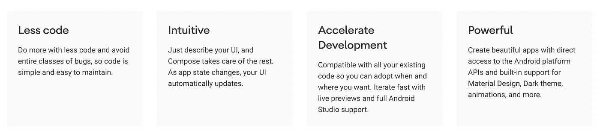

# 学习 Jetpack 撰写简介

> 原文：<https://medium.com/nerd-for-tech/1st-day-of-learning-jetpack-compose-db3865bc5ca4?source=collection_archive---------13----------------------->

图片来自谷歌资源

在 Android Dev Summit 2019 宣布 Jetpack Compose 之后，许多开发者都计划集成[🏗️](https://emojipedia.org/building-construction/) 在他们现有的应用程序中编写或者开始使用最新的 Jetpack 组件创建新的应用程序&编写。在应用程序开发中，除了顶级功能&特性，用户界面在吸引人方面也发挥着重要作用。我们已经意识到没有动画，动作等就无法生成波兰用户界面。因此，Compose 在这里扮演了一个角色，它成为一个现代的 UI 工具包，帮助应用程序开发人员在这一领域取得成功。[📱](https://emojipedia.org/mobile-phone/)

> [Android Dev 峰会上的 Compose 简介**2019**](https://www.youtube.com/watch?v=Q9MtlmmN4Q0)
> (Compose 解决什么问题，Compose 如何工作，一些设计决策背后的原因)
> [使用 Jetpack Compose 进行 Android 开发的现代方法](https://android-developers.googleblog.com/2019/10/android-dev-summit-2019-keynote.html)
> 
> 后来在 2020 年**，谷歌宣布了带有更多改进的 Compose Alpha 版本
> [宣布了 Jetpack Compose Alpha](https://android-developers.googleblog.com/2020/08/announcing-jetpack-compose-alpha.html)**

# **介绍**

****

**图片来自 Google Compose 简介**

**Jetpack Compose 是 Android 用于构建原生 UI 的现代工具包。它简化并加速了 Android 上的 UI 开发。借助更少的代码、强大的工具和直观的 Kotlin APIs，快速实现您的应用。使用它，您将不会编辑任何 XML 布局或直接创建 UI 小部件。相反，您将调用 Jetpack Compose 函数来说明您想要什么元素，Compose 编译器将完成剩下的工作。**

**组合中的关键组件是可组合函数。这些函数允许您通过描述应用程序的形状和数据依赖关系，以编程方式定义应用程序的 UI，而不是关注 UI 的构造过程。要创建一个可组合的函数，只需在函数名中添加`@Composable`注释。**

## **[撰写入门](https://developer.android.com/jetpack/compose/documentation)😀**

## **[作曲](https://developer.android.com/jetpack/compose/mental-model)的心智模式是什么？🤔**

## **如何设置 Jetpack Compose？🚧**

## **[但是如何支持与现有 app 的互操作性？](https://developer.android.com/jetpack/compose/documentation)🔗**

## **[有没有样例应用可以参考？](https://github.com/android/compose-samples) 🗂**

## **[Google 有提供作曲学习的途径吗？](https://developer.android.com/courses/pathways/compose) [🏢](https://emojipedia.org/office-building/)**

**[了解更全面的学习资源列表](/androiddevnotes/a-comprehensive-list-of-learning-resources-for-understanding-jetpack-compose-in-android-4e0f75528323) [🖥️](https://emojipedia.org/desktop-computer/)**

**您可以为基本设置克隆此存储库。此外，所有概念源代码都可以从相同的
[**https://github.com/SatyamGondhale/LearnCompose**](https://github.com/SatyamGondhale/LearnCompose)进行更新**

** [## 订阅最新内容并保持更新。

### 订阅最新内容并保持更新。通过注册，您将创建一个中型帐户，如果您还没有…

gondhalesatyam-28082.medium.com](https://gondhalesatyam-28082.medium.com/subscribe) 

以上信息足以让你有基本的了解。请浏览以上所有链接，以便更好地理解 Compose。它将明确所有的基本概念，并提供一种进一步学习的方法。
如果你认为这对你有帮助，请随意[👏🏻](https://emojipedia.org/clapping-hands-light-skin-tone/)(鼓掌)&分享。谢了。😄**