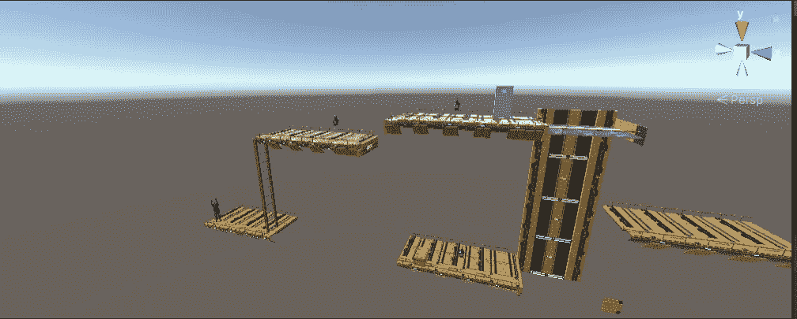
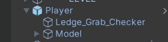
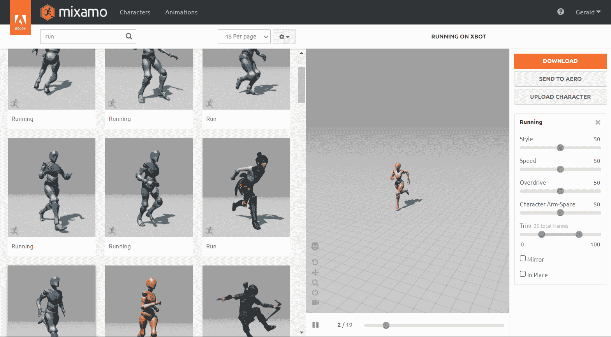
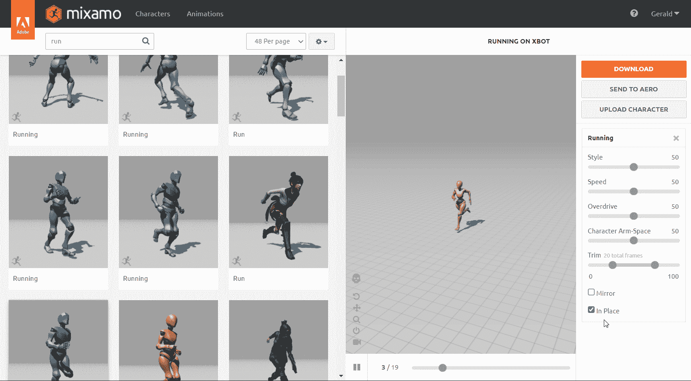
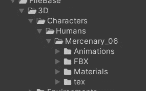
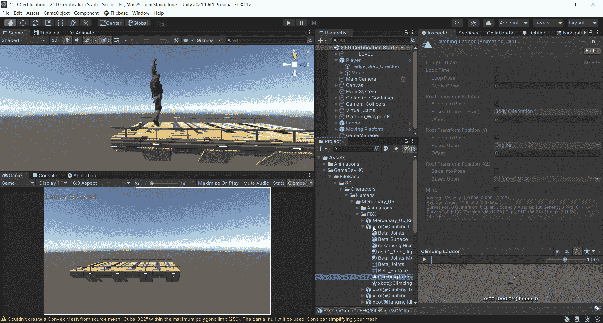
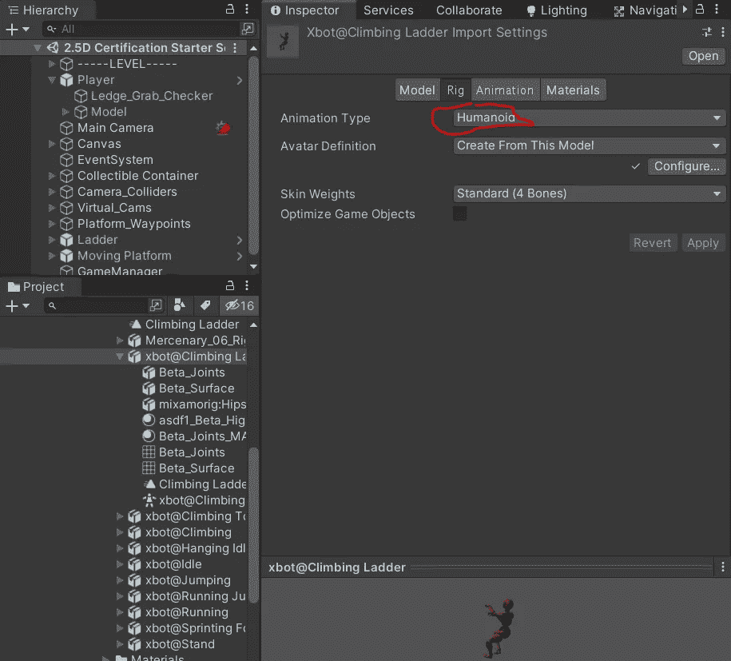
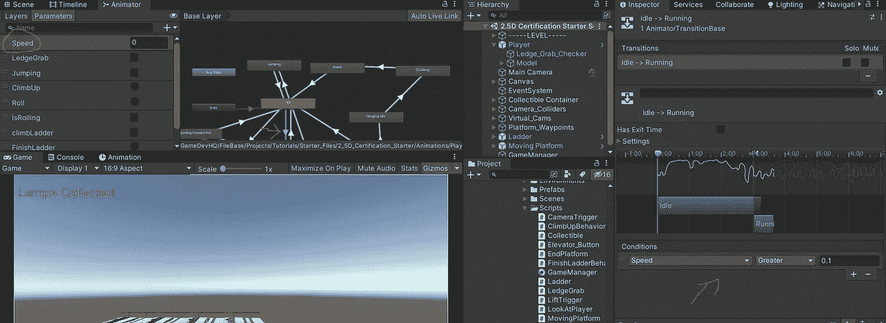
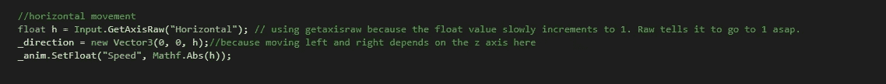
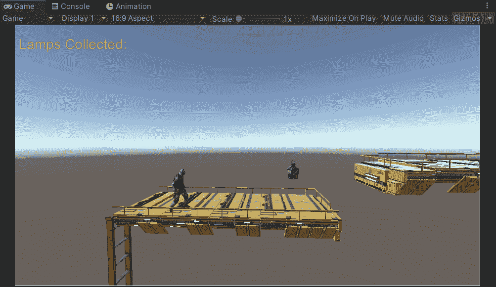

# 2.5D 游戏开发:动画:第 1 部分:空闲>>运行

> 原文：<https://medium.com/nerd-for-tech/2-5d-game-development-animations-part-1-idle-run-b9fc354be54a?source=collection_archive---------16----------------------->

在这篇文章中，我将介绍一种实现空闲动画和运行动画的方法。我已经通过 GameDevHQ.com 从 Filebase 导入了一些资产，但是你可以从任何地方找到的基本资产实现所有相同的东西。

正如你在这里看到的，我已经用一个角色模型设置了一个基本关卡。

我的玩家角色的模型被放在一个名为 Player 的游戏对象中，而实际的模型被称为“模型”。

这是出于组织目的。你会看到“壁架 _ 抓取 _ 检查”。暂且不管。我将在以后的文章中谈到这一点。

我将从 Mixamo.com 进口一些动画。这个网站非常适合制作我们的动画系统的原型，让事情看起来更好！我相信合作和团队精神，所以当你想认真对待你的游戏时，让一个真正的艺术家/动画师参与到你的项目中来是非常棒的。

我去了 mixamo.com，发现了一个闲置动画和运行动画。当我下载这些时，我选择了“原地”选项，并将其保存为“统一的 FBX”。

我选择“就位”，因为如果我不这样做，动画会让角色模型自己向前移动。像这样:

我需要它在适当的位置，这样我可以更好地控制动画。当我触发奔跑动画时，我的角色将会在地图上水平移动。基本上我想控制动画。我不想让动画控制角色。

现在我将实际进入实施阶段。

在 Unity，我有一个文件夹来存放我的 FBX 文件。

我也有一个文件夹来存放我的动画。我不得不进入 FBX 文件夹，把最近下载的 FBX 文件拖到那里，复制动画。现在我可以操纵这个动画了。

我把它拖到我的动画文件夹，并确保装备设置为人形。

现在我可以用这个动画了。到目前为止，我相信你已经知道如何创建一个动画组件，并将其添加到你的游戏对象中。我拖动了空闲动画和运行动画。我将空闲动画设置为默认状态，并在运行动画之间来回转换。

为了能够在两者之间转换，我需要设置一些条件，并通过代码设置这些条件。

从空闲到运行

我决定使用一个浮点参数。当玩家的速度大于 0.1 时，就会触发跑步动画。如果小于 0.1，则会触发空闲动画。我在我的玩家脚本中设置了这个。

我在剧本中需要做的就是说 _anim。SetFloat(“速度”，数学。ABS(h))；

这将访问 animator，将名为 Speed 的浮点参数设置为 h 的绝对值。如您所见,“h”是 Z 轴，因为在本例中 Z 轴指向右侧。

当玩家向右移动时，一切都很好，但尝试向左移动而不使用 h 的绝对值，相机实际上会翻转以跟随玩家，并确保它总是向右移动。我还使用了 GetAxisRaw，这样 h 值就不会逐渐增加到 1。它只是直接让运行动画在水平输入一被读取就触发。一旦放开按键，它也会直接变为 0。

这就是全部了！

