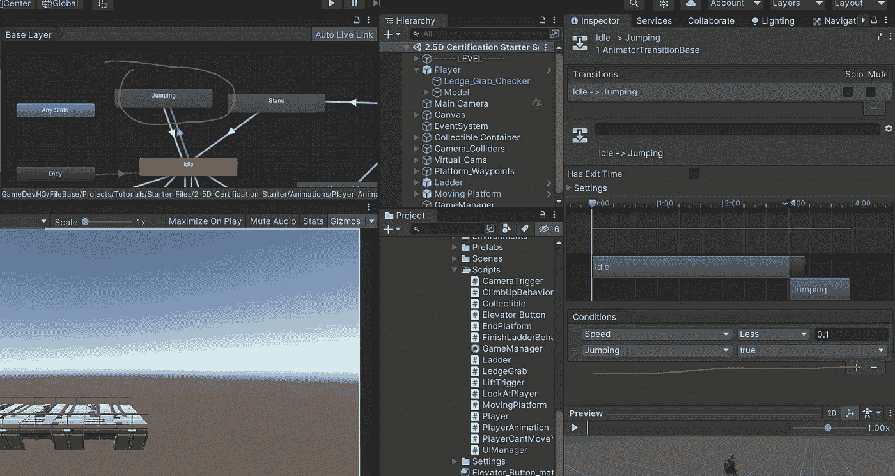
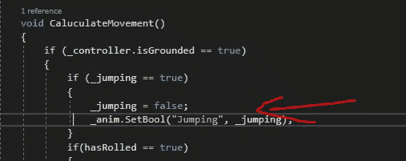
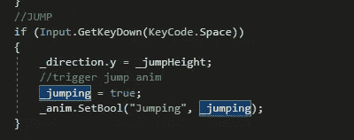
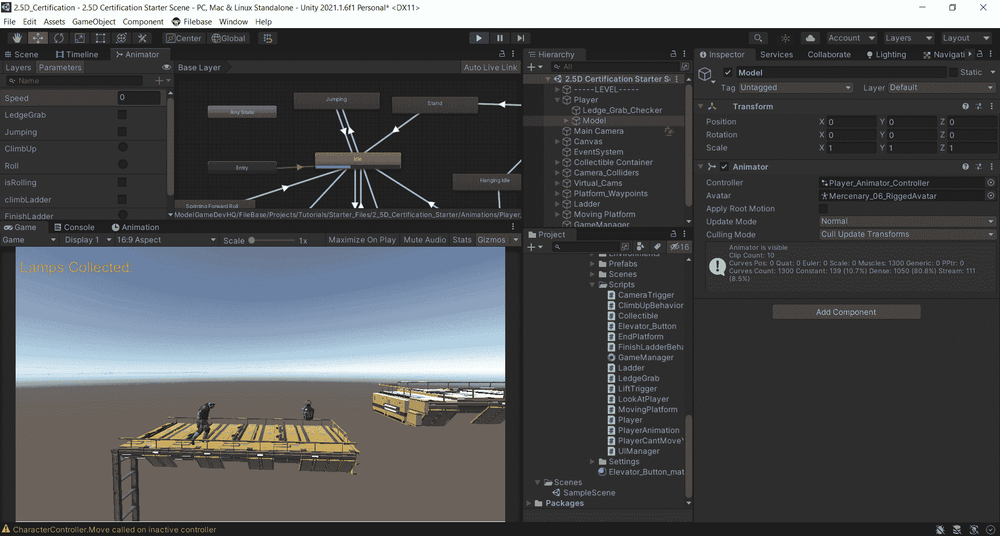
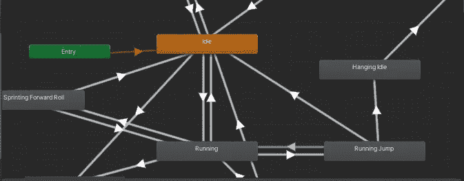
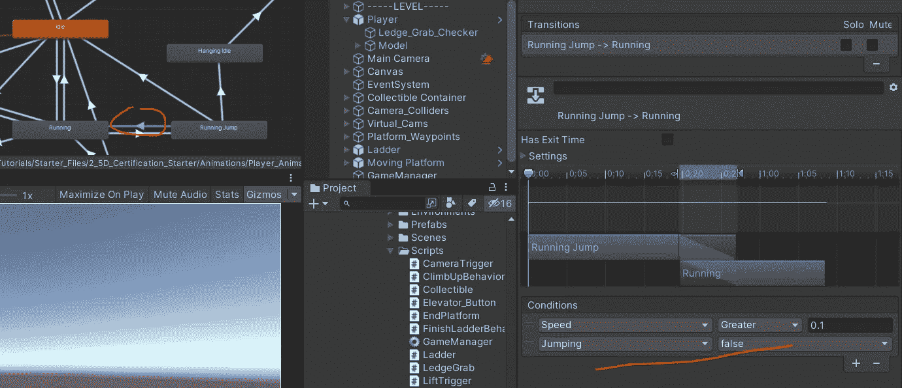
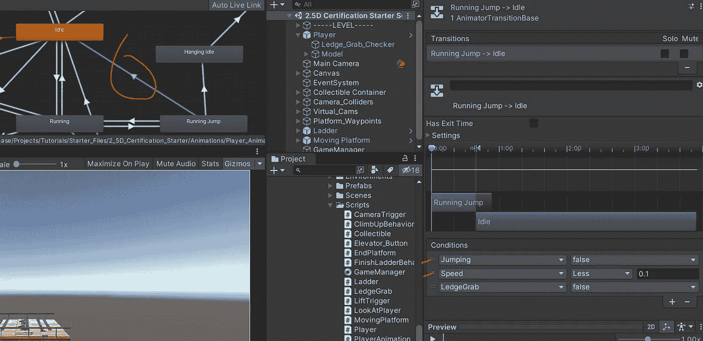
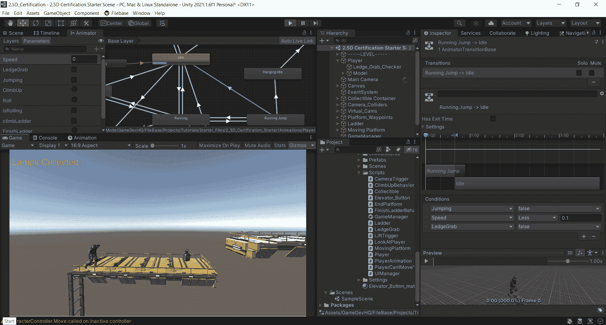

# 2.5D 游戏开发:动画:第 2 部分—跳跃

> 原文：<https://medium.com/nerd-for-tech/2-5d-game-development-animations-part-2-jumping-c36f63de7621?source=collection_archive---------13----------------------->

在这篇文章中，我将快速浏览处理跳跃动画。

我有 2 个不同的跳跃动画。一个是我站着不动的时候，一个是我跑步的时候。我也从 Mixamo.com 下载了这些。

这个超级容易实现。我在 animator 窗口中设置了一些条件:

在这里，我有我的空闲到跳跃的动画条件设置。所以如果我的速度小于 0.1，跳跃为真，转换就发生了。这是代码中发生这种情况的地方。

和

所以当我按下 space 键时，我将 bool“Jumping”设置为 what _ Jumping。超级简单。对于返回 idle 的过渡，我只是设置了一个跳转的条件为 false。

现在运行动画到跳跃。

所以要跑起来，速度需要大于 0.1。酷毙了。因此，如果“速度”大于 0.1，并且“跳跃”为真，则会播放略有不同的动画。

这里有点不同的是，我希望能够从跑步跳跃到空闲或再次跑步。什么条件允许这种差异？速度！

因此，如果我在我的跑步跳跃动画中，速度大于 0.1，那么它会回到跑步状态，但如果小于 0.1，它会回到空闲状态。

跑步跳跃到跑步

跑步跳到怠速。

如你所见，这里有一些抓取逻辑。我将在下一篇文章中讨论这个问题。现在，这里是运行中的跑步到跑步跳跃动画。

