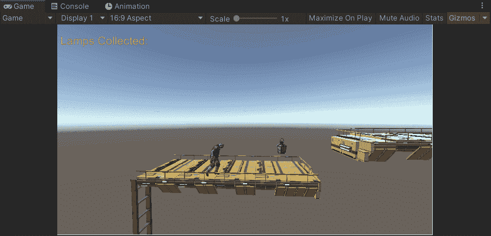
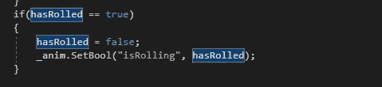
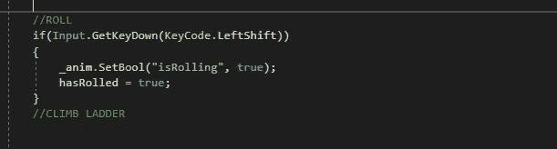
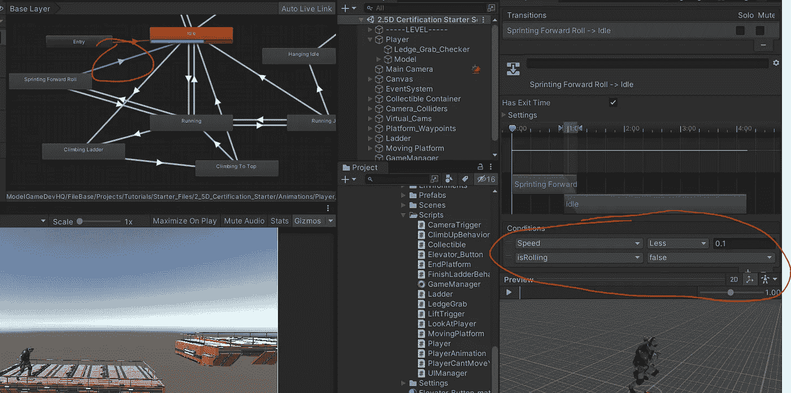
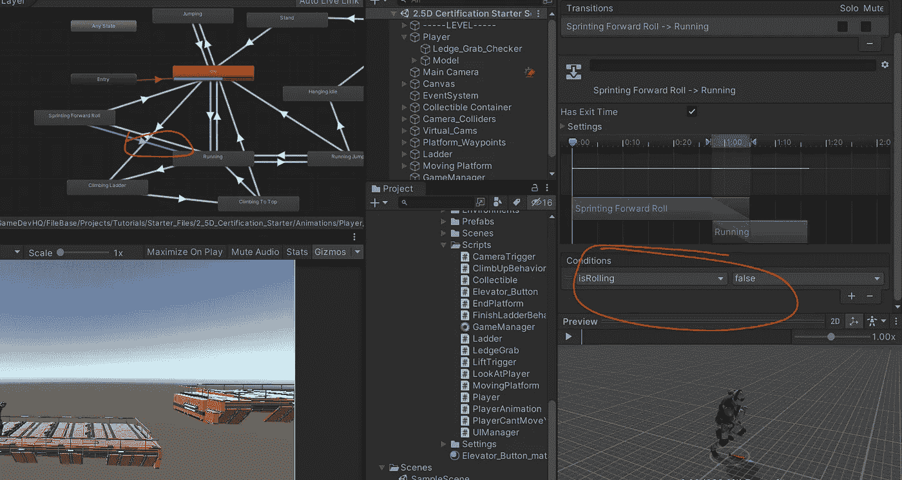

# 2.5D 游戏开发:动画:第 4 部分—滚动

> 原文：<https://medium.com/nerd-for-tech/2-5d-game-development-animations-part-4-rolling-dde445b27074?source=collection_archive---------12----------------------->

在本文中，我将回顾我设置前滚机制的方法。

我使用了一个叫做 isRolling 的 bool 类型的条件。为 true 时，会发生从奔跑到翻滚的转换。当它为假时，转换返回到运行。这是非常直接的，所以这篇文章不会很长。

该 if 语句将 hasRolled bool 从 true 更改为 false，并相应地设置动画 bool 条件。

这只是将 bool 设置为 true，并在按下 Left Shift 时滚动到 true。

我希望能够根据我的速度回到空闲或跑步状态。所以！

当速度小于 0.1 且 isRolling 为假时，返回怠速

如果我想回到正在运行的动画，我需要做的就是将从滚动到运行状态的转换从 true 设置为 false。因为我的速度决定了动画的运行。

这就是全部，真的！稍后，我将添加一些对象滚动，这将提供自己的一套独特的问题。例如:角色控制器将仍然是它的原始高度，这将不允许玩家实际滚到物体下面。有几种方法可以解决这个问题，我将在以后的时间里深入探讨这些方法！:)