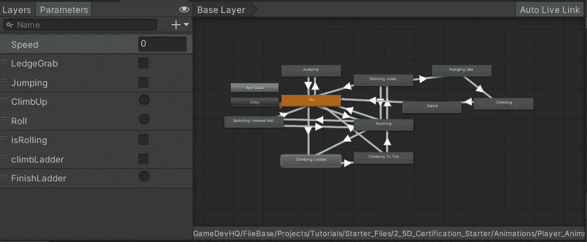
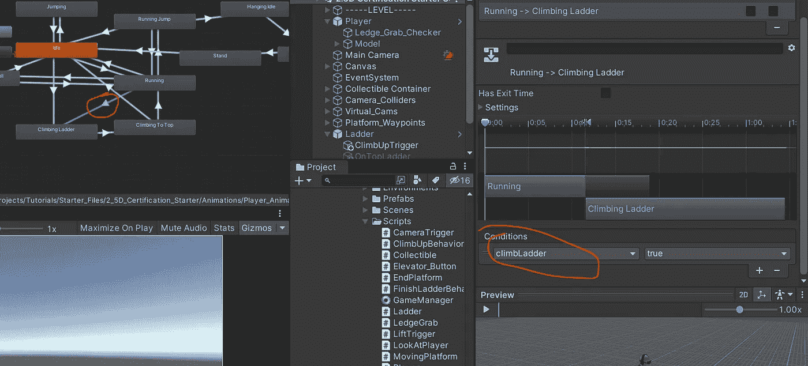
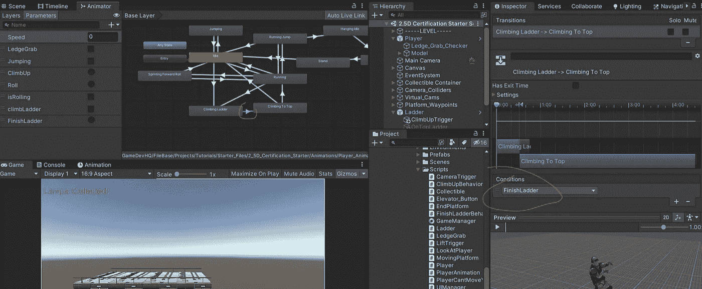
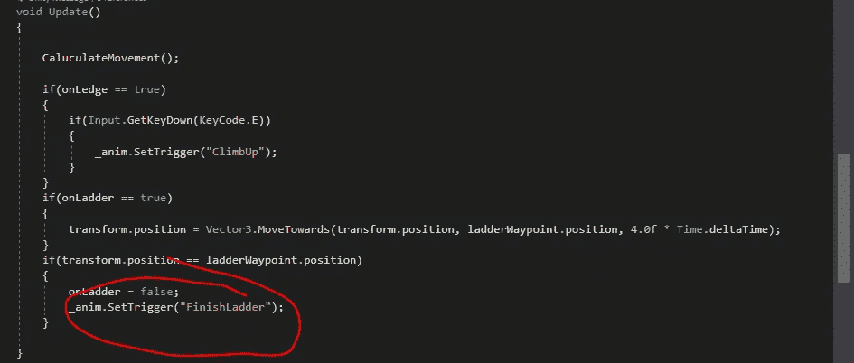
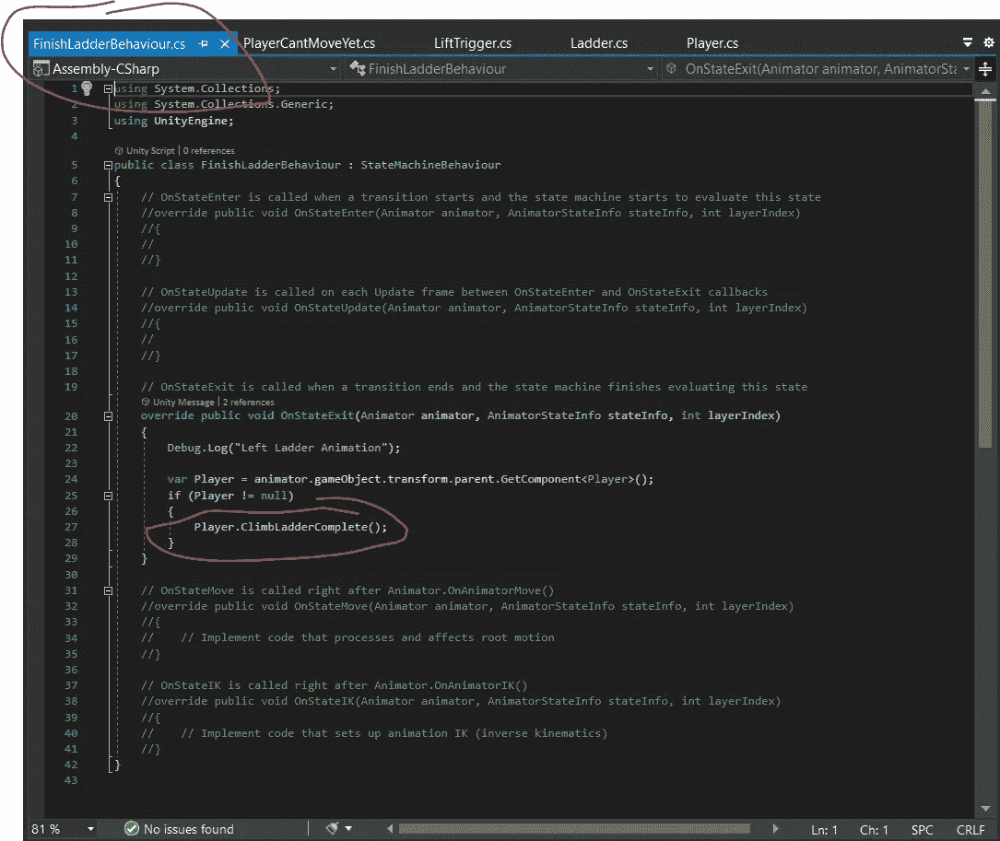
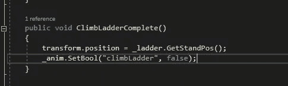
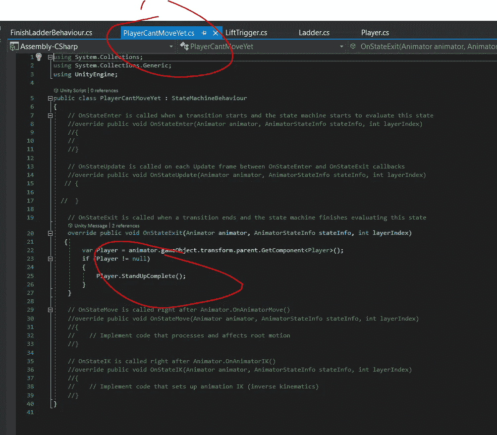

# 2.5D 游戏开发:动画:第 5 部分——爬梯

> 原文：<https://medium.com/nerd-for-tech/2-5d-game-development-animations-part-6-ladder-climb-87d3a6c733d0?source=collection_archive---------12----------------------->

在这篇文章中，我将回顾我如何设置一个简单的爬梯机制。

我发现实现这一点的最简单的方法是在梯子附近设置一个碰撞器来启动攀爬动画。我用了 Vector3。MoveTowards()从梯子底部移动到我在梯子顶部设置的航路点。一旦到了那里，我就触发动画，完成梯子的攀爬，然后过渡到站立，这样我就可以再次自由移动了。

这是一步一步来的。

首先，我找到了一个爬梯子的动画，并把它设置在 Unity 中，就像我的其他动画一样。

然后，我设置了 Animator 控制器窗口，其中包含所需的节点及其过渡。

这看起来一团糟，老实说，的确如此！有几种方法可以处理 animator 控制器窗口，这可能不是最好的方法，但我想强调通过代码处理动画状态，以及使用这种方法可以实现什么。

所以我们有一个攀登梯子动画和一个攀登到顶端动画用于这个实现。正如你在这里看到的，我有跑步动画过渡到爬梯动画。我刚刚用一个名为“climbLadder”的 bool 参数创建了一个条件，并将其设置为 true，转换就发生了。

这就导致了爬到顶端的动画，基本上就是一个梯子的拆卸。这种转变的方式是当玩家到达位于梯子顶端的一个路点时，通过代码设置一个“结束梯子”触发器。

我制作了两个独立的行为脚本来处理退出爬到顶端动画退出状态。其中一个重新激活角色控制器，另一个设置站立位置，以便当角色控制器被重新激活时，它移动到该位置。

行为脚本 1

这要求:

它将 transform.position 设置为预定的 GetStandPosition。就像抓壁架一样。

行为脚本 2

这将调用播放器中的方法，将控制器设置回活动状态。就像抓壁架一样。

为了回到运行或空闲状态，需要以速度为条件进行转换。如果速度大于 0 >运行。如果速度小于 0.1 >怠速。最终结果:

您需要计算 X、Y 和 Z 轴的站立姿势变换位置，并确保在检查器中指定该位置。