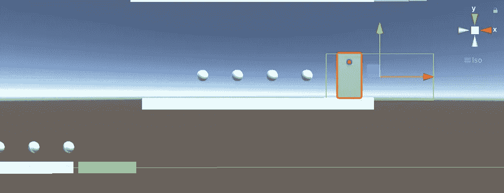
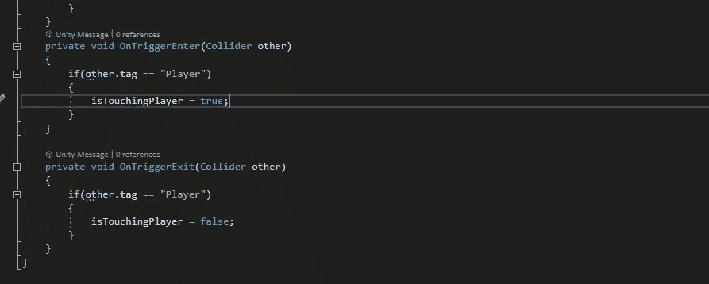
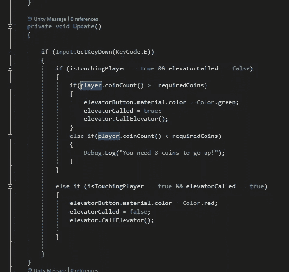
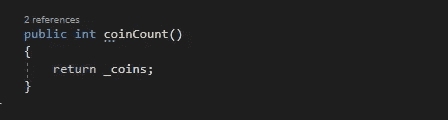
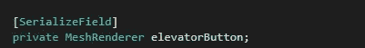
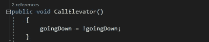
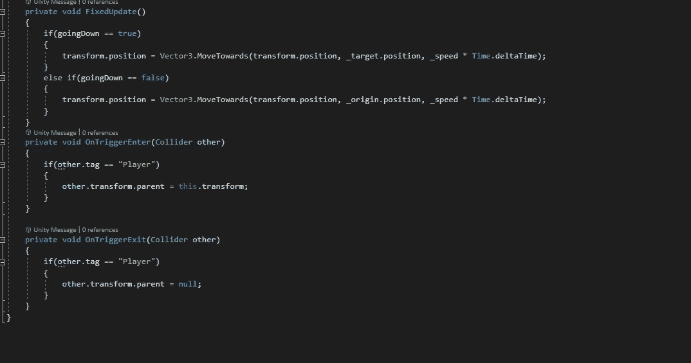
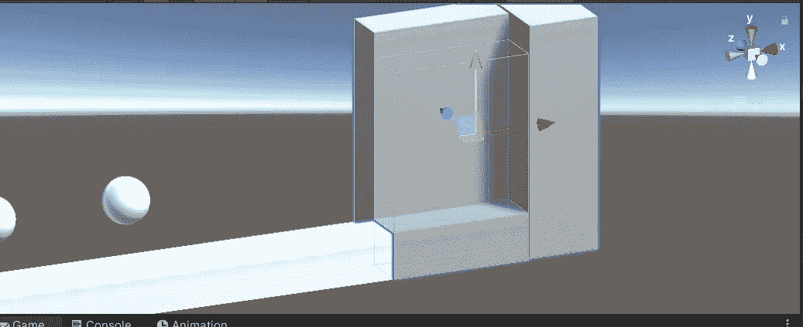
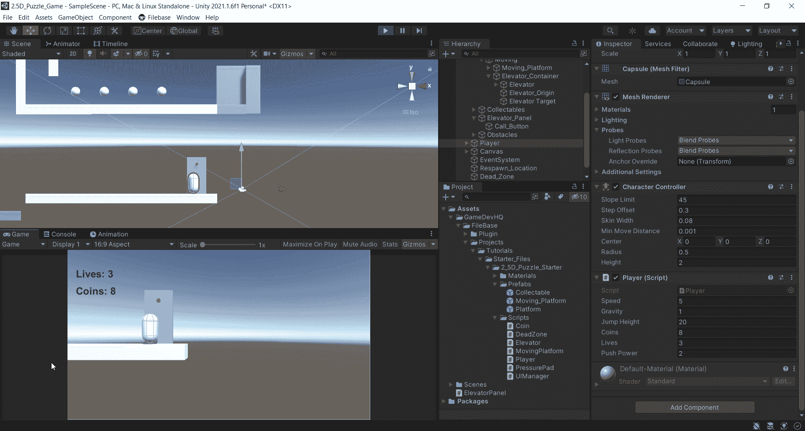

# 2.5D 游戏开发:谜题:第 1 部分—电梯系统

> 原文：<https://medium.com/nerd-for-tech/2-5d-game-development-puzzles-part-1-elevator-system-715d768ec65e?source=collection_archive---------22----------------------->

在接下来的几篇文章中，我将介绍一些不同的拼图元素，以及我是如何在 2.5D 环境中处理它们的。这将涵盖像电梯系统，跳墙，推动物体到开关。

# **电梯系统:**

我在这里设置了一个简单的场景。一旦我走上移动平台，就有一个亮着红灯的盒子。我希望能够按下“E”键，并呼叫电梯到我所在的楼层。

“电梯面板”上有这个触发碰撞器。所以你可能已经知道，我们需要检测与它的碰撞，然后检查 E 是否被按下。很多人会说使用 OnTriggerStay()是解决这个问题的方法。我发现了一种不同的方法，我个人认为效果更好。这个方法利用了布尔函数！

OnTriggerEnter 和 OnTriggerExit 都将名为`isTouchingPlayer`的布尔值翻转为开和关。所以如果 isTouchingPlayer 为真，E 被按下电梯向下移动。当玩家退出触发碰撞器并按下 E 键时，什么也没发生。与 OnTriggerStay 的功能相同，但我只是喜欢对事情有更多的控制，所以这种方法是我的最爱。

在更新函数中，我们有一点要解开。有一种叫做电梯的书。电梯呼叫自动为假。所以如果它为假，而 isTouchingPlayer 为真，那么我们继续下一组条件。在播放器脚本中，我设置了一个方法来处理硬币计数。

这只是返回硬币。这是一个 int 变量类型。我在电梯脚本中还有一个 int 类型的变量，名为 requiredCoins。因此，如果 coinCount()返回一个大于或等于 requiredCoins 的数字，电梯将会下降。我设置 requiredCoins = 8。你可以按照你认为合适的方式来设置。

接下来，我将获取 elevatorButton 游戏对象的 MeshRenderer，以便在按下 E 键时更改材质颜色。elevatorCalled 设置为 true，然后是 elevator。CallElevator()是从电梯脚本中调用的。

在这里，我所做的只是将 goingDown(a bool) =设为相反的值。这样，如果电梯在上面，我按 E，它就下来，如果我在上面，我按 E，它就上升。这与上一篇文章中提到的移动平台的设置几乎相同。

那么为什么你的角色会在电梯上升的时候掉下去呢？为什么这么紧张？我们一定要在一个固定的更新时间内处理电梯运动()。这还不是全部。我们想让玩家游戏对象成为电梯游戏对象的子对象。怎么会？

我在电梯里设置了另一个触发碰撞器。当玩家与它碰撞时，由于电梯脚本中的 OnTriggerEnter 和 Exit，它变成了电梯的子对象。

现在所有的都已经设置好了，最终的结果应该是这样的。

按 E，按钮变绿，电梯下降。进入电梯碰撞器，玩家成为电梯的孩子。按 E 键，电梯上升。退出碰撞器，现在玩家不再是电梯的孩子了。漂亮！在下一篇文章中，我将介绍如何设置跳墙:)