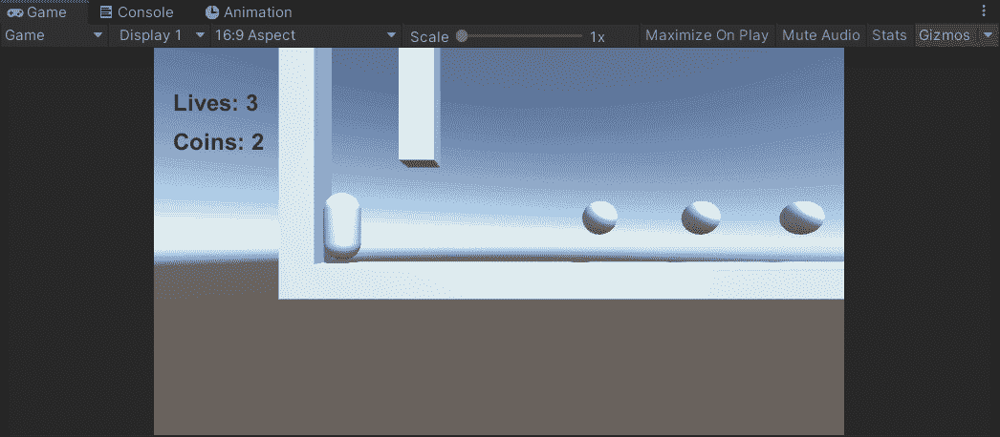
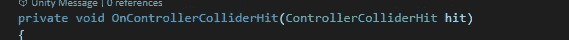
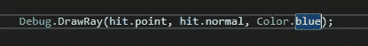
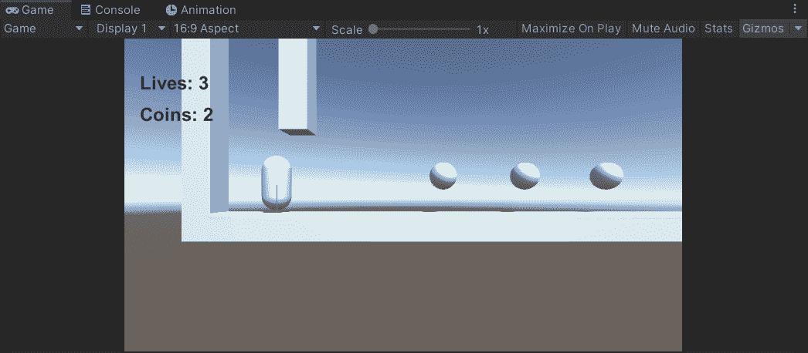
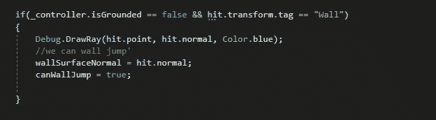
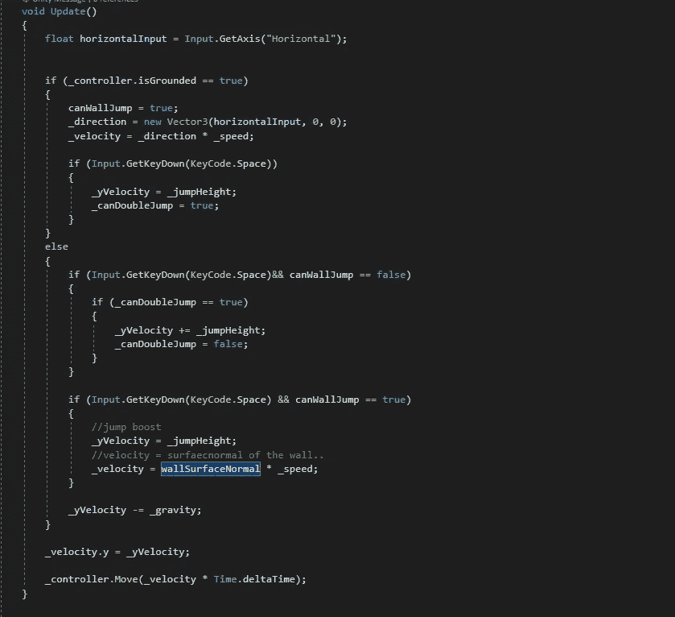
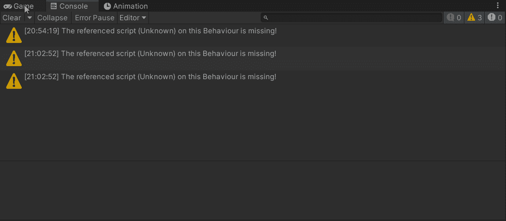

# 2.5D 游戏开发:谜题:第 2 部分—跳墙

> 原文：<https://medium.com/nerd-for-tech/2-5d-game-development-puzzles-part-2-wall-jumping-9417b2e535c0?source=collection_archive---------18----------------------->

正如我所承诺的，我将在 2.5D 的环境中翻墙。让我们开始吧。

为了做到这一点，我需要知道两件事。我碰壁了吗？我需要被反射到对面的墙上。

在上面的剪辑中，您可以看到一条小蓝线横跨胶囊游戏对象的宽度。这条蓝线叫做表面法线。计算的方式是通过一个方法。

OnContollerColliderHit 是一个每当角色控制器碰到任何东西时都会自动调用的方法。所以我们在这个方法里面能做的就是说:`Debug.DrawRay(hit.point, hit.normal)`。这个方法获取命中的原点，然后在垂直于命中点的方向(hit.normal)发送光线

所以现在每当控制器接触到任何物体，表面法线都会被计算。

我在玩家脚本中计算移动的方式阻止了我在空中跳跃和向任何方向移动。唯一一次我想能够修改我的方向是当角色控制器是接地的。这样，当我跳起来撞到墙上时，我可以按下空间，被推向另一个方向。

在前面提到的方法中，我添加了几行代码。我还将场景中构成墙壁的物体标记为“墙”。因此，当控制器没有接地，并击中一个标记为“墙”的对象时，会发生以下代码。这仅仅是计算墙面法线和将布尔值从假转换为真。

在我的更新()中，我在计算运动。在 else 部分中，我处理了墙跳功能。如果我们不能跳墙，一切都很正常。如果我们能跳墙，我就把速度设为墙面正常速度。速度就是方向*速度。我们的方向是从击中开始计算的。正常！多整洁啊！？

最终结果:

