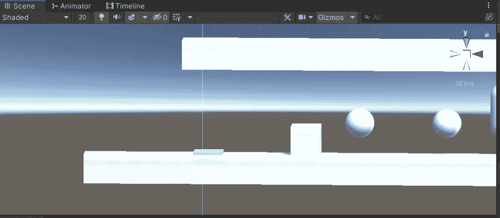
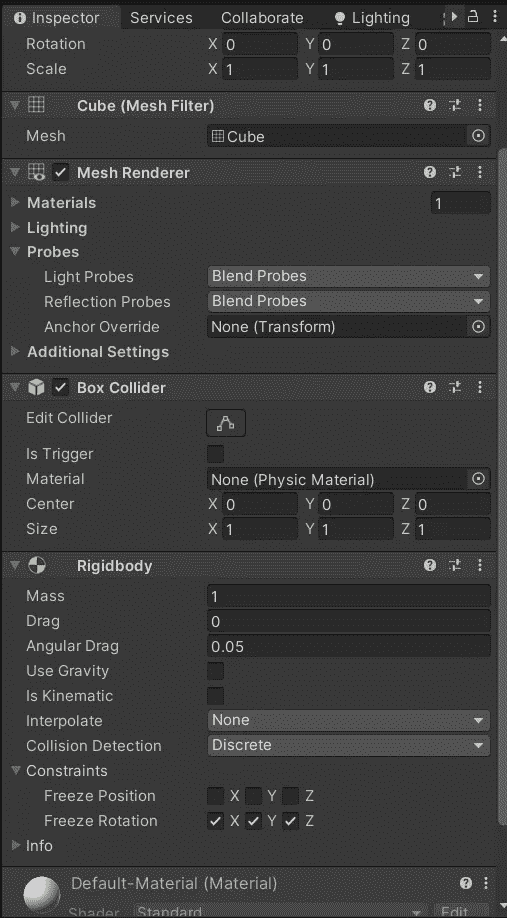
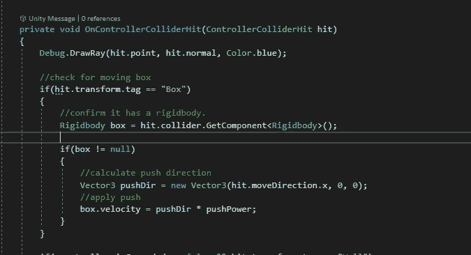
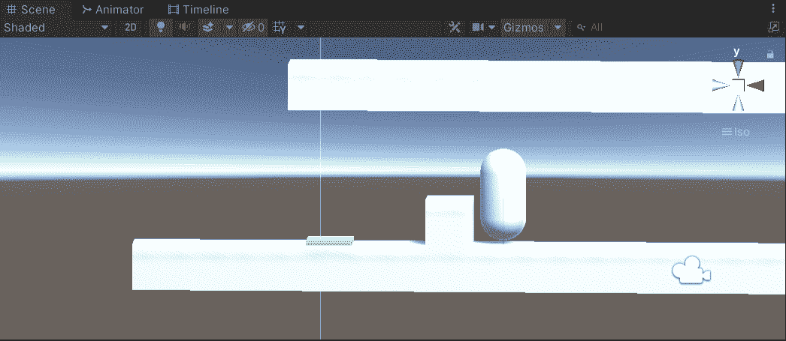
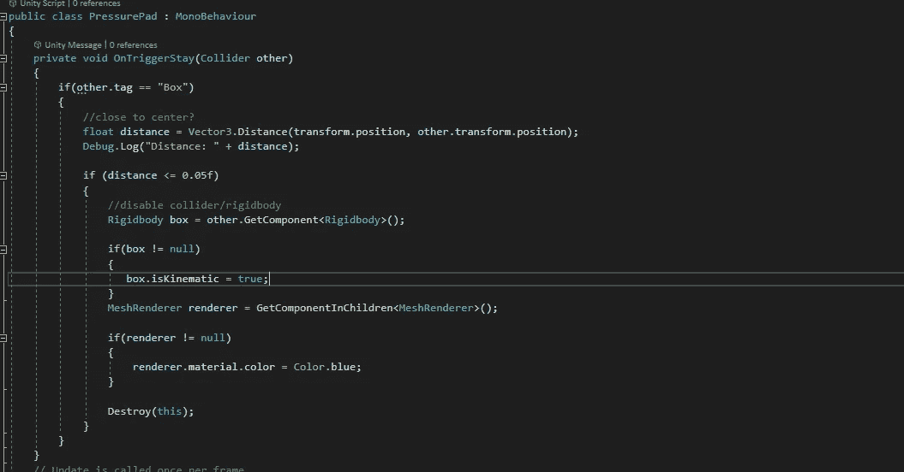
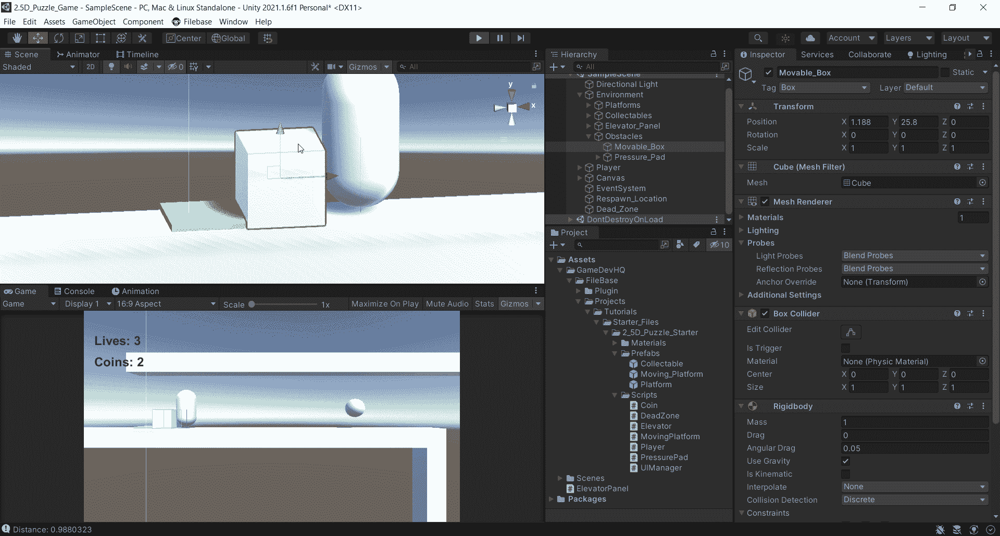
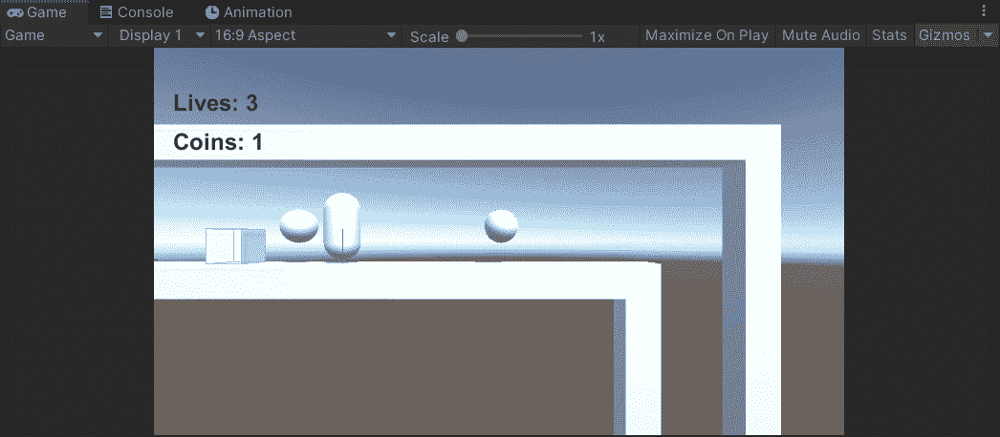

# 2.5D 游戏开发:谜题:第 3 部分—推动物体

> 原文：<https://medium.com/nerd-for-tech/2-5d-game-development-puzzles-part-3-pushing-objects-8e49b03068f7?source=collection_archive---------19----------------------->

在跳墙成功到达关卡顶端后，有一个箱子需要被推到稍微凸起的平台上。

我的目标是能够在碰撞时推动这个盒子，在特定的点上，平台会变成蓝色。

为了与这个盒子碰撞，它需要一个碰撞器和一个刚体组件。我在这些文章中只讨论过触发碰撞器，所以这次会有一点不同。我没有设置触发器为真！

箱式组件

我现在需要确保玩家能够检测到盒子。这是剧本。

我又在用 OnControllerColliderHit()了。为了检查控制器点击了什么，我们需要使用 hit.transform.tag。如果框不为空，我计算推动方向。这是一个新的 Vector3，它在 x 轴上接收点击信息，在 y 和 z 轴上什么也不接收。pushPower 是一个全局 float 变量，在这个脚本的顶部初始化。我给了它一个[SerializedField]属性，以便能够在检查器中输入值。

现在玩家可以碰撞和推动箱子。

所以现在平台。我希望盒子一旦覆盖了平台的特定部分，就停止被推动。如果我简单地使用一个触发碰撞器，一旦碰撞发生，设置盒子在刚体上运动，盒子将进入碰撞器并立即停止。我需要计算盒子的距离和平台中间的距离。

我正在使用 OnTriggerStay()，这样我就可以不断地更新距离。这基本上是说，如果 other.tag 是盒子，distance 是一个新的向量，它的距离是从平台到 other.transform.position 的变换计算的。我用 Debug.Log 打印出距离。

为了测试盒子需要在平台上覆盖多少，我进入播放模式，实际上强制盒子和平台之间的碰撞，因为我正在打印距离，它会在左下角不断更新。

当距离大约为 0.05f 时，我将盒子的刚体设为运动学。现在，它不会移动时，与碰撞。因为 MeshRenderer 实际上是平台的子对象，所以我必须获取 ComponentInChildren。当距离为 0.05f 时，它会改变颜色。

你可以想象这对几个游戏开发任务有多有用。当距离为 0.05f 时，您可能会有一个超级棒的动画发生。您也可以通过说 if(distance > *insertnumberhere*)在相反的方向计算并触发事情发生。可能性是无限的。

在下一组文章中，我将导入一些模型和关卡资源到一个新的场景中。他们将涵盖动画触发的不同方面和实现整洁的机制，如壁架抓取和梯子！敬请期待！