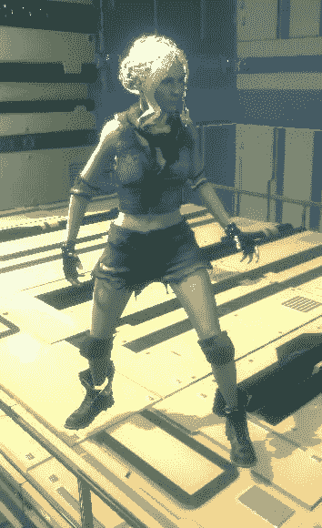
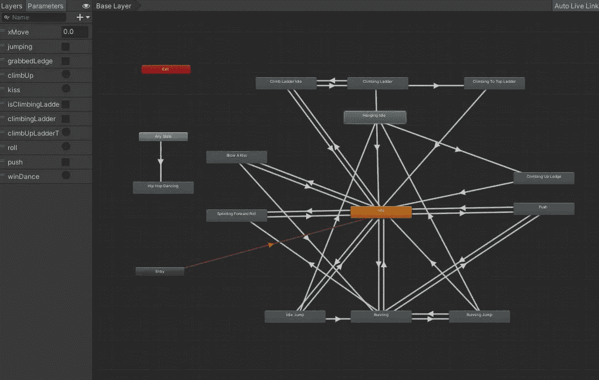
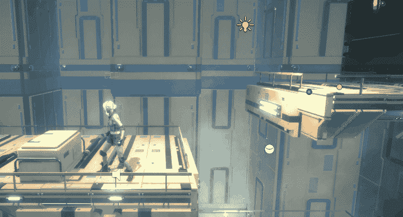
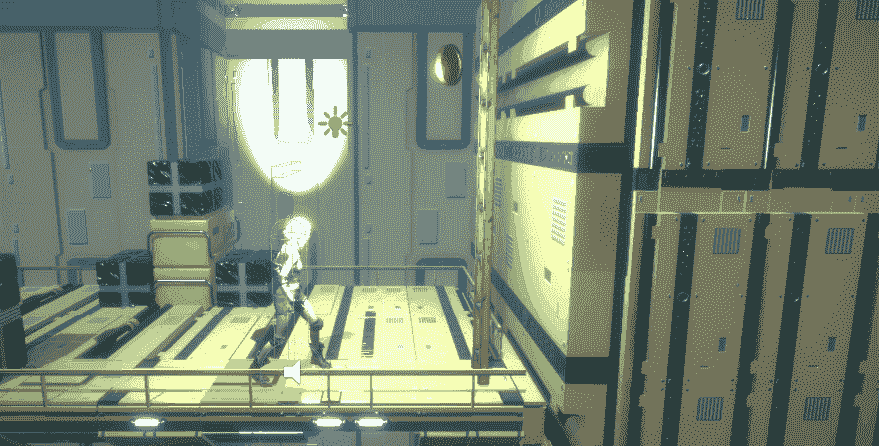

# 2.5D 训练进度报告:收尾和时间追踪。一致

> 原文：<https://medium.com/nerd-for-tech/2-5d-training-progression-report-finishing-up-time-trail-unity-e054c364b2a2?source=collection_archive---------18----------------------->

我终于完成了 GameDevHQ 的 2.5D 训练计划。(你可以在这里阅读[之前的进展报告)。以下是最终实现的功能。](https://novusxdev.medium.com/2-5d-training-progression-report-moving-to-urp-and-using-new-assets-unity-479f35ca8212)

> T2 图层动画

我的可玩角色是一个叫 Lea 的女性。角色模型是从 GameDevHQ 文件库中下载的。

至于动画，我用了 adobe 从 www.mixamo.com 的免费动画。他们有很多免费的动画和几乎每一个你需要的动作。

这是我为玩家设计的动画师最终的样子。从跑，到跳，到抓窗台，到爬梯子，甚至飞吻和跳舞。

> 抓壁架

在做这个功能之前，我一直认为这是一个非常简单的壮举，但事实并非如此。我们实现的系统是模块化的，但还没有模块化到你可以抓住游戏中每个壁架的程度。它非常适合平台玩家，在那里你可以定义抓哪个平台。

我会写一篇详细的文章来说明这是怎么做到的，但是基本上在玩家和被抓住的壁架上都有触发碰撞器。这样做的目的是让玩家可以抓取闲置动画中的壁架；之后，玩家开始攀爬，并且他的位置被设置到壁架中的预定位置。

## 梯子向上爬

它遵循与壁架攀爬机械相同的想法。玩家检测到一个梯子，开始攀爬，一旦他们靠近壁架，角色会自动爬到梯子顶部的预定位置。

## 时间轨迹水平

最后，我用所有学到的知识做了一个原型。我创建了一个时间追踪关卡。我添加了一个计时器，要收集的硬币，以最佳运行形式的高分，主菜单屏幕，当然还有音频。

你的目标是收集所有的硬币，找到密室，并在时间结束前到达关卡的终点。

你可以试试 webGL 版本的原型[这里(Lea 的冒险)](https://simmer.io/@NovusXDev/adventures-of-lea)上 smelle . io，好好享受吧。