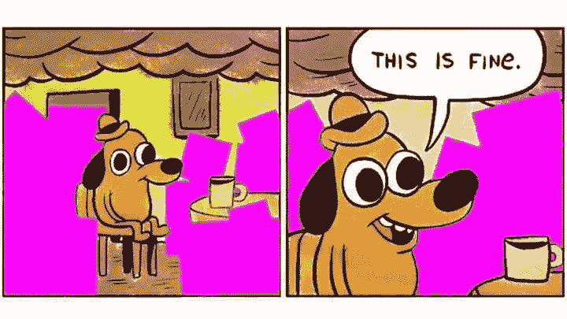
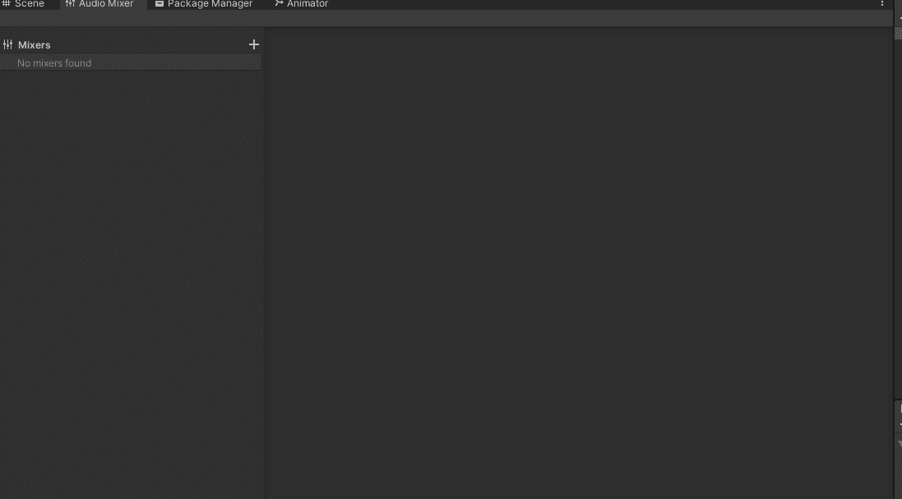
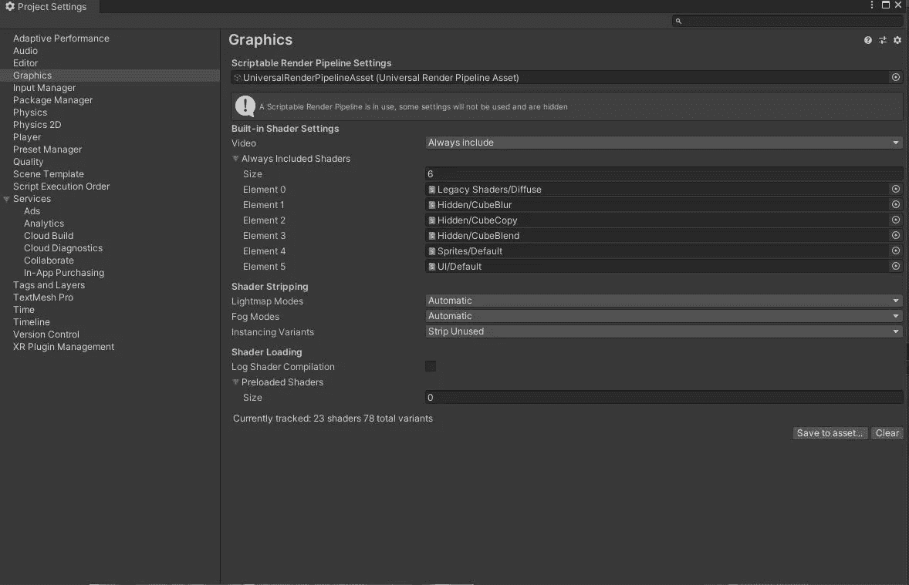
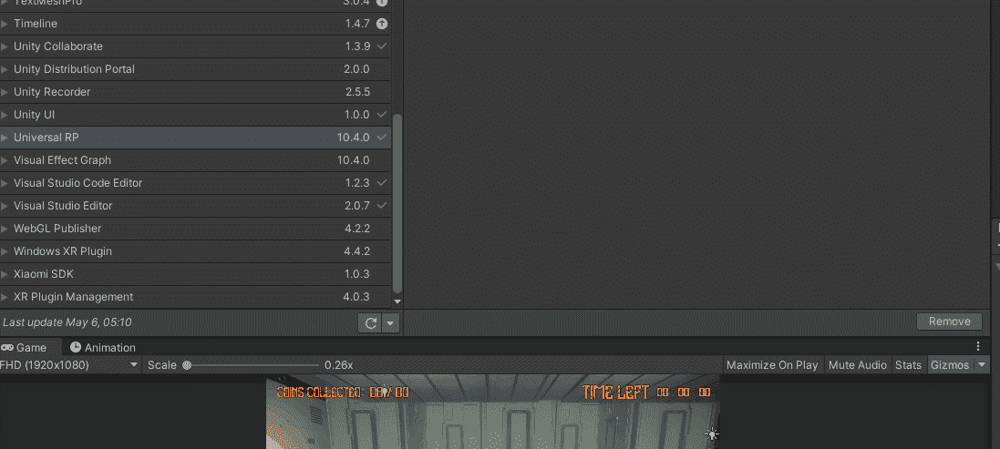
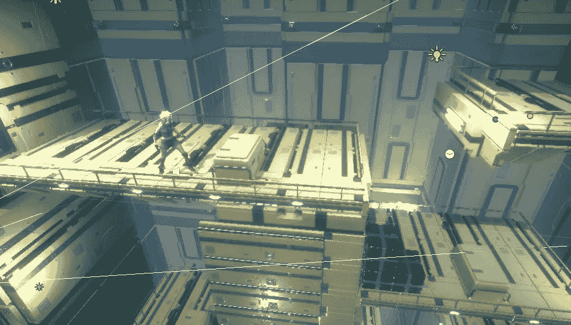

# 2.5D 培训进展报告:转移到 URP 并使用新资产。一致

> 原文：<https://medium.com/nerd-for-tech/2-5d-training-progression-report-moving-to-urp-and-using-new-assets-unity-479f35ca8212?source=collection_archive---------20----------------------->

根据我上一份进度报告([查看这里](https://novusxdev.medium.com/2-5d-training-progression-report-elevator-pushing-systems-unity-7e85f4266e50))，现在是时候将项目升级到 Unity 中的通用渲染管道，并从 GameDevHQ 文件库下载一些新资源。

URP 的紫色陷阱

> 用户需求语言

通用渲染管道或 URP 是 Unity 将你的游戏真实地带入生活的方式，并给你的游戏带来图形上的提升，这是简单地使用 Unity 自带的基本图形环境无法实现的。URP 针对移动使用进行了优化，因此您可以以图形方式升级您的项目，但仍然保持非常好的性能。

## 以下是将项目升级到 URP 的方法。

1.  打开*软件包管理器，窗口>软件包管理器*。
2.  确保选择“软件包:统一注册表”，并找到通用 RP。
3.  下载它，然后将其导入到您的项目中。

4.*打开编辑>项目设置>图形*。在那里，您需要分配一个可脚本化的渲染管道设置。如果没有，那么创建一个。

5.转到:*编辑>渲染管道>通用渲染管道>将项目材质升级到 URP 材质*。如果你不做这一步，那么你会注意到你的项目将有一个紫色的材料。现在，每当你导入新的资产到你的项目中，并且它们上面有奇怪的材料时，确保完成这一步。

> 选择资产

对于这个项目，资产是使用 [GameDevHQ 文件库](https://community.gamedevhq.com/feed/filebase)下载的。GDHQ 文件库现在有成千上万的可用资产，可用于项目的原型制作。放入这个文件库的工作是巨大的，最好的是它在不断更新。

为了这个项目，我们选择了一个勤劳的地方，我选择了一个女性角色，这让我想起了《古墓丽影》中的萝拉·卡芙特。

接下来:抓壁架和爬梯子。