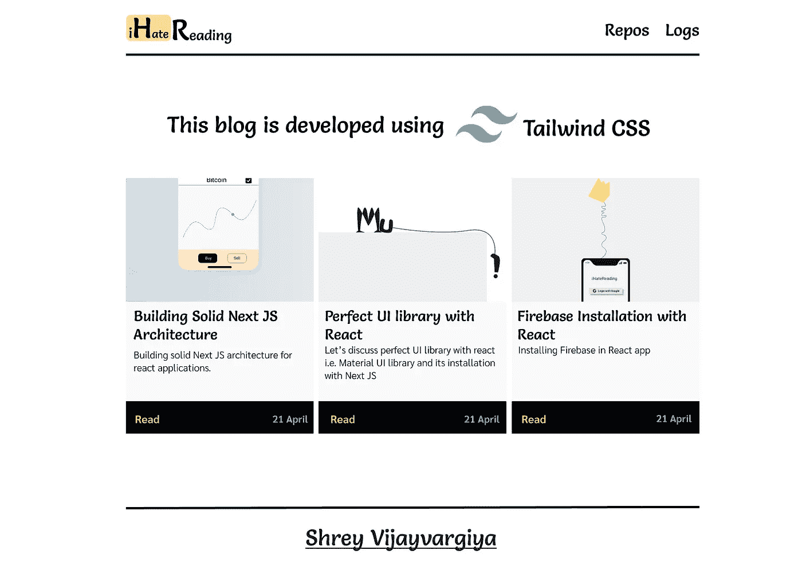

# 在 React 中安装顺风 CSS 只需 2 分钟和 2 个步骤

> 原文：<https://medium.com/nerd-for-tech/2-minute-2-steps-for-installing-tailwind-css-in-react-8dd420d81647?source=collection_archive---------19----------------------->

在下一个 JS 项目中开始使用 Tailwind CSS

[下一个 JS 的顺风装置创意](http://ihatereading.in)

# 在后台

对于所有的新读者和非关注者，我正在为最常用的第三方库如布尔玛 CSS，Materila UI，Next JS，Express 等的安装过程创建一个完整的系列文章。