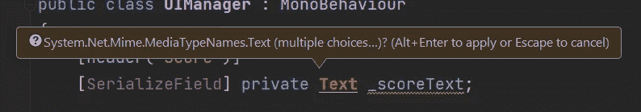
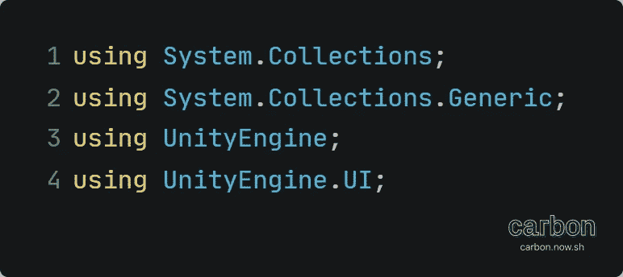
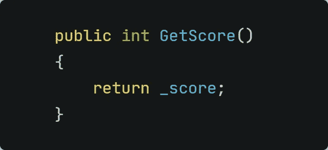
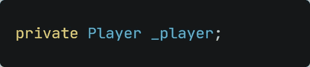
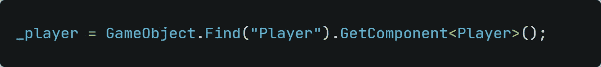
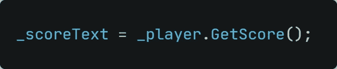
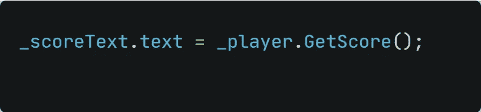
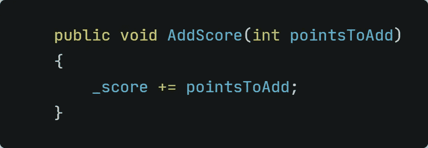
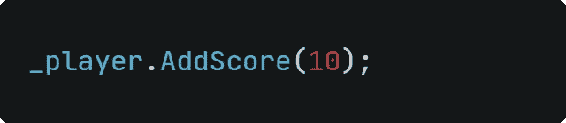
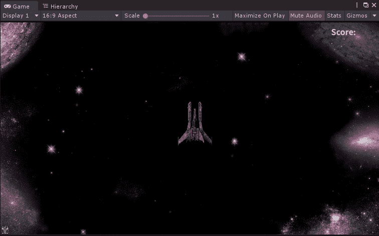

# 实现乐谱 UI 行为

> 原文：<https://medium.com/nerd-for-tech/23-04-implementing-the-score-ui-behavior-c34e1510617c?source=collection_archive---------17----------------------->

## 把这些数字加起来！

在 [Unsplash](https://unsplash.com?utm_source=medium&utm_medium=referral) 上 [engin akyurt](https://unsplash.com/@enginakyurt?utm_source=medium&utm_medium=referral) 拍摄的照片

就在昨天，我们为 Score 文本元素准备了所有需要的东西。现在是时候用代码实现这个功能了！

分数是一个文本元素。因此，我们只需要声明一个文本类型的变量。

也许您注意到代码没有自动完成，甚至用一条红色曲线加了下划线。别担心，这完全正常。

如果你像我一样使用 Rider 作为 IDE，你会知道这里的问题是什么。数据类型文本存在于多个指令中，IDE 不确定应该使用哪一个。因此，你会被问到你想用哪一个。

当我们想要访问 Unity 库时，我们选择 *UnityEngine。UI.Text*

如果您使用 Visual Studio 或其他 IDE，它们不会像这里这样通知您，您只需使用 UnityEngine 添加*。UI；*在你的 *UIManager.cs* 脚本的最顶端。

前 4 行应该是这样的:

完成后，红色的曲线应该消失了，你的脚本中不应该有任何错误！

**创建分数变量** 为了存储分数，我们首先需要创建一个变量。让我们在播放器脚本上创建它:

**访问分数变量
*千万不要*** 用*公共*访问修饰符声明变量！规则是将每个新变量声明为*私有*，所以最好坚持这样做。

为了让其他脚本访问变量，我们可以在脚本中创建一个小方法，该方法将简单地返回变量及其值。

打算被其他脚本访问的方法需要 *public* access 修饰符，所以其他脚本可以看到该方法。

*_scoreText* 文本框存储在 UIManager 上。为了访问我们刚刚创建的 GetScore()方法，我们需要在 *UIManager.cs* 脚本上创建一个播放器的句柄。

首先，我们需要分配玩家:

之后，我们需要分配玩家:

记得空检查！

现在我们能够访问播放器脚本中的公共方法了！因为我们想一直得到分数，所以我们在 *UIManager()* 脚本的 *Update()* 方法中调用了 *GetScore()* 方法。然而，这一行代码**将无法工作**:

这样不行！

为什么？因为我们正在重新分配游戏对象。我们想改变文本而不是游戏对象。因此，我们需要访问 *_scoreText* 的文本组件。下面一行代码将带给我们想要的行为:

这会有用的

**增加分数** 我们知道屏幕上显示的分数。但是，比分始终停留在 0…

为了解决这个问题，我们需要在游戏的某一点增加一些分数。谁会喜欢一个分数计数器永远停留在 0 的游戏？😄

让我们在 *Player.cs* 脚本中添加一个新方法:

*   因为我们需要从另一个脚本访问这个方法
*   我们想要指定我们想要添加的分数的数量。不同的动作可以增加不同的分数。因此，无论何时调用该方法，我们都将直接键入金额。如果不指定要添加的点，该方法将返回错误。
*   最后，我们将把刚刚指定的数量添加到现有的分数中。

**从 *Enemy.cs* 脚本** 中调用方法现在到了最后一步！每当敌人被激光摧毁时，我们想给玩家 10 分。为此，我们只需要在敌人的 *OnTriggerEnter2D()* 方法内部添加一行代码。

我们只是想给玩家额外的分数，如果敌人与激光相撞。如果敌人与玩家发生碰撞，我们将不会在当前分数上扣分。因此，我们应该将代码添加到 *other 中。比较标记("激光")*块。

就是这样！我们成功地在游戏中加入了分数系统！看看最终的结果:

完全工作的评分系统！