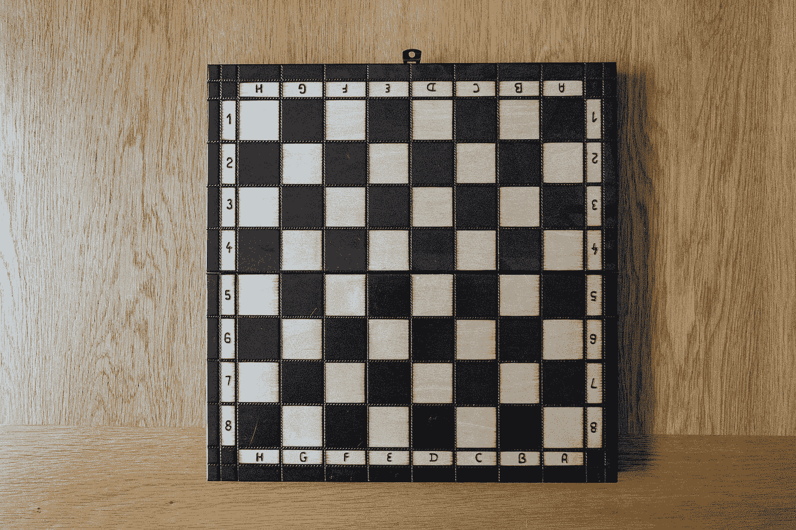
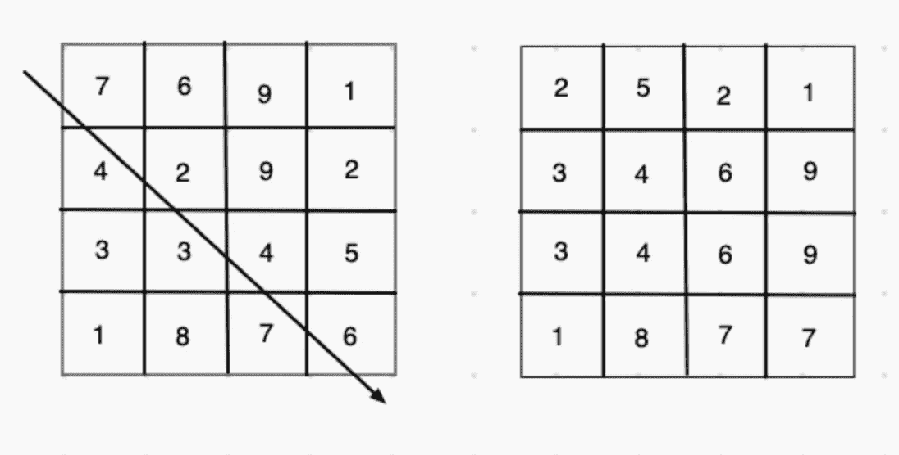
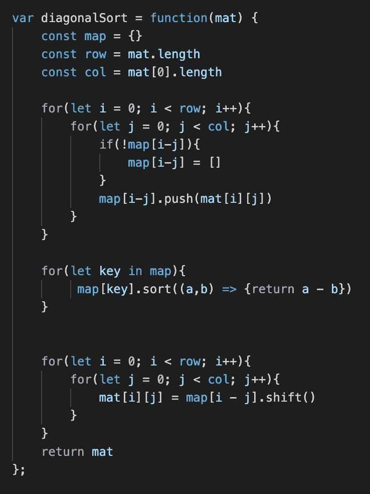

# 二维阵列/矩阵

> 原文：<https://medium.com/nerd-for-tech/2d-arrays-matrices-9ffc24ff4540?source=collection_archive---------18----------------------->

在编程中，我们可以使用矩阵，这可以用一个 2d 数组来创建，该数组只是嵌套在一个数组中的数组(也可以通过进一步嵌套来创建更大的多维数组 3d、4d)。



照片由 [Unsplash](https://unsplash.com?utm_source=medium&utm_medium=referral) 上的[尼克·费因斯](https://unsplash.com/@jannerboy62?utm_source=medium&utm_medium=referral)拍摄

2d 数组看起来就像这样。

```
[[1,3,9,4],
 [5,7,9,5],
 [1,1,1,2],
 [6,3,8,4]]
```

我们可以访问这个 2d 数组中的元素，就像我们访问一个普通数组一样，只不过是更深一层，所以 array[i][j]中的 I 代表行，j 代表列。因此，如果我们想访问上面矩阵左上角的 1，我们可以用 array[0][0]得到它。上面的例子是一个正方形，但是我们的矩阵也可以是行数多于列数的矩形，反之亦然。

有几个算法问题，可以使用二维数组像螺旋通过矩阵，搜索矩阵，旋转矩阵。我将关注的矩阵问题是对角排序矩阵，并给出一个解决方案。这是一个 leetcode 问题(1329)。该问题要求从左上到右下按升序对矩阵的值进行对角排序。下面是一个矩阵的图解(未排序的对角线),箭头显示了我们希望排序后的矩阵增加的方向。右边的第二个矩阵是我们想要的结果。



为了达到这个目的，我们必须注意或意识到(这在处理矩阵和对角线的大多数问题中是有帮助的)矩阵指数之间的关系。对于每条对角线，行和列的索引以这样的方式相关，即对于整个对角线，行索引减去列索引将是相同的值。在上面的例子中，穿过中间 7，2，4，6 的对角线所有这些数字的行索引减去列索引都是 0。因此，我们可以通过矩阵使用知识循环，并通过矩阵的每条对角线绘制出矩阵。然后，我们可以对每条对角线的映射值进行排序。最后一部分是通过遍历矩阵中的每个点并放置来自映射的排序值(再次使用行索引减去列索引)，将从映射值排序的矩阵放回一起。以下是用 JavaScript 编写的解释解决方案:



简而言之，我们映射出原始矩阵对角排序映射，并从映射中重建矩阵。