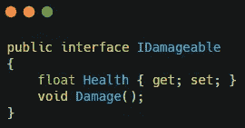
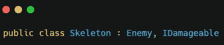
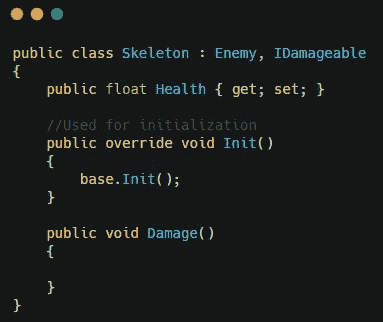
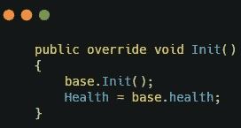
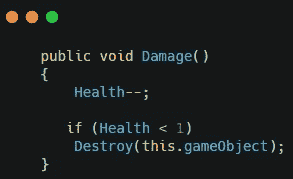
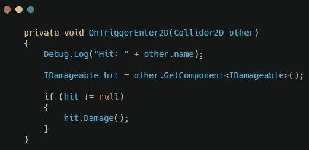
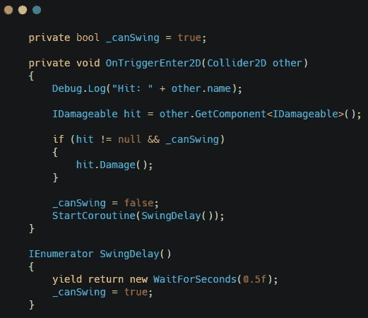
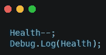
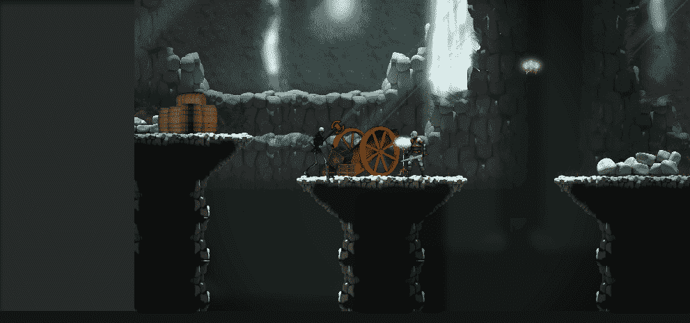

# 在 Unity 中使用接口的 2D 攻击系统

> 原文：<https://medium.com/nerd-for-tech/2d-attack-system-using-interfaces-in-unity-db7a5ec3ac5?source=collection_archive---------7----------------------->

我的游戏里有敌人，现在是时候让玩家攻击他们了。

首先，创建一个新的 c#脚本，并将其命名为 IDamageable。这将是一个界面。除了使用接口的脚本必须使用接口中的所有组件之外，接口类似于类继承。一个脚本也可以使用多个接口。

在 IDamageable 脚本中，将其声明为一个接口，并创建一个健康变量和一个损坏方法。

转到其中一个敌人类，并将 IDamageable 接口添加到脚本中。

这将迫使这个类使用健康变量和损害方法。

在 Init 方法中，将 health 变量设置为等于敌方类中的 Health 变量。

伤害法中，敌人每被击中一次生命值减一。如果生命值小于 1，则销毁当前游戏中附加脚本的对象。

为了利用这一点，转到攻击脚本并创建一个 **OnTiggerEnter2D** 。你将在你击中的碰撞器上检查一个 IDamageable 组件。如果它有一个，你将调用损坏方法。

为了确保敌人每次只被击中一次，创建一个布尔变量。调用损坏方法后，此变量将为 false。调用损坏方法后，调用一个协程等待 0.5f 秒，将变量设为 true。该变量需要为 true 才能再次调用 damage 方法。

如果在 health 减去 1 之后，在 skeleton 类中添加一个 debug 语句，您将能够看到 health 在下降。

现在设置你的敌人的健康，你将准备好测试这一点。

