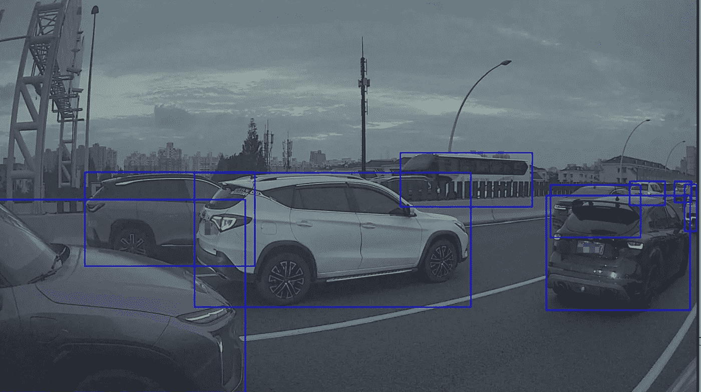
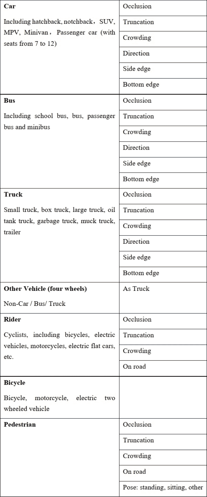
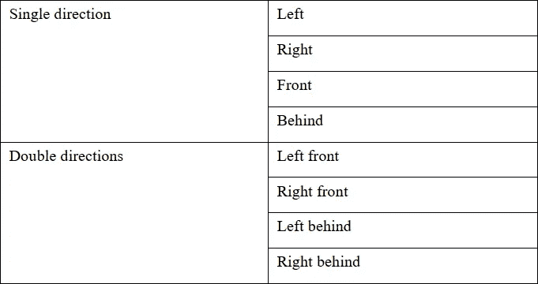

# 2D 影像障碍标注案例研究

> 原文：<https://medium.com/nerd-for-tech/2d-images-obstacle-labeling-case-study-112350dec12?source=collection_archive---------0----------------------->

在自动驾驶场景下，行驶中的车辆需要分析与当前车道内其他车辆的位置关系，做出适当的控制决策，避免事故发生。

比如前面近距离有车辆，或者两边车辆都在试图切入车道，这个车辆就需要及时减速。

为了获得其他车辆相对于本车的准确距离，需要获得其他车辆的准确位置信息，进而估算出车辆之间的距离。

利用人工神经网络模型检测包含车辆的矩形框，并根据位置进一步估计本车与邻车的距离。例如，在车辆检测中，可以根据盒子底部边界中点的横坐标来估计两辆车辆之间的水平距离。

下面分享一个视觉障碍检测标注案例。

## 1.障碍类别

轿车、公共汽车、卡车、自行车、三轮车、自行车、行人

## 2.标签要求

标签类型:2D 拳击

对于轿车、公共汽车、卡车和移动的车辆，方向是需要的。

障碍物尺寸:大于 15*15 像素

标签级别:低至 5 个像素。

## 3.障碍类别和标注属性

## 4.汽车标签详情

A.基本规则

-对于截断和拥挤障碍物，应评估整个零件

-出租车顶灯、后视镜等配件不需要贴标签

B.遮挡类型(被背景遮挡)

-不闭塞

-部分闭塞(百分比)

-高度闭塞(百分比)

C.拥挤类型(被其他障碍物遮挡)

-不拥挤

-部分拥挤(百分比)

高度拥挤(百分比)

D.截断类型

-不截断

-截断

E.方向

# 结束

将您的数据标注任务外包给 [ByteBridge，](https://tinyurl.com/53cy4wnv)您可以更便宜、更快地获得高质量的 ML 训练数据集！

*   无需信用卡的免费试用:您可以快速获得样品结果，检查输出，并直接向我们的项目经理反馈。
*   100%人工验证
*   透明标准定价:[有明确的定价](https://www.bytebridge.io/#/?module=price)(含人工成本)

## 为什么不试一试？