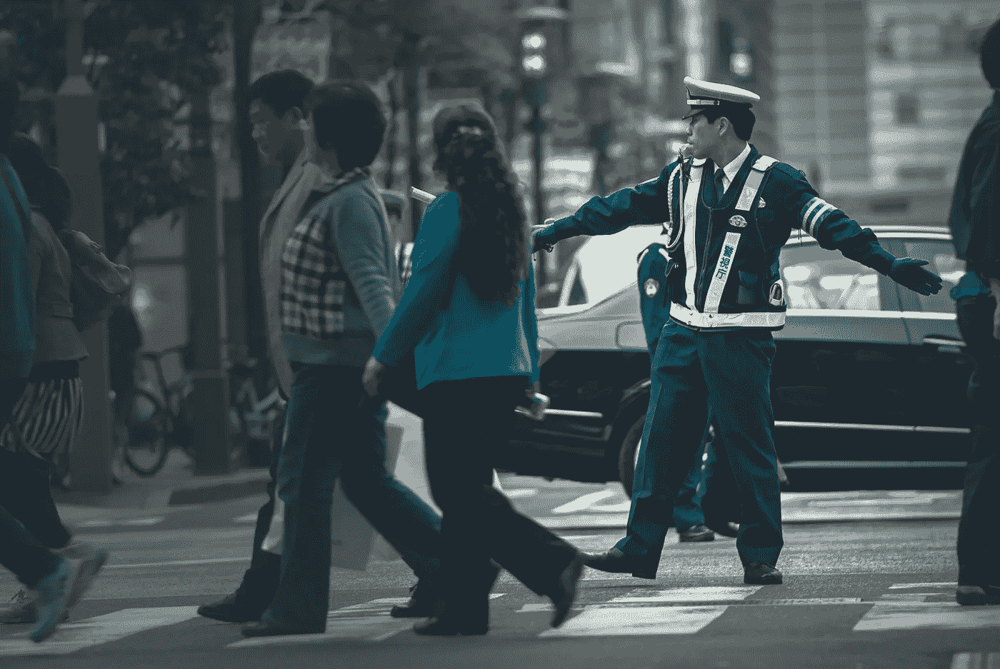
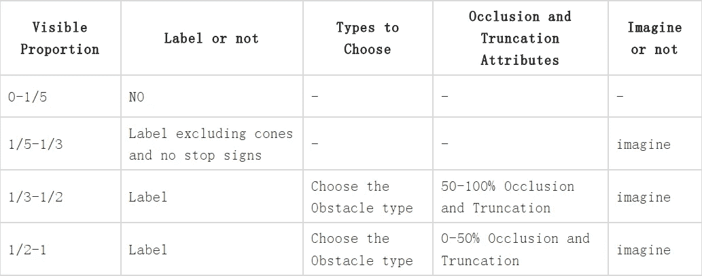
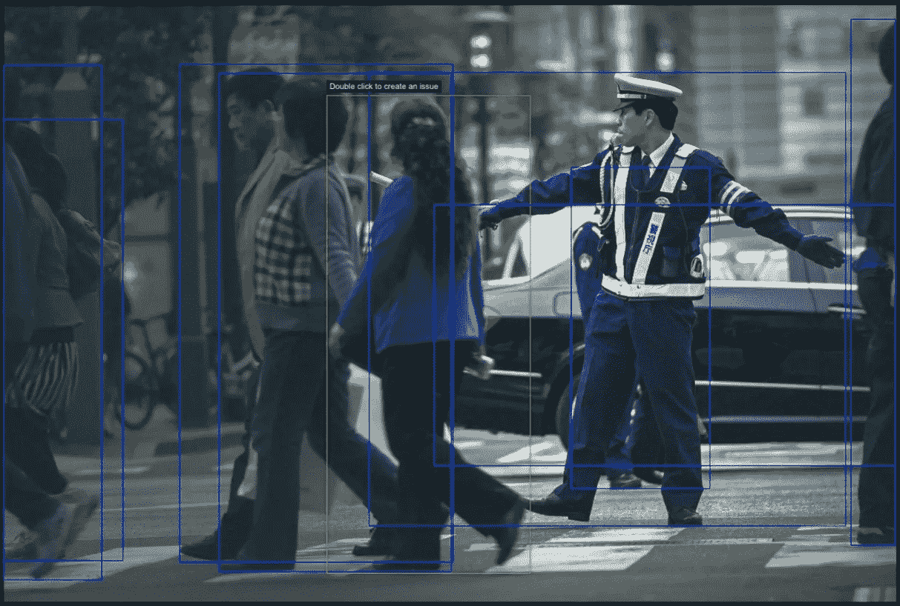
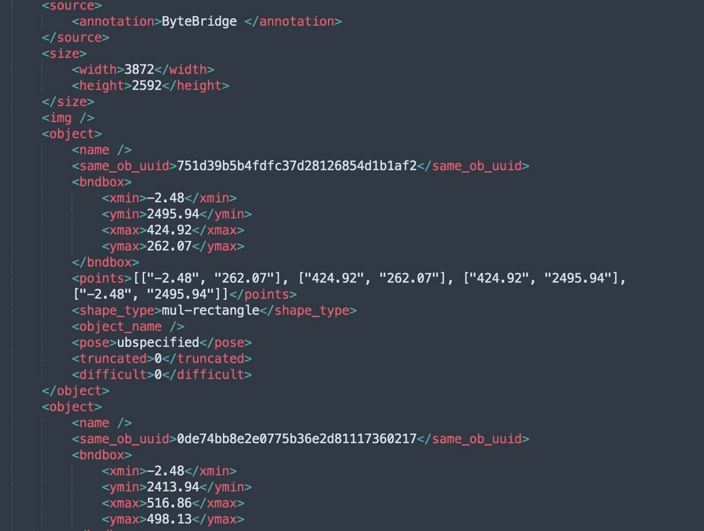

# 自动驾驶行业中的 2D 物体检测标签案例研究

> 原文：<https://medium.com/nerd-for-tech/2d-object-detection-labeling-case-study-in-the-self-driving-industry-c0d59003e0e3?source=collection_archive---------1----------------------->

你愿意看“无人送货车给你送包裹”这种有趣的交通工具，还是更愿意尝试“无人车带你回家”？

无人车要在高速复杂的环境下实现还需要很长时间。对于行驶在普通道路上的大型无人驾驶货车来说，虽然环境略简单，但需要考虑的安全因素也很多。

一般来说，在特定的环境中，例如在仓库、货场、公园或港口等相对独立的空间中，由于可行驶的区域是可控的，低速无人车已经成为商业实施的首选场所之一。——很多自动驾驶公司都在争抢的地方。

现在我们来看一个无人物流车的数据标注项目。

## 障碍标记说明

适用于任何开放环境下的无人物流车。

**1。任务介绍**

对于在公园或开放环境中运行的无人物流车辆，它们依靠摄像头传感器来检测和识别场景中的障碍。因此，为了训练 R&D 过程中的障碍检测模型，需要将相关场景中的对象标记为优先级。目标总是包括车辆、行人、交通标志(锥形路标和禁止停车标志等)。)，以及其他类别。

**2。基本贴标原则**

对于 2D 对象检测注释任务，需要用 2D 边界框标记图像中类别中列出的对象，以确定其位置。对于被遮挡或截断的障碍物，贴标机需要根据其可见比例进行判断，并想象不可见的部分。对于行人，贴标签者需要标记姿势(站、坐、蹲或弯腰)。

**3。障碍类别规格**

对于 2D 障碍物的标注任务，需要标注的主要障碍物类别有行人、骑自行车的人、摩托车、自行车、三轮车、小型客车、大中型客车、货车、智能物流车、工程车、手推车、圆锥体、相对静态障碍物、动态障碍物、车道。

注 1:车道的定义:机动车行驶区域。符合机动车行驶区域的人行横道、自行车道和车辆转弯带都是车道；开放的道路理论上是车辆可以进入的区域，但是绿化带和人行道不是车道。

注 2:透视、反射障碍、广告牌上的障碍需要标注为遗漏。比如透过车窗看到的人(不管车窗玻璃是否摇下)，镜子里的人，广告牌上的人的影像。

注 3:对于一些车辆，很多东西被拖在它们的后部。贴标签机在这种情况下需要为障碍物标注两个框，一个框为车辆，一个框为被拖物(选择被拖物的属性类别为未知不可移动)，两个框的 ID 要相同。

**4。标签属性的说明**

遮挡和截断属性的 2D 盒标记规则:

遮挡的定义:物体在图像中，但被其他物体遮挡。

截断的定义:物体的一部分不在图像中，超出了边界。

想象的定义:想象并标记图像中的完整障碍。

用于确定遮挡和截断属性的障碍物的可见比例如下所示。

**行人姿态属性:**

对于行人来说，他们的姿势有三个属性，包括站、坐、蹲或弯。

注意 1:如果自行车被遮挡，骑自行车的人被标记为行人。

注 2:因遮挡或截断仅头部可见的行人标注为遗漏，胸部以上的标注为行人。

# 您可以手动配置和 ByteBridge 注释

## 只剩三步了

*   使用您的电子邮件登录
*   上传样本
*   告诉我们要贴什么标签:告诉我们最小标签尺寸和您需要的精度。

您可以将需求发送给我们，我们将处理配置工作。

那就轮到我们了。

演示和报价将在工作日不到 24 小时内准备就绪。

## 输出

字节桥 2D 对象检测注释

**JSON 输出**

字节桥 2D 对象检测注释 JSON

## 结束

把你的数据标注任务外包给 [ByteBridge](https://tinyurl.com/mr3vnchd) ，你可以更便宜更快的获得高质量的 ML 训练数据集！

*   无需信用卡的免费试用:您可以快速获得样品结果，检查输出，并直接向我们的项目经理反馈。
*   100%人工验证
*   透明和标准定价:[有明确的定价](https://www.bytebridge.io/#/?module=price)(包括人工成本)

## 为什么不试一试？