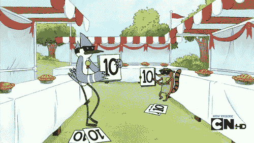
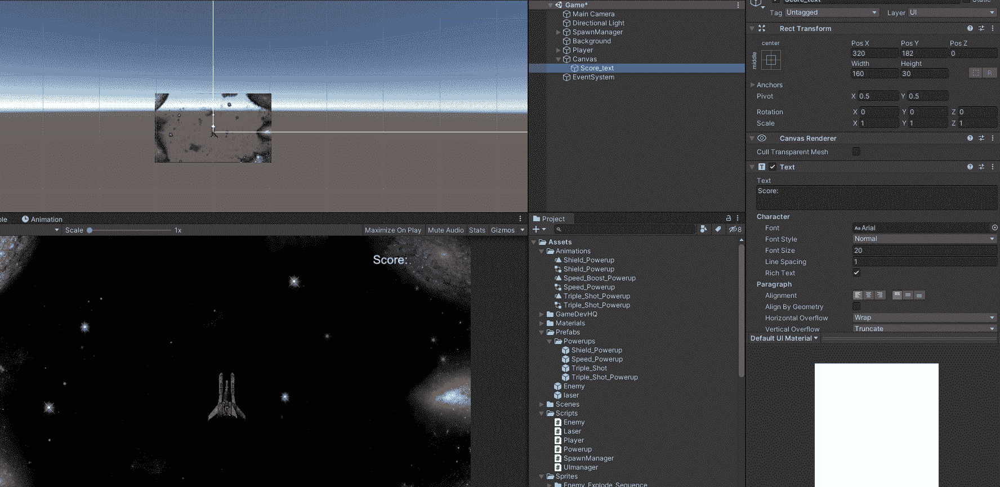
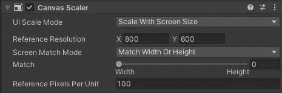
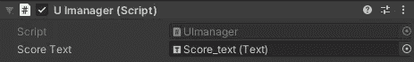
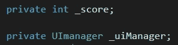
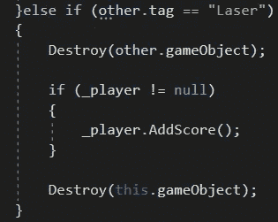
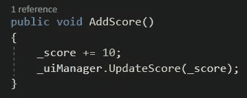
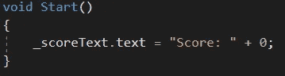
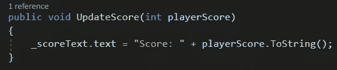
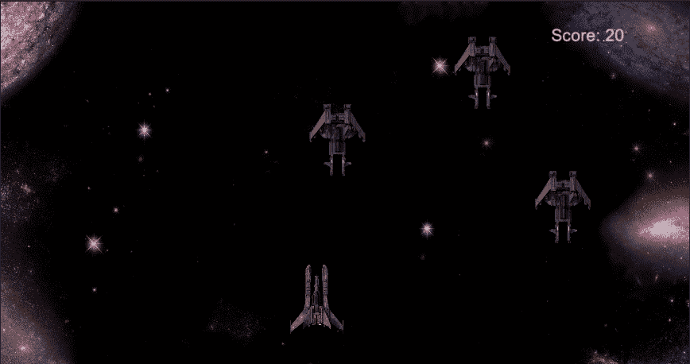

# 2D 射手:添加一个评分系统

> 原文：<https://medium.com/nerd-for-tech/2d-shooter-adding-a-score-system-3cab7db0c44f?source=collection_archive---------21----------------------->

**目标:**实现一个系统，增加一个 UI 元素，每当敌人被激光摧毁时，数字增加 10。

首先在 Unity 的层级中右键单击。进入用户界面，然后点击“文本”。基本的就可以了。这将创建两个对象，一个称为“画布”，另一个称为“事件系统”，然后画布中还应该有一个子对象，您可以将其重命名为“Score_Text”。

选择 score_text 对象后，您可以更改文本本身、更改大小和颜色，以及更改对齐和锚点。定位点允许界面位置随屏幕大小缩放。现在，输入文本“Score:”这样你就可以准确地定位它在游戏中出现的位置。通过在场景视图中缩小，直到您可以看到一个大的白色方块，可以做到这一点。点按文本并将其拖到右上角。将文本改为白色，大小改为 20。然后转到“Rect Transform”，选择右上角作为锚点。

你也可以点击画布，并确保缩放它设置为屏幕大小，这样任何 UI 元素的大小都会根据屏幕的大小而改变。

现在创建一个名为 UImanager 的新 C#脚本，并将其拖到画布上。这是我们将制作代码的地方，这些代码将能够与我们的文本进行交互，因此当敌人被消灭时，分数将会改变。

在这个脚本中，创建一个序列化的文本变量“_scoreText”，并在检查器中，将文本*对象*拖动到框中。

现在转到播放器脚本，创建这两个变量:

现在转到敌方脚本，在探测激光碰撞的方法中写下 if 语句。这将检查当激光击中敌人时玩家是否活着，如果是，它将激活一个我们将创建的方法。

回到播放器脚本，让我们创建 AddScore()方法。

这是控制增加点数的方法。现在转到 UImanager 脚本。我们想加上“使用 UnityEngine。UI”到最顶端。

这将允许我们在编码时使用 UI 命令。

现在在 start 方法中，我们要初始化乐谱文本。

现在让我们创建一个方法，该方法将使用我们通过前面的步骤获得的信息来更新分数。

现在我们有了一个基本的，有效的评分系统！

