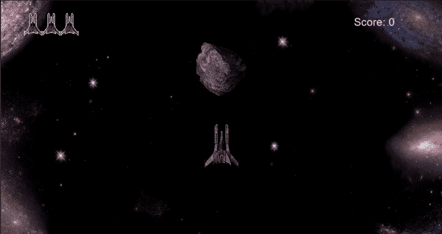
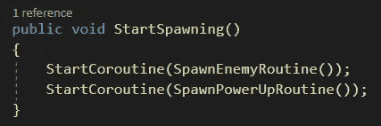
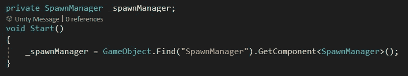
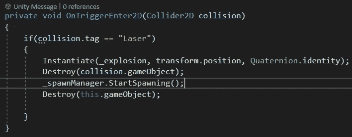
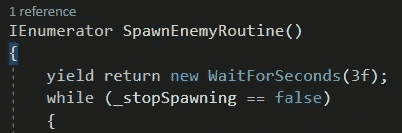

# 2D 射手:用小行星控制敌人

> 原文：<https://medium.com/nerd-for-tech/2d-shooter-controlling-the-enemy-spawns-with-the-asteroid-34ce8e87a123?source=collection_archive---------15----------------------->

**目标:**只有在小行星被摧毁后，才能启动敌人和能量。

我们要做的第一件事是将 SpawnManager 中调用 spawn 协程的代码移到它们自己的方法中，这样 start 方法就不会立即启动它们。

现在转到小行星脚本。为 SpawnManager 创建一个变量，并在 start 方法中找到它，同时也使用 getcomponent 访问脚本。

现在在我们摧毁小行星之前调用 StartSpawning 方法。

为了制造一个延迟，我们可以在敌人和力量被实例化的地方添加“yield return new waitforsecond”。

现在我们应该在与任何敌人战斗之前好好休息一下了！