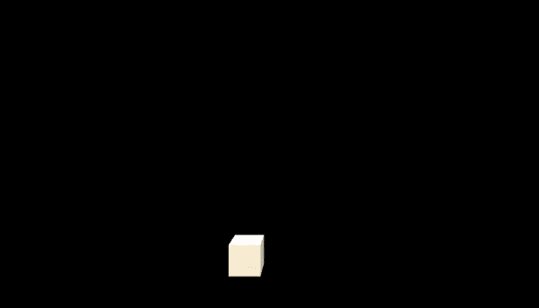
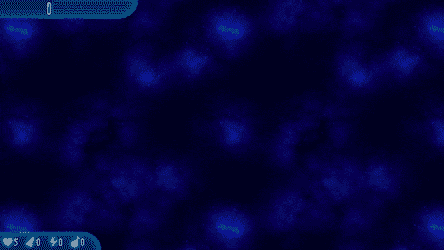
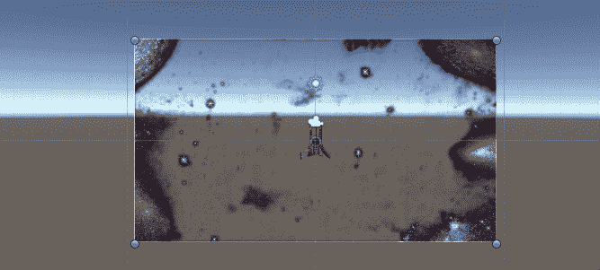
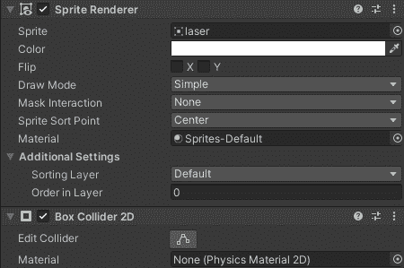
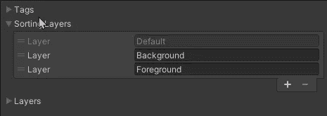
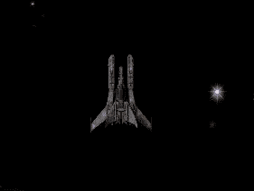

# 2D·舒特:给原型赋予艺术

> 原文：<https://medium.com/nerd-for-tech/2d-shooter-giving-art-to-the-prototype-da17d8a6f65e?source=collection_archive---------17----------------------->

一个只是立方体射击其他立方体的小球的游戏不是很有趣。没有钩子，也没有视觉吸引力。

想想看，你愿意玩这样一个游戏吗:

或者类似这样的东西:

以《小鸡入侵者》(由
互动工作室制作)为例

我们正在制作的游戏不会有鸡，但它将设定在太空中。现在，让我们先考虑一下基本的外观，然后再进行增强和精细的工作。

**目的:**为玩家、背景、激光、敌人加入艺术元素，让游戏看起来更有趣。

因为我是 GamedevHQ 的一员，我可以使用他们的 filebase 系统访问资产。从那里我下载并导入资产到 Unity。我需要的一切都自动存在于资产文件夹中。

先说背景。在我的资产中，我有一个背景覆盖，我需要做的就是把它拖到层次结构中，它就会出现在场景中。在游戏视图中，它与相机的视图不太一致。所以我们只需要稍微调整一下大小。

一旦这样做了，你会想在精灵渲染器组件中创建一对夫妇层，使背景将留在背景中。

点击“添加分类层”后，你会看到可用的层和创建它们的选项。点击加号按钮，使前景和背景层。确保背景在前景上方**。**

一旦图层完成，你需要将背景*图像*分配给背景*图层。*

现在，当我们想制作一个 2D 游戏时，我们有了 3D 对象，最简单的转换方法就是删除这些对象。让我们现在只担心球员。

是的，删除它。

但是不用担心！我们将保留所有的脚本，所以我们大部分的辛勤工作将仍然存在！

现在只需拖动你想要使用的精灵到层次中，并确保它在前景层。之后，只需重新分配剧本给它，恭喜，我们有一艘宇宙飞船！

但是有些问题我们需要解决，我将在下一篇文章中讨论。